# IDEA Engineering Core v0 Architecture Description

> **Instance state**: controlled `Draft 0.20`. This document describes a candidate architecture for
> the recorded product direction and Draft requirements. It does not approve a technology stack,
> authorize production implementation, or record a successful architecture review.

## Control envelope

| Field | Recorded value |
|---|---|
| Stable Document ID | `IE-PROD-ARCH-001` |
| Document Class | `DOC-05` |
| Title | IDEA Engineering Core v0 Architecture Description |
| Owner | `Principal Product Author`; named person attribution required before `Proposed` |
| Document Status | `Draft` |
| Document Version | `0.20` |
| Applicable Baseline | `IDEA-C1-ANALYSIS-DESIGN-001` / candidate `IE-TECH-CORE-V0-001` |
| Requirements Input | `IE-PROD-SREQ-001@0.13`; Feature and Spec decisions remain `NOT-RUN` |
| Effective Date | `NOT APPLICABLE` until approval |
| Authors | `Principal Product Author`; named identity not yet recorded |
| Reviewers | Project user performs internal document review; architecture review `NOT-RUN`; required independent/specialist reviewer unassigned |
| Approvers | Product Decision Authority for Tech; identity, decision and date are `UNKNOWN` |
| Source Links | [DOC-04](DOC-04-software-requirements-specification.md), [DOC-06](DOC-06-data-integration-and-migration-specification.md), [DOC-08](DOC-08-ui-ux-and-interaction-specification.md), [architecture input](../../../architecture/idea-product-lifecycle-architecture.md), [ADR index](../../../adr/README.md), [RBAC/diagram source analysis](../../../research/2026-09-10-microsoft-rbac-and-architecture-diagram-standards.md), [DDM/Aras workspace comparison](../../../research/2026-09-10-ddm-aras-checkout-reference-checkin-comparison.md) |
| Downstream Links | [DOC-07](DOC-07-mvp-roadmap-and-delivery-plan.md), [VVP](registers/VVP-core-v0-verification-validation-plan.md), [TECH-001](decision-briefs/TECH-001-technology-and-architecture-proposal.md), future implementation contracts and evidence |
| Evidence / Claim Status | Architecture and technology evaluation are `Draft`; tests, spikes and operational evidence are `NOT-RUN` |
| Change History | 0.20: redraw the visually dense `ARCH-VIEW-MOD-001` as a scoped C4 Component Diagram with an explicit purpose, audience, exclusions and notation; detailed ownership remains in the existing Module table and behavioural flows remain in their dedicated views; no product requirement, architecture decision, Tech choice or gate state changes; [IE-CHG-DOC-REVIEW-001@0.2](registers/CHG-2026-09-14-post-pull-document-review-corrections.md). 0.19: make Submit/Approve authorization and attributable outcome explicit in `ARCH-VIEW-SEQ-003`, identify the delegated administrator who requests a Group Role Assignment in `ARCH-VIEW-ACT-001`, and replace ambiguous Checkout-entitlement wording; no new product requirement or gate decision; [IE-CHG-DOC-REVIEW-001@0.1](registers/CHG-2026-09-14-post-pull-document-review-corrections.md). Earlier history remains in the controlled change records. |
| Access Classification / Retention Rule | `INTERNAL`; retain with the controlled product baseline and successor/change records |

<!-- AUTHOR CONTENT START -->

## 1. System of interest and context

The system of interest is `C1 — IDEA Engineering`, an internal product that controls engineering
documents, immutable Generations, Product Structure, review decisions and exact Releases. It remains
useful and deployable without a future platform or another product capability.

The following view is the C4-style system context. Arrows show an allowed interaction, not shared
database ownership. Dashed elements are future or external boundaries.

**`ARCH-VIEW-CTX-001` — System context (conceptual).** **Model profile:** C4-style System Context;
`Draft 0.12`; all stakeholders. **Question:** who uses IDEA, what is external and where does product
authority stop? **Scope:** one Operating Organization. **Excludes:** internal Modules, database
schema and physical deployment. **Trace:** DOC-03 actors, `REQ-GOV-001`, `REQ-AUTH-*`,
`REQ-IAM-*`. **Legend:** solid arrows are current interactions; dashed arrows are future/optional;
the central IDEA box is the system of interest.

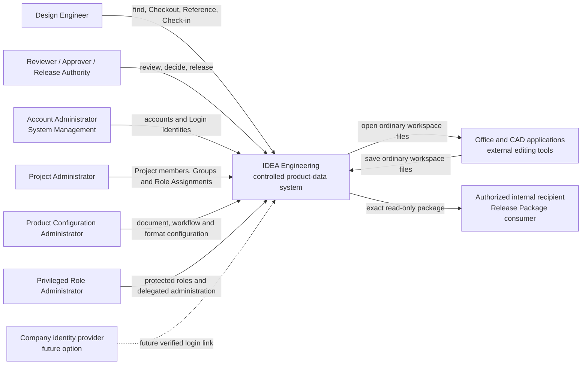
```mermaid
flowchart LR
    accTitle: IDEA Engineering system context
    accDescr: Engineers, reviewers and scoped administrators use IDEA Engineering. Office and CAD applications are external editing tools, a company identity provider is a future option, and authorized recipients consume exact read-only Release Packages. IDEA remains the product-data authority.

    engineer["Design Engineer"]
    reviewer["Reviewer / Approver / Release Authority"]
    accountAdmin["Account Administrator<br/>System Management"]
    projectAdmin["Project Administrator"]
    configAdmin["Product Configuration Administrator"]
    roleAdmin["Privileged Role Administrator"]
    idea["IDEA Engineering<br/>controlled product-data system"]
    apps["Office and CAD applications<br/>external editing tools"]
    companyId["Company identity provider<br/>future option"]
    releaseConsumer["Authorized internal recipient<br/>Release Package consumer"]

    engineer -->|find, Checkout, Reference, Check-in| idea
    reviewer -->|review, decide, release| idea
    accountAdmin -->|accounts and Login Identities| idea
    projectAdmin -->|Project members, Groups and Role Assignments| idea
    configAdmin -->|document, workflow and format configuration| idea
    roleAdmin -->|protected roles and delegated administration| idea
    idea -->|open ordinary workspace files| apps
    apps -->|save ordinary workspace files| idea
    idea -->|exact read-only package| releaseConsumer
    companyId -.->|future verified login link| idea
```

| Context item | Description | Authority / evidence | Status |
|---|---|---|---|
| Internal actors | Engineer/Author, Reviewer, Independent Approver, Release Authority, Account Administrator, Project Administrator, Product Configuration Administrator, Privileged Role Administrator, Super Administrator, Quality/Audit Reader, Security reviewer and Operator. Each administrator capability is an independently scoped Role Assignment, not an account type or hierarchy. | DOC-03@0.7 actors; `REQ-AUTH-009/010`; DOC-08 profiles | `Draft` |
| External applications | Configured Office/CAD applications read and write ordinary files in a Managed Workspace. Unsaved in-memory state is outside IDEA. | `REQ-FMT-001/004`; accepted product decision | `Draft` |
| Accounts and login | Native IDEA accounts initially. During development the project user may hold temporary bootstrap capability; normal Account Administration is assigned to named System Management personnel. Other/company login is future scope, not an external prerequisite. | `REQ-IAM-001…007`; `TECH-CTX-003/004` | Responsibility model confirmed; production assignees, secure implementation and policy unqualified |
| Data stores | Relational authoritative metadata plus private content-addressed Artifact storage. | `REQ-ID-*`, `REQ-STR-*`, `REQ-OPS-001/003/004`; DOC-06 | Architecture `Draft`; providers undecided |
| Future integrations | Read-only Controlled Release Package export is in Core v0. General external integration, company login and write-back are deferred. | Feature exclusions; `REQ-LC-008` | `DEFER` for integrations; export required |
| Product boundary | One internal product and one Organization boundary in the first deployment; Organization isolation remains enforced by design. | `REQ-GOV-001`; internal-company decision | `Draft` |

Confirmed constraints are recorded in [TECH-CTX-001…008](registers/CHG-2026-09-03-tech-context-and-proposal.md) and refined by the current responsibility model: Windows engineering PCs, 50–100 total intended users at one site, company-controlled server to be proposed, native accounts first, temporary user-held bootstrap/possible operations during development, normal Account Administration by named System Management personnel, no assumed DevOps function, uncertain MB-to-GB related document sets and preliminary recovery objectives. None is measured capacity or a stack decision.

## 2. Concerns, quality attributes and scenarios

| Scenario / concern | Stimulus and operating condition | Required architecture response | Verification link | Current result |
|---|---|---|---|---|
| `QRS-001` Correct identity/version | Register, change, Check-in and revise one Logical Document. | One stable identity; immutable committed Generation; atomic first baseline and revision transition. | `REQ-ID-001…006`; `VVP-001/002` | `NOT-RUN` |
| `QRS-002` Atomic multi-document Check-in | Failure occurs at any upload, validation, materialization or transaction point. | Candidate content remains private; every selected change commits together or none commits; retry is idempotent. | `REQ-WS-007/008/012`, `REQ-OPS-001`; `VVP-003` | `NOT-RUN` |
| `QRS-003` Stale/non-owner protection | A stale, wrong-owner, wrong-Workspace or unauthorized publish is submitted. | Authoritative state is unchanged, local work remains safe, and an actionable conflict is returned. | `REQ-WS-010/011/013`; `VVP-004` | `NOT-RUN` |
| `QRS-004` Exact release | Release is requested with missing, unresolved or unapproved content. | Lifecycle Governance fails closed; successful Release pins exact Generation, structure, policy and evidence. | `REQ-STR-003`, `REQ-LC-006…009`; `VVP-006` | `NOT-RUN` |
| `QRS-005` Organization isolation | An identity attempts to resolve or command another Organization's resource. | Resource owner refuses the action and appends permitted Audit Evidence without cross-scope disclosure. | `REQ-GOV-001/002`; `VVP-007` | `NOT-RUN` |
| `QRS-006` Exact restore | Metadata/content/configuration is restored from one approved recovery point. | Every retained Generation resolves and digest-checks; gaps are reported and cannot be called PASS. | `REQ-OPS-003/004`; `VVP-013` | `NOT-RUN` |
| `QRS-007` Localized interaction | The same controlled task runs in each supported locale and surface. | Command/state/authority outcomes remain equal; user Unicode round-trips; missing resources use the declared fallback. | `REQ-UX-*`, `REQ-LOC-*`; `VVP-009/010` | `NOT-RUN` |
| `QRS-008` Untrusted format input | A malformed, oversized or slow file is processed. | Bounded worker failure cannot change source Artifact or product state; results retain tool/profile provenance. | `REQ-FMT-002…005`, `REQ-SEC-004`; `VVP-008/011` | `NOT-RUN` |
| Dense workspace usability | User performs a controlled task at the canonical 1440×900 demo viewport. | Context remains visible; same-type detail scrolls internally or opens in a drawer/modal; keyboard, focus and status semantics remain usable. | `REQ-UX-*`; `VVP-009` | `NOT-RUN` |
| `QRS-009` Account eligibility and recovery | An account is provisioned, recovered, suspended or its sessions revoked. | Stable Actor history survives; old sessions cannot authorize subsequent protected requests, and account administration does not confer product privileges. | `REQ-IAM-*`; `VVP-015` | `NOT-RUN` |
| `QRS-010` Governed authorization change | An administrator changes a Role Definition, Group membership or Role Assignment. | Identity establishes the eligible Actor; RBAC constrains the administrator's own role, principal and Scope boundary; versioned configuration and Audit prevent client-only change, stale activation or self-escalation from changing authority. | `REQ-AUTH-001…010`, `REQ-GOV-002/005`; `VVP-007/015`, RBAC-01…10 | `NOT-RUN` |

RTO of four working hours and RPO of at most one hour are user-confirmed **planning objectives** for severe server failure, not achieved SLAs. Working-hour clock/coverage, workload, capacity, latency, availability, Reservation lease, transfer expiry and worker limits require approved measurement profiles. The project user may operate initially; a long-term operator and specialist review remain unassigned.

## 3. Viewpoints and views

This architecture description applies the project's tailored ISO/IEC/IEEE 42010:2022 profile: it
identifies the system of interest, stakeholders/concerns, viewpoints, maintained views,
correspondence rules, rationale, decisions and known gaps. A diagram is not accepted merely because
it renders; every element must correspond to an owned responsibility, Interface, requirement or
explicitly marked external/future boundary.

| Viewpoint | Intended concern / audience | View maintained here | Correspondence rule | Review status |
|---|---|---|---|---|
| Context | Product Decision Authority and all stakeholders | System boundary and external actors in section 1 | No external actor/store becomes product authority. | `Draft` |
| Responsibility | Maintainers and reviewers | Hosts and deep Modules in sections 4–5 | Every authoritative state has exactly one owner Module. | `Draft` |
| Information | Product, data and quality owners | Identity/lifecycle implications in section 8 and DOC-06 | Persisted references use stable identities and exact version pins. | `Draft` |
| Interaction | Engineer, reviewer and HCD owner | Checkout/Check-in and review/release sequences in section 7 | UI state is a view of server/workspace truth, not a second authority. | `Draft` |
| Deployment | Operator and security owner | Host/trust-zone view in sections 4 and 9 | Client/worker packages cannot hold infrastructure credentials. | `Draft` |
| Reliability | Operator, data and quality owners | Atomicity, idempotency, outbox, reconciliation and restore in section 9 | Public state appears only after a complete authoritative commit. | `Draft` |
| Security | Security and policy owners | Trust seams and owner-enforced authorization in section 10 | Every access path reaches the authoritative owner policy. | `Draft` |
| Evolution | Product and architecture owners | seams, candidate stack and deferred boundaries | A later Adapter may replace an Implementation without changing Module authority or accepted interface semantics. | `Draft` |

### 3.1 Maintained view catalogue

Each view has a stable ID so a review comment can identify the exact model rather than referring to
“the diagram above”. All views are conceptual or candidate models; none is implementation evidence.

| View ID | Type / location | Question answered | Scope and principal audience | Status / trace | Text alternative |
|---|---|---|---|---|---|
| `ARCH-VIEW-CTX-001` | C4-style System Context / section 1 | Who uses IDEA, what is external and where is the product boundary? | One Operating Organization; all stakeholders; excludes internal Modules and deployment nodes. | `Draft`; DOC-03 actors; `REQ-GOV-001`, `REQ-AUTH-*`, `REQ-IAM-*` | Context table and paragraph after the view. |
| `ARCH-VIEW-CON-001` | C4-style Container / section 4.1 | Which executable/data containers exist and what responsibility crosses each interface? | Candidate logical runtime; maintainers/security; excludes physical host count. | `Draft`; `REQ-SEC-*`, `REQ-OPS-*`, `REQ-AUTH-*` | Numbered container description after the view. |
| `ARCH-VIEW-DEP-001` | C4-style Deployment / section 4.2 | What runs on engineer/admin devices and server zone, and where are trust boundaries? | Initial candidate deployment; operations/security; technology remains unapproved. | `Draft`; `REQ-SEC-*`, `REQ-OPS-*` | Deployment explanation after the view. |
| `ARCH-VIEW-MOD-001` | C4 Component Diagram / section 5.1 | How does a protected product command reach its declared authoritative owners and obtain RBAC decisions? | Principal command-control Modules inside one IDEA Server; maintainers/reviewers; excludes supporting content paths, actors, workflow sequences, deployment and database tables. | `Draft`; `REQ-GOV-*`, `REQ-AUTH-*`, DOC-06 | Module table, `ARCH-VIEW-MOD-002` and rules surrounding the view. |
| `ARCH-VIEW-MOD-002` | C4 Component-level responsibility view / section 5.3 | Where is the seam around Checkout/Reference/Check-in, and which collaborators may affect an authoritative commit? | Controlled Product Data and its callers/collaborators; architecture/implementation/security reviewers; excludes classes and physical deployment. | `Draft`; `REQ-WS-001…015`, `REQ-OPS-001`; ADR C1-004/C1-005 | Numbered responsibility and seam description after the view. |
| `ARCH-VIEW-RBAC-001` | UML-style class/domain view / section 5.2 | How do Principal, Group, Role Definition, Permission, Scope and Role Assignment relate? | Authorization domain; security/requirements/data reviewers. | `Draft`; `REQ-AUTH-001…010`; ADR C1-010 | Relationship list following the view. |
| `ARCH-VIEW-STATE-001` | UML State Machine / section 7 | Which commands change Business Revision workflow state? | One Business Revision; lifecycle users/reviewers. | `Draft`; `REQ-LC-001…009` | State notes and section introduction. |
| `ARCH-VIEW-STATE-002` | UML State Machine / section 7 | How does one Reservation end without being silently reactivated or transferred? | One server Reservation record; engineer/support/maintainer; excludes local file state and Workflow. | `Draft`; `REQ-WS-002/007…010/013`; ADR C1-005 | Numbered status rules after the view. |
| `ARCH-VIEW-STATE-003` | UML State Machine / section 7 | How are Reference integrity and current-head freshness combined into safe user choices? | One local Workspace Entry materialized as Reference; engineer/support; excludes server document lifecycle. | `Draft`; `REQ-WS-003/010/011/014` | State explanation and action table after the view. |
| `ARCH-VIEW-STATE-004` | UML State Machine / section 7.2 | Which Check-in Operation states are resumable, authoritative, terminal or held for reconciliation? | One OperationId; maintainer/operations/verification; excludes per-chunk state. | `Draft`; `REQ-WS-007…013/015`, `REQ-OPS-001/002` | State definitions and invariants after the view. |
| `ARCH-VIEW-SEQ-001` | UML Sequence / section 7.1 | In what order is exact Checkout/Reference scope materialized safely? | One work-scope command; engineer/maintainer. | `Draft`; `REQ-WS-001…006/013` | Numbered steps before the view. |
| `ARCH-VIEW-SEQ-002` | UML Sequence / section 7.2 | How does Check-in commit atomically or preserve local stale work? | One OperationId; engineer/maintainer/operations. | `Draft`; `REQ-WS-007…013`, `REQ-OPS-001` | Numbered steps before the view. |
| `ARCH-VIEW-SEQ-003` | UML Sequence / section 7.3 | How are review decisions and an exact Release committed? | One Review Round and Release scope; reviewer/releaser. | `Draft`; `REQ-LC-001…009`, `REQ-STR-003` | Numbered steps before the view. |
| `ARCH-VIEW-ACT-001` | UML-style activity/swimlane / section 7.5 | Who creates Linh's account and grants Design Engineer access in P-100? | Account and Project administration; administrators/support. | `Draft`; `REQ-AUTH-009/010`, `REQ-IAM-002/005` | Numbered responsibility explanation after the view. |
| `ARCH-VIEW-SEQ-004` | UML Sequence / section 7.6 | How is Effective Permission evaluated and followed by business gates? | One protected request; security/maintainers/support. | `Draft`; `REQ-AUTH-003…008`, `REQ-GOV-002` | Evaluation algorithm before the view. |
| `ARCH-VIEW-SEQ-005` | UML Sequence / section 7.1.1 | What happens when a Reference is modified locally? | One referenced Artifact and Logical Document; engineer/support; excludes semantic CAD/Office merge. | `Draft`; `REQ-WS-003/010/011/014` | Numbered paths and paragraph after the view. |
| `ARCH-VIEW-SEQ-006` | UML Sequence / section 9.1 | How is a multi-GB Artifact transferred, resumed and verified without becoming public early? | One Artifact transfer inside one Check-in Operation; maintainers/operations/security; excludes final multi-document commit. | `Draft`; `REQ-WS-012/015`, `REQ-OPS-001` | Numbered transfer contract after the view. |
| `ARCH-VIEW-SEQ-007` | UML Sequence / section 7.2.1 | How does a client distinguish pre-commit failure, interrupted work and a committed operation whose response was lost? | One OperationId across a connection/process failure; engineer/support/operations; excludes business retry with changed inputs. | `Draft`; `REQ-WS-007/010/012/013`, `REQ-OPS-001/002` | Numbered outcome-resolution description after the view. |
| `ARCH-VIEW-ACT-002` | UML-style activity / section 7 introduction | How does one controlled document move from registration to an exactly reproducible Release without collapsing independent states? | One end-to-end Release Spine; product, architecture and delivery reviewers; excludes screen navigation and physical deployment. | `Draft`; `REQ-ID-*`, `REQ-WS-*`, `REQ-LC-*`, `REQ-STR-003`, `REQ-OPS-004` | Numbered Release Spine explanation following the view. |
| `ARCH-VIEW-SEQ-008` | UML Sequence / section 7.4 | How are native sign-in, session eligibility, suspension and recovery handled without losing local work or rewriting Actor history? | One Actor/account across Web/Desktop and one protected operation; security/implementation/support reviewers. | `Draft`; `REQ-IAM-001…007`, `REQ-AUTH-008/009`, `REQ-SEC-001/003` | Numbered account/session rules before the view. |
| `ARCH-VIEW-STATE-005` | UML State Machine / section 7.5.1 | How do Custom Role Definition versions and Role Assignments change without silently broadening existing authority? | One Custom Role family and one Role Assignment; access/security reviewers; excludes built-in Role editing. | `Draft`; `REQ-AUTH-001…010`, `REQ-GOV-005` | State rules and cross-lifecycle invariants following the view. |
| `ARCH-VIEW-SEQ-009` | UML Sequence / section 7.8 | How are an exact BOM view, a pinned export and an import candidate kept distinct? | One Structure Snapshot and BOM View Profile; structure/data/implementation reviewers. | `Draft`; `REQ-STR-004…006`, `IF-STRUCTURE-BOM`, `IF-AUTHORIZATION-DECISION`, `IF-IAM-ELIGIBILITY-QUERY`, BM-01…06 | Seven-step description and coordinator/UoW outcome rules beside the view. |
| `ARCH-VIEW-SEQ-010` | UML Sequence / section 7.9 | How is a CAD/Office Representation produced or uploaded and tied to one exact source Generation? | One source Artifact and one Format Capability Profile; format/security/release reviewers. | `Draft`; `REQ-FMT-001…005`, `REQ-SEC-004`, `IF-FORMAT-JOB`, `IF-AUTHORIZATION-DECISION` | Generation, custody/metadata acceptance and failure rules following the view. |
| `ARCH-VIEW-SEQ-011` | UML Sequence / section 9.3 | How is a coordinated recovery set restored and proved exact before service reopens? | One approved recovery point across database, Artifact, configuration and key custody; operations/data/security reviewers. | `Draft`; `REQ-OPS-003/004`, `REQ-IAM-004`, `QRS-006` | Recovery invariants and reopening conditions after the view. |
| `ARCH-VIEW-SEC-001` | Trust-boundary data-flow view / section 10 | Which protected data crosses each trust zone, where is it authorized, and what may never cross? | Initial logical deployment trust zones; security/architecture/operations reviewers; excludes final ports and selected infrastructure. | `Draft`; `REQ-SEC-001…004`, `REQ-AUTH-008`, `REQ-AUD-*` | Threat/control table and trust-zone explanation beside the view. |
| `ARCH-VIEW-EVO-001` | C4-style component/evolution view / section 9.2 | How can Artifact storage grow or change provider without changing product identity? | Artifact-storage seam and migration; architecture/operations/data owners; excludes selected vendor/topology. | `Draft`; `REQ-OPS-003…006`, `QRS-012` | Storage-boundary explanation after the view. |
| `DATA-VIEW-CORE-001` | UML-style ER/domain view / DOC-06 section 1.1 | What identities reproduce an exact Release? | Controlled-data domain; data/quality owners. | `Draft`; `REQ-ID-*`, `REQ-STR-*`, `REQ-LC-006…009` | Structured explanation in DOC-06. |
| `DATA-VIEW-AUTH-001` | UML-style RBAC data view / DOC-06 section 1.2 | What records persist account and RBAC authority without duplicating ownership? | Authorization data; data/security owners. | `Draft`; `REQ-AUTH-*`, `REQ-IAM-*` | Structured explanation in DOC-06. |
| `DATA-VIEW-ART-001` | UML-style ER/domain view / DOC-06 section 1.3 | How do resumable transfer and replaceable storage preserve immutable Artifact identity? | Artifact transfer/custody data; data/operations/security owners; excludes provider schema. | `Draft`; `REQ-WS-012/015`, `REQ-OPS-001/003/004/006` | Structured explanation in DOC-06. |
| `DATA-VIEW-WS-001` | UML Class/domain view / DOC-06 section 1.4 | Which local and server records prove Workspace mode, publish entitlement, expected head and one atomic Check-in result? | Workspace and publication data; data/architecture/verification owners; excludes table/ORM mapping and Artifact-location detail. | `Draft`; `REQ-WS-001…015`, `REQ-ID-002…004`; ADR C1-004/C1-005 | Structured relationship and authority explanation in DOC-06. |

### 3.2 Diagram authoring and review policy

This project tailors ISO/IEC/IEEE 42010:2022 for architecture-description organization, uses C4
concepts for high-level static structure and selected UML model kinds for domain, state, activity
and interaction questions. Mermaid stores editable diagram source only; it is not the architecture
method, and the experimental Mermaid C4 syntax is not required. The evidence and limitations are
recorded in [IE-RES-RBAC-ARC-001](../../../research/2026-09-10-microsoft-rbac-and-architecture-diagram-standards.md).

Every maintained diagram shall have, on or immediately beside it:

1. a stable View ID, title, model kind, question answered and intended stakeholder/concern;
2. explicit system/resource Scope, exclusions and one consistent abstraction level;
3. status and source baseline distinguishing `Proposed/Draft`, `Accepted` and later `As-built`;
4. named and typed elements with one responsibility, avoiding generic boxes such as “Business Logic”;
5. directional relationships labelled with the action or information passed, plus protocol at a trust seam;
6. a legend for every symbol, line or color convention; meaning shall not depend on color or position alone;
7. stable terms from `CONTEXT.md`, with acronyms expanded on first use;
8. requirement, Interface, ADR, risk and verification trace outside the graphic rather than prose crowded inside it;
9. editable source under configuration control and a pinned rendering-tool/version record in the document build;
10. a short text alternative and a nearby structured long description covering purpose, elements, relationships, conditions and conclusion;
11. source validation plus inspection of the actual rendered output at its intended screen/page size for clipping, overlap, contrast, arrow direction and legibility; and
12. controlled update of the view catalogue, text alternative and affected cross-view correspondence whenever the model changes.

A diagram is ready for baseline review only when a reviewer can answer yes to all of the following:

- question, audience, concern, type, Scope, exclusions and abstraction level are explicit;
- every element, boundary, acronym and convention is understandable from labels and legend;
- every meaningful relationship is directional and correctly labelled;
- the diagram agrees with requirements, ADRs, Interface contracts, data ownership and other views;
- the long description communicates the same essential information without relying on the image; and
- the actual rendered artifact was inspected, not merely syntax-checked.

The current diagrams remain `Draft`. The current source consistency and focused internal rendition
inspection are recorded in
[IE-VEV-ARCH-CORR-005](registers/VEV-2026-09-14-module-authority-view-legibility.md); predecessor VEV
records remain historical evidence. Qualified architecture/security review remains `NOT-RUN`; render
success must not be reported as architecture conformance or evidence that the software has been
implemented.

Unless a view declares a local override, diagrams use this legend: a solid arrow is an active
call, information flow or state transition; a dashed arrow is a future/optional relationship; a
cylinder is a persistent store; a `subgraph` is a runtime, responsibility or trust boundary; a
sequence `alt` block contains mutually exclusive outcomes; and a state-machine arrow is labelled by
the command/event that causes the transition. Color is decorative reinforcement only and never the
sole carrier of meaning.

## 4. Deployable hosts and responsibilities

| Host | Responsibility | Must not do | Primary requirements |
|---|---|---|---|
| IDEA Server | Authenticate product requests; coordinate Modules; enforce RBAC and business gates; persist authoritative state; perform atomic Check-in, workflow and Release; append Audit/outbox. | Expose internal schema; let clients/workers decide authoritative state; require a future platform for local behavior. | `REQ-ID-*`, `REQ-WS-007…013`, `REQ-LC-*`, `REQ-GOV-*`, `REQ-AUTH-*` |
| IDEA Web | Search/browse/view; review/approval; governed administration; policy-appropriate preview/download. | Write stores directly, trust client-side role visibility or duplicate identity, Check-in, authorization, approval or Release rules. | `REQ-LC-*`, `REQ-AUTH-*`, `REQ-UX-*`, `REQ-LOC-*` |
| IDEA Desktop | Capture explicit Checkout/Open/Check-in/Cancel/Recover intent; confirm scope; show conflict/recovery; launch files by OS association. | Run in an external application; publish on Save; keep permanent store credentials. | `REQ-WS-*`, `REQ-FMT-001/004`, `REQ-UX-*` |
| Workspace process | Per-user materialization, full scan/hash, cache, Workspace Manifest, resumable transfer and durable local recovery state. | Become product authority, approve/release, infer user intent or auto-merge binary changes. | `REQ-WS-001/003/004/006/009…013`, `REQ-SEC-003` |
| Format Processing Runtime | Execute one bounded immutable-input analysis/preview/conversion job through a versioned Adapter. The Adapter may invoke a qualified export interface of an installed CAD application or an approved standalone converter; manual uploads enter through the same Representation acceptance boundary. | Mutate source content or product state; reuse broad credentials; claim undeclared capability; assume a universal CAD renderer; attach output to a floating/latest source. | `REQ-FMT-002…005`, `REQ-SEC-004` |
| Relational store | Persist identity, metadata, heads, policies, structure, workflow, release, Audit and operation state transactionally. | Store user-editable working files or become an interface consumed by clients. | DOC-06; `REQ-OPS-003/004` |
| Private Artifact store | Retain immutable content by digest and serve only through scoped authorized transfer. | Expose permanent credentials/public access or decide which content is authoritative. | `REQ-ID-003`, `REQ-SEC-001/002`, `REQ-OPS-001/003/004` |

### 4.1 Candidate container view

This logical view separates applications/processes and data stores without claiming how many
physical machines will host them. Solid arrows are labelled requests or data flow; cylinders are
authoritative/private stores; the Office/CAD tool is external to IDEA.

**`ARCH-VIEW-CON-001` — Candidate logical containers.** **Model profile:** C4-style Container;
`Draft 0.12`; maintainers and security/operations reviewers. **Question:** which executable or data
container owns each runtime responsibility and interface? **Scope:** logical runtime, independent of
host count. **Excludes:** internal classes and selected physical topology. **Trace:** `REQ-SEC-*`,
`REQ-OPS-*`, `REQ-AUTH-*`. **Legend:** cylinders are private persistent stores; arrows are labelled
calls/data flows; Office/CAD is external.

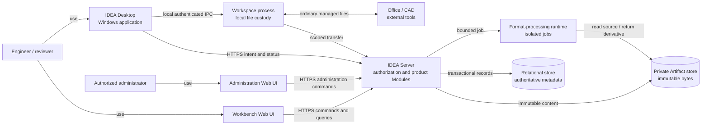
```mermaid
flowchart LR
    accTitle: IDEA Engineering candidate container view
    accDescr: Engineers use the Web workbench or Desktop. Administrators use the Administration Web application. All protected requests go to one IDEA Server, which owns authorization and product coordination and accesses the relational and private Artifact stores. The Workspace process alone manages local working files. Format processing is isolated from the main Server.

    engineer["Engineer / reviewer"]
    administrator["Authorized administrator"]
    workbench["Workbench Web UI"]
    adminWeb["Administration Web UI"]
    desktop["IDEA Desktop<br/>Windows application"]
    workspace["Workspace process<br/>local file custody"]
    tools["Office / CAD<br/>external tools"]
    server["IDEA Server<br/>authorization and product Modules"]
    format["Format-processing runtime<br/>isolated jobs"]
    db[("Relational store<br/>authoritative metadata")]
    artifacts[("Private Artifact store<br/>immutable bytes")]

    engineer -->|use| workbench
    engineer -->|use| desktop
    administrator -->|use| adminWeb
    workbench -->|HTTPS commands and queries| server
    adminWeb -->|HTTPS administration commands| server
    desktop -->|HTTPS intent and status| server
    desktop -->|local authenticated IPC| workspace
    workspace <-->|ordinary managed files| tools
    workspace -->|scoped transfer| server
    server -->|transactional records| db
    server -->|immutable content| artifacts
    server -->|bounded job| format
    format -->|read source / return derivative| artifacts
```

Long description and conclusion:

1. Workbench Web, Administration Web and Desktop are presentation/interaction containers; none is authority.
2. Desktop delegates per-user local file materialization and scanning to the Workspace process; Office/CAD reads and saves ordinary files there.
3. Every protected product or administration command reaches the IDEA Server, which resolves account eligibility, RBAC and owner-Module business gates.
4. The relational store and Artifact store are private implementation containers, never client integration interfaces.
5. Format processing receives one bounded job and cannot mutate source or authoritative product state.

### 4.2 Candidate deployment view

This view separates deployable processes from domain Modules. The two Web front ends serve different
jobs but use the same authenticated Server interfaces and the same product authority. Technology
labels are candidates for Tech approval, not approved deployment facts.

**`ARCH-VIEW-DEP-001` — Candidate deployment and trust zones.** **Model profile:** C4-style
Deployment; `Draft 0.12`; operations, security and Tech reviewers. **Question:** what runs on each
device/zone and where do trust seams cross? **Scope:** initial candidate topology. **Excludes:**
approved sizing, high availability and final technology decision. **Trace:** `REQ-SEC-*`,
`REQ-OPS-*`, `QRS-005/006`. **Legend:** each subgraph is a deployment/trust zone; arrows crossing a
zone are labelled with transport; cylinders are private stores.

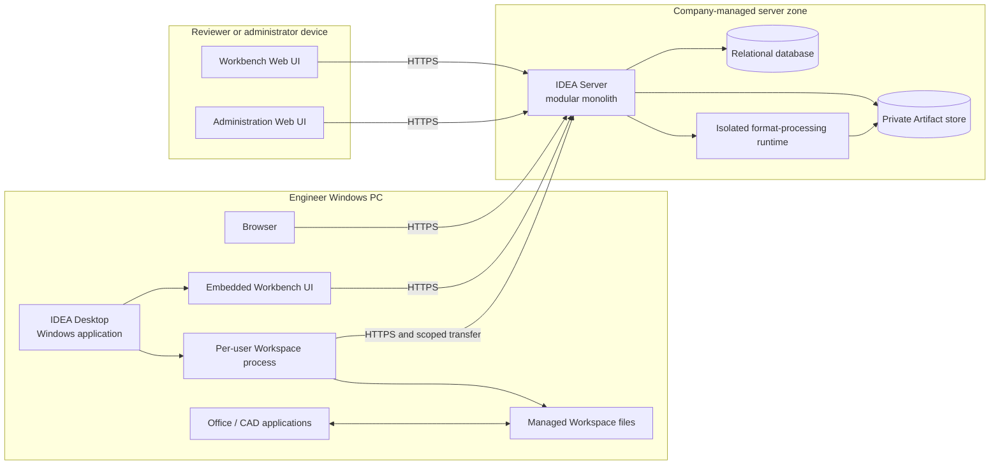
```mermaid
flowchart LR
    accTitle: Candidate deployment and trust zones
    accDescr: Engineer Windows PCs run browser, Desktop, Web-rendered Workbench, per-user Workspace process and external Office or CAD tools. Reviewer and administrator devices use separate Web entry points. All cross-device calls use HTTPS to a company-managed server zone containing the server, database, private Artifact store and isolated format runtime.

    subgraph pc["Engineer Windows PC"]
        browser["Browser"]
        desktop["IDEA Desktop<br/>Windows application"]
        webview["Embedded Workbench UI"]
        workspace["Per-user Workspace process"]
        files["Managed Workspace files"]
        tools["Office / CAD applications"]

        desktop --> webview
        desktop --> workspace
        workspace --> files
        tools <--> files
    end

    subgraph adminPc["Reviewer or administrator device"]
        reviewWeb["Workbench Web UI"]
        adminWeb["Administration Web UI"]
    end

    subgraph serverZone["Company-managed server zone"]
        server["IDEA Server<br/>modular monolith"]
        db[("Relational database")]
        artifacts[("Private Artifact store")]
        format["Isolated format-processing runtime"]

        server --> db
        server --> artifacts
        server --> format
        format --> artifacts
    end

    browser -->|HTTPS| server
    webview -->|HTTPS| server
    workspace -->|HTTPS and scoped transfer| server
    reviewWeb -->|HTTPS| server
    adminWeb -->|HTTPS| server
```

The Workbench and Administration UI may share a component library and authentication/session
mechanism, but they are separate entry points and permission surfaces. Hiding an administration
button in the Workbench is not an authorization control; the Server applies the same policy to every
request.

The Workspace process initially means a protected per-user background process, not a privileged
machine-wide Windows service. Process count and packaging remain a Tech decision.

## 5. Deep Modules, Interfaces and ownership

In this document, a **Module** owns a coherent responsibility and state; its **Interface** is the
small contract callers need; its **Implementation** hides internal complexity; a **Seam** is a place
where policy, technology or deployment can vary; and an **Adapter** translates across a Seam. These
terms do not imply one network service per Module.

| Module | Small Interface intent | Complexity hidden by Implementation | Authoritative state |
|---|---|---|---|
| Controlled Product Data | Register, resolve, organize, Rename, Create Copy, Checkout, prepare/commit Check-in, revise and retrieve exact content through Artifact Custody. | Stable identity, logical folder/placement relationships, copy provenance, Generation immutability, optimistic concurrency, Reservation/business rules and atomic Change Sets. | Logical Document, Document Folder/Placement, source-copy relation, Generation-manifest `ArtifactReference`, Generation, Business Revision, Reservation, Working Head, Check-in Operation/Change Set. It never owns Artifact bytes, locations, staged candidates, provider mapping or BOM/Format Representation metadata. |
| Artifact Custody | Accept a verified immutable candidate or resolve a retained exact Artifact; issue scoped transfers and migrate verified locations. | Content-addressed deduplication, candidate staging, digest/size verification, provider mapping, read selection, location migration and private-byte reconciliation. | Artifact, Artifact Location, Artifact Transfer and Staged Candidate. It may allocate/reuse `ArtifactId` after verification, but never publishes a Generation, advances a Working Head or decides a business outcome. |
| Product Structure | Resolve, validate and publish exact structure; query versioned BOM views; prepare/export BOM Representations; validate and atomically apply BOM Import Candidates. | Node/occurrence/dependency rules, cycles, unresolved members, semantic digest, exact pins, BOM View Profiles, source/output provenance, difference preview and stale-base protection. | Structure Snapshot, controlled relation identities, BOM View Profile versions, BOM Import Candidate/result and BOM Representation metadata including owner-specific exact ArtifactId/digest pins; it does not create CPD Generation-manifest `ArtifactReference` records. |
| Lifecycle Governance | Validate/activate Workflow and Approval definitions, define Workflow Roles and their required RBAC eligibility, assign a default version by Document Class, start/transition an instance, record decisions, Release and resolve an exact baseline. | State/transition validation, definition/instance versioning, role eligibility and instance assignment, decision count/rule, required reason/evidence, invalidation, notifications, exceptions and release completeness. | Workflow Definition/Version, Workflow Role, eligibility rule, Document-Class Workflow Assignment, Workflow Instance/assignment, Review Round, Approval Policy/Decision and Release Record. |
| Information Model | Validate metadata, classify and allocate governed numbers. | Schema versioning, numbering scope/idempotency and policy migration. | Metadata/Classification/Numbering Policy Definitions and allocations. |
| Format Intelligence | Declare capability and request analysis/representation. | Execution mode (`None`, `Manual`, `Application-assisted`, `Parser`, `Standalone converter`), application/Adapter/tool versions, prerequisites, isolation, resource limits, provenance, stale derivative handling and Release-policy response. | Format Capability Profile, job/result identity and Representation metadata including owner-specific exact source/output ArtifactId/digest pins; never source authority or CPD Generation-manifest `ArtifactReference` authority. |
| Project Governance | Create and govern Projects; maintain Project Membership, Project Groups and direct Group Membership through scoped commands. | Membership effective dates, Project isolation, direct-membership-only rule, duplicate/cycle refusal and stable Group identity. | Project, Project Membership, Business/Project Group and direct Group Membership; no account credential or Role Definition/Assignment authority. |
| Access Policy | Prepare/validate/activate the RBAC policy and evaluate Effective Permission for an authoritative resource owner. | Permission catalogue; protected built-in and versioned Custom Role Definitions; Role Assignments over Actor/Group Principals and organization/Project/resource Scopes; supported conditions/effective periods; constrained delegation; additive evaluation; explanation and bootstrap/adoption safety. | Permission, Role Definition/Version, Role Assignment, Authorization Scope reference, delegation constraint, Access Policy Version and authorization-decision evidence. It references Actor eligibility from Identity and Accounts and membership from Project Governance. |
| Application Use-case Transaction Coordinator | Orchestrate one declared cross-module business operation such as Check-in or Release. | Input correlation, declared owner-call order, shared relational unit-of-work lifetime and abort handling. | No authoritative product state and no generic CRUD/resource authority. It calls owner Interfaces; each owner writes only its own state. |
| Discovery | Find/browse through rebuildable projections. | Indexing, query projection, lag and replay. | Search projection only; never product authority. |
| Audit Evidence | Append and export attributable product events. | Correlation, completeness, ordering, retention reference and controlled export. | Append-only Audit Evidence records, appended in the same relational unit of work as the authoritative outcome when the outcome is material; Audit never creates or owns an `OwnerCommandOutcome`. |
| Identity and Accounts | Provision/activate, authenticate, change/reset password, suspend and revoke sessions; resolve stable Actor context; expose a read-only IAM eligibility query port for Access Policy. | Maintained credential mechanisms, recovery tokens, account status, session invalidation, future login linking and the query-port read model. | Organization-scoped Actor/IDEA Account, Login Identity and credential/session/recovery records; no Project Membership, Group, Role Assignment, Workflow Role, document ACL or approval authority. |

### 5.1 Authority and module ownership view

The table above is the detailed responsibility catalogue. The view below is deliberately narrower:
it shows the static Modules needed to understand one protected product command. Administrator
responsibilities belong to `ARCH-VIEW-ACT-001`; Workspace and Artifact responsibility belongs to
`ARCH-VIEW-MOD-002`; runtime Check-in and Release behaviour belongs to the sequence views.

| View field | Definition |
|---|---|
| Diagram name | `ARCH-VIEW-MOD-001` — C4 Component Diagram for the protected command path inside IDEA Server |
| Diagram type / model kind | C4 Component Diagram, rendered with Mermaid flowchart notation |
| Purpose | Show how one protected product command reaches only its declared authoritative owner Modules, and how each owner obtains an authorization decision without giving Access Policy authority over product state. A named cross-Module operation may involve more than one owner. |
| Intended audience | Software maintainers, security reviewers and architecture reviewers. |
| Scope | The coordinator, product-state owners, Access Policy and its two authoritative fact providers inside the `IDEA Server` container. |
| Excludes | People and administrator roles, UI screens, Workspace and Artifact paths, deployment nodes, workflow timing, database tables and detailed message sequences. |
| Trace | `REQ-GOV-*`, `REQ-AUTH-*`, DOC-06, the detailed Module table above and `ARCH-VIEW-MOD-002`. |
| Reading convention | A solid arrow is a permitted logical call in the arrow direction, not a time sequence. Absence of an arrow does not grant access. |

Method basis: [ISO/IEC/IEEE 42010:2022](https://www.iso.org/standard/74393.html) supplies the
architecture-description concepts used to declare the view, concern and model kind; it does not
mandate this notation. The [C4 Component Diagram](https://c4model.com/diagrams/component) supplies
the zoom level: logical components inside one container, their responsibilities and relationships.
The project calls these logical components **Modules** and does not imply a separately deployed
service for each box.

**`ARCH-VIEW-MOD-001` — C4 Component Diagram for the protected command path inside IDEA Server.**

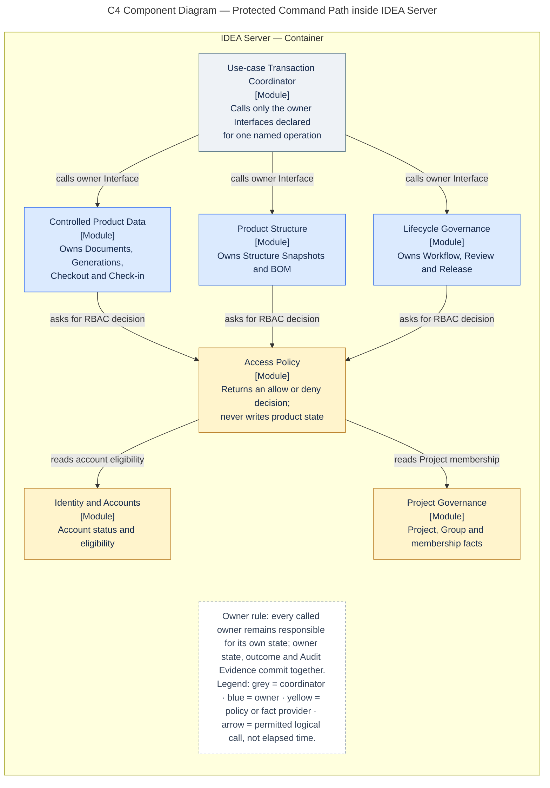
```mermaid
---
title: C4 Component Diagram — Protected Command Path inside IDEA Server
---
flowchart TB
    accTitle: C4 Component Diagram for the protected command path inside IDEA Server
    accDescr: A use-case coordinator invokes only the product-state owner Modules declared for a protected command. A named cross-Module operation may involve more than one owner. Controlled Product Data, Product Structure and Lifecycle Governance are possible owners. Each called owner requests an authorization decision from Access Policy before a protected write. Access Policy reads account eligibility from Identity and Accounts and Project membership from Project Governance. Access Policy returns a decision but never writes product state. The arrows are permitted logical calls, not a time sequence.

    subgraph server["IDEA Server — Container"]
        direction TB

        coordinator["Use-case Transaction Coordinator<br/>[Module]<br/>Calls only the owner Interfaces declared<br/>for one named operation"]

        cpd["Controlled Product Data<br/>[Module]<br/>Owns Documents, Generations,<br/>Checkout and Check-in"]
        structure["Product Structure<br/>[Module]<br/>Owns Structure Snapshots and BOM"]
        lifecycle["Lifecycle Governance<br/>[Module]<br/>Owns Workflow, Review and Release"]

        access["Access Policy<br/>[Module]<br/>Returns an allow or deny decision;<br/>never writes product state"]

        iam["Identity and Accounts<br/>[Module]<br/>Account status and eligibility"]
        project["Project Governance<br/>[Module]<br/>Project, Group and membership facts"]

        note["Owner rule: every called owner remains responsible for its own state; owner state, outcome and Audit Evidence commit together.<br/>Legend: grey = coordinator · blue = owner · yellow = policy or fact provider · arrow = permitted logical call, not elapsed time."]
    end

    coordinator -->|calls owner Interface| cpd
    coordinator -->|calls owner Interface| structure
    coordinator -->|calls owner Interface| lifecycle

    cpd -->|asks for RBAC decision| access
    structure -->|asks for RBAC decision| access
    lifecycle -->|asks for RBAC decision| access
    access -->|reads account eligibility| iam
    access -->|reads Project membership| project

    iam ~~~ note
    project ~~~ note

    classDef owner fill:#dbeafe,stroke:#2563eb,color:#172b4d
    classDef guard fill:#fff4cc,stroke:#b7791f,color:#172b4d
    classDef supporting fill:#eef2f6,stroke:#607d8b,color:#172b4d
    classDef note fill:#ffffff,stroke:#94a3b8,color:#334155,stroke-dasharray:4 3
    class cpd,structure,lifecycle owner
    class access,iam,project guard
    class coordinator supporting
    class note note
```

Module rules:

1. A Module writes only its own authoritative state.
2. Cross-Module work uses an Interface and explicit stable identities, not shared table mutation.
3. A named Application Use-case Transaction Coordinator may coordinate multiple owner
   Implementations only through declared contracts and one atomic business operation. It has no
   generic resource API, repository or CRUD authority and cannot mutate owner state itself.
4. Projections, caches, derivatives and UI view models are rebuildable and never become authority.
5. Splitting a Module across a process Seam requires measured scale, isolation, ownership or failure
   evidence and a new approved Tech decision.
6. Identity and Accounts owns only Actor/account/login eligibility. Project Governance owns Project,
   Project Membership and direct Business-Group membership. Access Policy owns Permission, Role
   Definition, Role Assignment and evaluation; Lifecycle Governance owns Workflow Roles and instance
   assignments. Every administrator is an explicit Role Assignment, not an account type or document superuser.
7. One application transaction coordinates owner modules through a shared relational unit-of-work
   boundary; no owner exposes its database tables as the cross-module Interface. The unit of work
   atomically retains the owner result, Audit Evidence and transactional outbox with the
   authoritative outcome. Transferring authority to a generic CRUD service is not the design.
8. Artifact Custody owns bytes, candidates and locations only. Controlled Product Data retains
   Generation-manifest `ArtifactReference` and publication authority, while Product Structure and
   Format Intelligence retain only their own exact ArtifactId/digest pins in Representation metadata
   and call custody through its narrow Interface rather than write provider records.
9. Access Policy resolves IAM eligibility only through `IF-IAM-ELIGIBILITY-QUERY`, a read-only
   logical port implemented by Identity and Accounts. The query never re-enters an IAM mutation
   command handler and does not hold an IAM mutation lock while resolving a decision; the command
   dependency remains one-way.

### 5.2 RBAC domain view

This view uses UML-style class relationships. `1` and `0..*` express cardinality; the hollow-triangle
arrow means “is a kind of”; labelled solid lines express governed associations. It shows the logical
authorization model, not database tables or UI nesting.

**`ARCH-VIEW-RBAC-001` — Principal-role-scope authorization model.** **Model profile:** UML Class
domain view; `Draft 0.14`; requirements, security and data reviewers. **Question:** how is effective
product permission assembled without treating an account, Group or administrator name as authority?
**Scope:** logical authorization identities and associations. **Excludes:** credentials, UI nesting
and database schema. **Trace:** `REQ-AUTH-001…010`, ADR C1-010, RBAC-01…10. **Legend:** hollow
triangle is specialization; labelled lines and multiplicities are governed associations.

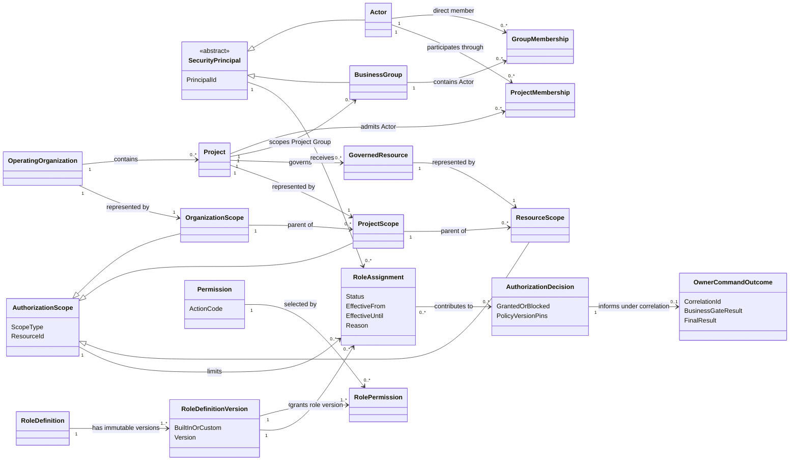
```mermaid
classDiagram
    direction LR
    accTitle: Principal role Scope authorization model
    accDescr: Actors and Business Groups are security principals. Direct memberships connect Actors to Project Groups. Immutable Role Definition versions contain product Permissions, and each Role Assignment binds one principal and one role version to one Authorization Scope. Access Policy owns immutable authorization decisions; the owner Module separately records business-gate and final command outcomes under the same correlation.

    class SecurityPrincipal {
      <<abstract>>
      PrincipalId
    }
    class Actor
    class BusinessGroup
    class GroupMembership
    class OperatingOrganization
    class Project
    class ProjectMembership
    class GovernedResource
    class AuthorizationScope {
      ScopeType
      ResourceId
    }
    class OrganizationScope
    class ProjectScope
    class ResourceScope
    class RoleDefinition
    class RoleDefinitionVersion {
      BuiltInOrCustom
      Version
    }
    class Permission {
      ActionCode
    }
    class RolePermission
    class RoleAssignment {
      Status
      EffectiveFrom
      EffectiveUntil
      Reason
    }
    class AuthorizationDecision {
      GrantedOrBlocked
      PolicyVersionPins
    }
    class OwnerCommandOutcome {
      CorrelationId
      BusinessGateResult
      FinalResult
    }

    SecurityPrincipal <|-- Actor
    SecurityPrincipal <|-- BusinessGroup
    Actor "1" --> "0..*" GroupMembership : direct member
    BusinessGroup "1" --> "0..*" GroupMembership : contains Actor
    Actor "1" --> "0..*" ProjectMembership : participates through
    Project "1" --> "0..*" ProjectMembership : admits Actor
    OperatingOrganization "1" --> "0..*" Project : contains
    Project "1" --> "0..*" BusinessGroup : scopes Project Group
    Project "1" --> "0..*" GovernedResource : governs
    AuthorizationScope <|-- OrganizationScope
    AuthorizationScope <|-- ProjectScope
    AuthorizationScope <|-- ResourceScope
    OperatingOrganization "1" --> "1" OrganizationScope : represented by
    Project "1" --> "1" ProjectScope : represented by
    GovernedResource "1" --> "1" ResourceScope : represented by
    OrganizationScope "1" --> "0..*" ProjectScope : parent of
    ProjectScope "1" --> "0..*" ResourceScope : parent of
    RoleDefinition "1" --> "1..*" RoleDefinitionVersion : has immutable versions
    RoleDefinitionVersion "1" --> "1..*" RolePermission : contains
    Permission "1" --> "0..*" RolePermission : selected by
    SecurityPrincipal "1" --> "0..*" RoleAssignment : receives
    RoleDefinitionVersion "1" --> "0..*" RoleAssignment : grants role version
    AuthorizationScope "1" --> "0..*" RoleAssignment : limits
    RoleAssignment "0..*" --> "0..*" AuthorizationDecision : contributes to
    AuthorizationDecision "1" --> "0..1" OwnerCommandOutcome : informs under correlation
```

Long description and conclusion:

1. Actor and Business Group are the two Core v0 Security Principal kinds. Login Identity is absent because it authenticates an Actor and is not an authorization layer.
2. An Actor joins a Business Group directly; no relationship permits a Business Group to contain another Group.
3. A Role Definition has immutable versions. `RolePermission` associates each immutable version
   with one or more reusable Permission action codes; a Permission is not owned by one Role.
4. A Role Assignment binds one Principal, one exact Role Definition version and one Authorization Scope, with effective status/time and reason.
5. The organization contains Projects, and each Project governs resources. Each level has its own
   Authorization Scope, so the inheritance path is explicit without a recursive self-loop in this
   management-facing view. Project Membership and Project Group scope constrain Project access but
   do not grant an action by themselves.
6. Access Policy computes an immutable `AuthorizationDecision` from every applicable assignment.
   The resource owner separately records `OwnerCommandOutcome`, including its business-gate and
   final result, correlated to the decision. Therefore “RBAC granted” may still end as “operation
   blocked by lifecycle/Checkout rules” without mutating or overloading the policy decision.

The model intentionally contains no separately assignable `Permission Set` and no object called an
administrator account. `Design Engineer` and every administrator name are Role Definitions used in
ordinary Role Assignments.

### 5.3 Checkout, Reference and Check-in responsibility view

This view focuses on the seam that implementation code and tests shall use. It deliberately does not
turn every internal responsibility into a network service or public interface.

**`ARCH-VIEW-MOD-002` — Controlled Workspace publication responsibilities.** **Model profile:** C4
   Component-level responsibility view; `Draft 0.16`; audience is architecture, implementation,
security and verification reviewers. **Question:** which responsibility owns local custody,
Reservation rules, candidate transfer, publication and uncertain-result recovery? **Scope:** one
Checkout/Reference/Check-in path inside one Operating Organization. **Excludes:** UI layout,
database tables, deployment nodes and a selected storage technology. **Trace:** `REQ-WS-001…015`,
`REQ-OPS-001/002`, `IF-PRODUCT-COMMAND`, `IF-ARTIFACT-TRANSFER`, `IF-WORKSPACE-IPC`, ADR C1-004 and
C1-005. **Legend:** a solid arrow is a permitted call or information flow; cylinders are private
persistent stores; the coordinator is a narrow application component, while named Modules retain
their own state and rules.

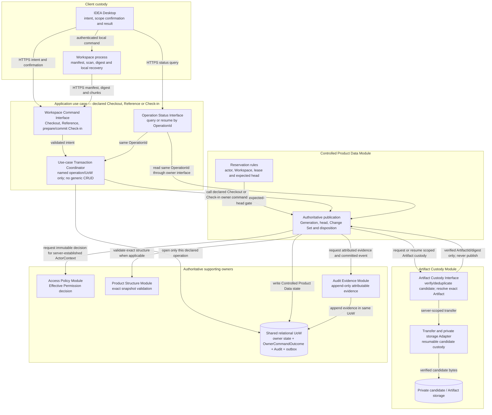
```mermaid
flowchart TB
    accTitle: Controlled Workspace publication responsibilities
    accDescr: The Desktop and Workspace process call named Checkout, Reference and Check-in use cases. A narrow coordinator starts a shared relational unit of work only for the declared operation; it calls owner Modules but has no generic CRUD or outcome authority. Artifact Custody owns private bytes and locations, while Controlled Product Data owns Generation-manifest ArtifactReferences, Reservations and publication; Product Structure and Format Intelligence own any Representation metadata and exact ArtifactId/digest pins in their own boundaries. Owner state, owner outcome, Audit Evidence and outbox commit together.

    subgraph client["Client custody"]
        direction TB
        desktop["IDEA Desktop<br/>intent, scope confirmation and result"]
        workspace["Workspace process<br/>manifest, scan, digest and local recovery"]
        desktop -->|authenticated local command| workspace
    end

    subgraph application["Application use case — declared Checkout, Reference or Check-in"]
        direction TB
        command["Workspace Command Interface<br/>Checkout, Reference, prepare/commit Check-in"]
        status["Operation Status Interface<br/>query or resume by OperationId"]
        coordinator["Use-case Transaction Coordinator<br/>named operation/UoW only; no generic CRUD"]

        command -->|validated intent| coordinator
        status -->|same OperationId| coordinator
    end

    subgraph product["Controlled Product Data Module"]
        direction TB
        reservation["Reservation rules<br/>actor, Workspace, lease and expected head"]
        publisher["Authoritative publication<br/>Generation, head, Change Set and disposition"]

        reservation -->|entitlement and expected-head gate| publisher
    end

    subgraph artifact["Artifact Custody Module"]
        direction TB
        custody["Artifact Custody Interface<br/>verify/deduplicate candidate; resolve exact Artifact"]
        transfer["Transfer and private storage Adapter<br/>resumable candidate custody"]
        staging[("Private candidate / Artifact storage")]
        custody -->|server-scoped transfer| transfer
        transfer -->|verified candidate bytes| staging
    end

    subgraph owners["Authoritative supporting owners"]
        direction TB
        policy["Access Policy Module<br/>Effective Permission decision"]
        structure["Product Structure Module<br/>exact snapshot validation"]
        audit["Audit Evidence Module<br/>append-only attributable evidence"]
        database[("Shared relational UoW<br/>owner state + OwnerCommandOutcome + Audit + outbox")]
    end

    desktop -->|HTTPS intent and confirmation| command
    workspace -->|HTTPS manifest, digest and chunks| command
    desktop -->|HTTPS status query| status
    coordinator -->|call declared Checkout or Check-in owner command| publisher
    publisher -->|request immutable decision for server-established ActorContext| policy
    publisher -->|request or resume scoped Artifact custody| custody
    custody -->|verified ArtifactId/digest only; never publish| publisher
    publisher -->|validate exact structure when applicable| structure
    coordinator -->|open only this declared operation| database
    publisher -->|write Controlled Product Data state| database
    publisher -->|request attributed evidence and committed event| audit
    audit -->|append evidence in same UoW| database
    status -->|read same OperationId through owner interface| publisher
```

Long description and conclusion:

1. Desktop captures intent and confirmation; the Workspace process owns local files, manifest,
   hashing and safe recovery. Neither can create a Generation or decide that Check-in succeeded.
2. Callers learn one small Workspace command interface and one status interface. Reservation,
   transfer, deduplication, idempotency and commit ordering remain hidden implementation complexity.
3. Controlled Product Data, as the resource owner, asks Access Policy for an immutable eligibility
   decision from a server-established `ActorContext`, then applies the current-head, owner,
   Workspace, lease, lifecycle and exact-scope business gates itself. The coordinator never acts as
   an authorization owner.
4. Artifact Custody makes candidate bytes durable and digest-verified, allocates or reuses only an
   `ArtifactId` and returns it to the caller. It owns no Generation, Working Head, Reservation or
   Release decision; candidates remain private and are not a Generation.
5. The coordinator opens a shared relational unit of work only for the declared operation. Each
   owner writes its own state through its Interface; the same commit retains the owner command
   outcome, Audit Evidence and transactional outbox with changed Generations, Working Heads, any
   Change Set and every confirmed Reservation disposition. A No Change entry creates no Generation
   but participates in the same complete result.
6. A client that loses the response asks the status interface about the same `OperationId`. It never
   infers completion from upload progress and never creates a replacement operation with changed
   inputs.
7. The Artifact Custody Adapter is a real Seam because filesystem and later object/multi-volume
   Implementations may replace one another. Neither it nor the use-case coordinator is a general
   product service: custody hides only byte/location complexity, and coordination hides only one
   declared business operation.

## 6. Semantic interface catalogue

The interfaces below define product meaning. Protocol, serialization and library choices are
candidate Tech details; a later implementation must preserve the behavior and errors.

| Interface ID | Owner / caller | Inputs and outputs | Contract and error behavior | Security / trace |
|---|---|---|---|---|
| `IF-PRODUCT-QUERY` | Owner Module / Web, Desktop | Server-established `ActorContext`, stable identity and requested view → authorized exact state/projection. | No client-supplied `ActorId` is trusted; no floating resolution where an exact pin is required; stale projection is identified; missing/unauthorized fails without data leakage. | Authenticated; owner-authorized; correlation/Audit where material. |
| `IF-PRODUCT-COMMAND` | Owner Module / Web, Desktop | Session proof at the server boundary, then server-established `ActorContext`, target, expected state, `OperationId` and payload → one accepted/refused owner outcome. | Optimistic preconditions and idempotency are explicit; the owner requests authorization and enforces final business gates; no partial authoritative outcome. | Client `ActorId` or policy snapshot is never authority; decision evidence pins policy/version inputs. |
| `IF-ARTIFACT-CUSTODY` | Artifact Custody / owner Modules | Candidate or exact Artifact identity/digest plus server-issued operation scope → verified `ArtifactId`/digest, private-custody or read result. | Verification may deduplicate and allocate/reuse an Artifact identity but cannot publish a Generation or mutate owner business state. | Provider/path credentials remain server-only; every material custody result is correlated and auditable. |
| `IF-ARTIFACT-TRANSFER` | Artifact Custody / Workspace or authorized viewer | Exact Artifact/digest and server-issued operation scope → resumable bytes plus verification result. | Short-lived scoped grant; wrong object, expiry, replay or digest mismatch fails closed. | No permanent store credential in client; server mediates transfer and correlates/audits it. |
| `IF-WORKSPACE-IPC` | Workspace process / Desktop | Per-user authenticated commands, progress, manifest and local-state evidence. | Another user/session cannot command/read; reconnect does not invent server success. | Protected local transport; no secrets in diagnostic output. |
| `IF-FORMAT-JOB` | Format Intelligence / isolated Adapter | Immutable source Generation/Artifact digest, Capability Profile and limits → typed candidate/result plus verified output digest. An application-assisted Adapter may invoke only the declared export interface/version. | Idempotent; returned source pin/digest must match the request; Artifact Custody only verifies and stores bytes, while Format Intelligence owns acceptance of Representation metadata, including its own exact source/output ArtifactId/digest pins. Those pins are not CPD Generation-manifest `ArtifactReference` records. Source advance changes the derivative to `Needs update`; failure preserves source and authoritative state. Manual upload uses the same acceptance boundary. | One-job least privilege; application/Adapter/tool provenance and output digest retained; accepted metadata, OwnerCommandOutcome, Audit Evidence and outbox commit in the Format owner unit of work; Release blocks or warns only under its versioned policy. |
| `IF-COMMITTED-EVENT` | Owner Module / projections and notifications | Committed event with identity, version, actor, correlation and source pins. | Published from transactional outbox only; replay repairs consumers; consumer failure cannot reverse/fabricate owner state. | Classification propagated; consumer access scoped. |
| `IF-ACCOUNT-SESSION` | Identity and Accounts / Web, Desktop and Server | Credentials, recovery proof or session proof → server-established `ActorContext` (stable Actor/Organization plus current session-security context), account eligibility or bounded denial. | One-use expiring recovery; explicit revocation; no credential in logs and no public signup endpoint. A client proof is not a trusted `ActorId`; account/session eligibility is checked on every protected request, then revalidated with the owner before authoritative commit. Material account/security mutation writes IAM-owned state, `OwnerCommandOutcome`, material Audit Evidence and applicable outbox in one owner unit of work before success; a failed sign-in has no authoritative account mutation and may use the independent sign-in audit path. | `REQ-IAM-001/003/004/006/007`; `VVP-015`; maintained framework mechanisms, not a custom OAuth server. |
| `IF-IAM-ELIGIBILITY-QUERY` | Identity and Accounts (read-only query port) / Access Policy | Server-established `ActorContext` and request correlation → current account/session eligibility, security-version and bounded IAM facts, or unavailable/denied result. | Read-only logical seam for authorization resolution. It cannot mutate account, session or recovery state, issue/revoke commands, re-enter the IAM mutation command handler or hold an IAM mutation lock while resolving; missing evidence fails closed. It is not a new process or service. | No client-supplied `ActorId`; the query and returned security version are correlated to the immutable `AuthorizationDecision` without exposing protected credential data. |
| `IF-DIRECTORY-ADMIN` | Identity and Accounts / Account Administration UI | Server-established `ActorContext`, assigned Scope, expected version and account/Login-Identity command → one accepted/refused directory outcome. | Only an effective Account Administrator may issue, activate, suspend or recover accounts in Scope. The interface cannot create Project/Group membership, Role Definitions/Assignments, read an existing password or imply product authority. A material accepted mutation commits IAM-owned state, `OwnerCommandOutcome`, Audit Evidence and applicable outbox atomically in one relational unit of work; stale, unauthorized or invalid commands mutate nothing and retain bounded refusal evidence. | `REQ-IAM-002/003/005…007`; actor, target, Scope, before/after identity and outcome audited without secrets. |
| `IF-PROJECT-ACCESS-ADMIN` | Project Governance / Project Administration UI | Project Scope, expected version and Project-Membership/Group/Group-Membership command → one accepted/refused outcome. | The caller must have Project Administrator at that Project. Only direct Actor membership is accepted; another Project, a nested Group or a partial concurrent change is refused. Account and role state are not mutated. | `REQ-AUTH-003/005/009/010`; Project/Group/member identities, before/after values, actor, reason and outcome audited. |
| `IF-RBAC-ADMIN` | Access Policy / Role Administration UI | Role Definition candidate or Role Assignment command, base version, Principal, exact Scope, effective interval/condition and reason → validation/diff or accepted/refused outcome. | Built-in roles cannot be edited; Custom Role change creates a successor version available to new assignments but never retargets an existing assignment implicitly. Moving an assignment to the successor is a separate previewed replacement. The caller's delegation limits are revalidated at commit; self-broadening, unapproved role/principal/Scope, non-Super highest-role change and last-recovery removal fail atomically. Serialized import is only a candidate and never self-authorizes activation. | `REQ-AUTH-001…010`, `REQ-GOV-005`; RBAC-01…10; exact role/assignment and before/after outcome audited. |
| `IF-AUTHORIZATION-DECISION` | Access Policy / every authoritative owner Module | Server-established `ActorContext`, requested Permission, `ResourceId`, Scope and expected state → immutable `AuthorizationDecision`, contributing paths and policy/version pins. | Access Policy itself resolves current IAM eligibility through `IF-IAM-ELIGIBILITY-QUERY`, Project Membership, direct Group Membership, Role Assignments, Role Definition Versions and Scope hierarchy; no owner accepts a client policy snapshot. No grant blocks. The decision cannot commit owner state or bypass owner business gates. The read-only IAM query port never re-enters an IAM mutation command. | `REQ-GOV-002`, `REQ-AUTH-003…008`; decision and separately owned `OwnerCommandOutcome` share a correlation identity. |
| `IF-WORKFLOW-ADMIN` | Lifecycle Governance / Product Configuration Administration UI | Workflow/Approval definition candidate, Workflow Roles, RBAC eligibility rules and base version → validation/diff or activated version. | A definition cannot create accounts, Groups, memberships or Role Assignments. Missing roles/transitions/eligibility, stale base or self-authorizing adoption is refused; running instances remain pinned to prior versions. | `REQ-LC-001/003/005`, `REQ-GOV-005`, `REQ-AUTH-008`; WF-01…06; definition/version/actor/outcome audited. |
| `IF-STRUCTURE-BOM` | Product Structure / Web, Desktop, controlled export and named BOM Import coordinator | Exact Structure Snapshot and BOM View Profile → authorized BOM view or pinned BOM Representation; exact base snapshot plus candidate payload → validation/diff or one confirmed coordinator operation returning exact Structure Snapshot and Generation identities. | A file upload is non-authoritative. Query/export never follows floating latest. Product Structure generates export bytes through Artifact Custody, then revalidates the exact snapshot/profile/business conditions and accepts BOM Representation metadata, including owner-specific ArtifactId/digest pins, in its owner UoW before returning a retained/Current result; that pin is not a CPD `ArtifactReference`. A named BOM Import coordinator opens one shared relational unit of work for confirmation, asks Product Structure and Controlled Product Data to write only their own state, and retains owner outcomes, Audit Evidence and outbox atomically. Invalid, unresolved, stale-base, unauthorized or faulted import changes no authoritative row and creates no partial snapshot or Generation. | `REQ-STR-004…006`; BM-01…06; snapshot/profile/candidate/output digests, owner outcomes and actor evidence audited. |
| `IF-DESKTOP-BRIDGE` | Desktop / approved Web-rendered region | Versioned, allowlisted intent plus selected item/Workspace scope → progress/result. | Validate sender origin/frame, schema, session and manifest scope; no arbitrary path, shell command or generic host-object proxy. Navigation invalidates bridge authority; unsupported version fails safely. | `REQ-SEC-003`; `VVP-009/011`; native confirmation where scope changes. |
| `IF-COMPANY-IDENTITY` | Future login Adapter / Identity and Accounts | Verified provider subject → explicitly linked internal Actor/Organization. | Future integration; failure cannot substitute another actor, auto-link by email or reinterpret retained Audit. Native login remains the initial method. | Protocol/provider and company authorization `UNKNOWN`; deferred, not implemented as an empty integration layer. |

A supported public integration interface is outside Core v0. Internal versioned interfaces do not
create a promise of ERP/MRP write-back, bidirectional synchronization or direct database access.

## 7. Key interaction and state sequences

Lifecycle state and edit entitlement are independent. `Under Review` answers where a Business
Revision is in its Workflow; an active Checkout answers who may publish the next change from an
expected Generation. Approval is a retained decision, not a second lifecycle state. Local file
condition and Check-in progress are two further independent facts. The UI may show them together,
but implementation and Audit shall not collapse them into one generic status.

| Independent fact | Source of truth | Example values | It must never be used to infer |
|---|---|---|---|
| Business Revision workflow | Lifecycle Governance | `Start`, `In Work`, `Under Review`, `Released` | who holds publish entitlement or whether a local file changed |
| Reservation status | Controlled Product Data | `Active`, `Ended`, `Expired`, `Recovered` | workflow state, local file deletion or successful Check-in |
| Workspace Entry condition | Workspace Manifest plus current authorized server query | `Reference`, `Checkout`; exact/changed locally; current/out of date | authoritative publication or permission by itself |
| Check-in Operation status | Controlled Product Data | prepared, transferring, validating, ready, committed, refused or reconciliation needed | file integrity without digest evidence or user intent for a different operation |

**`ARCH-VIEW-ACT-002` — End-to-end controlled Release Spine.** **Model profile:** UML-style
activity view rendered as a flowchart; `Draft 0.13`; product, architecture and delivery reviewers.
**Question:** how does a registered document become an exactly reproducible Release while the
independent states above remain separate? **Scope:** one Logical Document and the exact Release scope
that eventually contains it. **Excludes:** screen navigation, physical deployment and format-specific
editing. **Trace:** `REQ-ID-*`, `REQ-WS-*`, `REQ-LC-*`, `REQ-STR-003`, `REQ-OPS-004`,
`IF-PRODUCT-COMMAND`. **Legend:** solid arrows are successful business progress; labelled alternate
arrows are mutually exclusive outcomes; red-outline nodes are safe stopped outcomes and do not
publish authority.

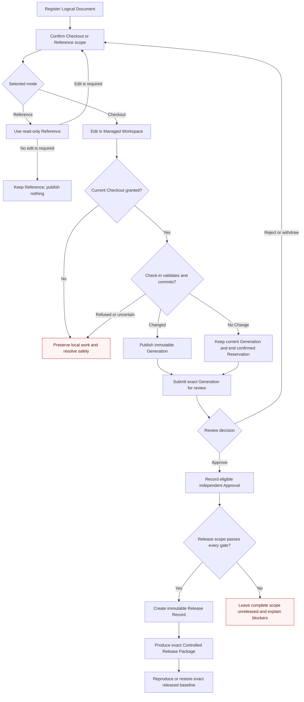
```mermaid
flowchart TB
    accTitle: End-to-end controlled Release Spine
    accDescr: A Logical Document is registered, an exact Checkout or Reference scope is confirmed, work is performed in an ordinary local Workspace, and Check-in either publishes one immutable Generation or records No Change while ending the confirmed Reservation. The exact Generation is reviewed, approved and released only after scope revalidation. Any failed Check-in preserves local work and any failed Release leaves the scope unreleased. An exact Release Package can later be reproduced and restored.

    Register[Register Logical Document] --> Acquire[Confirm Checkout or Reference scope]
    Acquire --> Mode{Selected mode}
    Mode -->|Checkout| Work[Edit in Managed Workspace]
    Mode -->|Reference| Reference[Use read-only Reference]
    Reference -->|Edit is required| Acquire
    Reference -->|No edit is required| RefOnly[Keep Reference; publish nothing]
    Work --> Eligible{Current Checkout granted?}
    Eligible -->|Yes| Checkin{Check-in validates and commits?}
    Eligible -->|No| Safe[Preserve local work and resolve safely]
    Checkin -->|Changed| Generation[Publish immutable Generation]
    Checkin -->|No Change| SameHead[Keep current Generation and end confirmed Reservation]
    Checkin -->|Refused or uncertain| Safe
    Generation --> Review[Submit exact Generation for review]
    SameHead --> Review
    Review --> Decision{Review decision}
    Decision -->|Approve| Approve[Record eligible independent Approval]
    Decision -->|Reject or withdraw| Acquire
    Approve --> Release{Release scope passes every gate?}
    Release -->|Yes| Record[Create immutable Release Record]
    Release -->|No| Blocked[Leave complete scope unreleased and explain blockers]
    Record --> Package[Produce exact Controlled Release Package]
    Package --> Restore[Reproduce or restore exact released baseline]

    classDef stopped fill:#fff4f4,stroke:#b42318,color:#5f1610
    class Safe,Blocked stopped
```

Reading order is top to bottom. Registration creates identity, not a released file. Checkout or
Reference establishes a visible read-only Workspace mode for an exact scope and never enters the
Check-in path by itself. If editing becomes necessary, the user must request a current Checkout.
A successful changed Check-in
publishes one immutable Generation; a successful `No Change` publishes none but still ends every
confirmed Reservation. Review and Approval pin an exact Generation. Release then revalidates the
complete confirmed scope and either creates one immutable Release Record or creates no release
outcome. Reproduction and restore resolve only from that retained record and its exact pins.

The diagrams below are conceptual state views; persisted codes remain governed by the selected
definitions. Each state transition names the event or command that changes that one state owner.

**`ARCH-VIEW-STATE-001` — Business Revision workflow state.** **Model profile:** UML State
 Machine; `Draft 0.12`; lifecycle users and reviewers. **Question:** which governed commands move the
Revision, independently of Checkout? **Scope:** one Business Revision and its seeded lifecycle.
**Excludes:** Reservation, local
Workspace and transfer state. **Trace:** `REQ-LC-001…009`, `VVP-006`. **Legend:** arrows are
accepted commands; notes are invariant constraints, not additional states.

```mermaid
stateDiagram-v2
    accTitle: Business Revision workflow state
    accDescr: A first successful Check-in moves a Revision from Start to In Work. Submit moves it to Under Review. Reject or Withdraw returns it to In Work. Approval records a decision but the Revision remains Under Review until an eligible Release succeeds. Checkout never changes this workflow.
    direction LR

    state "In Work" as InWork
    state "Under Review" as UnderReview
    [*] --> Start
    Start --> InWork: first successful Check-in
    InWork --> UnderReview: Submit for review
    UnderReview --> InWork: Reject or Withdraw review
    UnderReview --> Released: Release after approval and gate validation
    Released --> [*]
```

The principal conclusion is that Checkout, Check-in transfer progress and Approval do not silently
advance this state machine. In particular, an approved Revision remains `Under Review` until the
Release command passes its exact-scope gates.

**`ARCH-VIEW-STATE-002` — Reservation record lifecycle.** **Model profile:** UML State Machine;
`Draft 0.12`; engineer, support and implementation reviewers. **Question:** how does the temporary
publish entitlement end? **Scope:** one server-authoritative `ReservationId` from creation through
terminal disposition. **Excludes:** Workflow,
local file and Check-in Operation state. **Trace:** `REQ-WS-002/007…010/013`, ADR C1-005,
`WS-01…04`. **Legend:** each arrow changes the status of the same `ReservationId`; a new Checkout
always creates a different Reservation record.

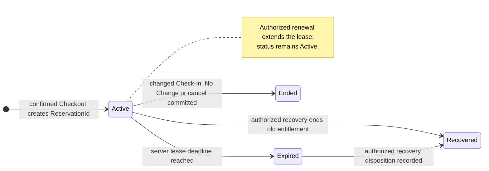
```mermaid
stateDiagram-v2
    accTitle: Reservation record lifecycle
    accDescr: A confirmed Checkout creates an Active Reservation. Renewal keeps that same record Active. A committed changed or No Change Check-in or governed cancel makes it Ended. Lease timeout makes it Expired. Authorized recovery makes the old record Recovered. Ended, Expired and Recovered records never become Active again; any later Checkout creates a new Reservation against the current head.
    direction LR

    [*] --> Active: confirmed Checkout creates ReservationId
    note right of Active
      Authorized renewal extends the lease;
      status remains Active.
    end note
    Active --> Ended: changed Check-in, No Change or cancel committed
    Active --> Expired: server lease deadline reached
    Active --> Recovered: authorized recovery ends old entitlement
    Expired --> Recovered: authorized recovery disposition recorded
```

`Ended`, `Expired` and `Recovered` grant no publish entitlement, but their records remain for
Audit. Network loss, sign-out and application exit are not transitions. They stop renewal at most;
the server clock and configured lease decide whether `Active` later becomes `Expired`. Reference
never creates a Reservation. No administrator path reactivates the old record or bypasses the
expected-Generation check. `Released` is a Business Revision lifecycle state only; it is never a
Reservation status or Reservation terminal disposition.

**`ARCH-VIEW-STATE-003` — Local Reference condition and safe exits.** **Model profile:** state and
condition view; `Draft 0.14`; engineer, support and interaction reviewers. **Question:** what may the
user do when local integrity and server freshness change independently? **Scope:** one Workspace
Entry originally materialized as Reference and its pinned expected Generation. **Excludes:** server
Workflow and semantic CAD/Office merge. **Trace:** `REQ-WS-003/010/011/014`, `QRS-003`,
`WS-05/06`. **Legend:** the Reference condition is the Cartesian observation
`LocalIntegrity × ServerFreshness`; `Unknown` means the relevant fact is not proved and cannot be
silently treated as current.

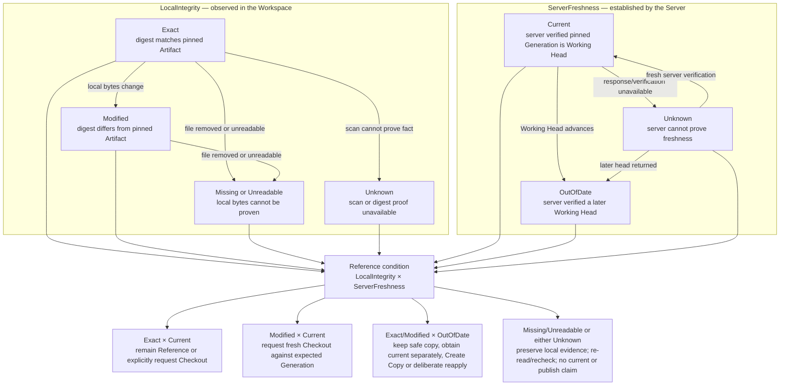
```mermaid
flowchart TB
    accTitle: Local Reference condition and safe exits
    accDescr: Local file verification and server-head verification are independent observations. Exact plus Current permits ordinary Reference use. Modified plus Current may convert to Checkout only after a fresh server grant. OutOfDate, Missing, Unreadable or either Unknown condition preserves local work and blocks any claim that it is current or publishable until an explicit safe path and revalidation succeed.

    subgraph local["LocalIntegrity — observed in the Workspace"]
        exact["Exact<br/>digest matches pinned Artifact"]
        modified["Modified<br/>digest differs from pinned Artifact"]
        unreadable["Missing or Unreadable<br/>local bytes cannot be proven"]
        localUnknown["Unknown<br/>scan or digest proof unavailable"]
        exact -->|local bytes change| modified
        exact -->|file removed or unreadable| unreadable
        exact -->|scan cannot prove fact| localUnknown
        modified -->|file removed or unreadable| unreadable
    end

    subgraph freshness["ServerFreshness — established by the Server"]
        current["Current<br/>server verified pinned Generation is Working Head"]
        outOfDate["OutOfDate<br/>server verified a later Working Head"]
        serverUnknown["Unknown<br/>server cannot prove freshness"]
        current -->|Working Head advances| outOfDate
        current -->|response/verification unavailable| serverUnknown
        serverUnknown -->|fresh server verification| current
        serverUnknown -->|later head returned| outOfDate
    end

    condition["Reference condition<br/>LocalIntegrity × ServerFreshness"]
    exact --> condition
    modified --> condition
    unreadable --> condition
    localUnknown --> condition
    current --> condition
    outOfDate --> condition
    serverUnknown --> condition

    normal["Exact × Current<br/>remain Reference or explicitly request Checkout"]
    convert["Modified × Current<br/>request fresh Checkout against expected Generation"]
    stale["Exact/Modified × OutOfDate<br/>keep safe copy, obtain current separately, Create Copy or deliberate reapply"]
    uncertain["Missing/Unreadable or either Unknown<br/>preserve local evidence; re-read/recheck; no current or publish claim"]
    condition --> normal
    condition --> convert
    condition --> stale
    condition --> uncertain
```

| Observed Reference condition | Safe primary action | Server effect before any later Check-in |
|---|---|---|
| `Exact × Current` | Continue as Reference, or explicitly request Checkout. | Reference itself creates no Reservation. `Current` is valid only after server verification. |
| `Modified × Current` | Request **Chuyển thành bản làm việc**; keep the same local bytes only if fresh Checkout is granted. | One new Reservation binds this Workspace and expected Generation. |
| `Exact × OutOfDate` | Keep the exact historical Reference or confirm replacement with the current exact file. | No publish and no merge. |
| `Modified × OutOfDate` | Keep a safe copy, Create Copy, or obtain current separately and deliberately reapply under a new current-head Checkout. | Original Logical Document remains unchanged; discard requires confirmation. |
| `Missing`/`Unreadable` local integrity, or either dimension `Unknown` | Preserve the available evidence and show the fact as unproved; re-read/re-hash locally or re-query the server before offering a state-dependent action. | No conversion, publish, automatic replacement or “current” label is permitted from an unproved fact. |

### 7.1 Checkout and materialization

**`ARCH-VIEW-SEQ-001` — Confirmed Checkout/Reference materialization.** **Model profile:** UML
Sequence; `Draft 0.14`; engineer, implementation and verification reviewers. **Question:** when are
Reservations created, and how do exact files enter the Workspace? **Scope:** one confirmed root plus
selected related documents in one Managed Workspace. **Excludes:** later Check-in and semantic
content merge. **Trace:** `REQ-WS-001…006/013/015`,
`IF-PRODUCT-COMMAND`, `IF-ARTIFACT-TRANSFER`, `WS-01`. **Legend:** `alt` branches are mutually
exclusive outcomes; dashed returns contain results and no command; every file transfer is for an
exact Artifact/digest.

1. Desktop resolves the selected root and known Related Documents.
2. User confirms each item as Checkout, Reference or excluded; no hidden assembly-wide cascade.
3. Server authorizes the complete request and creates one Reservation per Checkout document against
   its expected Generation. One conflict refuses the proposed set and returns affected entries.
4. Controlled Product Data grants scoped Artifact transfer for the confirmed snapshot.
5. Workspace process materializes every exact file, verifies the digest and records its Workspace
   Manifest before Desktop reports completion and opens the root through the operating system.

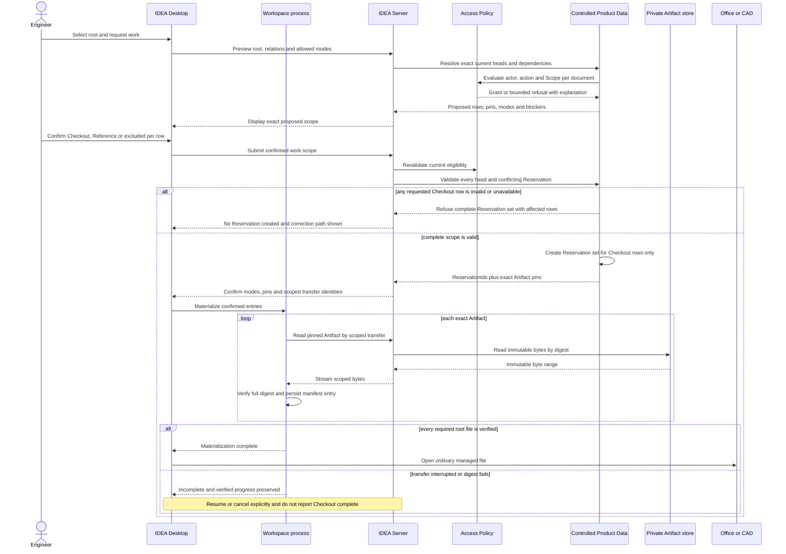
```mermaid
sequenceDiagram
    accTitle: Confirmed Checkout and Reference materialization
    accDescr: The engineer first sees and confirms an exact document scope. The server evaluates permission and current state for every row. One conflict refuses the requested Reservation set. If valid, the server creates Reservations only for Checkout rows, returns exact Artifact pins for both modes, and mediates each Store-to-Workspace byte stream so the Workspace verifies each digest before updating its manifest or opening the root file.

    actor Engineer
    participant Desktop as IDEA Desktop
    participant Workspace as Workspace process
    participant Server as IDEA Server
    participant Policy as Access Policy
    participant Product as Controlled Product Data
    participant Store as Private Artifact store
    participant Tool as Office or CAD

    Engineer->>Desktop: Select root and request work
    Desktop->>Server: Preview root, relations and allowed modes
    Server->>Product: Resolve exact current heads and dependencies
    Product->>Policy: Evaluate actor, action and Scope per document
    Policy-->>Product: Grant or bounded refusal with explanation
    Product-->>Server: Proposed rows, pins, modes and blockers
    Server-->>Desktop: Display exact proposed scope
    Engineer->>Desktop: Confirm Checkout, Reference or excluded per row
    Desktop->>Server: Submit confirmed work scope
    Server->>Policy: Revalidate current eligibility
    Server->>Product: Validate every head and conflicting Reservation
    alt any requested Checkout row is invalid or unavailable
        Product-->>Server: Refuse complete Reservation set with affected rows
        Server-->>Desktop: No Reservation created and correction path shown
    else complete scope is valid
        Product->>Product: Create Reservation set for Checkout rows only
        Product-->>Server: ReservationIds plus exact Artifact pins
        Server-->>Desktop: Confirm modes, pins and scoped transfer identities
        Desktop->>Workspace: Materialize confirmed entries
        loop each exact Artifact
            Workspace->>Server: Read pinned Artifact by scoped transfer
            Server->>Store: Read immutable bytes by digest
            Store-->>Server: Immutable byte range
            Server-->>Workspace: Stream scoped bytes
            Workspace->>Workspace: Verify full digest and persist manifest entry
        end
        alt every required root file is verified
            Workspace-->>Desktop: Materialization complete
            Desktop->>Tool: Open ordinary managed file
        else transfer interrupted or digest fails
            Workspace-->>Desktop: Incomplete and verified progress preserved
            Note over Desktop,Server: Resume or cancel explicitly and do not report Checkout complete
        end
    end
```

The Reservation-set creation is atomic for the confirmed Checkout rows; Reference rows never receive
one. File transfer occurs afterward and may resume independently. Therefore materialization failure
does not invent a successful local file, end the already granted Reservations or change a
Generation. The user can resume, cancel under policy or let the lease expire; each path remains
visible and attributable.

### 7.1.1 Modified Reference handling

**`ARCH-VIEW-SEQ-005` — Modified Reference decision sequence.** **Model profile:** UML Sequence;
`Draft 0.12`; engineer and support reviewers. **Question:** which server check permits conversion,
and what remains safe when it fails? **Scope:** one locally modified Reference entry, its Workspace
and its expected Generation. **Excludes:**
automatic CAD/Office merge and generic file comparison. **Trace:** `REQ-WS-003/010/011/014`,
`QRS-003`, `WS-05/06`. **Legend:** `alt` branches are user-selected paths and mutually exclusive for
this attempt. The user is choosing what to do with local bytes; none of these choices silently
changes the original Logical Document.

1. Workspace detects that a file materialized as Reference no longer matches its recorded digest and
   reports **Đã thay đổi trên máy**.
2. Direct Check-in is unavailable because Reference grants no publish entitlement.
3. `Chuyển thành bản làm việc` asks Server for a new Checkout against the referenced expected
   Generation. It succeeds only when that Generation remains current and no other active Reservation
   exists.
4. If the Generation is stale or unavailable, Workspace preserves the local candidate and lets the
   user keep a safe copy, materialize the current Generation separately, create a new Logical
   Document, or discard only after confirmation. CAD/Office content is never auto-merged.

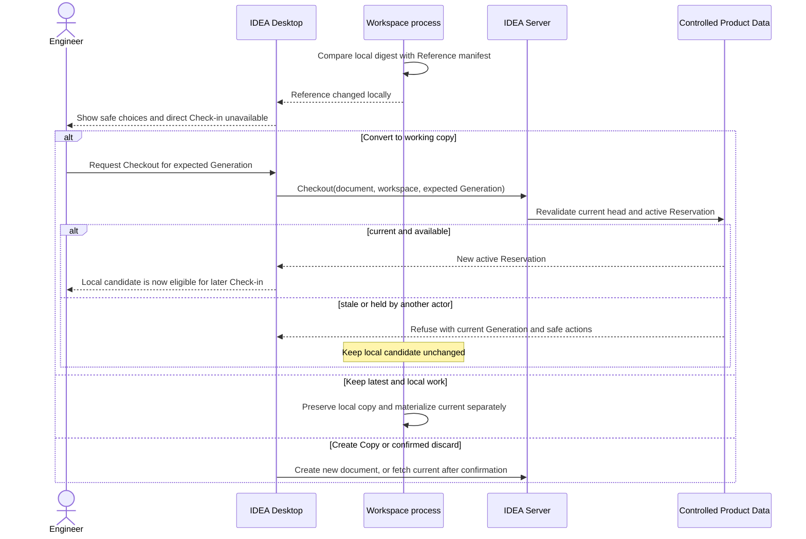
```mermaid
sequenceDiagram
    accTitle: Modified Reference decision sequence
    accDescr: A changed local Reference cannot be checked in. The engineer may request Checkout against its exact expected Generation. Only a still-current and available Generation yields a new Reservation while keeping local bytes. Otherwise the original document is unchanged and the local candidate remains available for safe copy, current-file comparison, deliberate reapplication, Create Copy or confirmed discard.

    actor Engineer
    participant Desktop as IDEA Desktop
    participant Workspace as Workspace process
    participant Server as IDEA Server
    participant Product as Controlled Product Data

    Workspace->>Workspace: Compare local digest with Reference manifest
    Workspace-->>Desktop: Reference changed locally
    Desktop-->>Engineer: Show safe choices and direct Check-in unavailable
    alt Convert to working copy
        Engineer->>Desktop: Request Checkout for expected Generation
        Desktop->>Server: Checkout(document, workspace, expected Generation)
        Server->>Product: Revalidate current head and active Reservation
        alt current and available
            Product-->>Desktop: New active Reservation
            Desktop-->>Engineer: Local candidate is now eligible for later Check-in
        else stale or held by another actor
            Product-->>Desktop: Refuse with current Generation and safe actions
            Note over Workspace: Keep local candidate unchanged
        end
    else Keep latest and local work
        Workspace->>Workspace: Preserve local copy and materialize current separately
    else Create Copy or confirmed discard
        Desktop->>Server: Create new document, or fetch current after confirmation
    end
```

Text alternative: a modified Reference is detected locally and cannot be checked in. Conversion to
a working copy requires a fresh server Checkout against the same current Generation. If that check
fails, the original document remains unchanged and the user's local bytes remain available for safe
copy, comparison/manual reapplication, Create Copy or confirmed discard.

### 7.2 Check-in and stale recovery

**`ARCH-VIEW-STATE-004` — Check-in Operation lifecycle.** **Model profile:** UML State Machine;
`Draft 0.12`; implementation, operations and verification reviewers. **Question:** which
operation-level states may resume, which state proves publication, and when is reconciliation
required? **Scope:** one server-owned `OperationId` from registration through terminal resolution.
**Excludes:** individual transfer/validation phases, chunk/range state and
UI progress wording; those pre-commit phases are decomposed in the transition table below. **Trace:**
`REQ-WS-007…013/015`, `REQ-OPS-001/002`, `QRS-001/002/011`, `WS-02/03/07/08`.
**Legend:** arrows show principal operation-level transitions for the same immutable input
fingerprint; `Ended without publication` groups the three distinct terminal outcomes `Refused`,
`Failed` and `Cancelled` only to keep this overview readable. Their exact transitions remain in the
table below. `Needs reconciliation` is a held operational state, not success.

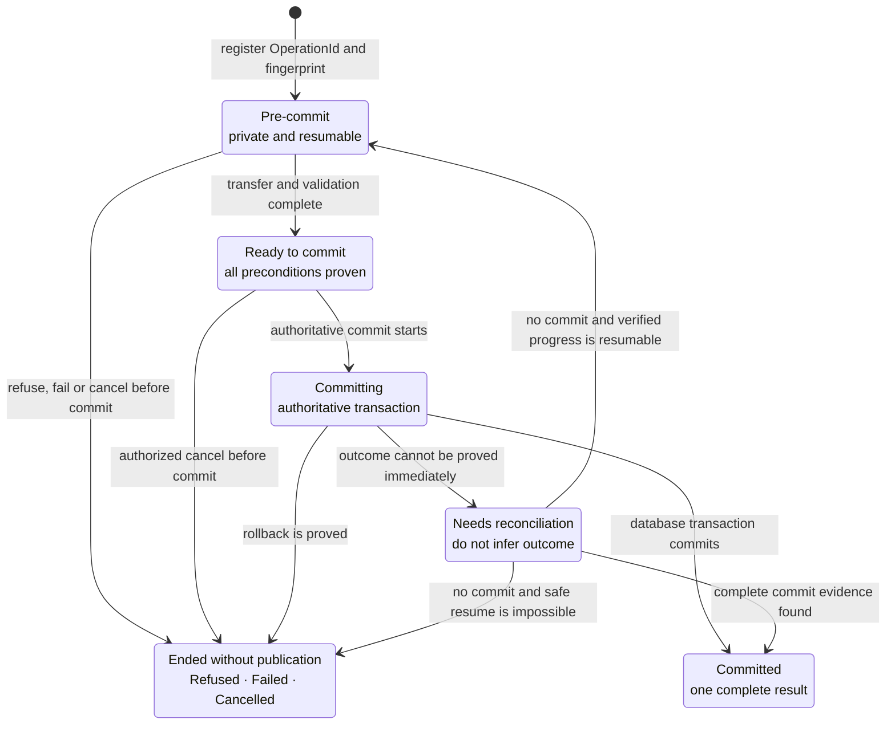
```mermaid
stateDiagram-v2
    accTitle: Check-in Operation lifecycle
    accDescr: The server accepts one OperationId and input fingerprint into a private resumable pre-commit state. Only complete transfer and validation reach Ready to commit, and only the authoritative database commit reaches Committed. Refused, failed and cancelled operations are grouped as ended without publication in this overview and remain distinct in the transition table. An uncertain commit outcome is held for reconciliation before the client may treat it as committed or safely resumable.

    direction TB

    state "Pre-commit<br/>private and resumable" as PreCommit
    state "Ready to commit<br/>all preconditions proven" as ReadyToCommit
    state "Committing<br/>authoritative transaction" as Committing
    state "Committed<br/>one complete result" as Committed
    state "Ended without publication<br/>Refused · Failed · Cancelled" as EndedNoPublication
    state "Needs reconciliation<br/>do not infer outcome" as NeedsReconciliation

    [*] --> PreCommit: register OperationId and fingerprint
    PreCommit --> ReadyToCommit: transfer and validation complete
    PreCommit --> EndedNoPublication: refuse, fail or cancel before commit
    ReadyToCommit --> EndedNoPublication: authorized cancel before commit
    ReadyToCommit --> Committing: authoritative commit starts
    Committing --> Committed: database transaction commits
    Committing --> EndedNoPublication: rollback is proved
    Committing --> NeedsReconciliation: outcome cannot be proved immediately
    NeedsReconciliation --> Committed: complete commit evidence found
    NeedsReconciliation --> PreCommit: no commit and verified progress is resumable
    NeedsReconciliation --> EndedNoPublication: no commit and safe resume is impossible
```

`Pre-commit` is one operation-level state with three internal phases: `Prepared`, `Transferring` and
`Validating`. Those phases may resume only with the same `OperationId` and identical declared-input
fingerprint. A transport interruption alone does not make the operation `Failed`. `Refused`, `Failed`
and `Cancelled` publish no Generation and do not end a still-valid Reservation merely because
the Check-in attempt ended; an explicit Reservation cancel or independent lease expiry remains a
separate event. `Needs reconciliation` prevents both a success claim and an unsafe replacement
operation until authoritative evidence resolves it.

| Source condition | Accepted event or proved fact | Target condition | Authoritative meaning |
|---|---|---|---|
| New request | Initial validation refuses the declared input. | `Refused` | No candidate or product state is published. |
| New request | Server records one `OperationId` and immutable input fingerprint. | `Prepared` | The operation exists, but no product change is public. |
| `Prepared` | Changed entries require bytes. | `Transferring` | Resumable private transfer may start. |
| `Prepared` | Every entry is No Change and needs no candidate bytes. | `Validating` | The same operation still performs all current-state checks. |
| `Transferring` | Every candidate digest is verified. | `Validating` | Complete immutable candidates exist privately. |
| `Validating` | Permission, lifecycle, Reservation, expected head, scope and content checks all pass. | `Ready to commit` | This is the final safe point before authoritative publication. |
| Any state before `Committing` | Authorized user cancels. | `Cancelled` | No product state is published; Reservation disposition follows the explicit cancel policy, not an inferred Check-in success. |
| Any state before `Committing` | A business precondition is no longer valid. | `Refused` | No publication; affected facts and safe recovery actions are returned. |
| Any state before `Committing` | A technical failure is known and safe resume is impossible. | `Failed` | No authoritative commit; local work remains recoverable. |
| `Ready to commit` | The authoritative database transaction starts. | `Committing` | Client retry must query the same operation; it must not create another one. |
| `Committing` | Transaction commit is proved. | `Committed` | The complete result is authoritative and all confirmed Reservations are ended. |
| `Committing` | Rollback is proved. | `Failed` | None of the proposed product changes became authoritative. |
| `Committing` | Immediate outcome cannot be proved. | `Needs reconciliation` | Neither success nor failure may be reported yet. |
| `Needs reconciliation` | Commit evidence is found, or non-commit plus safe resumability is proved. | `Committed`, `Transferring` or `Failed` | Resolution follows authoritative evidence; it never guesses from client progress. |

**`ARCH-VIEW-SEQ-002` — Atomic Check-in publication.** **Model profile:** UML Sequence; `Draft
0.14`; engineer, implementation, operations and verification reviewers. **Question:** where is the
last safe refusal point, and what exactly becomes authoritative together? **Scope:** one confirmed
multi-document Check-in scope and one immutable `OperationId` input. **Excludes:** response-loss
recovery, which is isolated in
`ARCH-VIEW-SEQ-007`. **Trace:** `REQ-WS-006…013/015`, `REQ-OPS-001`, `IF-PRODUCT-COMMAND`,
`IF-ARTIFACT-TRANSFER`, ADR C1-004/C1-005, `WS-02/03/07`. **Legend:** private staging is outside
the authoritative database transaction; the `alt` paths are mutually exclusive results for the
same operation.

1. Workspace process scans/hashes the complete candidate scope and classifies unchanged, changed,
   missing, Out of date and modified-without-Checkout entries using the approved UI terms.
2. Desktop requires confirmation of exact scope and explains that a successful or No Change result ends Checkout for that scope. Core v0 offers no retain-after-Check-in option.
3. Content is staged privately through Artifact Custody. The Server establishes `ActorContext` from
   session proof and the named Check-in coordinator validates digest, metadata, relations, policy,
   owner, Workspace, Reservation and expected Generation.
4. Any invalid entry refuses the entire confirmed operation. Local work is preserved; the response
   shows expected/current Generation and valid refresh/reapply, Save As, retry or governed recovery.
5. Verify and durably materialize immutable candidate bytes in private storage **before** publication. A failed or uncertain file write cannot reach `Ready to commit`. No filesystem/object-store write is assumed to participate in a database transaction.
6. One shared relational database transaction revalidates account/session eligibility, owner policy,
   Reservation, expected heads and scope. Its named coordinator calls owner Modules only through
   their Interfaces; the owners record Artifact manifest references, required Structure Snapshots,
   Generations, Working Heads, a Change Set when at least one entry changed, the owner command
   outcome, Audit Evidence, outbox and the end of the in-scope Reservations. Each Module writes only
   its owned state through that unit of work.
7. A semantic No Change result creates no Generation and still records the result and ends every Reservation in the confirmed scope. A mixed changed/unchanged scope ends all confirmed Reservations when the whole operation succeeds. Failure preserves local work and any still-valid entitlement.
8. Retrying the same OperationId resolves the same operation; it does not create a duplicate Generation, Change Set or result. After a database failure, unused bytes remain private and are reconciled only after proving no live operation or retained Generation references them.

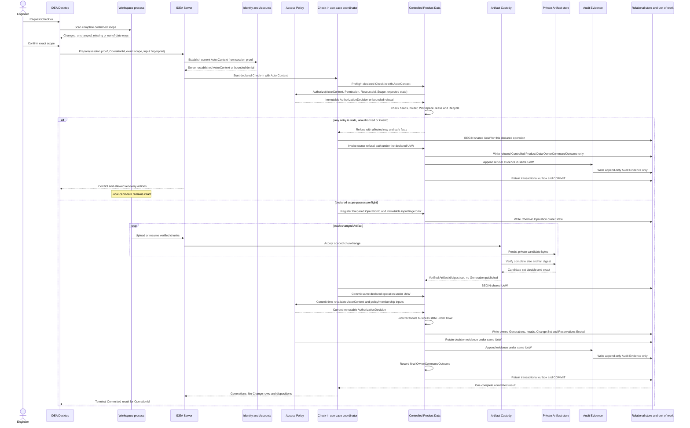
```mermaid
sequenceDiagram
    accTitle: Atomic Check-in publication
    accDescr: The engineer confirms an exact scope after a complete local scan. The Server establishes ActorContext from session proof, then a named Check-in coordinator calls the Controlled Product Data owner. That owner asks Access Policy for authorization and applies its own business gates. Changed bytes are staged and digest-verified by Artifact Custody. At commit time, a shared relational unit of work revalidates authorization and business state, records each owner outcome, Audit Evidence and outbox atomically, publishes every changed Generation and ends confirmed Reservations as Ended. Any refusal or pre-commit failure publishes none and preserves local work.

    actor Engineer
    participant Desktop as IDEA Desktop
    participant Workspace as Workspace process
    participant Server as IDEA Server
    participant IAM as Identity and Accounts
    participant Policy as Access Policy
    participant Coordinator as Check-in use-case coordinator
    participant Product as Controlled Product Data
    participant Custody as Artifact Custody
    participant Store as Private Artifact store
    participant Audit as Audit Evidence
    participant DB as Relational store and unit of work

    Engineer->>Desktop: Request Check-in
    Desktop->>Workspace: Scan complete confirmed scope
    Workspace-->>Desktop: Changed, unchanged, missing or out-of-date rows
    Engineer->>Desktop: Confirm exact scope
    Desktop->>Server: Prepare(session proof, OperationId, exact scope, input fingerprint)
    Server->>IAM: Establish current ActorContext from session proof
    IAM-->>Server: Server-established ActorContext or bounded denial
    Server->>Coordinator: Start declared Check-in with ActorContext
    Coordinator->>Product: Preflight declared Check-in with ActorContext
    Product->>Policy: Authorize(ActorContext, Permission, ResourceId, Scope, expected state)
    Policy-->>Product: Immutable AuthorizationDecision or bounded refusal
    Product->>Product: Check heads, holder, Workspace, lease and lifecycle
    alt any entry is stale, unauthorized or invalid
        Product-->>Coordinator: Refuse with affected row and safe facts
        Coordinator->>DB: BEGIN shared UoW for this declared operation
        Coordinator->>Product: Invoke owner refusal path under the declared UoW
        Product->>DB: Write refused Controlled Product Data OwnerCommandOutcome only
        Product->>Audit: Append refusal evidence in same UoW
        Audit->>DB: Write append-only Audit Evidence only
        Product->>DB: Retain transactional outbox and COMMIT
        Server-->>Desktop: Conflict and allowed recovery actions
        Note over Workspace: Local candidate remains intact
    else declared scope passes preflight
        Coordinator->>Product: Register Prepared OperationId and immutable input fingerprint
        Product->>DB: Write Check-in Operation owner state
        loop each changed Artifact
            Workspace->>Server: Upload or resume verified chunks
            Server->>Custody: Accept scoped chunk/range
            Custody->>Store: Persist private candidate bytes
        end
        Custody->>Store: Verify complete size and full digest
        Store-->>Custody: Candidate set durable and exact
        Custody-->>Product: Verified ArtifactId/digest set, no Generation published
        Coordinator->>DB: BEGIN shared UoW
        Coordinator->>Product: Commit same declared operation under UoW
        Product->>Policy: Commit-time revalidate ActorContext and policy/membership inputs
        Policy-->>Product: Current immutable AuthorizationDecision
        Product->>Product: Lock/revalidate business state under UoW
        Product->>DB: Write owned Generations, heads, Change Set and Reservations Ended
        Policy->>DB: Retain decision evidence under same UoW
        Product->>Audit: Append evidence under same UoW
        Audit->>DB: Write append-only Audit Evidence only
        Product->>Product: Record final OwnerCommandOutcome
        Product->>DB: Retain transactional outbox and COMMIT
        DB-->>Coordinator: One complete committed result
        Coordinator-->>Server: Generations, No Change rows and dispositions
        Server-->>Desktop: Terminal Committed result for OperationId
    end
```

Private Artifact writes are intentionally not presented as part of the relational ACID transaction.
The invariant is logical all-or-none visibility: verified candidates may exist privately before
commit, but authoritative readers see either the complete changed Change Set, the recorded No Change
result, or the prior baseline. A known
pre-commit failure changes no Working Head and ends no Reservation. Unreferenced private bytes
remain subject to controlled reconciliation and cannot be treated as a Generation.

### 7.2.1 Interrupted and uncertain Check-in result

**`ARCH-VIEW-SEQ-007` — Resolve interruption by OperationId.** **Model profile:** UML Sequence;
`Draft 0.12`; engineer, support, operations and verification reviewers. **Question:** how does the
client distinguish safe resume from a commit whose response was lost? **Scope:** one interrupted
client attempt and the same immutable `OperationId` input. **Excludes:** starting a different business
operation or editing the declared scope. **Trace:** `REQ-WS-007/010/012/013`, `REQ-OPS-001/002`, `QRS-002`,
`WS-03/07`. **Legend:** a crossed return is a response the client did not receive; status and
reconciliation always use the original `OperationId`.

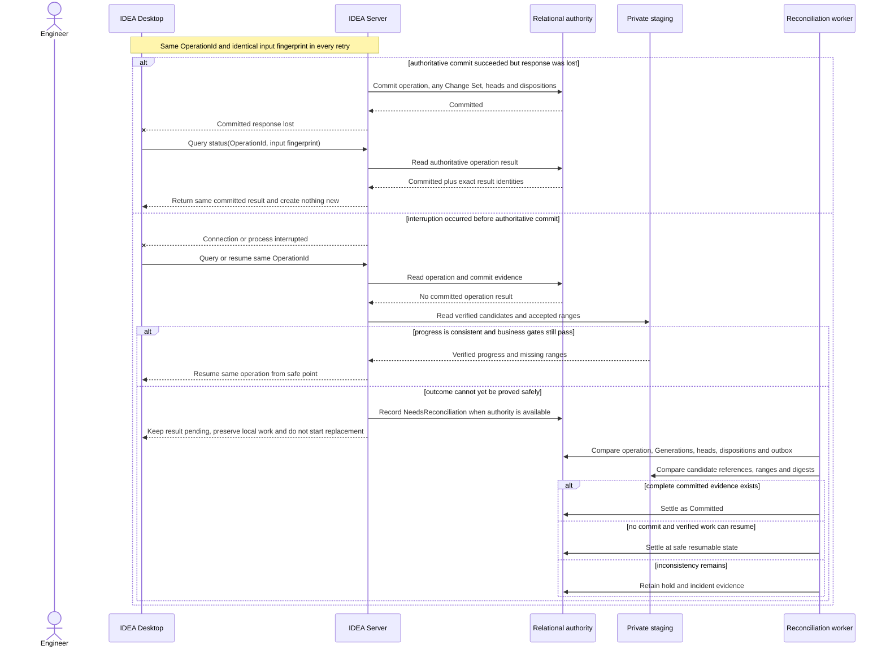
```mermaid
sequenceDiagram
    accTitle: Resolve an interrupted or uncertain Check-in by OperationId
    accDescr: If the commit succeeded but its response was lost, the client queries the same OperationId and receives the already committed result. If interruption occurred before commit, the server returns verified progress for safe resume. If authoritative evidence is inconsistent or temporarily unavailable, the operation is held for reconciliation and no new operation or success is inferred.

    actor Engineer
    participant Desktop as IDEA Desktop
    participant Server as IDEA Server
    participant DB as Relational authority
    participant Staging as Private staging
    participant Reconcile as Reconciliation worker

    Note over Desktop,Server: Same OperationId and identical input fingerprint in every retry
    alt authoritative commit succeeded but response was lost
        Server->>DB: Commit operation, any Change Set, heads and dispositions
        DB-->>Server: Committed
        Server--xDesktop: Committed response lost
        Desktop->>Server: Query status(OperationId, input fingerprint)
        Server->>DB: Read authoritative operation result
        DB-->>Server: Committed plus exact result identities
        Server-->>Desktop: Return same committed result and create nothing new
    else interruption occurred before authoritative commit
        Server--xDesktop: Connection or process interrupted
        Desktop->>Server: Query or resume same OperationId
        Server->>DB: Read operation and commit evidence
        DB-->>Server: No committed operation result
        Server->>Staging: Read verified candidates and accepted ranges
        alt progress is consistent and business gates still pass
            Staging-->>Server: Verified progress and missing ranges
            Server-->>Desktop: Resume same operation from safe point
        else outcome cannot yet be proved safely
            Server->>DB: Record NeedsReconciliation when authority is available
            Server-->>Desktop: Keep result pending, preserve local work and do not start replacement
            Reconcile->>DB: Compare operation, Generations, heads, dispositions and outbox
            Reconcile->>Staging: Compare candidate references, ranges and digests
            alt complete committed evidence exists
                Reconcile->>DB: Settle as Committed
            else no commit and verified work can resume
                Reconcile->>DB: Settle at safe resumable state
            else inconsistency remains
                Reconcile->>DB: Retain hold and incident evidence
            end
        end
    end
```

The Desktop clears the displayed Checkout entitlement only after the authoritative status is
`Committed` and includes the Reservation dispositions for the confirmed scope. Reusing the same
`OperationId` with a different document set, expected Generation, Reservation, Workspace, size or
digest is an input mismatch and is refused; it is never interpreted as a retry.

### 7.3 Review, approval and Release

**`ARCH-VIEW-SEQ-003` — Review and exact Release sequence.** **Model profile:** UML Sequence;
`Draft 0.15`; author, approver, Release Authority and lifecycle reviewers. **Question:** how does an
exact reviewed Generation become part of one reproducible Release without changing unrelated work?
**Scope:** one Review Round and one Release operation. **Excludes:** Workspace transfer and later
Revision work; the separate authorized Withdraw command is described in rule 4 but not drawn.
**Trace:** `REQ-LC-001…009`, `REQ-AUTH-006…008`, `REQ-STR-003`, `VVP-006`, SR-01…06. **Legend:** `alt`
branches are mutually exclusive lifecycle outcomes; dashed arrows are returned assignments/results.

1. Submit creates a new identified Review Round and pins the exact Generation and review scope under one Workflow/Approval Policy Version.
2. When an instance starts, Lifecycle Governance resolves the active default for its Document Class
   or an explicitly permitted selection, then pins that Workflow Definition and Approval Policy.
3. A later definition activation affects future instances only; migration of a running instance is
   a separately authorized, previewed and audited operation.
4. A content-changing Check-in is blocked while the Business Revision is Under Review. The submitter
   may Withdraw or a reviewer may Reject; either closes the current Review Round and returns to In
   Work. A later changed Check-in and resubmission creates a new Review Round and never inherits the
   earlier decision.
5. The seeded path requires one eligible independent approver and refuses self-approval/release.
   Missing actors or invalid configuration block the affected action with an explainable result.
6. The applicable Release Policy classifies whether the confirmed scope requires zero, one or more
   exact `StructurePin` records. Where structure is required by the scope/package rules, every pin
   is exact and is revalidated with the required Structure Snapshot; Release also revalidates exact
   Artifacts, decisions, exceptions, policy and Audit.
7. Success atomically creates an immutable Release Record, its `0..* StructurePin` records and
   reproducible Controlled Release Package; failure changes no release state and reports blocking
   entries. No global rule infers that every Release must have, or must lack, structure.

Submit and Approve/Reject are protected Lifecycle commands, not UI-only transitions. For each,
the Server establishes the ActorContext from session proof, Access Policy evaluates the requested
action and exact resource, and Lifecycle revalidates the actor's eligibility, exact Generation,
workflow rules and current authority before commit. Lifecycle owns each accepted or refused
`OwnerCommandOutcome`; Audit Evidence appends the attributable result without becoming the decision
owner. A refused command never creates a Review Round or Approval Decision.

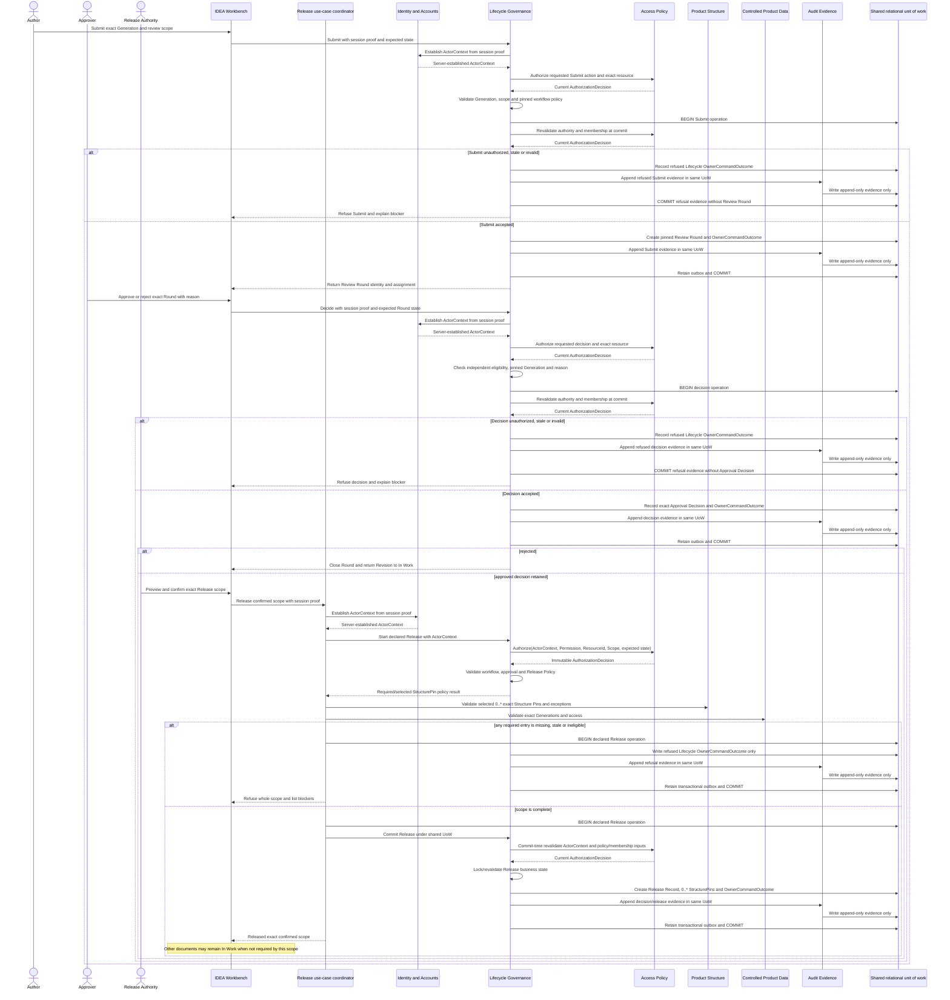
```mermaid
sequenceDiagram
    accTitle: Review approval and exact Release sequence
    accDescr: An author submits one exact Generation with server-established ActorContext and current authorization. Lifecycle commits one Review Round, its owner outcome and Audit evidence or refuses without creating the round. An independent approver's decision is separately authenticated, authorized, checked against the pinned Generation and policy, and committed with owner outcome and Audit. A rejected round returns to In Work. For an approved round, the narrow Release coordinator obtains fresh authorization, validates the exact confirmed scope and either refuses all of it or atomically records one Release Record, applicable Structure Pins, owner outcome, Audit Evidence and outbox. Unrelated documents may remain In Work.

    actor Author
    actor Approver
    actor Releaser as Release Authority
    participant UI as IDEA Workbench
    participant Coordinator as Release use-case coordinator
    participant IAM as Identity and Accounts
    participant Lifecycle as Lifecycle Governance
    participant Policy as Access Policy
    participant Structure as Product Structure
    participant Product as Controlled Product Data
    participant Audit as Audit Evidence
    participant UoW as Shared relational unit of work

    Author->>UI: Submit exact Generation and review scope
    UI->>Lifecycle: Submit with session proof and expected state
    Lifecycle->>IAM: Establish ActorContext from session proof
    IAM-->>Lifecycle: Server-established ActorContext
    Lifecycle->>Policy: Authorize requested Submit action and exact resource
    Policy-->>Lifecycle: Current AuthorizationDecision
    Lifecycle->>Lifecycle: Validate Generation, scope and pinned workflow policy
    Lifecycle->>UoW: BEGIN Submit operation
    Lifecycle->>Policy: Revalidate authority and membership at commit
    Policy-->>Lifecycle: Current AuthorizationDecision
    alt Submit unauthorized, stale or invalid
        Lifecycle->>UoW: Record refused Lifecycle OwnerCommandOutcome
        Lifecycle->>Audit: Append refused Submit evidence in same UoW
        Audit->>UoW: Write append-only evidence only
        Lifecycle->>UoW: COMMIT refusal evidence without Review Round
        Lifecycle-->>UI: Refuse Submit and explain blocker
    else Submit accepted
        Lifecycle->>UoW: Create pinned Review Round and OwnerCommandOutcome
        Lifecycle->>Audit: Append Submit evidence in same UoW
        Audit->>UoW: Write append-only evidence only
        Lifecycle->>UoW: Retain outbox and COMMIT
        Lifecycle-->>UI: Return Review Round identity and assignment
        Approver->>UI: Approve or reject exact Round with reason
        UI->>Lifecycle: Decide with session proof and expected Round state
        Lifecycle->>IAM: Establish ActorContext from session proof
        IAM-->>Lifecycle: Server-established ActorContext
        Lifecycle->>Policy: Authorize requested decision and exact resource
        Policy-->>Lifecycle: Current AuthorizationDecision
        Lifecycle->>Lifecycle: Check independent eligibility, pinned Generation and reason
        Lifecycle->>UoW: BEGIN decision operation
        Lifecycle->>Policy: Revalidate authority and membership at commit
        Policy-->>Lifecycle: Current AuthorizationDecision
        alt Decision unauthorized, stale or invalid
            Lifecycle->>UoW: Record refused Lifecycle OwnerCommandOutcome
            Lifecycle->>Audit: Append refused decision evidence in same UoW
            Audit->>UoW: Write append-only evidence only
            Lifecycle->>UoW: COMMIT refusal evidence without Approval Decision
            Lifecycle-->>UI: Refuse decision and explain blocker
        else Decision accepted
            Lifecycle->>UoW: Record exact Approval Decision and OwnerCommandOutcome
            Lifecycle->>Audit: Append decision evidence in same UoW
            Audit->>UoW: Write append-only evidence only
            Lifecycle->>UoW: Retain outbox and COMMIT
            alt rejected
                Lifecycle-->>UI: Close Round and return Revision to In Work
            else approved decision retained
                Releaser->>UI: Preview and confirm exact Release scope
                UI->>Coordinator: Release confirmed scope with session proof
                Coordinator->>IAM: Establish ActorContext from session proof
                IAM-->>Coordinator: Server-established ActorContext
                Coordinator->>Lifecycle: Start declared Release with ActorContext
                Lifecycle->>Policy: Authorize(ActorContext, Permission, ResourceId, Scope, expected state)
                Policy-->>Lifecycle: Immutable AuthorizationDecision
                Lifecycle->>Lifecycle: Validate workflow, approval and Release Policy
                Lifecycle-->>Coordinator: Required/selected StructurePin policy result
                Coordinator->>Structure: Validate selected 0..* exact Structure Pins and exceptions
                Coordinator->>Product: Validate exact Generations and access
                alt any required entry is missing, stale or ineligible
                    Coordinator->>UoW: BEGIN declared Release operation
                    Lifecycle->>UoW: Write refused Lifecycle OwnerCommandOutcome only
                    Lifecycle->>Audit: Append refusal evidence in same UoW
                    Audit->>UoW: Write append-only evidence only
                    Lifecycle->>UoW: Retain transactional outbox and COMMIT
                    Coordinator-->>UI: Refuse whole scope and list blockers
                else scope is complete
                    Coordinator->>UoW: BEGIN declared Release operation
                    Coordinator->>Lifecycle: Commit Release under shared UoW
                    Lifecycle->>Policy: Commit-time revalidate ActorContext and policy/membership inputs
                    Policy-->>Lifecycle: Current AuthorizationDecision
                    Lifecycle->>Lifecycle: Lock/revalidate Release business state
                    Lifecycle->>UoW: Create Release Record, 0..* StructurePins and OwnerCommandOutcome
                    Lifecycle->>Audit: Append decision/release evidence in same UoW
                    Audit->>UoW: Write append-only evidence only
                    Lifecycle->>UoW: Retain transactional outbox and COMMIT
                    Coordinator-->>UI: Released exact confirmed scope
                    Note over UI: Other documents may remain In Work when not required by this scope
                end
            end
        end
    end
```

### 7.4 Account provisioning, Project access and session loss

1. A controlled, one-time bootstrap creates a named first Super Administrator and an explicit
   recovery path. This does not grant document, Approval or Release authority.
2. An authorized Account Administrator issues Linh's Actor, IDEA Account and Login Identity in the
   Operating Organization. Activation/password setup uses framework-managed, one-use expiring proof
   through an approved delivery channel; open self-registration is disabled. The account alone grants
   no Project or product authority.
3. A Project Administrator assigned at Project `P-100` adds Linh to that Project and, when justified,
   directly to the `Cơ khí P-100` Business Group. The Account Administrator cannot perform either
   operation merely because it created the account.
4. The `Cơ khí P-100` Group receives the `Design Engineer` Role Definition at `P-100` through a Role
   Assignment. A Project Administrator may create that assignment only when its own delegated role,
   principal class and Scope limits allow it. Changing the Role Definition itself belongs to an
   authorized Privileged Role Administrator, not routine Project administration.
5. Native IDEA login establishes a protected session. The Server/IAM establishes `ActorContext`
   from its proof; no client-supplied `ActorId`, username, email or provider claim is a durable
   document-owner key. Every protected product request is still evaluated from current account
   eligibility, Project Membership, Group Membership, applicable Role Assignments and the resource
   owner's business gates.
6. Password recovery invalidates prior recovery proof and affected sessions; a material
   account/security mutation writes IAM-owned state, its `OwnerCommandOutcome`, material Audit
   Evidence and applicable outbox in one owner unit of work before success. Refusal changes no
   account state and retains bounded evidence. A failed sign-in has no authoritative account-state
   mutation and may be audited through its independent sign-in path. Requests beginning after a
   suspension/revocation commit are refused for affected old sessions; commands revalidate
   eligibility before their own commit.
7. Already running transfers are cancelled or revalidated at defined request/chunk checkpoints; bytes
   already delivered and saved local work cannot be remotely erased. Resume requires fresh
   authorization. Exact timing/checkpoints must be qualified, not described as instantaneous
   revocation of every byte.
8. UI explains reauthentication without deleting a local candidate. Re-enabling an account does not
   resurrect old sessions. Account, Project, Group and Role Assignment changes do not rewrite
   historical Actor, Approval or Audit records.

**`ARCH-VIEW-SEQ-008` — Native account, session revocation and recovery.** **Model profile:** UML
  Sequence; `Draft 0.16`; security, implementation and support reviewers. **Question:** how does IDEA
establish and revoke a native session while preserving stable Actor history and local work?
**Scope:** one Actor/account, one Web or Desktop session and one protected operation. **Excludes:**
future company identity provider protocol and the detailed RBAC algorithm in section 7.6.
**Trace:** `REQ-IAM-001…007`, `REQ-AUTH-008/009`, `REQ-SEC-001/003`, `IF-ACCOUNT-SESSION`,
`IF-IAM-ELIGIBILITY-QUERY`.
**Legend:** solid arrows are commands or validation calls; dashed arrows are results; `alt` paths are
mutually exclusive. Suspension/recovery changes account or session authority, never document
ownership history.

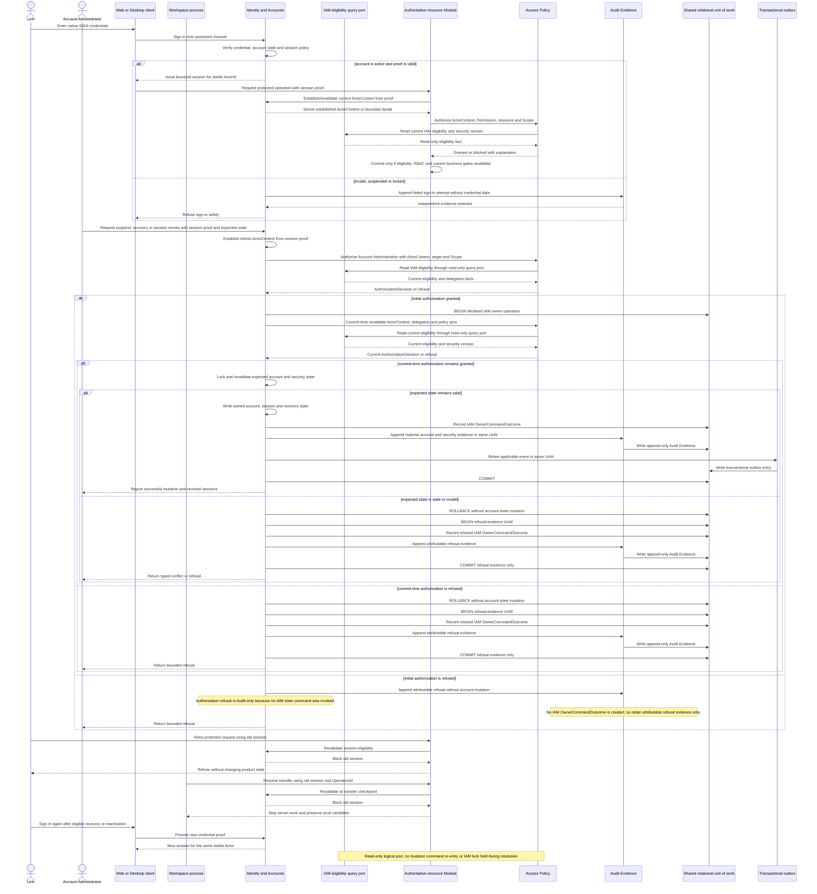
```mermaid
sequenceDiagram
    accTitle: Native account session revocation and recovery
    accDescr: Linh signs in through the IDEA client and receives a bounded session only when the account is active. A client sends session proof, never a trusted ActorId; Server/IAM establishes ActorContext before the owner asks Access Policy and applies business gates. Access Policy reads IAM eligibility through a read-only query port that never re-enters an IAM mutation command. A material account or security mutation writes IAM state, OwnerCommandOutcome, Audit Evidence and applicable outbox in one relational unit of work before success. A failed sign-in is audited independently because it has no authoritative account-state mutation. When an Account Administrator suspends the account or recovery changes credentials, affected sessions are revoked. Later requests and resumed transfers using an old session are refused, while local Workspace files remain safe. A fresh eligible sign-in keeps the same stable Actor history.

    actor Linh
    actor Admin as Account Administrator
    participant Client as Web or Desktop client
    participant Workspace as Workspace process
    participant IAM as Identity and Accounts
    participant IAMQ as IAM eligibility query port
    participant Owner as Authoritative resource Module
    participant Policy as Access Policy
    participant Audit as Audit Evidence
    participant UoW as Shared relational unit of work
    participant Outbox as Transactional outbox

    Linh->>Client: Enter native IDEA credentials
    Client->>IAM: Sign in over protected channel
    IAM->>IAM: Verify credential, account state and session policy
    alt account is active and proof is valid
        IAM-->>Client: Issue bounded session for stable ActorId
        Client->>Owner: Request protected operation with session proof
        Owner->>IAM: Establish/revalidate current ActorContext from proof
        IAM-->>Owner: Server-established ActorContext or bounded denial
        Owner->>Policy: Authorize ActorContext, Permission, resource and Scope
        Policy->>IAMQ: Read current IAM eligibility and security version
        IAMQ-->>Policy: Read-only eligibility fact
        Policy-->>Owner: Granted or blocked with explanation
        Owner->>Owner: Commit only if eligibility, RBAC and current business gates revalidate
    else invalid, suspended or locked
        IAM->>Audit: Append failed sign-in attempt without credential data
        Audit-->>IAM: Independent evidence retained
        IAM-->>Client: Refuse sign-in safely
    end

    Admin->>IAM: Request suspend, recovery or session revoke with session proof and expected state
    IAM->>IAM: Establish Admin ActorContext from session proof
    IAM->>Policy: Authorize Account Administration with ActorContext, target and Scope
    Policy->>IAMQ: Read IAM eligibility through read-only query port
    IAMQ-->>Policy: Current eligibility and delegation facts
    Policy-->>IAM: AuthorizationDecision or refusal
    alt initial authorization granted
        IAM->>UoW: BEGIN declared IAM owner operation
        IAM->>Policy: Commit-time revalidate ActorContext, delegation and policy pins
        Policy->>IAMQ: Read current eligibility through read-only query port
        IAMQ-->>Policy: Current eligibility and security version
        Policy-->>IAM: Current AuthorizationDecision or refusal
        alt commit-time authorization remains granted
            IAM->>IAM: Lock and revalidate expected account and security state
            alt expected state remains valid
                IAM->>IAM: Write owned account, session and recovery state
                IAM->>UoW: Record IAM OwnerCommandOutcome
                IAM->>Audit: Append material account and security evidence in same UoW
                Audit->>UoW: Write append-only Audit Evidence
                IAM->>Outbox: Retain applicable event in same UoW
                Outbox->>UoW: Write transactional outbox entry
                IAM->>UoW: COMMIT
                IAM-->>Admin: Report successful mutation and revoked sessions
            else expected state is stale or invalid
                IAM->>UoW: ROLLBACK without account-state mutation
                IAM->>UoW: BEGIN refusal-evidence UoW
                IAM->>UoW: Record refused IAM OwnerCommandOutcome
                IAM->>Audit: Append attributable refusal evidence
                Audit->>UoW: Write append-only Audit Evidence
                IAM->>UoW: COMMIT refusal evidence only
                IAM-->>Admin: Return typed conflict or refusal
            end
        else commit-time authorization is refused
            IAM->>UoW: ROLLBACK without account-state mutation
            IAM->>UoW: BEGIN refusal-evidence UoW
            IAM->>UoW: Record refused IAM OwnerCommandOutcome
            IAM->>Audit: Append attributable refusal evidence
            Audit->>UoW: Write append-only Audit Evidence
            IAM->>UoW: COMMIT refusal evidence only
            IAM-->>Admin: Return bounded refusal
        end
    else initial authorization is refused
        IAM->>Audit: Append attributable refusal without account mutation
        Note over IAM: Authorization refusal is Audit-only because no IAM state command was invoked.
        Note over Audit: No IAM OwnerCommandOutcome is created, so retain attributable refusal evidence only.
        IAM-->>Admin: Return bounded refusal
    end

    Linh->>Owner: Retry protected request using old session
    Owner->>IAM: Revalidate session eligibility
    IAM-->>Owner: Block old session
    Owner-->>Linh: Refuse without changing product state
    Workspace->>Owner: Resume transfer using old session and OperationId
    Owner->>IAM: Revalidate at transfer checkpoint
    IAM-->>Owner: Block old session
    Owner-->>Workspace: Stop server work and preserve local candidate

    Linh->>Client: Sign in again after eligible recovery or reactivation
    Client->>IAM: Present new credential proof
    IAM-->>Client: New session for the same stable Actor
    Note over IAMQ,Policy: Read-only logical port, no mutation command re-entry or IAM lock held during resolution
```

The account change and session revocation commit together with the IAM `OwnerCommandOutcome`,
material Audit Evidence and applicable outbox before success is reported. When an IAM command has
been invoked, an expected-state or commit-time authorization refusal records the refused IAM outcome
in the refusal-evidence unit of work; Audit appends only attributable Audit Evidence. An initial
authorization refusal occurs before an IAM state command is invoked, so that branch records Audit
evidence only and creates no IAM `OwnerCommandOutcome`. A refusal never changes account state and the
independent failed-sign-in path remains separate. An already-issued cookie or native token is
therefore not accepted solely because its local expiry has not passed. A long transfer revalidates at
declared checkpoints; the server can stop further authority or bytes but cannot erase a saved local
candidate. Recovery may restore login eligibility, but it neither creates Project access nor changes
the Actor identity used by retained Approval, ownership or Audit evidence. The Access Policy query
seam is read-only and never invokes the IAM mutation command handler recursively.

### 7.5 Responsibility flow for granting Linh access to P-100

**`ARCH-VIEW-ACT-001` — Account and Project access administration.** **Model profile:** UML-style
activity/swimlane rendered as a flowchart; `Draft 0.15`; account, Project, access and support
reviewers. **Question:** who makes Linh eligible to work as Design Engineer in P-100? **Scope:** one
account and one Project access path. **Excludes:** password detail and document business gates beyond
their final decision. **Trace:** `REQ-IAM-002/005`, `REQ-AUTH-003/005/009/010`, PA-01…04.
**Legend:** each subgraph is an authority lane; arrows carry an outcome to the next authority and do
not transfer ownership.

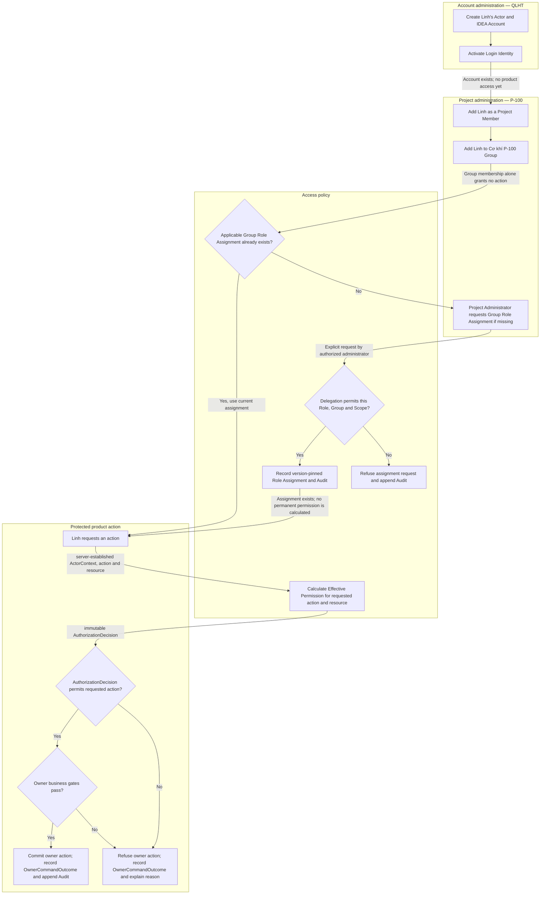
```mermaid
flowchart TB
    accTitle: Account and Project access administration responsibility
    accDescr: System Management creates and activates Linh's account without product access. A Project Administrator separately admits Linh to P-100 and its mechanical Group. If the Group lacks an applicable Design Engineer Role Assignment, a Project Administrator with sufficient delegated authority explicitly requests one for the Group at P-100 Scope. Access Policy refuses an out-of-delegation request or records the exact assignment and Audit evidence. Only when Linh later requests an action on a resource does Access Policy calculate Effective Permission; the owner then applies separate business gates.

    subgraph AA[Account administration — QLHT]
        direction LR
        A1[Create Linh's Actor and IDEA Account]
        A2[Activate Login Identity]
        A1 --> A2
    end

    subgraph PA[Project administration — P-100]
        direction LR
        P1[Add Linh as a Project Member]
        P2[Add Linh to Cơ khí P-100 Group]
        P3[Project Administrator requests Group Role Assignment if missing]
        P1 --> P2
    end

    subgraph AP[Access policy]
        direction LR
        R0{Applicable Group Role Assignment already exists?}
        R1{Delegation permits this Role, Group and Scope?}
        R3[Record version-pinned Role Assignment and Audit]
        R4[Refuse assignment request and append Audit]
        R2[Calculate Effective Permission for requested action and resource]
        R1 -->|Yes| R3
        R1 -->|No| R4
    end

    subgraph PD[Protected product action]
        direction LR
        D1[Linh requests an action]
        D2{AuthorizationDecision permits requested action?}
        D5{Owner business gates pass?}
        D3[Commit owner action; record OwnerCommandOutcome and append Audit]
        D4[Refuse owner action; record OwnerCommandOutcome and explain reason]
        D2 -->|Yes| D5
        D2 -->|No| D4
        D5 -->|Yes| D3
        D5 -->|No| D4
    end

    A2 -->|Account exists; no product access yet| P1
    P2 -->|Group membership alone grants no action| R0
    R0 -->|Yes, use current assignment| D1
    R0 -->|No| P3
    P3 -->|Explicit request by authorized administrator| R1
    R3 -->|Assignment exists; no permanent permission is calculated| D1
    D1 -->|server-established ActorContext, action and resource| R2
    R2 -->|immutable AuthorizationDecision| D2
```

Reading order follows the downward flow; the grouped authority lanes identify ownership. QLHT creates and maintains the account only. The Project
Administrator for `P-100` adds Linh to the Project and its mechanical Group. If a valid Group Role
Assignment already exists, Linh may use that path. If it is missing, a Project Administrator must
explicitly request the `Design Engineer` assignment at Project Scope and may do so only when its own
delegation covers that Role Definition, Group principal and Scope. Access Policy checks those limits,
records the exact assignment and Audit evidence, or refuses the request. It does not create an
assignment on its own or calculate a permanent permission merely because an assignment exists. A
later protected action supplies the
server-established ActorContext, action and resource to Access Policy; the resulting immutable
`AuthorizationDecision` is distinct from the product Module's later `OwnerCommandOutcome`. The
owner then checks lifecycle, Checkout owner, expected Generation and other business rules before
recording either a committed or refused outcome.
The same person may hold more than one administrative role only through separate, visible Role
Assignments.

### 7.5.1 Governed Role Definition and Role Assignment lifecycle

**`ARCH-VIEW-STATE-005` — Governed Role configuration lifecycle.** **Model profile:** UML State
Machine; `Draft 0.13`; access-policy, security and administration reviewers. **Question:** how can a
Custom Role or an assignment change without silently changing existing authority? **Scope:** one
Custom Role Definition family and one Role Assignment. **Excludes:** protected built-in Role editing,
Project/Group membership and product business gates. **Trace:** `REQ-AUTH-001…010`, `REQ-GOV-005`,
`IF-RBAC-ADMIN`, RBAC-01…08. **Legend:** the upper and lower groups are independent state owners;
arrows change only the record named by their group; activation always checks an expected version and
the administrator's current delegated authority.

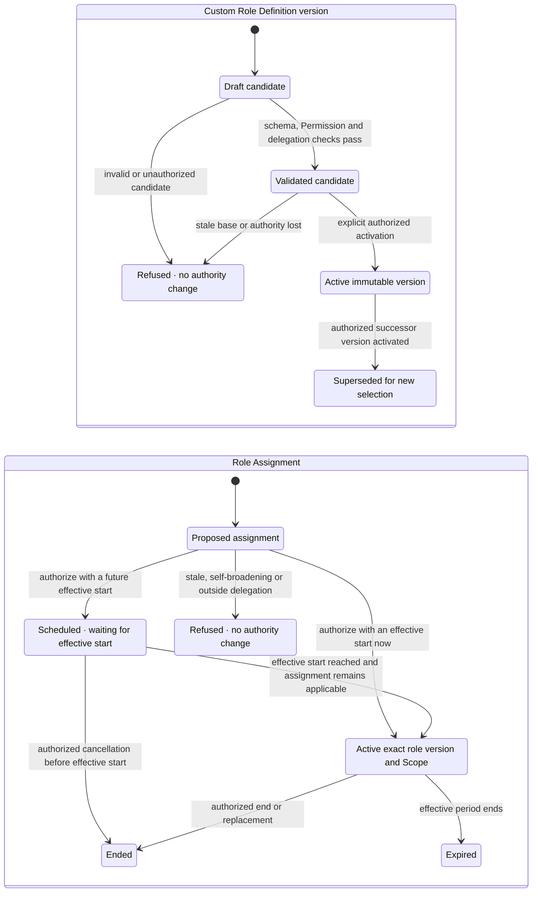
```mermaid
stateDiagram-v2
    accTitle: Governed Role Definition and Role Assignment lifecycle
    accDescr: A Custom Role Definition candidate is edited as Draft, validated and then either refused or activated as an immutable version. Activating a successor supersedes the former definition for new selection but never changes an existing assignment. A Role Assignment is separately proposed and authorized against one exact active Role Definition version and Scope. It becomes Active immediately or Scheduled for a future effective start, then ends explicitly or expires. Replacing it requires another reviewed assignment.
    direction LR

    state "Custom Role Definition version" as RoleVersion {
        [*] --> RD_Draft
        state "Draft candidate" as RD_Draft
        state "Validated candidate" as RD_Validated
        state "Active immutable version" as RD_Active
        state "Superseded for new selection" as RD_Superseded
        state "Refused · no authority change" as RD_Refused

        RD_Draft --> RD_Validated: schema, Permission and delegation checks pass
        RD_Draft --> RD_Refused: invalid or unauthorized candidate
        RD_Validated --> RD_Active: explicit authorized activation
        RD_Validated --> RD_Refused: stale base or authority lost
        RD_Active --> RD_Superseded: authorized successor version activated
    }

    state "Role Assignment" as Assignment {
        [*] --> RA_Proposed
        state "Proposed assignment" as RA_Proposed
        state "Scheduled · waiting for effective start" as RA_Scheduled
        state "Active exact role version and Scope" as RA_Active
        state "Ended" as RA_Ended
        state "Expired" as RA_Expired
        state "Refused · no authority change" as RA_Refused

        RA_Proposed --> RA_Active: authorize with an effective start now
        RA_Proposed --> RA_Scheduled: authorize with a future effective start
        RA_Proposed --> RA_Refused: stale, self-broadening or outside delegation
        RA_Scheduled --> RA_Active: effective start reached and assignment remains applicable
        RA_Scheduled --> RA_Ended: authorized cancellation before effective start
        RA_Active --> RA_Ended: authorized end or replacement
        RA_Active --> RA_Expired: effective period ends
    }
```

The two lifecycles deliberately do not share a transition. A Role Definition version contains
Permissions; a Role Assignment separately connects one Principal, that exact version and one Scope.
Activating a successor Role Definition affects only later selection. Existing assignments remain
pinned until an authorized administrator previews and commits explicit replacement assignments.
Ending, expiry or refusal removes or withholds future authorization; it does not rewrite earlier
authorization decisions or Audit evidence. Removing the last effective Super Administrator recovery
path and every attempt at self-broadening are refused before either lifecycle changes.

An accepted future assignment remains `Scheduled` and contributes no Permission before its effective
start. `Active` means eligible within the effective interval, subject to current membership, Scope
and conditions. `Ended`, `Expired` and `Refused` contribute no Permission. No lifecycle state
overrides the request-time evaluation in section 7.6.

### 7.6 Effective Permission and business-gate decision

Before a protected command commits, the authoritative resource Module performs this sequence:

1. receive client session proof, never a client-trusted `ActorId` or client policy snapshot;
2. have Server/IAM establish the stable `ActorContext` and current account/session-security context;
3. request authorization from Access Policy with `ActorContext`, requested Permission, `ResourceId`,
   Scope and expected state;
4. have Access Policy resolve current IAM eligibility through the read-only
   `IF-IAM-ELIGIBILITY-QUERY` port, then resolve Project Membership, direct Group Membership,
   applicable direct-Actor and Group Role Assignments, immutable Role Definition versions and
   Scope hierarchy, and apply supported effective-period and condition constraints;
5. receive an immutable `AuthorizationDecision` and block when it grants no Permission;
6. have the resource owner apply lifecycle, Checkout, expected-head, independence, completeness and
   other business gates, recording its separate `OwnerCommandOutcome`; and
7. at commit, revalidate current security/policy/membership inputs and lock/revalidate the owner
   business state inside the shared relational unit of work. Any failed revalidation aborts the
   command before an authoritative outcome is committed.

**`ARCH-VIEW-SEQ-004` — Effective Permission followed by business gates.** **Model profile:** UML
Sequence; `Draft 0.15`; security, implementation and Audit reviewers. **Question:** why can an RBAC
grant still end in a blocked product command? **Scope:** one protected request at one resource.
**Excludes:** administration that created the account, membership or assignment. **Trace:**
`REQ-AUTH-003…008`, `REQ-GOV-002`, `IF-IAM-ELIGIBILITY-QUERY`, RBAC-04…10. **Legend:** `alt`
paths separate initial denial, business-gate refusal, commit-time authorization refusal, stale owner
state and successful commit; Audit records do not grant authority.

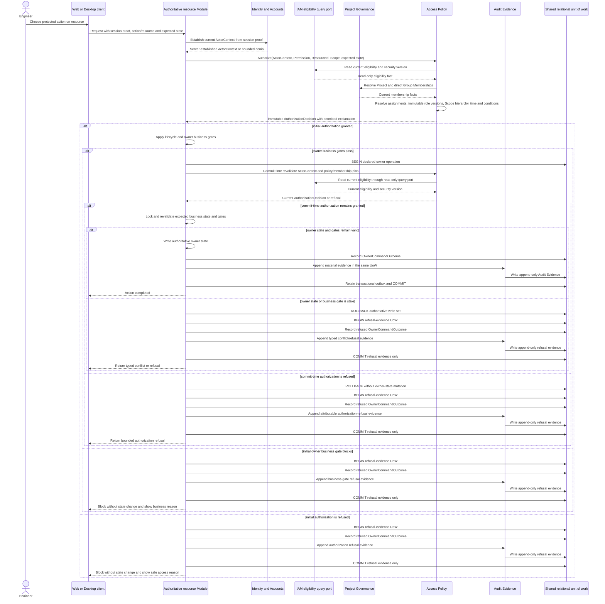
```mermaid
sequenceDiagram
    accTitle: Effective Permission followed by business gates
    accDescr: A client presents session proof and never supplies a trusted ActorId. Server/IAM establishes ActorContext. The owner asks Access Policy with ActorContext, Permission, ResourceId, Scope and expected state; Access Policy resolves IAM eligibility through a read-only query port, then Project and Group membership, assignments, role versions and Scope hierarchy, and returns an immutable AuthorizationDecision. The owner records a separate business-gate/final outcome. At commit, authorization inputs and owner state revalidate inside one relational unit of work with Audit Evidence and outbox. A revoked decision cannot fall through to an owner write.

    actor Engineer
    participant Client as Web or Desktop client
    participant Owner as Authoritative resource Module
    participant IAM as Identity and Accounts
    participant IAMQ as IAM eligibility query port
    participant Project as Project Governance
    participant Policy as Access Policy
    participant Audit as Audit Evidence
    participant UoW as Shared relational unit of work

    Engineer->>Client: Choose protected action on resource
    Client->>Owner: Request with session proof, action/resource and expected state
    Owner->>IAM: Establish current ActorContext from session proof
    IAM-->>Owner: Server-established ActorContext or bounded denial
    Owner->>Policy: Authorize(ActorContext, Permission, ResourceId, Scope, expected state)
    Policy->>IAMQ: Read current eligibility and security version
    IAMQ-->>Policy: Read-only eligibility fact
    Policy->>Project: Resolve Project and direct Group Memberships
    Project-->>Policy: Current membership facts
    Policy->>Policy: Resolve assignments, immutable role versions, Scope hierarchy, time and conditions
    Policy-->>Owner: Immutable AuthorizationDecision with permitted explanation
    alt initial authorization granted
        Owner->>Owner: Apply lifecycle and owner business gates
        alt owner business gates pass
            Owner->>UoW: BEGIN declared owner operation
            Owner->>Policy: Commit-time revalidate ActorContext and policy/membership pins
            Policy->>IAMQ: Read current eligibility through read-only query port
            IAMQ-->>Policy: Current eligibility and security version
            Policy-->>Owner: Current AuthorizationDecision or refusal
            alt commit-time authorization remains granted
                Owner->>Owner: Lock and revalidate expected business state and gates
                alt owner state and gates remain valid
                    Owner->>Owner: Write authoritative owner state
                    Owner->>UoW: Record OwnerCommandOutcome
                    Owner->>Audit: Append material evidence in the same UoW
                    Audit->>UoW: Write append-only Audit Evidence
                    Owner->>UoW: Retain transactional outbox and COMMIT
                    Owner-->>Client: Action completed
                else owner state or business gate is stale
                    Owner->>UoW: ROLLBACK authoritative write set
                    Owner->>UoW: BEGIN refusal-evidence UoW
                    Owner->>UoW: Record refused OwnerCommandOutcome
                    Owner->>Audit: Append typed conflict/refusal evidence
                    Audit->>UoW: Write append-only refusal evidence
                    Owner->>UoW: COMMIT refusal evidence only
                    Owner-->>Client: Return typed conflict or refusal
                end
            else commit-time authorization is refused
                Owner->>UoW: ROLLBACK without owner-state mutation
                Owner->>UoW: BEGIN refusal-evidence UoW
                Owner->>UoW: Record refused OwnerCommandOutcome
                Owner->>Audit: Append attributable authorization-refusal evidence
                Audit->>UoW: Write append-only refusal evidence
                Owner->>UoW: COMMIT refusal evidence only
                Owner-->>Client: Return bounded authorization refusal
            end
        else initial owner business gate blocks
            Owner->>UoW: BEGIN refusal-evidence UoW
            Owner->>UoW: Record refused OwnerCommandOutcome
            Owner->>Audit: Append business-gate refusal evidence
            Audit->>UoW: Write append-only refusal evidence
            Owner->>UoW: COMMIT refusal evidence only
            Owner-->>Client: Block without state change and show business reason
        end
    else initial authorization is refused
        Owner->>UoW: BEGIN refusal-evidence UoW
        Owner->>UoW: Record refused OwnerCommandOutcome
        Owner->>Audit: Append authorization refusal evidence
        Audit->>UoW: Write append-only refusal evidence
        Owner->>UoW: COMMIT refusal evidence only
        Owner-->>Client: Block without state change and show safe access reason
    end
```

The explanation can name the relevant account status, Project/Group membership, Role Assignment,
Role Definition version, Scope and owner business gate, but it must not disclose data the requester
is not authorized to see. `AuthorizationDecision` remains Access-Policy-owned and immutable;
`OwnerCommandOutcome` is the distinct owner record that states business-gate and final result.
Direct Actor assignments are supported but remain visible in administration and Audit; Group
assignment is the normal personnel-management path. A commit-time refusal is terminal for that
command: no owner write or success response follows it. Core v0 has neither nested Groups nor a
general user-configurable explicit-deny rule.

### 7.7 Organize, rename and create a copy

1. A query resolves the selected `DocumentId`, its authorized Document Placements and the displayed
   folder/divider tree; no client receives or constructs an authoritative Artifact-storage path.
2. Move or link commands authorize the source document, destination folder and requested mode, then
   change only Placement state. An exact historical link pins its selected Revision and Generation.
3. A navigation-alias Rename changes only the Placement label and Audit. A controlled Product
   Definition name/title change enters the normal Checkout/Check-in path and creates a Generation.
4. Create Copy reads one authorized exact source, allocates a new `DocumentId`, records source
   provenance and initializes the new document under the normal New/first-publish rules. It does not
   carry source Reservation, Approval or Released state.
5. Every command revalidates authorization and expected state at commit. Failure leaves the prior
   document, placements and source/copy relationship unchanged and returns one attributable result.

### 7.8 View, export and import BOM data

1. Product Structure resolves one exact Structure Snapshot and one versioned BOM View Profile; the
   resulting view retains occurrence identities, exact component Generations and profile-defined
   quantity, position and other fields.
2. Export resolves and authorizes the exact snapshot/profile, generates a candidate and asks Artifact
   Custody to verify/store immutable bytes. Product Structure then revalidates the exact
   snapshot/profile/business conditions and writes the BOM Representation metadata (including
   RepresentationId, source/profile pins, producer/format provenance, exact ArtifactId/digest and
   status) in its owner unit of work. Only that Product Structure commit makes the output a retained
   BOM Representation; the owner-specific ArtifactId/digest pin is not a CPD `ArtifactReference`.
3. A later source snapshot or profile version does not rewrite the old output. The old output stays
   reproducible and is shown as `Needs update` when compared with the newer source/profile.
4. Import first stores a non-authoritative candidate with its payload digest and exact base snapshot.
   Server validation produces an add/change/remove preview without changing Product Structure.
5. User confirmation sends the expected base and candidate identity to a named BOM Import
   coordinator. The coordinator opens one shared relational unit of work, revalidates authorization
   at commit time, and asks Product Structure and Controlled Product Data to write only their own
   Structure Snapshot and Generation/Working Head state. Each owner records its own
   `OwnerCommandOutcome`; Audit Evidence and the transactional outbox commit with the authoritative
   outcome. Artifact bytes remain private external custody and are not part of the relational
   transaction.
6. If authorization, the exact base/difference, Checkout/lifecycle/expected-Generation or any owner
   write fails, the coordinator rolls back all uncommitted authoritative writes, then asks the
   relevant owner(s) to record refused or rolled-back `OwnerCommandOutcome` records in a separate
   refusal-evidence unit of work; Audit writes only correlated Audit Evidence. The candidate remains
   safe for governed reconciliation or a fresh preview; no partial Structure Snapshot, Generation or
   Working Head is published. A BOM export whose metadata acceptance fails after byte storage is not
   accepted or `Current`; its bytes remain private/unreferenced and the prior structure is unchanged.
7. An independently controlled parts-list Logical Document follows ordinary Generation/workflow
   rules and records an explicit exact relationship to its Structure Snapshot; it is never silently
   substituted for, or by, a generated BOM Representation.

**`ARCH-VIEW-SEQ-009` — Exact BOM view, export and controlled import.** **Model profile:** UML
  Sequence; `Draft 0.16`; product-structure, data, implementation and verification reviewers.
**Question:** how are an authoritative Structure Snapshot, a read-only BOM Representation and a
proposed import kept distinct? **Scope:** one exact Structure Snapshot, one BOM View Profile and one
optional import candidate. **Excludes:** spreadsheet authoring and physical storage-provider detail.
**Trace:** `REQ-STR-004…006`, `IF-STRUCTURE-BOM`, `IF-AUTHORIZATION-DECISION`, BM-01…06. **Legend:**
`opt` sections are independent user intentions; the `alt` branches separate authorization, owner
validation and committed import outcomes; dashed returns are views, previews or results and never
mutate Product Structure before the coordinator commit.

```mermaid
sequenceDiagram
    accTitle: Exact BOM view export and controlled import
    accDescr: The user selects an exact Structure Snapshot and BOM View Profile. Product Structure returns an authorized BOM view that pins both identities. For export, Product Structure generates a candidate, asks Artifact Custody to verify/store immutable bytes, then revalidates the exact source/profile/business conditions and accepts owner-specific BOM Representation metadata, including the ArtifactId/digest pin, in its owner UoW before returning a retained Representation. That pin is not a CPD Generation-manifest ArtifactReference. Import first stores a candidate and validates it against an exact base snapshot, then shows an add-change-remove preview. A named BOM Import coordinator owns only the declared operation and shared relational unit of work. At commit it revalidates authorization, asks Product Structure to write only its Structure Snapshot and Controlled Product Data to write only its Generation and Working Head, records each owner outcome with Audit Evidence and outbox, and commits or refuses all authoritative state together. Artifact bytes remain private custody outside the relational transaction; byte storage alone never accepts a Representation.

    actor User
    participant UI as Structure and BOM workspace
    participant IAM as Identity and Accounts
    participant IAMQ as IAM eligibility query port
    participant Policy as Access Policy
    participant Coord as BOM Import coordinator
    participant UoW as Shared relational unit of work
    participant Structure as Product Structure
    participant Product as Controlled Product Data
    participant Artifacts as Artifact custody
    participant Audit as Audit Evidence
    participant Outbox as Transactional outbox

    User->>UI: Select exact Structure Snapshot and BOM View Profile
    UI->>Structure: Query authorized BOM view with exact pins
    Structure-->>UI: Occurrences, quantities, positions and component Generations

    opt Export this exact view
        User->>UI: Choose Excel, PDF or CSV export
        UI->>Structure: Resolve and authorize exact snapshot and profile
        Structure->>Structure: Generate export candidate
        Structure->>Artifacts: Verify/store immutable candidate bytes by digest
        Artifacts-->>Structure: ArtifactId and verified digest
        Structure->>UoW: BEGIN Product Structure export acceptance
        Structure->>Structure: Revalidate exact snapshot, profile and business conditions
        alt export metadata conditions remain valid
            Structure->>Structure: Write BOM Representation metadata with exact snapshot/profile pins, ArtifactId/digest and provenance
            Structure->>UoW: Record Product Structure OwnerCommandOutcome
            Structure->>Audit: Append export source, profile, actor, output identity and outcome in same UoW
            Audit->>UoW: Write append-only Audit Evidence
            Structure->>Outbox: Retain applicable event in same UoW
            Outbox->>UoW: Write transactional outbox record
            Structure->>UoW: COMMIT
            Structure-->>UI: Pinned retained BOM Representation
        else export metadata conditions stale or invalid
            Structure->>UoW: ROLLBACK export metadata UoW
            Structure->>UoW: BEGIN refusal-reconciliation UoW
            Structure->>UoW: Record refused Product Structure OwnerCommandOutcome
            Structure->>Audit: Append typed refusal and candidate identity
            Audit->>UoW: Write append-only refusal Audit Evidence
            Structure->>UoW: COMMIT refusal evidence only
            Structure-->>UI: Not accepted, private unreferenced candidate remains for reconciliation
        end
    end

    opt Import proposed structure change
        User->>UI: Upload candidate and choose exact base snapshot
        UI->>Structure: Upload candidate through authorized Server transfer
        Structure->>Artifacts: Store non-authoritative candidate by digest
        Artifacts-->>Structure: Candidate identity and verified digest
        Structure-->>UI: Opaque candidate identity
        UI->>Structure: Validate schema, references, access and exact base
        Structure-->>UI: Add, change and remove preview or validation errors
        Note over UI,Structure: Confirmation is unavailable while validation errors remain
        User->>UI: Confirm the displayed candidate and difference set
        UI->>Coord: Execute named BOM Import with session proof, expected base and candidate
        Coord->>IAM: Establish ActorContext from session proof
        IAM-->>Coord: Server-established ActorContext or bounded denial
        Coord->>Policy: Authorize ActorContext, Permission, resource and Scope
        Policy->>IAMQ: Read current eligibility through read-only query port
        IAMQ-->>Policy: Current eligibility and security version
        Policy-->>Coord: AuthorizationDecision or refusal
        alt initial authorization granted
            Coord->>UoW: BEGIN declared BOM Import operation
            Coord->>Policy: Commit-time revalidate ActorContext and policy/membership pins
            Policy->>IAMQ: Read current eligibility through read-only query port
            IAMQ-->>Policy: Current eligibility and security version
            Policy-->>Coord: Current AuthorizationDecision or refusal
            alt commit-time authorization remains granted
                Coord->>Structure: Apply Structure Snapshot with expected base and preview identity
                Structure->>Structure: Lock and revalidate base, references and complete difference
                alt Structure owner gates pass
                    Structure->>UoW: Write owned Structure Snapshot and OwnerCommandOutcome
                    Coord->>Product: Accept imported Generation with expected Checkout and head
                    Product->>Product: Lock and revalidate Checkout, lifecycle and expected Generation
                    alt Product owner gates pass
                        Product->>UoW: Write owned Generation and Working Head plus OwnerCommandOutcome
                        Coord->>Audit: Append candidate and before/after evidence correlated to owner results
                        Audit->>UoW: Write append-only Audit Evidence
                        Coord->>Outbox: Retain transactional outbox in same UoW
                        Outbox->>UoW: Write committed event
                        Coord->>UoW: COMMIT
                        Coord-->>UI: Return exact Structure Snapshot and Generation identities
                    else Product state or gate is stale or invalid
                        Coord->>UoW: ROLLBACK all uncommitted owner writes
                        Coord->>UoW: BEGIN refusal-evidence UoW
                        Coord->>Structure: Invoke rolled-back owner refusal path
                        Structure->>UoW: Write rolled-back Structure outcome
                        Coord->>Product: Invoke owner refusal handler
                        Product->>UoW: Write refused Controlled Product Data outcome
                        Coord->>Audit: Append evidence correlated to rolled-back/refused results
                        Audit->>UoW: Write append-only refusal Audit Evidence
                        Coord->>UoW: COMMIT refusal evidence only
                        Note over Structure,Product: The Structure write was rolled back, so no Structure Snapshot or Generation is committed.
                        Coord-->>UI: Typed refusal, candidate remains safe
                    end
                else Structure base or gate is stale or invalid
                    Coord->>UoW: ROLLBACK without authoritative owner commit
                    Coord->>UoW: BEGIN refusal-evidence UoW
                    Coord->>Structure: Invoke owner refusal handler
                    Structure->>UoW: Write refused Product Structure outcome
                    Coord->>Audit: Append correlated Structure refusal evidence
                    Audit->>UoW: Write append-only refusal Audit Evidence
                    Coord->>UoW: COMMIT refusal evidence only
                    Note over Coord,Structure: Product Structure validation was attempted but no authoritative write occurred. CPD was not invoked, so no CPD OwnerCommandOutcome is created.
                    Coord-->>UI: Typed refusal, candidate remains safe
                end
            else commit-time authorization is refused
                Coord->>UoW: ROLLBACK without authoritative owner mutation
                Coord->>UoW: BEGIN refusal-evidence UoW
                Coord->>Audit: Append attributable authorization refusal evidence
                Audit->>UoW: Write append-only refusal Audit Evidence
                Coord->>UoW: COMMIT refusal evidence only
                Note over Coord,Audit: Authorization failed before owner writes. No Product Structure or CPD OwnerCommandOutcome is created.
                Coord-->>UI: Bounded refusal, candidate remains safe
            end
        else initial authorization is refused
            Coord->>Audit: Append attributable refusal without owner mutation
            Note over Coord,Audit: Authorization failed before an owner command was invoked. Audit retains evidence only and no OwnerCommandOutcome is created.
            Coord-->>UI: Refuse and require correction or fresh preview
        end
    end

    Note over Coord,Product: Coordinator owns only operation orchestration and UoW lifetime. Each owner writes only its own authoritative state.
    Note over Artifacts,UoW: Candidate bytes and Artifact custody stay outside the relational transaction. Only verified identities and digests cross the seam.
```

The view returned first is authoritative only because it resolves one exact Structure Snapshot; the
Excel/PDF/CSV export becomes a retained Representation only after Product Structure commits its
owner-specific metadata in the export acceptance UoW. Artifact byte storage alone is never acceptance,
and a failed metadata acceptance leaves bytes private/unreferenced while the prior structure remains
unchanged. The retained export is a read-only Representation of the view, not the structure itself.
Import is the reverse only after validation and explicit confirmation. Upload, parse and preview remain
private candidate work. The import commit rechecks the same base and publishes both the new Structure
Snapshot and its owning Generation atomically. A later snapshot or profile can make an old export
`Needs update`, but it never alters that export's original provenance.

### 7.9 Produce a neutral Representation from CAD or Office

The source Product Definition remains authoritative. A PDF, thumbnail or other neutral output is a
separate Representation tied to one exact source Generation and Artifact digest. Automatic and
manual paths meet at the same acceptance rules; neither path may attach an output to a floating
latest document.

**`ARCH-VIEW-SEQ-010` — Qualified neutral Representation production.** **Model profile:** UML
Sequence; `Draft 0.15`; format, security, release and implementation reviewers. **Question:** how is
a generated or manually supplied Representation accepted for one exact source without making the
worker authoritative? **Scope:** one immutable source Generation, one Format Capability Profile and
one requested Representation. **Excludes:** a universal CAD renderer, in-application IDEA add-in and
semantic merging. **Trace:** `REQ-FMT-001…005`, `REQ-SEC-004`, `IF-FORMAT-JOB`, `VVP-008`.
**Legend:** the isolated worker returns untrusted candidate output; only Format Intelligence may
validate and register a Representation; `alt` paths are mutually exclusive terminal outcomes.

```mermaid
sequenceDiagram
    accTitle: Qualified neutral Representation production
    accDescr: Format Intelligence resolves one exact source Generation, Artifact digest and versioned capability profile. For an automatic path it grants a bounded immutable-input job to an isolated format adapter, which may invoke a qualified application export or standalone converter. For a manual path it receives an uploaded candidate. Artifact Custody verifies and stores immutable output bytes and returns the exact Artifact identity and digest, but byte custody does not make a Representation authoritative. Format Intelligence alone validates and accepts Representation metadata, source pins and producer provenance in its owner unit of work, recording the Owner Command Outcome, Audit Evidence and applicable outbox atomically. If metadata acceptance fails after byte storage, the candidate remains private and unreferenced for governed reconciliation; the source is unchanged. When the source later advances, the old committed Representation remains reproducible but is marked Needs update for the newer head.

    actor User
    participant UI as Workbench
    participant Product as Controlled Product Data
    participant Format as Format Intelligence
    participant Worker as Isolated Format Adapter
    participant Artifacts as Artifact custody
    participant Lifecycle as Lifecycle Governance
    participant Audit as Audit Evidence
    participant UoW as Shared relational unit of work
    participant Outbox as Transactional outbox

    User->>UI: Request PDF or neutral Representation
    UI->>Format: Request output for exact Generation and profile
    Format->>Product: Resolve immutable source Artifact and digest
    Product-->>Format: Exact source identity and scoped read grant
    Format->>Format: Validate declared capability and resource limits

    alt qualified automatic or application-assisted path
        Format->>Worker: Run bounded job with immutable input and profile
        Worker->>Artifacts: Read only the granted source Artifact
        Artifacts-->>Worker: Exact bytes and digest
        Worker-->>Format: Candidate output, tool versions and typed result
    else approved manual path
        UI->>Format: Upload candidate output with declared source
    end

    Format->>Format: Verify output digest, type, source pins and producer provenance
    alt valid candidate matches requested source
        Format->>Artifacts: Store immutable Representation output by digest
        Artifacts-->>Format: Artifact identity and verified digest
        Note over Format,Artifacts: Artifact bytes remain external immutable custody. Only verified identity and digest cross the relational seam.
        Format->>UoW: BEGIN Format owner operation
        Format->>Format: Revalidate exact source Generation/Artifact, profile and business conditions
        alt source/profile/business conditions remain valid
            Format->>Format: Write accepted Representation metadata and status
            Format->>UoW: Record Format OwnerCommandOutcome
            Format->>Audit: Append source, profile, producer, output and outcome in same UoW
            Audit->>UoW: Write append-only Audit Evidence
            Format->>Outbox: Retain applicable event in same UoW
            Outbox->>UoW: Write transactional outbox record
            Format->>UoW: COMMIT
            Format-->>UI: Accepted/current Representation for exact source Generation
        else metadata conditions stale or invalid
            Format->>UoW: ROLLBACK metadata UoW
            Format->>UoW: BEGIN refusal-reconciliation UoW
            Format->>UoW: Record refused Format OwnerCommandOutcome
            Format->>Audit: Append typed refusal and candidate identity
            Audit->>UoW: Write append-only refusal evidence
            Format->>UoW: COMMIT refusal evidence only
            Format-->>UI: Not accepted — private unreferenced candidate remains for reconciliation
        end
    else timeout, malformed, mismatched or undeclared capability
        Format->>Audit: Append typed failure and bounded worker evidence
        Format-->>UI: Failed without changing source or product state
    end

    Product-->>Format: Working Head later advances
    Format->>Lifecycle: Report prior output as Needs update for the newer head
```

The worker is an Adapter at the format-processing Seam, not a product-authority Module. It receives
one immutable input and bounded resources; it cannot change Product Definition, Generation or
Release state. Artifact Custody owns only immutable bytes and their verified identity/digest. Format
Intelligence accepts output metadata only after digest, type, source and producer checks plus its
owner-UoW revalidation; the committed metadata, Owner Command Outcome, Audit Evidence and outbox
share that outcome. A byte-storage success or worker response alone never makes a Representation
current, and a metadata refusal leaves the candidate private/unreferenced for reconciliation.
Release blocks a missing or outdated Representation only when its pinned Release Policy requires
that output; otherwise the user receives a warning. Exact application, Adapter, tool version and
license remain values to qualify rather than assumptions embedded in this view.

## 8. Data, lifecycle and integration implications

| Topic | Architectural implication | Detailed authority | Status |
|---|---|---|---|
| Identity/version | Stable Logical Document and Business Revision identities point to immutable Generations. Version within Revision is the business-visible Generation order; there is no separate Version Sequence field. | DOC-06 sections 2–3; `REQ-ID-*` | `Draft` |
| Organization and copy | Document Folder/Placement identities are independent of physical storage. Move/link/unlink change organization only; Rename retains `DocumentId`; Create Copy allocates a new one with source provenance. | DOC-06 `DATA-REL-017…019`; `REQ-ID-007…009`; IF-01…06 | `Draft` |
| Binary content | Artifact bytes are immutable and content-addressed; a Generation Manifest pins exact digests. | DOC-06; `REQ-ID-003/004` | `Draft` |
| Structure | Structure Snapshot is immutable and members pin exact Generations; unresolved required dependencies remain visible. | DOC-06 `DATA-REL-005`; `REQ-STR-*` | `Draft` |
| BOM views and files | BOM is a view of an exact Structure Snapshot under a versioned profile. Excel/PDF/CSV outputs remain pinned non-authoritative BOM Representations; imports remain candidates until previewed and atomically accepted. Independent controlled parts lists retain their own Logical Document/Generation identity and an exact structure relationship. | DOC-06 `DATA-REL-020…023`; `REQ-STR-004…006`; BM-01…06 | `Draft`; procedures `NOT-RUN` |
| Workflow/release | Multiple definitions may coexist; a versioned assignment selects the active default per Document Class. Instances and decisions pin exact definition/policy versions, and Release never follows floating latest. A graphical designer is deferred; validated configuration data/forms are sufficient for Core v0. | DOC-06 `DATA-REL-008…010`; `REQ-LC-*` | `Draft` |
| Policy/configuration | Identity establishes Actor/account eligibility; Access Policy separately owns versioned product authorization. Forms and optional JSON import create candidates only; Server-side validation and authorized activation are required before a new version has effect. Product defaults, governed policies and low-impact settings retain distinct change paths. | DOC-06 `DATA-REL-016`; `REQ-GOV-002/005`; AC-01…05 | `Draft`; approval pending |
| Store Existing | Bounded onboarding maps ordinary files into the same identity/content model; duplicates are shown, never silently merged. | DOC-06 section 5; `REQ-ID-005/006` | `Draft` |
| Export | Controlled Release Package is read-only and exact; external write-back remains deferred. | DOC-06 section 4; `REQ-LC-008` | `Draft` |
| Audit/recovery | Evidence is append-only in the logical product model; backup/restore covers one consistent metadata/content/configuration point, including account/security records and required keys. | DOC-06 sections 7–8; `REQ-AUD-*`, `REQ-OPS-*` | `Draft`; procedures `NOT-RUN` |
| Accounts/login | Stable Actor survives login-name changes, suspension and explicitly linked future authentication methods; credentials are not part of engineering-file manifests or exports. | DOC-06 `DATA-REL-013…015`; `REQ-IAM-*` | `Draft`; data migration only when approved |

## 9. Reliability, deployment and operations

### 9.1 Publication and background work

The maintained Check-in Operation lifecycle is `ARCH-VIEW-STATE-004` in section 7.2; its
interruption/status behavior is `ARCH-VIEW-SEQ-007`. Those views replace the former abbreviated
pipeline so that resumable transfer, authoritative commit, terminal refusal and
`NeedsReconciliation` are not collapsed into one progress line. Per-Artifact transfer state remains
separate in `ARCH-VIEW-SEQ-006` below.

Private durable materialization precedes database publication as specified in section 7.2. Database
constraints, expected-state predicates and an appropriate locking/isolation strategy protect head,
scope and operation identity; a selected database's default isolation alone is not proof of correctness.
Concurrent suspension, policy activation and publication need a defined serialization/revalidation
rule and race tests, not just a pre-request check.

Audit of the authoritative outcome and an outbox entry share the owner transaction. Projection/
notification/representation work consumes only committed outcomes, with idempotent retry and
bounded concurrency. No external broker, Redis or search service is required by this initial design.
Discovery requirements still need SPEC-OPEN-02; no advanced-search scope is inferred.

Reconciliation identifies abandoned staging, failed materialization, unreferenced private bytes,
missing/corrupt objects and projection drift. Collection has a grace/in-flight-reference rule and
a controlled record; it cannot delete an object required by a retained Generation or recovery set.
Physical durability, concurrent content-addressed writes and crash behavior of the selected store
must be qualified on the actual filesystem/storage stack.

**`ARCH-VIEW-SEQ-006` — Resumable large-Artifact transfer.** **Model profile:** UML Sequence;
`Draft 0.12`; implementation, operations and security reviewers. **Question:** how can one multi-GB
Artifact resume without whole-file memory or premature publication? **Scope:** one transfer within
one Check-in Operation. **Excludes:** final multi-document commit. **Trace:** `REQ-WS-012/015`,
`REQ-OPS-001`, `QRS-011`, `WS-08`. **Legend:** the loop sends only missing ranges; `alt` isolates
interruption handling. This view covers transfer into private staging only. Publication remains the
separate sequence in section 7.2.

```mermaid
sequenceDiagram
    accTitle: Resumable large Artifact transfer
    accDescr: The Workspace begins or resumes one transfer bound to an OperationId, digest and size. The server reports accepted ranges so only missing chunks are sent. Private staging verifies each chunk and the full digest; completion makes a private candidate ready but never publishes a Generation.

    participant Workspace as Workspace process
    participant Server as IDEA Server
    participant Staging as Private staging

    Workspace->>Server: Begin or resume(OperationId, Artifact digest, size)
    Server-->>Workspace: TransferId and accepted byte ranges
    loop Missing chunks only
        Workspace->>Server: Upload byte range plus chunk checksum
        Server->>Staging: Persist verified chunk privately
        Server-->>Workspace: Acknowledge accepted range
    end
    alt connection interrupted
        Workspace->>Server: Resume same TransferId and OperationId
        Server-->>Workspace: Return durable accepted ranges
    end
    Workspace->>Server: Complete transfer
    Server->>Staging: Assemble or stream-read and verify full digest
    Server-->>Workspace: Private candidate ready, or bounded failure
```

The transfer contract is range/chunk based, digest verified and idempotent. It does not require the
complete Artifact in client or server memory. A corrupt chunk is rejected; an uncertain response is
resolved by asking which ranges and terminal result the same operation already owns. A private
candidate is not a Generation and remains invisible to authoritative reads until the Check-in commit.

### 9.2 Initial deployment candidate

Evaluate one company-controlled server/VM for the monolith, relational database and private Artifact volume,
with separate process identities, least-privilege filesystem access and no database/public-file
access from clients. This is a proposed evaluation topology, not demonstrated sizing or availability.

The architecture direction is a Linux-first headless Server boundary, independently deployable from
the Windows Desktop/Workspace boundary. The exact Linux distribution, Server runtime/framework,
database, package versions and operational bundle are volatile technology decisions owned by the
current [`TECH-001`](decision-briefs/TECH-001-technology-and-architecture-proposal.md) and its linked
decision matrix; their qualification remains `NOT-RUN`. Existing Windows machines carry no Server
selection weight. The isolated format runtime may require a separate Windows worker host and license;
that does not require moving product authority into the worker or changing the whole Server OS.

A single server is a single outage domain. No failover/zero-downtime claim is made. Reject or revise
this topology if the approved outage/recovery objective cannot be met or the company requires more
availability. A separate physical/administrative backup failure domain is required for the proposed
severe-server-loss drill; a second folder, RAID or same-host snapshot alone is not that evidence.

**`ARCH-VIEW-EVO-001` — Artifact-storage evolution boundary.** **Model profile:** C4-style
   Component/evolution view; `Draft 0.16`; architecture, data and operations reviewers. **Question:**
how can storage capacity/provider change without changing product identity? **Scope:** Artifact
storage Seam and controlled migration. **Excludes:** selected vendor, topology and capacity claim.
**Trace:** `REQ-OPS-003…006`, `QRS-012`, `VVP-017`, ST-01…04. **Legend:** solid arrows are current
required calls; dashed arrows are optional future Adapters; the cylinder is authoritative relational
location metadata. The diagram selects no vendor and makes no claim that Core v0 initially stores
hundreds of TB.

```mermaid
flowchart LR
    accTitle: Artifact storage evolution boundary
    accDescr: Artifact Custody identifies Artifacts by stable identity and digest and calls one storage interface. Controlled Product Data retains CPD ArtifactReferences only in Generation manifests; Product Structure and Format Intelligence keep any exact ArtifactId/digest pins inside their own Representation metadata. A filesystem adapter is the current candidate; later object or multi-volume adapters can replace it. Migration copies and verifies bytes before changing custody location records, without changing Generations or Releases.

    Product[Controlled Product Data] -->|Generation-manifest ArtifactReference: exact Artifact ID and digest| Custody[Artifact Custody Module]
    Custody -->|Artifact ID, digest, operation| Port[Artifact Storage Port]
    Port -->|current candidate| FS[Filesystem Adapter]
    Port -.->|future option| OBJ[Object Storage Adapter]
    Port -.->|future option| MULTI[Multi-volume or tiering Adapter]
    Product -->|authoritative Generation manifests only| DB[(Relational database)]
    Custody -->|Artifact, location and migration records| DB
    MIG[Migration and Reconciliation] -->|copy, verify digest, switch location| Port
    MIG -->|record custody progress and outcome| Custody
```

Text alternative: Controlled Product Data owns `ArtifactReference` values in its Generation
manifests but does not own Artifact custody. Artifact Custody knows stable Artifact identities and
digests, not physical paths visible to callers, and calls one Artifact Storage Port. Core v0 may use
a filesystem adapter; later object-storage or multi-volume adapters can be introduced behind the
same port. Migration copies privately, verifies every digest, records custody progress and changes
the authoritative location only after reconciliation, so Generation manifests and Release Records do
not change.

### 9.3 Recovery design and measurement

- Database-native base backup plus continuous transaction-log archiving is the point-in-time-recovery
  candidate; the exact database mechanism belongs to current Tech authority. Track archive failure/lag,
  not only job completion. A database transaction log does not contain external Artifact bytes.
- Back up immutable Artifacts continuously/in bounded batches plus manifests, configuration/policy
  versions and required keys. A recovery-set record names the database recovery point and the
  complete matching content/configuration/key set. Extra newer unreferenced bytes may remain private.
- The usable recovery point is limited by the **oldest complete coordinated component**, not merely
  the newest database backup. Do not restore a database point whose referenced content is absent.
- Preliminary targets from TECH-CTX-008 are RTO ≤ four working hours and RPO ≤ one hour. Define
  incident start, business calendar/coverage, restore corpus and healthy-service acceptance before
  measuring. Record both elapsed wall time and agreed working-time measurement to avoid hiding delays.
- Restore to an isolated replacement environment, reconcile every retained Generation in the
  approved recovery scope and digest-check it, then exercise login, exact file open, Check-in and
  release reproduction. Incomplete/corrupt recovery is not PASS even if the clock target was met.
- Backups/keys require protected retention and recovery access; loss of credentials or encrypted
  key material is part of the drill. Recovery must not silently re-enable revoked sessions; invalidate
  restored sessions and enter **Restricted Recovery Mode**. Reopening requires a named security/
  operations decision based on independent evidence of post-recovery-point account, membership,
  role, policy and security changes. Missing or ambiguous evidence keeps service restricted; no
  automatic reconciliation may invent the changes. The one-hour loss objective does not authorize
  forgotten access revocations.
- The project user may operate initially. Name a backup operator/recovery custodian, supported hours,
  escalation path and repeatable runbook before operational rollout; no 24/7 or DevOps team assumed.

**`ARCH-VIEW-SEQ-011` — Coordinated exact backup and recovery.** **Model profile:** UML Sequence;
  `Draft 0.16`; operations, data, security and quality reviewers. **Question:** how is one recoverable
set created, restored and proved exact before service reopens? **Scope:** one approved recovery point
covering relational metadata, immutable Artifacts, active configuration/policy and required key
material. **Excludes:** final backup product, media topology and an unmeasured high-availability
claim. **Trace:** `REQ-OPS-003/004`, `REQ-IAM-004`, `QRS-006`, `VVP-013/014`. **Legend:** dashed
returns are evidence/results; the final `alt` is the only decision to reopen; newer unreferenced
Artifact bytes do not repair a missing referenced Artifact.

```mermaid
sequenceDiagram
    accTitle: Coordinated exact backup and recovery
    accDescr: A backup coordinator selects one recovery point and records a recovery-set manifest that joins the database point, every required immutable Artifact, active configuration and policy versions, and required protected key material. During recovery, an operator restores these parts into an isolated replacement, invalidates restored sessions and enters Restricted Recovery Mode. Post-recovery security changes are reconciled only from independent operational evidence, never by automatic replay. Absent or ambiguous evidence keeps the service restricted. Only exact data, completed security reconciliation and an explicit named reopen decision can reopen service.

    actor Operator as Recovery operator
    participant Coord as Backup and recovery coordinator
    participant DB as Database backup custody
    participant Artifacts as Artifact backup custody
    participant Config as Configuration and key backup custody
    participant Record as Recovery-set record
    participant Target as Isolated replacement environment
    participant Evidence as Independent security/change evidence
    participant Authority as Security and reopen authority
    participant Audit as Audit Evidence

    Coord->>DB: Capture database backup at named recovery point
    DB-->>Coord: Base backup and required log range identity
    Coord->>Artifacts: Capture required immutable content and manifests
    Artifacts-->>Coord: Artifact identities, digests and completion boundary
    Coord->>Config: Capture active configuration, policy versions and required key references
    Config-->>Coord: Protected version and custody evidence
    Coord->>Record: Commit one coordinated recovery-set manifest
    Record->>Audit: Append source identities, time and completion result

    Operator->>Record: Select approved recovery set
    Record-->>Operator: Exact database, Artifact, configuration and key pins
    Operator->>Target: Create isolated replacement environment
    Target->>DB: Restore database to pinned point
    Target->>Artifacts: Restore and resolve every referenced Artifact
    Target->>Config: Restore pinned configuration and required key material
    Target->>Target: Invalidate restored sessions, enter Restricted Recovery Mode
    Operator->>Evidence: Obtain independent post-recovery security/change evidence
    Evidence-->>Target: Proven changes, or explicit insufficient/ambiguous evidence
    Target->>Target: Reconcile only proven account, membership, role and policy changes
    Target->>Target: Resolve every Generation, structure and Release pin
    Target->>Artifacts: Digest-check all referenced content
    Artifacts-->>Target: Complete or missing and mismatched identities
    Target->>Target: Exercise login, exact open and Release reproduction

    alt every required identity/digest/check is exact and security reconciliation is proved
        Authority->>Target: Explicitly authorize service reopen
        Target->>Audit: Append successful drill evidence
        Target-->>Operator: Eligible for explicit service-reopen decision
    else any required item/check or security evidence is unresolved
        Target->>Audit: Append restricted-recovery evidence and exact gaps
        Target-->>Operator: Keep isolated/restricted, block reopening
    end
```

The Recovery-set record is the join among the component backups; no component's completion time is
the system recovery point by itself. Restored sessions are invalidated because a database rollback
must not revive revoked authority. The replacement remains in Restricted Recovery Mode until every
retained Generation, Structure Snapshot and Release Record resolves to matching Artifact digests,
the required functional checks pass, and a named authority has reconciled only independently proved
post-recovery security changes. Absent proof is not a safe default: it keeps access closed or
restricted. Meeting an elapsed-time target cannot turn an inexact recovery into PASS.

### 9.4 Delivery, rollback and observability

Plan versioned release bundles, dependency/license inventory, signed Desktop delivery where company
policy requires it, protected configuration, preflight checks, health checks and a documented
maintenance window. IT approves installation and update routes; no installation occurs in this task.

Test on a representative non-production environment before promotion. Database/account/policy
migrations record the pre-change backup and reconciliation criteria; replacing old binaries is not
automatically a safe schema downgrade. Choose forward repair or a proven full recovery path and
record its data-loss/compatibility consequences.

Monitor request failures/latency, database health/locks, disk free space and growth, digest failures,
transfer interruption, abandoned operations, worker limits, outbox lag, backup lag and latest
successful restore drill. Alert routes and ownership must be assigned; logs omit credentials and
sensitive unnecessary content. Representative concurrent users, maximum files, total corpus,
growth and resource thresholds are still measurement inputs, not invented server specifications.

## 10. Security and privacy design

Trust zones are Web-rendered content, the native Desktop host, the per-user Workspace process,
external CAD/Office editors, Server/IAM, authoritative data stores, isolated format runtime and
separate backup/recovery custody. A shared screen or ordinary file does not merge those authorities.

**`ARCH-VIEW-SEC-001` — Protected data flow across trust zones.** **Model profile:** trust-boundary
  data-flow view; `Draft 0.16`; security, architecture and operations reviewers. **Question:** which
protected data crosses each trust zone, where is authority checked, and which credentials or powers
must never cross? **Scope:** the initial logical deployment and its backup/format-processing zones.
**Excludes:** final host count, ports, firewall rules, selected backup product and a completed threat
assessment. **Trace:** `REQ-SEC-001…004`, `REQ-AUTH-008`, `REQ-AUD-*`, `IF-DESKTOP-BRIDGE`,
`IF-ARTIFACT-TRANSFER`, `IF-FORMAT-JOB`. **Legend:** solid arrows are runtime flows; dashed arrows are
backup/recovery flows; each subgraph is a separate trust zone, not an ownership hierarchy.

```mermaid
flowchart TB
    accTitle: Protected data flow across trust zones
    accDescr: Web-rendered content crosses a narrow bridge into the native Desktop host, which crosses authenticated manifest-scoped IPC into a per-user Workspace process, then ordinary managed files reach CAD or Office without IDEA authority. The required trust chain is WebView → Desktop → Workspace → CAD/Office, while Artifact bytes follow Store → Server → Workspace. Clients send session proof, never a trusted ActorId. Server/IAM establishes ActorContext before Access Policy and owner business gates revalidate. Artifact Custody owns private bytes and locations. Backup recovery stays restricted until exact data, independently evidenced security reconciliation and explicit reopening succeed.

    subgraph ClientPath[Client-to-editor trust path]
        direction LR
        subgraph WebZone[Web-rendered UI trust zone]
            WebView[Browser or WebView content<br/>potentially untrusted rendered content]
        end

        subgraph DesktopZone[Native Desktop trust zone]
            Desktop[IDEA Desktop native host]
        end

        subgraph WorkspaceZone[Per-user Workspace trust zone]
            Workspace[Workspace process]
            LocalFiles[Managed Workspace files]
            Workspace -->|ordinary managed file read/write| LocalFiles
        end

        subgraph EditorZone[External editor trust zone]
            Tools[CAD or Office application]
        end

        WebView -->|approved origin/frame; versioned allowlisted intent; navigation invalidates bridge| Desktop
        Desktop -->|authenticated per-user/session IPC; exact manifest scope; no shell or generic host object| Workspace
        Workspace -->|ordinary managed file only; no session, database or store credential| Tools
    end

    subgraph ServerZone[Company Server and IAM trust zone]
        Entry[IDEA Server entry]
        IAM[Identity and Accounts<br/>establishes ActorContext]
        Policy[Access Policy]
        Owners[Authoritative product Modules]
        Custody[Artifact Custody]
        Format[Format Intelligence job owner]
        Audit[Audit Evidence]
        Entry -->|validate session proof| IAM
        Entry -->|request requiring owner authorization| Owners
        Owners -->|request authorization with ActorContext| Policy
        Owners -->|exact Artifact/digest custody request| Custody
        Owners -->|bounded format request| Format
        Owners -->|append evidence in shared UoW| Audit
    end

    subgraph DataZone[Authoritative data trust zone]
        DB[(Relational store)]
        Artifact[(Private immutable Artifact store)]
    end

    subgraph WorkerZone[Isolated format-job trust zone]
        Worker[One-job Format Adapter and external tool]
    end

    subgraph RecoveryZone[Separate backup and recovery trust zone]
        Backup[(Coordinated backup set)]
        Keys[Protected key custody]
    end

    WebView -->|HTTPS session proof, queries and commands| Entry
    Desktop -->|HTTPS session, commands and status| Entry
    Workspace -->|scoped short-lived transfer and OperationId| Entry
    Entry -->|exact Artifact bytes after authorization| Workspace
    Owners -->|transactional records through owned persistence| DB
    Custody -->|Artifact bytes, locations and server-only access| Artifact
    Format -->|immutable input grant and resource limits| Worker
    Worker -->|untrusted candidate output and provenance| Format
    Format -->|validated immutable output by digest| Custody
    DB -.->|pinned database recovery point| Backup
    Artifact -.->|required immutable content and manifests| Backup
    Keys -.->|required protected recovery material| Backup
```

The data-flow arrows describe required interactions, not their execution order; account eligibility,
RBAC and business validation follow `ARCH-VIEW-SEQ-004` before any authoritative commit. The
WebView-to-Desktop bridge is not a generic desktop API, and the Desktop-to-Workspace bridge is not a
filesystem or shell proxy. Runtime store credentials remain in Server custody. Backup custody includes
configuration and policy versions as specified by `ARCH-VIEW-SEQ-011`.

| Trust Seam | Main threat categories | Required architectural control |
|---|---|---|
| WebView → Desktop | malicious origin/frame, navigation confusion, generic host-object escalation | approved origin/frame on every message; versioned allowlisted intent/schema; no arbitrary host object, filesystem or shell capability; navigation/session invalidates bridge authority |
| Desktop → Workspace process | another user/process impersonates the client, path traversal, generic shell abuse | authenticated per-user/session IPC; exact Workspace Manifest Scope; no generic filesystem/shell Interface; restart/reconnect does not invent server success |
| Workspace → CAD/Office | credential leakage, a design application becoming a product authority, arbitrary command injection | only ordinary managed files cross; CAD/Office receives no IDEA session, database/store credential or generic command bridge; saved bytes remain subject to later server validation |
| Web/Desktop/Workspace → Server | impersonation, replay, request tampering, cross-site request, privilege escalation | HTTPS; maintained session handling; anti-CSRF for browser state change; schema validation; session proof establishes ActorContext server-side; current account, RBAC and owner-business-gate revalidation before commit |
| Server → relational/Artifact stores | direct-store bypass, credential disclosure, metadata/content mismatch | server-only least-privilege credentials; one owner Module per authoritative state; Artifact Custody owns byte/location records; immutable digest verification; no client database or permanent store credential |
| Server → isolated format worker | malformed input, resource exhaustion, worker compromise, forged output | immutable bounded input; one-job authority; time/RAM/CPU/output limits; no product-write credential; typed result treated as untrusted until owner validation |
| Runtime data → recovery zone | incomplete backup set, unauthorized recovery, missing keys, revival of revoked sessions | separate custody; one Recovery-set manifest; protected key handling; exact restore/digest reconciliation; invalidate sessions and keep Restricted Recovery Mode until independent security-change evidence and an explicit reopen decision exist |
| Modules → Audit Evidence | action repudiation, history mutation, credential or content leakage | stable Actor/correlation/source pins; append-only product Interface; Audit Evidence and outbox are retained atomically with the owner command outcome; ordinary administration cannot edit or delete evidence |

The view identifies the principal threats and controls at each Seam; it is not a completed security
assessment. In particular, it makes visible the explicit `WebView → Desktop → Workspace → CAD/Office`
chain: a shared React UI does not share native authority, Office/CAD applications edit only ordinary
local files, the worker never becomes product authority, and backup access is not a normal runtime
permission. Final ports, certificates, host hardening and firewall rules belong to the physical
deployment design after the technology and company environment are selected.

| Control | Candidate design response | Required evidence |
|---|---|---|
| Native accounts and directory | Use a maintained authentication/session framework behind Identity and Accounts; the exact framework and session-persistence choice belong to the current Tech authority. Stable Actor, IDEA Account and Login Identity remain IDEA domain records, while Project Governance owns Project/Group membership. No public registration endpoint or shared default password. Account Administration grants neither Project access nor product authority. | REQ-IAM-001…007; REQ-AUTH-005/009; VVP-015, including least-privilege provisioning and session-revocation evidence |
| Password and recovery | Use maintained hashing/reset/token mechanisms; never log, email back or expose an existing password. Approved one-use delivery, password/lockout/rate-limit/MFA/recovery policy remains to be specified. | Recovery/replay/brute-force and privileged-reset abuse cases; security-policy review |
| Browser sessions | Same-origin HTTPS UI/API; Secure/HttpOnly session cookies and anti-CSRF protections on state changes. No session token in browser local storage. | CSRF, XSS/session, sign-out and suspension matrix |
| Native sessions | Qualify supported framework session/bearer integration, protected per-user credential storage and renewal. A framework session mechanism is not automatically an OAuth/OIDC server. No hand-written authorization-code protocol, token injection into JavaScript or promise of cross-surface SSO. | Exact maintained-library/flow review and old-token revocation tests; future standards-based provider requires separate selection |
| Account administration | Identity and Accounts validates the Account Administrator's Role Assignment, Scope and expected version for Actor, account and Login Identity commands. It cannot write Project Membership, Business Group Membership, Access Policy, Workflow or document state. | Cross-scope account operation, suspended account, reset/recovery abuse, direct-store denial and separation-of-duty tests |
| Project administration | Project Governance validates the Project Administrator's assignment before Project Membership, Group or direct Group Membership changes. It accepts only the assigned Project Scope and has no account or cross-Project authority. | Wrong Project, inactive Project Membership, nested-Group attempt, stale membership, removed Group and direct-store denial tests |
| Role administration and delegation | Access Policy owns supported Permissions, immutable Role Definition versions and Role Assignments. Activating a Custom Role successor never retargets existing assignments; each intended assignment replacement is previewed, authorized and audited. Every assignment command checks which roles, principal classes and descendant Scopes the administrator may manage; self-broadening and last-Super-recovery removal are refused. | Direct/group assignment, custom-role successor and explicit assignment replacement, expired assignment, unsupported condition, cross-scope delegation, self-escalation, Super-role and Audit tests |
| Eligibility and authorization | Client session proof is accepted only by Server/IAM, which establishes `ActorContext`; no client `ActorId` is trusted. Access Policy itself resolves current IAM eligibility, Project/Group membership, direct/Group assignments, Role Definition versions, Scope, time and supported conditions, then returns an immutable decision. The authoritative resource owner records the separate business outcome and revalidates both authorization inputs and owner state before commit. | Spoofed ActorId/policy snapshot, old cookie/token, removed membership/assignment, concurrent suspension, expired assignment, Check-in/Release and transfer tests; fail closed if eligibility cannot be established |
| Policy and workflow administration/import | Only Server endpoints accept form or serialized candidates. Schema/reference/semantic/base-version checks and preview precede authorized activation. Workflow roles reference RBAC eligibility but cannot change Group membership or Role Assignments; identity claims, client files and direct database paths are not product authority. | AC-01…05, WF-01…06 and REQ-AUTH-001…010; invalid/stale/self-authorizing import, missing Group/role, direct-store denial, version pin and Audit evidence |
| File transfer | Artifact Custody provides Server-mediated scoped short-lived transfer initially: `Store → Server → Workspace`, never a direct store stream or permanent store credential/public URI. Account/policy revalidation occurs at each protected request and before resume; long streams have defined cancellation/revalidation checkpoints. | Old-grant, wrong-object, expiry, replay, revoked-session, direct-store-stream denial and interrupted-transfer tests |
| Local process | Authenticated per-user/session IPC, controlled startup and recovery manifests; no privileged machine-wide agent required. OS same-user isolation is not proof against every malicious same-user process. | Cross-user/session denial, spoofed connection, restart/update/logout and preserved-local-work evidence |
| Web/native bridge | `WebView → Desktop → Workspace` is two distinct bridges: approved origins/frames and allowlisted versioned messages at WebView/Desktop; authenticated per-user/session IPC and exact manifest scope at Desktop/Workspace. Validate every navigation/message. No generic host object, arbitrary filesystem or shell access. External/untrusted content never shares a privileged bridge. | Malformed messages, iframe/origin navigation, path traversal, stale session, cross-user IPC, CAD/Office credential denial and focus/scale tests |
| Worker | Immutable input and bounded output; one-job least privilege and time/RAM/CPU/output quotas. Worker result is untrusted input to its owner. | Malformed/oversized/fault cases; original digest and product state unchanged |
| Audit / privacy | Account/security events use stable Actor and correlation without secrets; product Audit is append-only under ordinary admin and is committed with the owner outcome/outbox where material. High-privilege OS/database/backup access remains an explicit operational risk. | Event completeness, atomic-outcome fault injection, mutation denial, log inspection and access-review evidence |
| Secrets / backup | Protect TLS, server data-protection and recovery keys outside source; backup access separated from runtime access. Restored sessions are invalidated and service enters Restricted Recovery Mode. Only independent evidence may reconcile post-recovery security changes; missing proof keeps reopening blocked/restricted. | Secret scan, access-denial tests, independent-evidence recovery cases and loss-of-server/key restore drill |
| Delivery integrity | Pin source/dependencies/toolchain; review licenses including transitive components; apply verified patches and test rollback. | Version/license manifest, provenance and deployment evidence |

The above are proposed implementation responses, not a claim of security from framework defaults.
Framework cookie/session defaults and already issued credentials may outlive an account change.
The required eligibility check cannot be replaced by those defaults. Full MFA,
password, lockout, session-expiry and recovery-channel policy is still a qualification prerequisite.

## 11. Candidate technology decisions and trade-offs

The recommendation decomposes the former A/B/C bundles into independent decisions. Mandatory
criteria are the approved product invariants and company permissions; convenience cannot offset
failure of those criteria. No performance score, approved numeric weighting, budget or expertise
claim is invented.

| Decision ID / concern | Recommended candidate | Alternative and selection trigger | Cost / limitation / evidence |
|---|---|---|---|
| TECH-STACK-001 — server | Linux-first headless runtime/framework supporting the deep-module modular monolith and enforceable Module boundaries; exact selection is owned by current TECH/matrix | An alternative supported Server stack if qualification shows lower total risk; distributed services only with a separate measured need | Runtime, framework, dependency graph and support/patch owners remain volatile Tech decisions, not architecture semantics |
| TECH-DATA-001 — database | Relational database plus explicit, owner-respecting persistence and one reviewed schema-migration authority; exact selection is owned by current TECH/matrix | Another supported relational stack if transaction, recovery, operations and entitlement evidence makes it preferable | Must preserve shared relational UoW where declared, owner query/state authority, Audit/outbox atomicity and independent Artifact-byte custody |
| TECH-WEB-001 — Web UI | React + TypeScript SPA, Vite build, served with Server | React framework in SPA/static mode if routing/data/error handling is simpler and maintainable; SSR only for evidenced need | React normally recommends a framework. Vite alone is not routing/data/security design; no automatic extra Node production host is assumed |
| TECH-DESKTOP-001 — Windows UI | WPF/.NET 10 shell + WebView2 rendered regions; shared React UI where appropriate | WinUI 3/Windows App SDK after focus/scaling/toolchain/support comparison; WinForms only if complex workspace fit is demonstrated | Microsoft recommends WinUI 3 for new native apps. WPF is an IDEA-specific runtime/tooling trade-off, with a separate WebView2 update/bridge obligation |
| TECH-IDENTITY-001 — accounts and directory | Maintained authentication/session framework inside the monolith, with IDEA-owned stable Actor, Account and Login Identity records; exact framework/session persistence is owned by current TECH/matrix; Project Governance owns Project/Group membership | Future company login or maintained OIDC provider only when protocol/requirements/ownership are established | Framework roles/authorities are not product RBAC. No public signup; delegated administration, membership/assignment races, recovery and revocation still require design and qualification |
| TECH-FILES-001 — Artifacts | Private immutable content-addressed filesystem Adapter, server-only access | Private object-storage Adapter if shared/multi-node capacity or existing managed operations justify another dependency | Must qualify durable writes, digest, atomic naming, concurrent deduplication, capacity and coordinated backup; not a user SMB share or physical WORM guarantee |
| TECH-HOST-001 — server OS | Linux-first Server host boundary; exact distribution/release is owned by current TECH/matrix and operational qualification remains `NOT-RUN` | Another supported host only for a concrete IT/component/qualification/operations trigger | Windows estate does not determine Server OS; the separate Windows Format Worker does not move Server product authority or force a Windows Server host |
| TECH-OPS-001 — topology | Single server/VM candidate; separate backup failure domain; limited outbox/worker concurrency | Separate DB/file/worker hosts or stronger availability if measured needs/recovery results require it | One server remains an outage point; not a demonstrated 50–100-concurrent-user configuration |
| TECH-FORMAT-001 — format runtime | Isolated external runner, exact versioned profiles; IRONCAD first deep profile | Add tools/profiles only after entitlement and conformance evidence | OS/license/resources can require a Windows worker independent of the main server; never an in-CAD add-in |

Current exact selections, alternatives, primary-source links and licensing/support detail are owned by
[`TECH-001`](decision-briefs/TECH-001-technology-and-architecture-proposal.md) and its linked matrix and
research records. This architecture does not freeze a runtime, framework, database, package or patch.
Every selected implementation still needs an exact dependency/license/support inventory; no company
entitlement or total-cost estimate is asserted. Pin exact patch, package provenance, installer/bundle,
dependency graph, license notices and supported environment at qualification.

WebView2 Evergreen is preferred if IT supports managed updates and compatibility testing; a Fixed
Version requires explicit patch ownership and redistribution review. The native host must preserve
local candidates during restart/update. Browser/renderer credentials and native Workspace session
proof stay in their respective protected contexts; a shared UI does not imply a shared auth token.

No additional Adapter/service abstraction is created solely for a possible future provider. Use
small owned Interfaces at the file-store, authentication, format and client boundaries where
variation or a genuine security seam already exists; defer unused integrations.

## 12. Decisions, risks and constraints

| Record | ID | Decision/risk/constraint | Owner / treatment | Status |
|---|---|---|---|---|
| Accepted ADR | `IE-ADR-C1-001` | C1 remains independently useful and evolves from PDM to PLM before any platform dependency. | Architecture owner; preserve stable contracts without premature distributed design. | `Accepted` |
| Accepted ADR | `IE-ADR-C1-002` | No IDEA code runs inside design applications. | Desktop/Workspace/Format designs keep all execution external. | `Accepted` |
| Accepted ADR | `IE-ADR-C1-003` | Start the Server as a modular monolith with deep Modules. | Enforce Interface/schema ownership; split only on evidence. | `Accepted` |
| Accepted ADR | `IE-ADR-C1-004` | Immutable Generations and atomic Check-in Change Sets. | Transaction, staging, digest and idempotency design. | `Accepted` |
| Accepted ADR | `IE-ADR-C1-005` | Reservation binds document, actor, Workspace, lease and expected Generation. | Optimistic concurrency and explicit recovery; no binary auto-merge. | `Accepted` |
| Accepted ADR | `IE-ADR-C1-006` | Generic file control plus external Format Intelligence. | Versioned Capability Profiles and isolated Adapters. | `Accepted` |
| Proposed decision | `IE-ADR-C1-008` | Separate operational settings, governed policies and solution changes. | Product Decision Authority must approve the boundary/defaults before reliance. | `Proposed`; Tech input only |
| Proposed decision | `IE-ADR-C1-010` | Use Security Principal + Role Definition + Authorization Scope = Role Assignment; keep RBAC eligibility separate from business gates. | Product Decision Authority must approve the Spec/Tech baseline; preserve constrained delegation, immutable active role versions and last-Super recovery protection. | `Proposed`; internally reviewed design |
| Tech choices | `TECH-STACK-001` and section 11 decision IDs | Choose each proposed component/topology or require a justified alternative; not a pre-approved bundle. | Product Decision Authority at Tech decision. | `NOT-RUN` |
| Risk | `ARCH-RSK-001` | Planning context is confirmed, but IT allowlist, exact host/browser/CAD versions, license entitlements, support ownership and measured workload remain unknown. | Project user coordinates system management/technical support before final deployment qualification. | `PARTIALLY CLARIFIED`; no company deployment approval |
| Risk | `ARCH-RSK-002` | One author is also reviewer; architecture/security/operations specialist review is unavailable. | Record the limitation; assign review before any gate requiring independence. | `BLOCKED` |
| Risk | `ARCH-RSK-003` | Exact IRONCAD profile/tool version and isolated-processing entitlement are unknown. | Run a bounded non-production spike after exact environment/version is identified. | `BLOCKED` |
| Risk | `ARCH-RSK-004` | One Proposed source decision describes broader workflow-design scope than the current Core v0 Feature boundary. | The current instance follows the user-reviewed Feature Draft: seeded configurable workflow is required and a full graphical designer is deferred; Product Decision Authority resolves the source difference in the Feature decision. | `OPEN`; does not authorize the deferred feature |
| Risk | `ARCH-RSK-005` | Account recovery, Project/Group membership or Role Assignment administration can be abused; suspension/removal may leave old sessions or in-flight commands effective under library defaults. | Account, Project and Privileged Role administrators within their separate Scopes; delegated-scope checks, current eligibility revalidation, recovery controls and VVP-015 before live accounts. | `OPEN`; specialist unassigned |
| Risk | `ARCH-RSK-009` | A broad or mistaken administrative Role Assignment could create privilege escalation across Projects or remove the only recovery path. | Constrained delegation, no implicit admin hierarchy, explicit effective-access preview, immutable assignment Audit and last-Super protection; security tests remain `NOT-RUN`. | `OPEN`; specialist review unassigned |
| Risk | `ARCH-RSK-006` | Browser/native bridge exposes local work if origin, session or path validation fails. | Desktop/Workspace owner; narrow messages and VVP-009/011 before enabling bridge. | `OPEN` |
| Risk | `ARCH-RSK-007` | One operator/server and mismatched DB/file backups could make recovery targets unattainable. | User coordinates backup operator/storage and executes VVP-013/014 before rollout; revise topology if unsuccessful. | `OPEN`; targets unqualified |
| Risk | `ARCH-RSK-008` | Separate framework, OS, renderer, dependency and format-tool lifecycles create patch/license work. | Technical owner + IT; inventory, compatibility tests and upgrade budget before component pin. | `OPEN` |
| Constraint | `ARCH-CON-001` | Full graphical workflow design, bulk migration, general external integration and multisite behavior are outside Core v0. | Preserve configuration/interfaces without implementing deferred capability. | `Draft boundary` |

## 13. Verification and gate readiness

| Gate / verification item | Required evidence | Result |
|---|---|---|
| Feature prerequisite | Product Decision Authority decision on an updated Feature brief that pins DOC-03@0.7 | `NOT-RUN`; current Feature brief is stale after source changes |
| Spec prerequisite | Approved exact DOC-04@0.13 requirement baseline and resolved/owned requirement gaps, presented through an up-to-date Spec brief | `NOT-RUN`; DOC-04@0.13 is Draft and current Spec brief is stale |
| Requirement consistency | Architecture traces every response to DOC-04 and does not weaken negative paths | Trace authored; review `NOT-RUN` |
| PG3 architecture review | Context, views, Hosts, Modules, Interfaces, quality responses, data, deployment, security, risks and ADR status | Draft authored; review `NOT-RUN` |
| Architecture-view quality | Every maintained view has catalogue metadata, legend, coherent Scope/abstraction, labelled relationships, trace and equivalent text; source is validated and actual rendition inspected | The set contains 30 views: 26 in DOC-05 and four in DOC-06. The current source/rendition record is [IE-VEV-ARCH-CORR-005](registers/VEV-2026-09-14-module-authority-view-legibility.md); predecessor VEV records remain historical evidence. A rendered picture does not imply independent architecture acceptance. |
| Technology comparison | At least one realistic alternative plus lifecycle, licensing, skills, deployment and operations facts | Independent decisions compared; context confirmed, actual company deployment/license/skills and qualification gaps remain |
| Technical spikes | Transaction/fault injection, accounts/revocation, Desktop bridge, Workspace transfer/recovery, exact format profile and timed restore feasibility | Planned through VVP; execution `NOT-RUN` |
| Increment readiness | DOC-07 pins bounded scope, tests, migration/recovery and rollback after approved Feature/Spec/Tech | `BLOCKED` until decisions pass |
| Change impact | CHG/Work Item covers requirement, data, interface, UX, security, test, operation and release impact | [IE-CHG-WS-SCALE-001](registers/CHG-2026-09-10-workspace-transfer-storage-decisions.md) records the workspace/scale successor; the earlier RBAC/diagram re-baseline remains separately traceable; review/closure remains open |

## 14. Typed trace, supporting records and rendition controls

| Link type | Target and purpose | Result |
|---|---|---|
| `SOURCE-NEED` / `SOURCE-DECISION` | DOC-04 requirements; accepted ADRs; approved Feature/Spec decisions | Requirements/ADRs linked; Feature/Spec decisions `NOT-RUN` |
| `SOURCE-EVIDENCE` | DOC-02 options, DOC-06 data contracts, DOC-08 interaction design and official technology lifecycle sources | Draft sources and confirmed planning context linked; target operational/IT evidence still missing |
| `DOWNSTREAM` | DOC-06 realization constraints, DOC-07 increments, DOC-08 surfaces and future implementation contracts | Architecture response authored; downstream reconciliation required on change |
| `CHANGE` | CHG with architecture, data, interface, UX, risk, tests, operations and release impact | Prior decisions remain traceable; [IE-CHG-RBAC-ARCH-001](registers/CHG-2026-09-10-rbac-and-diagram-governance.md) records this successor and retained predecessor evidence; no implementation authorization |
| `VERIFICATION` | VVP/VEV requirement, quality, security, recovery, format and interaction evidence | VVP Draft exists; execution `NOT-RUN` |
| `RELEASE` | REL exact source/technology/build baseline and authorized scope | `NOT APPLICABLE` at analysis/design stage |
| `RENDITION` | Source-pinned DOCX/PDF with current/stale/superseded/withdrawn state | No rendition created |

An architecture statement cannot override DOC-04. A technology selection cannot silently add a
Feature or weaken acceptance/failure behavior. Any changed source baseline makes an earlier Tech
brief/rendition stale until its manifest and impact are reviewed.

<!-- AUTHOR CONTENT END -->

## Contract references

- [Core document catalogue](../../../../specs/003-controlled-documentation/contracts/document-catalogue.md)
- [Evidence and trace](../../../../specs/003-controlled-documentation/contracts/evidence-and-trace.md)
- [Gate package](../../../../specs/003-controlled-documentation/contracts/gate-package.md)
- [Project domain language](../../../../CONTEXT.md)
- [RBAC and architecture-diagram primary-source analysis](../../../research/2026-09-10-microsoft-rbac-and-architecture-diagram-standards.md)
