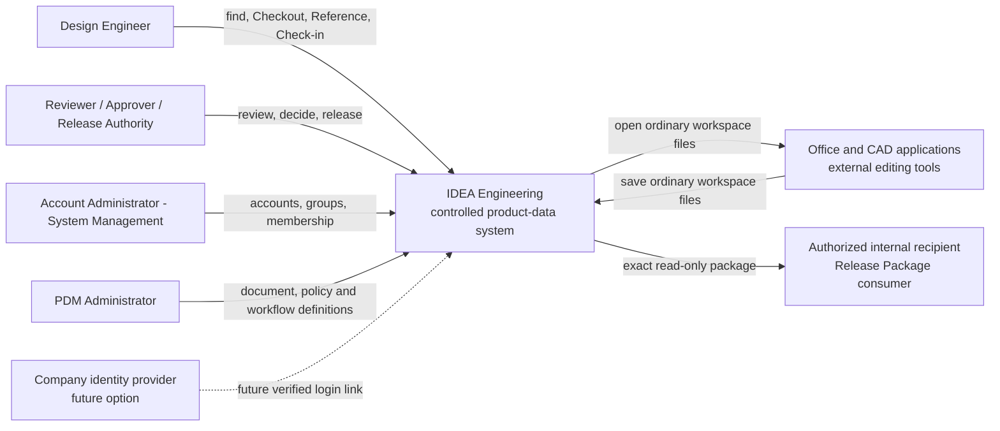
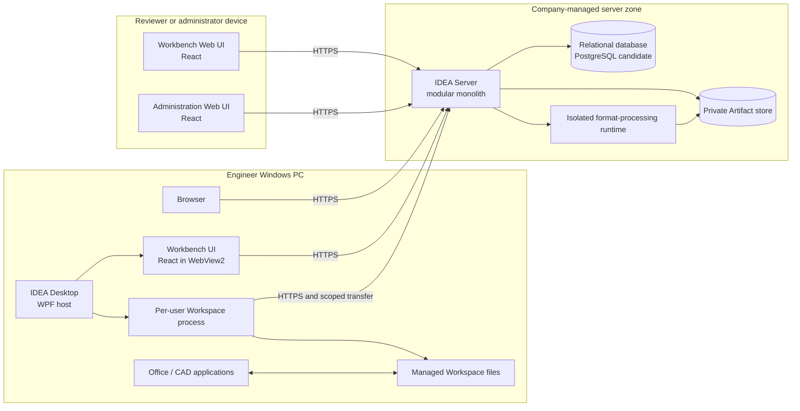
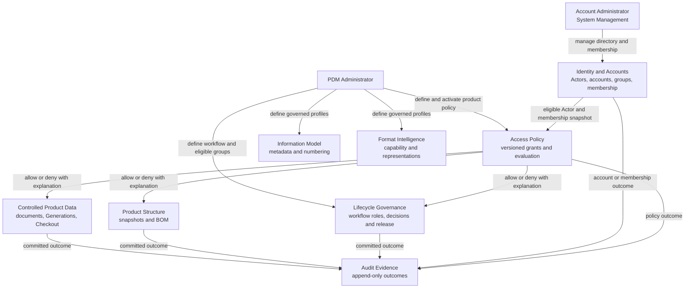
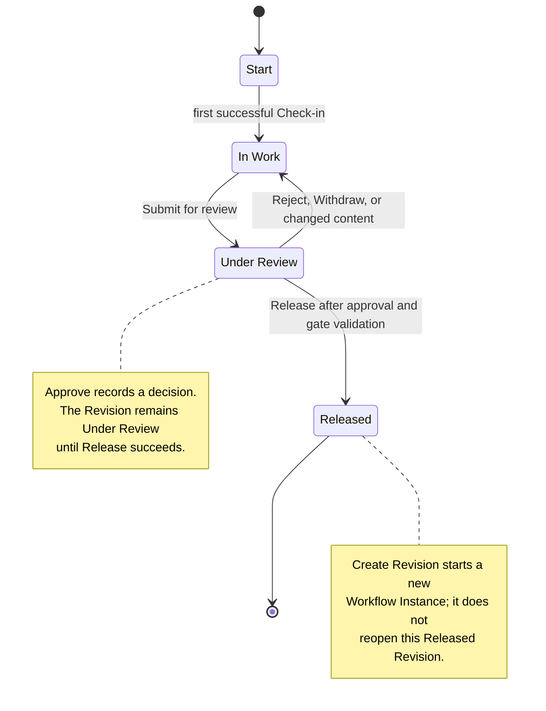
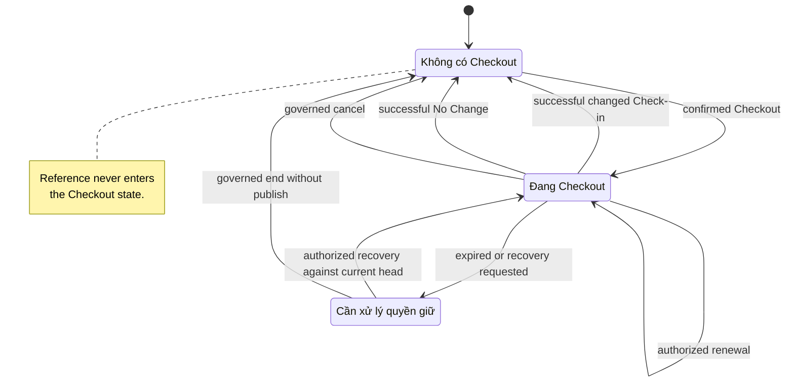
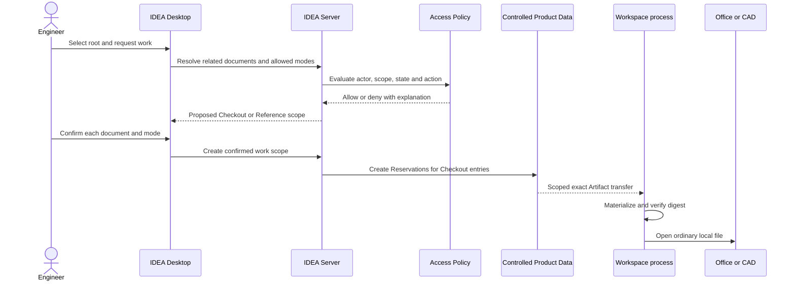
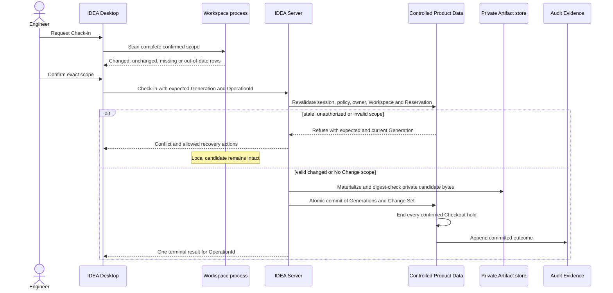
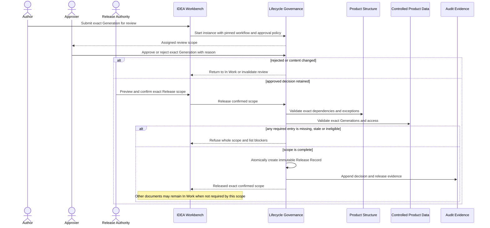
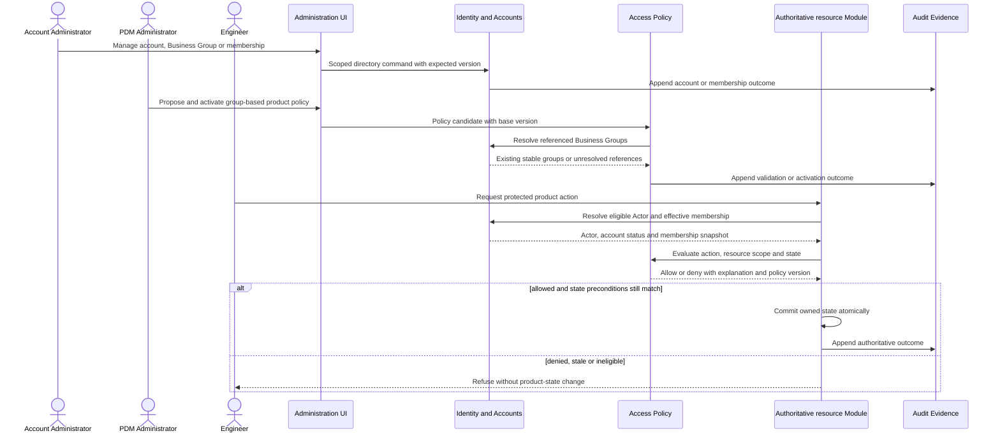

# IDEA Engineering Core v0 Architecture Description

> **Instance state**: controlled `Draft 0.10`. This document describes a candidate architecture for
> the recorded product direction and Draft requirements. It does not approve a technology stack,
> authorize production implementation, or record a successful architecture review.

## Control envelope

| Field | Recorded value |
|---|---|
| Stable Document ID | `IE-PROD-ARCH-001` |
| Document Class | `DOC-05` |
| Title | IDEA Engineering Core v0 Architecture Description |
| Owner | `Principal Product Author`; named person attribution required before `Proposed` |
| Document Status | `Draft` |
| Document Version | `0.10` |
| Applicable Baseline | `IDEA-C1-ANALYSIS-DESIGN-001` / candidate `IE-TECH-CORE-V0-001` |
| Requirements Input | `IE-PROD-SREQ-001@0.11`; Feature and Spec decisions remain `NOT-RUN` |
| Effective Date | `NOT APPLICABLE` until approval |
| Authors | `Principal Product Author`; named identity not yet recorded |
| Reviewers | Project user performs internal document review; architecture review `NOT-RUN`; required independent/specialist reviewer unassigned |
| Approvers | Product Decision Authority for Tech; identity, decision and date are `UNKNOWN` |
| Source Links | [DOC-04](DOC-04-software-requirements-specification.md), [DOC-06](DOC-06-data-integration-and-migration-specification.md), [DOC-08](DOC-08-ui-ux-and-interaction-specification.md), [architecture input](../../../architecture/idea-product-lifecycle-architecture.md), [accepted ADR index](../../../adr/README.md) |
| Downstream Links | [DOC-07](DOC-07-mvp-roadmap-and-delivery-plan.md), [VVP](registers/VVP-core-v0-verification-validation-plan.md), [TECH-001](decision-briefs/TECH-001-technology-and-architecture-proposal.md), future implementation contracts and evidence |
| Evidence / Claim Status | Architecture and technology evaluation are `Draft`; tests, spikes and operational evidence are `NOT-RUN` |
| Change History | 0.10: add maintained architecture views and correct ownership boundaries among Account Administration, Business Group membership, Access Policy and Workflow Roles; no deployment or technology option is approved by this revision. 0.9: reconcile current Feature/Spec inputs and remove a stray file label; [IE-CHG-SOURCE-RECON-001](registers/CHG-2026-09-09-cross-document-reconciliation.md). 0.8 separated authoritative Product Structure/BOM from BOM Representations and non-authoritative import candidates. 0.7 separated Logical Document identity from folders and copies. 0.6 separated Identity from product authorization. 0.5 defined configurable workflows. 0.4 defined CAD Representation paths. 0.3 aligned Version/Generation. 0.2 introduced the technology proposal and account context. |
| Access Classification / Retention Rule | `INTERNAL`; retain with the controlled product baseline and successor/change records |

<!-- AUTHOR CONTENT START -->

## 1. System of interest and context

The system of interest is `C1 — IDEA Engineering`, an internal product that controls engineering
documents, immutable Generations, Product Structure, review decisions and exact Releases. It remains
useful and deployable without a future platform or another product capability.

The following view is the C4-style system context. Arrows show an allowed interaction, not shared
database ownership. Dashed elements are future or external boundaries.

**`ARCH-VIEW-CTX-001` — System context (conceptual).**



| Context item | Description | Authority / evidence | Status |
|---|---|---|---|
| Internal actors | Engineer/Author, Reviewer, Independent Approver, Release Authority, Account Administrator, PDM Administrator, Quality/Auditor, Security Administrator and Operator. Account and PDM administration are independently assignable. | DOC-03@0.6 actors; DOC-08 user profiles | `Draft` |
| External applications | Configured Office/CAD applications read and write ordinary files in a Managed Workspace. Unsaved in-memory state is outside IDEA. | `REQ-FMT-001/004`; accepted product decision | `Draft` |
| Accounts and login | Native IDEA accounts initially. During development the project user may hold temporary bootstrap capability; normal Account Administration is assigned to named System Management personnel. Other/company login is future scope, not an external prerequisite. | `REQ-IAM-001…007`; `TECH-CTX-003/004` | Responsibility model confirmed; production assignees, secure implementation and policy unqualified |
| Data stores | Relational authoritative metadata plus private content-addressed Artifact storage. | `REQ-ID-*`, `REQ-STR-*`, `REQ-OPS-001/003/004`; DOC-06 | Architecture `Draft`; providers undecided |
| Future integrations | Read-only Controlled Release Package export is in Core v0. General external integration, company login and write-back are deferred. | Feature exclusions; `REQ-LC-008` | `DEFER` for integrations; export required |
| Product boundary | One internal product and one Organization boundary in the first deployment; Organization isolation remains enforced by design. | `REQ-GOV-001`; internal-company decision | `Draft` |

Confirmed constraints are recorded in [TECH-CTX-001…008](registers/CHG-2026-09-03-tech-context-and-proposal.md) and refined by the current responsibility model: Windows engineering PCs, 50–100 total intended users at one site, company-controlled server to be proposed, native accounts first, temporary user-held bootstrap/possible operations during development, normal Account Administration by named System Management personnel, no assumed DevOps function, uncertain MB-to-GB related document sets and preliminary recovery objectives. None is measured capacity or a stack decision.

## 2. Concerns, quality attributes and scenarios

| Scenario / concern | Stimulus and operating condition | Required architecture response | Verification link | Current result |
|---|---|---|---|---|
| `QRS-001` Correct identity/version | Register, change, Check-in and revise one Logical Document. | One stable identity; immutable committed Generation; atomic first baseline and revision transition. | `REQ-ID-001…006`; `VVP-001/002` | `NOT-RUN` |
| `QRS-002` Atomic multi-document Check-in | Failure occurs at any upload, validation, materialization or transaction point. | Candidate content remains private; every selected change commits together or none commits; retry is idempotent. | `REQ-WS-007/008/012`, `REQ-OPS-001`; `VVP-003` | `NOT-RUN` |
| `QRS-003` Stale/non-owner protection | A stale, wrong-owner, wrong-Workspace or unauthorized publish is submitted. | Authoritative state is unchanged, local work remains safe, and an actionable conflict is returned. | `REQ-WS-010/011/013`; `VVP-004` | `NOT-RUN` |
| `QRS-004` Exact release | Release is requested with missing, unresolved or unapproved content. | Lifecycle Governance fails closed; successful Release pins exact Generation, structure, policy and evidence. | `REQ-STR-003`, `REQ-LC-006…009`; `VVP-006` | `NOT-RUN` |
| `QRS-005` Organization isolation | An identity attempts to resolve or command another Organization's resource. | Resource owner refuses the action and appends permitted Audit Evidence without cross-scope disclosure. | `REQ-GOV-001/002`; `VVP-007` | `NOT-RUN` |
| `QRS-006` Exact restore | Metadata/content/configuration is restored from one approved recovery point. | Every retained Generation resolves and digest-checks; gaps are reported and cannot be called PASS. | `REQ-OPS-003/004`; `VVP-013` | `NOT-RUN` |
| `QRS-007` Localized interaction | The same controlled task runs in each supported locale and surface. | Command/state/authority outcomes remain equal; user Unicode round-trips; missing resources use the declared fallback. | `REQ-UX-*`, `REQ-LOC-*`; `VVP-009/010` | `NOT-RUN` |
| `QRS-008` Untrusted format input | A malformed, oversized or slow file is processed. | Bounded worker failure cannot change source Artifact or product state; results retain tool/profile provenance. | `REQ-FMT-002…005`, `REQ-SEC-004`; `VVP-008/011` | `NOT-RUN` |
| Dense workspace usability | User performs a controlled task at the canonical 1440×900 demo viewport. | Context remains visible; same-type detail scrolls internally or opens in a drawer/modal; keyboard, focus and status semantics remain usable. | `REQ-UX-*`; `VVP-009` | `NOT-RUN` |
| `QRS-009` Account eligibility and recovery | An account is provisioned, recovered, suspended or its sessions revoked. | Stable Actor history survives; old sessions cannot authorize subsequent protected requests, and account administration does not confer product privileges. | `REQ-IAM-*`; `VVP-015` | `NOT-RUN` |
| `QRS-010` Governed authorization change | An administrator changes a role/group/scope rule through a form or imports a serialized candidate. | Identity only establishes the eligible Actor. Server validates and previews the candidate, an authorized activation creates a new immutable Access Policy Version, and invalid/self-authorizing/client-only data changes no authority. | `REQ-GOV-002/005`, `REQ-SEC-001`; `VVP-007`, AC-01…05 | `NOT-RUN` |

RTO of four working hours and RPO of at most one hour are user-confirmed **planning objectives** for severe server failure, not achieved SLAs. Working-hour clock/coverage, workload, capacity, latency, availability, Reservation lease, transfer expiry and worker limits require approved measurement profiles. The project user may operate initially; a long-term operator and specialist review remain unassigned.

## 3. Viewpoints and views

This architecture description applies the project's tailored ISO/IEC/IEEE 42010:2022 profile: it
identifies the system of interest, stakeholders/concerns, viewpoints, maintained views,
correspondence rules, rationale, decisions and known gaps. A diagram is not accepted merely because
it renders; every element must correspond to an owned responsibility, Interface, requirement or
explicitly marked external/future boundary.

| Viewpoint | Intended concern / audience | View maintained here | Correspondence rule | Review status |
|---|---|---|---|---|
| Context | Product Decision Authority and all stakeholders | System boundary and external actors in section 1 | No external actor/store becomes product authority. | `Draft` |
| Responsibility | Maintainers and reviewers | Hosts and deep Modules in sections 4–5 | Every authoritative state has exactly one owner Module. | `Draft` |
| Information | Product, data and quality owners | Identity/lifecycle implications in section 8 and DOC-06 | Persisted references use stable identities and exact version pins. | `Draft` |
| Interaction | Engineer, reviewer and HCD owner | Checkout/Check-in and review/release sequences in section 7 | UI state is a view of server/workspace truth, not a second authority. | `Draft` |
| Deployment | Operator and security owner | Host/trust-zone view in sections 4 and 9 | Client/worker packages cannot hold infrastructure credentials. | `Draft` |
| Reliability | Operator, data and quality owners | Atomicity, idempotency, outbox, reconciliation and restore in section 9 | Public state appears only after a complete authoritative commit. | `Draft` |
| Security | Security and policy owners | Trust seams and owner-enforced authorization in section 10 | Every access path reaches the authoritative owner policy. | `Draft` |
| Evolution | Product and architecture owners | seams, candidate stack and deferred boundaries | A later Adapter may replace an Implementation without changing Module authority or accepted interface semantics. | `Draft` |

### 3.1 Maintained view catalogue

Each view has a stable ID so a review comment can identify the exact model rather than referring to
“the diagram above”. All views are conceptual or candidate models; none is implementation evidence.

| View ID | Model and location | Main concern | Principal trace |
|---|---|---|---|
| `ARCH-VIEW-CTX-001` | System context, section 1 | Product boundary, actors and external systems | DOC-03 actors; `REQ-GOV-001`; `REQ-IAM-*` |
| `ARCH-VIEW-DEP-001` | Candidate deployment, section 4.1 | Processes, trust zones and communication paths | `REQ-SEC-*`; `REQ-OPS-*`; Tech decision pending |
| `ARCH-VIEW-MOD-001` | Module authority, section 5.1 | Single ownership of authoritative state | `REQ-GOV-*`; `REQ-IAM-*`; DOC-06 |
| `ARCH-VIEW-STATE-001` | Workflow state, section 7 | In Work, Under Review and Released meaning | `REQ-LC-001…009` |
| `ARCH-VIEW-STATE-002` | Checkout state, section 7 | Edit entitlement independent of lifecycle | `REQ-WS-002/007/013` |
| `ARCH-VIEW-SEQ-001` | Checkout/materialization, section 7.1 | Exact scope and safe local custody | `REQ-WS-001…006/013` |
| `ARCH-VIEW-SEQ-002` | Check-in/stale recovery, section 7.2 | Atomic outcome and preservation of local work | `REQ-WS-007…013`; `REQ-OPS-001` |
| `ARCH-VIEW-SEQ-003` | Review/Release, section 7.3 | Exact approved release scope | `REQ-LC-001…009`; `REQ-STR-003` |
| `ARCH-VIEW-SEQ-004` | Account/group/authorization, section 7.5 | Separation of directory and product authority | `REQ-IAM-*`; `REQ-GOV-002/005` |
| `DATA-VIEW-CORE-001` | Released-baseline identity, DOC-06 section 1.1 | Information needed to reproduce an exact Release | `REQ-ID-*`; `REQ-STR-*`; `REQ-LC-006…009` |
| `DATA-VIEW-AUTH-001` | Directory/authorization ownership, DOC-06 section 1.2 | Separation of account, membership, policy and workflow data | `REQ-IAM-*`; `REQ-GOV-002/005` |

## 4. Deployable hosts and responsibilities

| Host | Responsibility | Must not do | Primary requirements |
|---|---|---|---|
| IDEA Server | Authenticate product requests; coordinate Modules; enforce authorization; persist authoritative state; perform atomic Check-in, workflow and Release; append Audit/outbox. | Expose internal schema; let clients/workers decide authoritative state; require a future platform for local behavior. | `REQ-ID-*`, `REQ-WS-007…013`, `REQ-LC-*`, `REQ-GOV-*` |
| IDEA Web | Search/browse/view; review/approval; governed administration; policy-appropriate preview/download. | Write stores directly or duplicate identity, Check-in, approval or Release rules. | `REQ-LC-*`, `REQ-UX-*`, `REQ-LOC-*` |
| IDEA Desktop | Capture explicit Checkout/Open/Check-in/Cancel/Recover intent; confirm scope; show conflict/recovery; launch files by OS association. | Run in an external application; publish on Save; keep permanent store credentials. | `REQ-WS-*`, `REQ-FMT-001/004`, `REQ-UX-*` |
| Workspace process | Per-user materialization, full scan/hash, cache, Workspace Manifest, resumable transfer and durable local recovery state. | Become product authority, approve/release, infer user intent or auto-merge binary changes. | `REQ-WS-001/003/004/006/009…013`, `REQ-SEC-003` |
| Format Processing Runtime | Execute one bounded immutable-input analysis/preview/conversion job through a versioned Adapter. The Adapter may invoke a qualified export interface of an installed CAD application or an approved standalone converter; manual uploads enter through the same Representation acceptance boundary. | Mutate source content or product state; reuse broad credentials; claim undeclared capability; assume a universal CAD renderer; attach output to a floating/latest source. | `REQ-FMT-002…005`, `REQ-SEC-004` |
| Relational store | Persist identity, metadata, heads, policies, structure, workflow, release, Audit and operation state transactionally. | Store user-editable working files or become an interface consumed by clients. | DOC-06; `REQ-OPS-003/004` |
| Private Artifact store | Retain immutable content by digest and serve only through scoped authorized transfer. | Expose permanent credentials/public access or decide which content is authoritative. | `REQ-ID-003`, `REQ-SEC-001/002`, `REQ-OPS-001/003/004` |

### 4.1 Candidate deployment view

This view separates deployable processes from domain Modules. The two Web front ends serve different
jobs but use the same authenticated Server interfaces and the same product authority. Technology
labels are candidates for Tech approval, not approved deployment facts.

**`ARCH-VIEW-DEP-001` — Candidate deployment and trust zones.**



The Workbench and Administration UI may share a component library and authentication/session
mechanism, but they are separate entry points and permission surfaces. Hiding an administration
button in the Workbench is not an authorization control; the Server applies the same policy to every
request.

The Workspace process initially means a protected per-user background process, not a privileged
machine-wide Windows service. Process count and packaging remain a Tech decision.

## 5. Deep Modules, Interfaces and ownership

In this document, a **Module** owns a coherent responsibility and state; its **Interface** is the
small contract callers need; its **Implementation** hides internal complexity; a **Seam** is a place
where policy, technology or deployment can vary; and an **Adapter** translates across a Seam. These
terms do not imply one network service per Module.

| Module | Small Interface intent | Complexity hidden by Implementation | Authoritative state |
|---|---|---|---|
| Controlled Product Data | Register, resolve, organize, Rename, Create Copy, Checkout, prepare/commit Check-in, revise and retrieve exact content. | Stable identity, logical folder/placement relationships, copy provenance, Generation immutability, optimistic concurrency, staging, deduplication and atomic Change Sets. | Logical Document, Document Folder/Placement, source-copy relation, Artifact reference, Generation, Business Revision, Reservation, Working Head, Check-in Operation/Change Set. |
| Product Structure | Resolve, validate and publish exact structure; query versioned BOM views; prepare/export BOM Representations; validate and atomically apply BOM Import Candidates. | Node/occurrence/dependency rules, cycles, unresolved members, semantic digest, exact pins, BOM View Profiles, source/output provenance, difference preview and stale-base protection. | Structure Snapshot, controlled relation identities, BOM View Profile versions, BOM Import Candidate/result and BOM Representation metadata. |
| Lifecycle Governance | Validate/activate Workflow and Approval definitions, define Workflow Roles and eligible Business Groups, assign a default version by Document Class, start/transition an instance, record decisions, Release and resolve an exact baseline. | State/transition validation, definition/instance versioning, role eligibility and instance assignment, decision count/rule, required reason/evidence, invalidation, notifications, exceptions and release completeness. | Workflow Definition/Version, Workflow Role, eligible-group mapping, Document-Class Workflow Assignment, Workflow Instance/assignment, Approval Policy/Decision and Release Record. |
| Information Model | Validate metadata, classify and allocate governed numbers. | Schema versioning, numbering scope/idempotency and policy migration. | Metadata/Classification/Numbering Policy Definitions and allocations. |
| Format Intelligence | Declare capability and request analysis/representation. | Execution mode (`None`, `Manual`, `Application-assisted`, `Parser`, `Standalone converter`), application/Adapter/tool versions, prerequisites, isolation, resource limits, provenance, stale derivative handling and Release-policy response. | Format Capability Profile, job/result identity and Representation metadata; never source authority. |
| Access Policy | Prepare/validate/activate a versioned product-authorization policy and evaluate a decision for an authoritative resource owner. | Grants from effective Business Group membership, resource class/scope/state and action; exceptional direct-Actor grant scope/reason/expiry; bootstrap/adoption authority; candidate diff/validation; explainable denial without hard-coded business roles. | Access Policy Definition/Version, exceptional direct grant, import candidate/activation and decision evidence. It references group/membership identities owned by Identity and Accounts. |
| Discovery | Find/browse through rebuildable projections. | Indexing, query projection, lag and replay. | Search projection only; never product authority. |
| Audit Evidence | Append and export attributable product events. | Correlation, completeness, ordering, retention reference and controlled export. | Append-only Audit records. |
| Identity and Accounts | Provision/activate, authenticate, change/reset password, suspend and revoke sessions; manage Business Groups and explicit membership within delegated Administration Scope; resolve stable Actor context. | Maintained credential mechanisms, recovery tokens, account status, session invalidation, future login linking, group-directory integrity, membership effective dates and scope checks. | Organization-scoped Actor/IDEA Account, Login Identity, credential/session/recovery records, Business Group and Business Group Membership; no Access Policy, Workflow Role, document ACL or approval authority. |

### 5.1 Authority and module ownership view

This diagram answers three different questions separately: who the person is, what policy applies,
and which Module is allowed to change the product state. A policy decision never writes another
Module's state.

**`ARCH-VIEW-MOD-001` — Module authority (conceptual).**



Module rules:

1. A Module writes only its own authoritative state.
2. Cross-Module work uses an Interface and explicit stable identities, not shared table mutation.
3. The server transaction may coordinate multiple owner Implementations only through declared
   contracts and one atomic business operation.
4. Projections, caches, derivatives and UI view models are rebuildable and never become authority.
5. Splitting a Module across a process Seam requires measured scale, isolation, ownership or failure
   evidence and a new approved Tech decision.
6. Identity and Accounts adds an internal technical responsibility, not a separate identity service.
   It owns Business Group identities and membership administration. Access Policy owns product-
   authorization definitions and evaluation; Lifecycle Governance owns Workflow Roles and instance
   assignments. Account Administration is an explicit scoped permission, not a document superuser.
7. One application transaction coordinates owner modules through a unit-of-work boundary; no owner exposes its database tables as the cross-module Interface. Transferring authority to a generic CRUD service is not the design.

## 6. Semantic interface catalogue

The interfaces below define product meaning. Protocol, serialization and library choices are
candidate Tech details; a later implementation must preserve the behavior and errors.

| Interface ID | Owner / caller | Inputs and outputs | Contract and error behavior | Security / trace |
|---|---|---|---|---|
| `IF-PRODUCT-QUERY` | Owner Module / Web, Desktop | Organization, actor, stable identity, requested view → authorized exact state/projection. | No floating resolution where an exact pin is required; stale projection is identified; missing/unauthorized fails without data leakage. | Authenticated; owner-authorized; correlation/Audit where material. |
| `IF-PRODUCT-COMMAND` | Owner Module / Web, Desktop | Actor, policy context, target, expected state, OperationId and payload → one accepted/refused outcome. | Optimistic preconditions and idempotency are explicit; no partial authoritative outcome. | Owner enforces final authorization; decision evidence pins policy version. |
| `IF-ARTIFACT-TRANSFER` | Controlled Product Data / Workspace or authorized viewer | Exact Artifact/digest and operation scope → resumable bytes plus verification result. | Short-lived scoped grant; wrong object, expiry, replay or digest mismatch fails closed. | No permanent store credential in client; transfer correlated and auditable. |
| `IF-WORKSPACE-IPC` | Workspace process / Desktop | Per-user authenticated commands, progress, manifest and local-state evidence. | Another user/session cannot command/read; reconnect does not invent server success. | Protected local transport; no secrets in diagnostic output. |
| `IF-FORMAT-JOB` | Format Intelligence / isolated Adapter | Immutable source Generation/Artifact digest, Capability Profile and limits → typed result/Representation or typed failure. An application-assisted Adapter may invoke only the declared export interface/version. | Idempotent; returned source pin/digest must match the request; source advance changes the derivative to `Needs update`; failure preserves source and state. Manual upload uses the same validation boundary. | One-job least privilege; application/Adapter/tool provenance and output digest retained; Release blocks or warns only under its versioned policy. |
| `IF-COMMITTED-EVENT` | Owner Module / projections and notifications | Committed event with identity, version, actor, correlation and source pins. | Published from transactional outbox only; replay repairs consumers; consumer failure cannot reverse/fabricate owner state. | Classification propagated; consumer access scoped. |
| `IF-ACCOUNT-SESSION` | Identity and Accounts / Web, Desktop and Server | Credentials, recovery proof or session proof → stable Actor/Organization, account eligibility or bounded denial. | One-use expiring recovery; explicit revocation; no credential in logs and no public signup endpoint. Account/session eligibility is checked on every protected request, then revalidated with the owner before authoritative commit. | `REQ-IAM-001/003/004/006/007`; `VVP-015`; maintained framework mechanisms, not a custom OAuth server. |
| `IF-DIRECTORY-ADMIN` | Identity and Accounts / Account Administration UI | Delegated Administration Scope, expected version and account/group/membership command → one accepted/refused directory outcome. | Only Account Administrators may issue/suspend accounts or create/update Business Groups and membership in scope. The interface cannot define Access Policy/Workflow, read existing passwords or imply document authority. Concurrent/stale changes fail without partial membership. | `REQ-IAM-002/005/006`; `REQ-GOV-002`; actor, target, scope, before/after identity and outcome audited without secrets. |
| `IF-POLICY-ADMIN` | Access Policy / PDM Administration UI | Form data or versioned serialized candidate plus base-policy pin → validation/diff or one activated Access Policy Version. | A policy references existing stable group identities but does not modify membership. Import has no runtime effect; malformed, unresolved, stale-base, unauthorized or self-authorizing candidates fail atomically. Activation is a separate Server command and retained history is never reinterpreted. | `REQ-GOV-002/005`; AC-01…05; candidate digest, actor, base/new version and outcome audited. |
| `IF-WORKFLOW-ADMIN` | Lifecycle Governance / PDM Administration UI | Workflow/Approval definition candidate, Workflow Roles, eligible group references and base version → validation/diff or activated version. | A definition cannot create accounts, groups or memberships. Missing groups, transitions, roles, decision rules or self-authorizing adoption are refused; running instances remain pinned to prior versions. | `REQ-LC-001/003/005`; `REQ-GOV-005`; WF-01…06; definition/version/actor/outcome audited. |
| `IF-STRUCTURE-BOM` | Product Structure / Web, Desktop, controlled export | Exact Structure Snapshot and BOM View Profile → authorized BOM view or pinned BOM Representation; exact base snapshot plus candidate payload → validation/diff or one confirmed new Structure Snapshot/Generation. | A file upload is non-authoritative. Query/export never follows floating latest; invalid, unresolved, stale-base, unauthorized or faulted import changes no authoritative row and creates no partial snapshot. | `REQ-STR-004…006`; BM-01…06; snapshot/profile/candidate/output digests and actor/outcome audited. |
| `IF-DESKTOP-BRIDGE` | Desktop / approved Web-rendered region | Versioned, allowlisted intent plus selected item/Workspace scope → progress/result. | Validate sender origin/frame, schema, session and manifest scope; no arbitrary path, shell command or generic host-object proxy. Navigation invalidates bridge authority; unsupported version fails safely. | `REQ-SEC-003`; `VVP-009/011`; native confirmation where scope changes. |
| `IF-COMPANY-IDENTITY` | Future login Adapter / Identity and Accounts | Verified provider subject → explicitly linked internal Actor/Organization. | Future integration; failure cannot substitute another actor, auto-link by email or reinterpret retained Audit. Native login remains the initial method. | Protocol/provider and company authorization `UNKNOWN`; deferred, not implemented as an empty integration layer. |

A supported public integration interface is outside Core v0. Internal versioned interfaces do not
create a promise of ERP/MRP write-back, bidirectional synchronization or direct database access.

## 7. Key interaction and state sequences

Lifecycle state and edit entitlement are independent. `Under Review` answers where a Business
Revision is in its Workflow; an active Checkout answers who may publish the next change from an
expected Generation. Approval is a retained decision, not a second lifecycle state. The diagrams
below are conceptual state views; persisted names remain governed by the selected definition.

**`ARCH-VIEW-STATE-001` — Business Revision workflow state.**



**`ARCH-VIEW-STATE-002` — Checkout entitlement state.**



### 7.1 Checkout and materialization

**`ARCH-VIEW-SEQ-001` — Checkout and materialization sequence.**

1. Desktop resolves the selected root and known Related Documents.
2. User confirms each item as Checkout, Reference or excluded; no hidden assembly-wide cascade.
3. Server authorizes the complete request and creates one Reservation per Checkout document against
   its expected Generation. One conflict refuses the proposed set and returns affected entries.
4. Controlled Product Data grants scoped Artifact transfer for the confirmed snapshot.
5. Workspace process materializes every exact file, verifies the digest and records its Workspace
   Manifest before Desktop reports completion and opens the root through the operating system.



### 7.2 Check-in and stale recovery

**`ARCH-VIEW-SEQ-002` — Check-in and stale-recovery sequence.**

1. Workspace process scans/hashes the complete candidate scope and classifies unchanged, changed,
   missing, Out of date and modified-without-Checkout entries using the approved UI terms.
2. Desktop requires confirmation of exact scope and explains that a successful or No Change result ends Checkout for that scope. Core v0 offers no retain-after-Check-in option.
3. Content is staged privately. Server validates identity, digest, metadata, relations, policy,
   owner, Workspace, Reservation and expected Generation.
4. Any invalid entry refuses the entire confirmed Change Set. Local work is preserved; the response
   shows expected/current Generation and valid refresh/reapply, Save As, retry or governed recovery.
5. Verify and durably materialize immutable candidate bytes in private storage **before** publication. A failed or uncertain file write cannot reach ReadyToPublish. No filesystem/object-store write is assumed to participate in a database transaction.
6. One database transaction revalidates account/session eligibility, owner policy, Reservation, expected heads and scope, then records Artifact manifest references, required Structure Snapshots, Generations, Working Heads, Change Set, Audit/outbox and the release of in-scope Reservations. Each Module writes only its owned state through the shared unit of work.
7. A semantic No Change result creates no Generation and still records the result and ends every hold in the confirmed scope. A mixed changed/unchanged scope ends all confirmed holds when the whole operation succeeds. Failure preserves local work and any still-valid entitlement.
8. Retrying the same OperationId resolves the same operation; it does not create a new Change Set. After a database failure, unused bytes remain private and are reconciled only after proving no live operation or retained Generation references them.



### 7.3 Review, approval and Release

**`ARCH-VIEW-SEQ-003` — Review and exact Release sequence.**

1. Submit pins the exact Generation and review scope under one Workflow/Approval Policy Version.
2. When an instance starts, Lifecycle Governance resolves the active default for its Document Class
   or an explicitly permitted selection, then pins that Workflow Definition and Approval Policy.
3. A later definition activation affects future instances only; migration of a running instance is
   a separately authorized, previewed and audited operation.
4. Later content change invalidates the pending review; it never inherits an earlier approval.
5. The seeded path requires one eligible independent approver and refuses self-approval/release.
   Missing actors or invalid configuration block the affected action with an explainable result.
6. Release revalidates exact Artifacts, Product Structure, decisions, exceptions, policy and Audit.
7. Success creates an immutable Release Record and reproducible Controlled Release Package;
   failure changes no release state and reports blocking entries.



### 7.4 Account provisioning and session loss

1. A controlled, one-time bootstrap provisions a named first account/recovery administrator. It does not bypass the separate Bootstrap Custodian/Access Policy adoption rules or grant itself document access.
2. An authorized Account Administrator issues an account in the Operating Organization. Activation/password setup uses framework-managed, one-use expiring proof through an approved delivery channel; open self-registration is disabled. Creating the account grants no product authority by itself.
3. Through a separate scoped command, the Account Administrator may place the Actor in an existing governed Business Group. The PDM Administrator defines the group's purpose and active product policy but does not make this routine membership assignment.
4. Native IDEA login establishes a protected session. All subsequent product access still reaches owner-enforced Access Policy. No username, email or provider claim is a durable document-owner key.
5. Password recovery invalidates prior recovery proof and affected sessions; suspension/revocation is recorded transactionally with attributable Audit. Requests beginning after that commit are refused for the affected old sessions; commands revalidate eligibility before their own commit.
6. Already running transfers are cancelled or revalidated at defined request/chunk checkpoints; bytes already delivered and saved local work cannot be remotely erased. Resume requires fresh authorization. Exact timing/checkpoints must be qualified, not described as instantaneous revocation of every byte.
7. UI explains reauthentication without deleting a local candidate. Re-enabling an account does not resurrect old sessions. Account/group changes do not rewrite historical Actor, Approval or Audit records.

### 7.5 Account, group and product-authorization decision

**`ARCH-VIEW-SEQ-004` — Directory administration and product-authorization sequence.**



The Account Administrator can change who belongs to a governed Business Group but cannot change
what that group is allowed to do. The PDM Administrator can define that policy and Workflow Role
eligibility but cannot create a user or place a person in the group. A person may hold both duties
only when both permissions are assigned explicitly; the interfaces and Audit remain separate.

### 7.6 Organize, rename and create a copy

1. A query resolves the selected `DocumentId`, its authorized Document Placements and the displayed
   folder/divider tree; no client receives or constructs an authoritative Artifact-storage path.
2. Move or link commands authorize the source document, destination folder and requested mode, then
   change only Placement state. An exact historical link pins its selected Revision and Generation.
3. A navigation-alias Rename changes only the Placement label and Audit. A controlled Product
   Definition name/title change enters the normal Checkout/Check-in path and creates a Generation.
4. Create Copy reads one authorized exact source, allocates a new `DocumentId`, records source
   provenance and initializes the new document under the normal New/first-publish rules. It does not
   carry source Reservation, Approval or Released state.
5. Every command revalidates authorization and expected state at commit. Failure leaves the prior
   document, placements and source/copy relationship unchanged and returns one attributable result.

### 7.7 View, export and import BOM data

1. Product Structure resolves one exact Structure Snapshot and one versioned BOM View Profile; the
   resulting view retains occurrence identities, exact component Generations and profile-defined
   quantity, position and other fields.
2. Export creates a BOM Representation with the source snapshot/profile, output digest, producer and
   format. It is a read-only result, not Product Structure authority.
3. A later source snapshot or profile version does not rewrite the old output. The old output stays
   reproducible and is shown as `Needs update` when compared with the newer source/profile.
4. Import first stores a non-authoritative candidate with its payload digest and exact base snapshot.
   Server validation produces an add/change/remove preview without changing Product Structure.
5. User confirmation sends the expected base and candidate identity. Product Structure revalidates
   access and references, then publishes the new Structure Snapshot and owning Generation in one
   atomic operation. Any stale, invalid or failed case changes neither.
6. An independently controlled parts-list Logical Document follows ordinary Generation/workflow
   rules and records an explicit exact relationship to its Structure Snapshot; it is never silently
   substituted for, or by, a generated BOM Representation.

## 8. Data, lifecycle and integration implications

| Topic | Architectural implication | Detailed authority | Status |
|---|---|---|---|
| Identity/version | Stable Logical Document and Business Revision identities point to immutable Generations. Version within Revision is the business-visible Generation order; there is no separate Version Sequence field. | DOC-06 sections 2–3; `REQ-ID-*` | `Draft` |
| Organization and copy | Document Folder/Placement identities are independent of physical storage. Move/link/unlink change organization only; Rename retains `DocumentId`; Create Copy allocates a new one with source provenance. | DOC-06 `DATA-REL-017…019`; `REQ-ID-007…009`; IF-01…06 | `Draft` |
| Binary content | Artifact bytes are immutable and content-addressed; a Generation Manifest pins exact digests. | DOC-06; `REQ-ID-003/004` | `Draft` |
| Structure | Structure Snapshot is immutable and members pin exact Generations; unresolved required dependencies remain visible. | DOC-06 `DATA-REL-005`; `REQ-STR-*` | `Draft` |
| BOM views and files | BOM is a view of an exact Structure Snapshot under a versioned profile. Excel/PDF/CSV outputs remain pinned non-authoritative BOM Representations; imports remain candidates until previewed and atomically accepted. Independent controlled parts lists retain their own Logical Document/Generation identity and an exact structure relationship. | DOC-06 `DATA-REL-020…023`; `REQ-STR-004…006`; BM-01…06 | `Draft`; procedures `NOT-RUN` |
| Workflow/release | Multiple definitions may coexist; a versioned assignment selects the active default per Document Class. Instances and decisions pin exact definition/policy versions, and Release never follows floating latest. A graphical designer is deferred; validated configuration data/forms are sufficient for Core v0. | DOC-06 `DATA-REL-008…010`; `REQ-LC-*` | `Draft` |
| Policy/configuration | Identity establishes Actor/account eligibility; Access Policy separately owns versioned product authorization. Forms and optional JSON import create candidates only; Server-side validation and authorized activation are required before a new version has effect. Product defaults, governed policies and low-impact settings retain distinct change paths. | DOC-06 `DATA-REL-016`; `REQ-GOV-002/005`; AC-01…05 | `Draft`; approval pending |
| Store Existing | Bounded onboarding maps ordinary files into the same identity/content model; duplicates are shown, never silently merged. | DOC-06 section 5; `REQ-ID-005/006` | `Draft` |
| Export | Controlled Release Package is read-only and exact; external write-back remains deferred. | DOC-06 section 4; `REQ-LC-008` | `Draft` |
| Audit/recovery | Evidence is append-only in the logical product model; backup/restore covers one consistent metadata/content/configuration point, including account/security records and required keys. | DOC-06 sections 7–8; `REQ-AUD-*`, `REQ-OPS-*` | `Draft`; procedures `NOT-RUN` |
| Accounts/login | Stable Actor survives login-name changes, suspension and explicitly linked future authentication methods; credentials are not part of engineering-file manifests or exports. | DOC-06 `DATA-REL-013…015`; `REQ-IAM-*` | `Draft`; data migration only when approved |

## 9. Reliability, deployment and operations

### 9.1 Publication and background work

```text
Prepared → Uploading → Validating → ReadyToPublish → Published
    └──────────────────────────────────────────────→ Failed
    └──────────────────────────────────────────────→ Cancelled
Published | Failed | Cancelled = terminal Check-in Operation states
```

Private durable materialization precedes database publication as specified in section 7.2. Database
constraints, expected-state predicates and an appropriate locking/isolation strategy protect head,
scope and operation identity; PostgreSQL's default isolation alone is not proof of correctness.
Concurrent suspension, policy activation and publication need a defined serialization/revalidation
rule and race tests, not just a pre-request check.

Audit of the authoritative outcome and an outbox entry share the owner transaction. Projection/
notification/representation work consumes only committed outcomes, with idempotent retry and
bounded concurrency. No external broker, Redis or search service is required by this initial design.
Discovery requirements still need SPEC-OPEN-02; no advanced-search scope is inferred.

Reconciliation identifies abandoned staging, failed materialization, unreferenced private bytes,
missing/corrupt objects and projection drift. Collection has a grace/in-flight-reference rule and
a controlled record; it cannot delete an object required by a retained Generation or recovery set.
Physical durability, concurrent content-addressed writes and crash behavior of the selected store
must be qualified on the actual filesystem/storage stack.

### 9.2 Initial deployment candidate

Evaluate one company-controlled server/VM for the monolith, PostgreSQL and private Artifact volume,
with separate process identities, least-privilege filesystem access and no database/public-file
access from clients. This is a proposed evaluation topology, not demonstrated sizing or availability.

Evaluate Ubuntu Server 24.04 LTS first only if IT can support it; Windows Server 2025 remains a
company-skills/licensing alternative. Exact .NET/OS/package compatibility is pinned at qualification.
The current .NET 10 OS matrix explicitly lists 24.04, not 26.04; do not assume a newer OS is qualified.
The isolated format runtime may require a separate Windows worker host and license; that does not
require moving product authority into the worker or changing the whole server OS.

A single server is a single outage domain. No failover/zero-downtime claim is made. Reject or revise
this topology if the approved outage/recovery objective cannot be met or the company requires more
availability. A separate physical/administrative backup failure domain is required for the proposed
severe-server-loss drill; a second folder, RAID or same-host snapshot alone is not that evidence.

### 9.3 Recovery design and measurement

- Database base backup plus continuous WAL archiving is the PostgreSQL PITR candidate. Track
  archive failure/lag, not only job completion. Database WAL does not contain external Artifact bytes.
- Back up immutable Artifacts continuously/in bounded batches plus manifests, configuration/policy
  versions and required keys. A recovery-set record names the database recovery point and the
  complete matching content/configuration/key set. Extra newer unreferenced bytes may remain private.
- The usable recovery point is limited by the **oldest complete coordinated component**, not merely
  the newest database backup. Do not restore a database point whose referenced content is absent.
- Preliminary targets from TECH-CTX-008 are RTO ≤ four working hours and RPO ≤ one hour. Define
  incident start, business calendar/coverage, restore corpus and healthy-service acceptance before
  measuring. Record both elapsed wall time and agreed working-time measurement to avoid hiding delays.
- Restore to an isolated replacement environment, reconcile every retained Generation in the
  approved recovery scope and digest-check it, then exercise login, exact file open, Check-in and
  release reproduction. Incomplete/corrupt recovery is not PASS even if the clock target was met.
- Backups/keys require protected retention and recovery access; loss of credentials or encrypted
  key material is part of the drill. Recovery must not silently re-enable revoked sessions; invalidate
  restored sessions and reconcile account/security changes since the recovery point before reopening
  access. The one-hour loss objective does not authorize forgotten access revocations.
- The project user may operate initially. Name a backup operator/recovery custodian, supported hours,
  escalation path and repeatable runbook before operational rollout; no 24/7 or DevOps team assumed.

### 9.4 Delivery, rollback and observability

Plan versioned release bundles, dependency/license inventory, signed Desktop delivery where company
policy requires it, protected configuration, preflight checks, health checks and a documented
maintenance window. IT approves installation and update routes; no installation occurs in this task.

Test on a representative non-production environment before promotion. Database/account/policy
migrations record the pre-change backup and reconciliation criteria; replacing old binaries is not
automatically a safe schema downgrade. Choose forward repair or a proven full recovery path and
record its data-loss/compatibility consequences.

Monitor request failures/latency, database health/locks, disk free space and growth, digest failures,
transfer interruption, abandoned operations, worker limits, outbox lag, backup lag and latest
successful restore drill. Alert routes and ownership must be assigned; logs omit credentials and
sensitive unnecessary content. Representative concurrent users, maximum files, total corpus,
growth and resource thresholds are still measurement inputs, not invented server specifications.

## 10. Security and privacy design

Trust zones are browser, Web-rendered Desktop, native user session, Managed Workspace, Server,
relational store, private Artifact store, isolated format runtime, backup store and external tools.

| Control | Candidate design response | Required evidence |
|---|---|---|
| Native accounts and directory | ASP.NET Core Identity is a candidate for maintained credential/session mechanics behind Identity and Accounts; stable Actor, Business Group and Membership remain IDEA domain records. No public registration endpoint or shared default password. Account Administration is distinct from PDM policy/workflow and product-decision permission. | REQ-IAM-001…007; REQ-GOV-002; VVP-015, including least-privilege provisioning, scoped membership and last-recovery-path protection |
| Password and recovery | Use maintained hashing/reset/token mechanisms; never log, email back or expose an existing password. Approved one-use delivery, password/lockout/rate-limit/MFA/recovery policy remains to be specified. | Recovery/replay/brute-force and privileged-reset abuse cases; security-policy review |
| Browser sessions | Same-origin HTTPS UI/API; Secure/HttpOnly session cookies and anti-CSRF protections on state changes. No session token in browser local storage. | CSRF, XSS/session, sign-out and suspension matrix |
| Native sessions | Qualify supported framework session/bearer integration, protected per-user credential storage and renewal. Identity API tokens are proprietary, not an OAuth/OIDC server. No hand-written authorization-code protocol, token injection into JavaScript or promise of cross-surface SSO. | Exact maintained-library/flow review and old-token revocation tests; future standards-based provider requires separate selection |
| Directory administration | Identity and Accounts validates delegated Administration Scope and expected version for Actor/account/Business Group/Membership commands. It cannot write Access Policy, Workflow or document state. | Cross-scope, stale membership, removed group, suspended account, direct-store denial and separation-of-duty tests |
| Eligibility and authorization | Identity and Accounts validates current active account/session and supplies effective membership; the authoritative resource owner evaluates current policy and expected state. Revocation/membership races are revalidated or serialized before commit. | Old cookie/token, removed membership, concurrent suspension, Check-in/Release and transfer tests; fail closed if eligibility cannot be established |
| Policy and workflow administration/import | Only Server endpoints accept form or serialized candidates. Schema/reference/semantic/base-version checks and preview precede separately authorized activation. Definitions may reference groups but cannot change membership; Identity claims, client files and direct database paths are not product authority. | AC-01…05 and WF-01…06; invalid/stale/self-authorizing import, missing group/role, direct-store denial, version pin and Audit evidence |
| File transfer | Server-mediated scoped short-lived transfer initially, with account/policy revalidation at each protected request and before resume. No permanent store credential/public URI. Long streams have defined cancellation/revalidation checkpoints. | Old-grant, wrong-object, expiry, replay, revoked-session and interrupted-transfer tests |
| Local process | Authenticated per-user/session IPC, controlled startup and recovery manifests; no privileged machine-wide agent required. OS same-user isolation is not proof against every malicious same-user process. | Cross-user/session denial, spoofed connection, restart/update/logout and preserved-local-work evidence |
| Web/native bridge | Only approved origins/frames, allowlisted versioned messages and exact manifest-scoped intentions; validate source on every navigation/message. No generic host object, arbitrary filesystem or shell access. External/untrusted content never shares a privileged bridge. | Malformed messages, iframe/origin navigation, path traversal, stale session and focus/scale tests |
| Worker | Immutable input and bounded output; one-job least privilege and time/RAM/CPU/output quotas. Worker result is untrusted input to its owner. | Malformed/oversized/fault cases; original digest and product state unchanged |
| Audit / privacy | Account/security events use stable Actor and correlation without secrets; product Audit append-only under ordinary admin. High-privilege OS/database/backup access remains an explicit operational risk. | Event completeness, mutation denial, log inspection and access-review evidence |
| Secrets / backup | Protect TLS, server data-protection and recovery keys outside source; backup access separated from runtime access. Restored sessions invalidated; account/security changes reconciled before reopening. | Secret scan, access-denial tests and loss-of-server/key restore drill |
| Delivery integrity | Pin source/dependencies/toolchain; review licenses including transitive components; apply verified patches and test rollback. | Version/license manifest, provenance and deployment evidence |

The above are proposed implementation responses, not a claim of security from framework defaults.
Identity cookie stamps default to periodic validation, and already issued bearer tokens may outlive
a password change. The required eligibility check cannot be replaced by those defaults. Full MFA,
password, lockout, session-expiry and recovery-channel policy is still a qualification prerequisite.

## 11. Candidate technology decisions and trade-offs

The recommendation decomposes the former A/B/C bundles into independent decisions. Mandatory
criteria are the approved product invariants and company permissions; convenience cannot offset
failure of those criteria. No performance score, approved numeric weighting, budget or expertise
claim is invented.

| Decision ID / concern | Recommended candidate | Alternative and selection trigger | Cost / limitation / evidence |
|---|---|---|---|
| TECH-STACK-001 — server | C#/.NET 10 LTS, ASP.NET Core, modular monolith | Java/Spring if established company skills/support justify a second runtime alongside Windows .NET; distributed services only with a separate measured need | Shared runtime family, not free implementation or presumed C# expertise; patch and supported-OS obligations |
| TECH-DATA-001 — database | PostgreSQL 18, aligned EF10/Npgsql provider10/driver versions | SQL Server 2025 production-licensed edition if company entitlements and operations make it preferable | PostgreSQL license has no fee, but support/DBA/backup work remains; SQL Developer is not a production entitlement |
| TECH-WEB-001 — Web UI | React + TypeScript SPA, Vite build, served with Server | React framework in SPA/static mode if routing/data/error handling is simpler and maintainable; SSR only for evidenced need | React normally recommends a framework. Vite alone is not routing/data/security design; no automatic extra Node production host is assumed |
| TECH-DESKTOP-001 — Windows UI | WPF/.NET 10 shell + WebView2 rendered regions; shared React UI where appropriate | WinUI 3/Windows App SDK after focus/scaling/toolchain/support comparison; WinForms only if complex workspace fit is demonstrated | Microsoft recommends WinUI 3 for new native apps. WPF is an IDEA-specific runtime/tooling trade-off, with a separate WebView2 update/bridge obligation |
| TECH-IDENTITY-001 — accounts and directory | ASP.NET Core Identity for native credential/session mechanics inside the monolith, with IDEA-owned stable Actor, Business Group and Membership records | Future company login or maintained OIDC provider only when protocol/requirements/ownership are established | Identity roles/claims are not the final product Access Policy. No public signup; delegated administration, membership races, recovery and revocation still require design and qualification |
| TECH-FILES-001 — Artifacts | Private immutable content-addressed filesystem Adapter, server-only access | Private object-storage Adapter if shared/multi-node capacity or existing managed operations justify another dependency | Must qualify durable writes, digest, atomic naming, concurrent deduplication, capacity and coordinated backup; not a user SMB share or physical WORM guarantee |
| TECH-HOST-001 — server OS | Evaluate Ubuntu Server 24.04 LTS with IT first | Windows Server 2025 when operator skills, support and licensing make it safer to maintain | Company decision outstanding; Windows design PCs do not determine server OS. No unsupported-OS or exact sizing claim |
| TECH-OPS-001 — topology | Single server/VM candidate; separate backup failure domain; limited outbox/worker concurrency | Separate DB/file/worker hosts or stronger availability if measured needs/recovery results require it | One server remains an outage point; not a demonstrated 50–100-concurrent-user configuration |
| TECH-FORMAT-001 — format runtime | Isolated external runner, exact versioned profiles; IRONCAD first deep profile | Add tools/profiles only after entitlement and conformance evidence | OS/license/resources can require a Windows worker independent of the main server; never an in-CAD add-in |

Sources and licensing/support detail are retained in the
[2026-09-03 primary-source note](../../../research/2026-09-03-idea-tech-stack-primary-sources.md).
The note documents .NET 10 support to 2028-11-14, .NET 8 to 2026-11-10, PostgreSQL 18 to 2030-11-14,
actual provider-major dependencies, and the separate EF10 page date of 2028-11-10. Resolve the
source-date discrepancy before adopting an upgrade calendar; do not silently promise the longer date.

.NET has no use charge, but official Windows binaries are not uniformly MIT. PostgreSQL/Npgsql
and EF/React/TypeScript/Vite carry their respective licenses; dependency trees, tooling, Windows,
WebView2 and CAD/Office products need an actual inventory. No company entitlement or total-cost
estimate is asserted. Vite and WebView2 have update obligations separate from .NET LTS.

The selected .NET 10 OS matrix lists Ubuntu 24.04 and Windows Server 2025. Canonical currently lists
24.04 standard security maintenance through May 2029. More recent OS releases are not automatically
supported by the chosen component combination. Pin exact major/minor/patch, installer, runtime,
dependency lockfiles, license notices and supported environment at qualification.

WebView2 Evergreen is preferred if IT supports managed updates and compatibility testing; a Fixed
Version requires explicit patch ownership and redistribution review. The native host must preserve
local candidates during restart/update. Browser/renderer credentials and native Workspace session
proof stay in their respective protected contexts; a shared UI does not imply a shared auth token.

No additional Adapter/service abstraction is created solely for a possible future provider. Use
small owned Interfaces at the file-store, authentication, format and client boundaries where
variation or a genuine security seam already exists; defer unused integrations.

## 12. Decisions, risks and constraints

| Record | ID | Decision/risk/constraint | Owner / treatment | Status |
|---|---|---|---|---|
| Accepted ADR | `IE-ADR-C1-001` | C1 remains independently useful and evolves from PDM to PLM before any platform dependency. | Architecture owner; preserve stable contracts without premature distributed design. | `Accepted` |
| Accepted ADR | `IE-ADR-C1-002` | No IDEA code runs inside design applications. | Desktop/Workspace/Format designs keep all execution external. | `Accepted` |
| Accepted ADR | `IE-ADR-C1-003` | Start the Server as a modular monolith with deep Modules. | Enforce Interface/schema ownership; split only on evidence. | `Accepted` |
| Accepted ADR | `IE-ADR-C1-004` | Immutable Generations and atomic Check-in Change Sets. | Transaction, staging, digest and idempotency design. | `Accepted` |
| Accepted ADR | `IE-ADR-C1-005` | Reservation binds document, actor, Workspace, lease and expected Generation. | Optimistic concurrency and explicit recovery; no binary auto-merge. | `Accepted` |
| Accepted ADR | `IE-ADR-C1-006` | Generic file control plus external Format Intelligence. | Versioned Capability Profiles and isolated Adapters. | `Accepted` |
| Proposed decision | `IE-ADR-C1-008` | Separate operational settings, governed policies and solution changes. | Product Decision Authority must approve the boundary/defaults before reliance. | `Proposed`; Tech input only |
| Tech choices | `TECH-STACK-001` and section 11 decision IDs | Choose each proposed component/topology or require a justified alternative; not a pre-approved bundle. | Product Decision Authority at Tech decision. | `NOT-RUN` |
| Risk | `ARCH-RSK-001` | Planning context is confirmed, but IT allowlist, exact host/browser/CAD versions, license entitlements, support ownership and measured workload remain unknown. | Project user coordinates system management/technical support before final deployment qualification. | `PARTIALLY CLARIFIED`; no company deployment approval |
| Risk | `ARCH-RSK-002` | One author is also reviewer; architecture/security/operations specialist review is unavailable. | Record the limitation; assign review before any gate requiring independence. | `BLOCKED` |
| Risk | `ARCH-RSK-003` | Exact IRONCAD profile/tool version and isolated-processing entitlement are unknown. | Run a bounded non-production spike after exact environment/version is identified. | `BLOCKED` |
| Risk | `ARCH-RSK-004` | One Proposed source decision describes broader workflow-design scope than the current Core v0 Feature boundary. | The current instance follows the user-reviewed Feature Draft: seeded configurable workflow is required and a full graphical designer is deferred; Product Decision Authority resolves the source difference in the Feature decision. | `OPEN`; does not authorize the deferred feature |
| Risk | `ARCH-RSK-005` | Native account issue/reset or group-membership administration can be abused; suspension/removal may leave old sessions or in-flight commands effective under library defaults. | Account Administrator plus assigned security reviewer; delegated-scope checks, current eligibility revalidation, recovery controls and VVP-015 before live accounts. | `OPEN`; specialist unassigned |
| Risk | `ARCH-RSK-006` | Browser/native bridge exposes local work if origin, session or path validation fails. | Desktop/Workspace owner; narrow messages and VVP-009/011 before enabling bridge. | `OPEN` |
| Risk | `ARCH-RSK-007` | One operator/server and mismatched DB/file backups could make recovery targets unattainable. | User coordinates backup operator/storage and executes VVP-013/014 before rollout; revise topology if unsuccessful. | `OPEN`; targets unqualified |
| Risk | `ARCH-RSK-008` | Separate framework, OS, renderer, dependency and format-tool lifecycles create patch/license work. | Technical owner + IT; inventory, compatibility tests and upgrade budget before component pin. | `OPEN` |
| Constraint | `ARCH-CON-001` | Full graphical workflow design, bulk migration, general external integration and multisite behavior are outside Core v0. | Preserve configuration/interfaces without implementing deferred capability. | `Draft boundary` |

## 13. Verification and gate readiness

| Gate / verification item | Required evidence | Result |
|---|---|---|
| Feature prerequisite | Product Decision Authority decision on an updated Feature brief that pins DOC-03@0.6 | `NOT-RUN`; FEATURE-001@0.12 is stale after the source clarification |
| Spec prerequisite | Approved exact DOC-04 requirement baseline and resolved/owned requirement gaps, presented through an up-to-date Spec brief | `NOT-RUN`; DOC-04@0.11 is Draft and SPEC-001@0.14 is stale |
| Requirement consistency | Architecture traces every response to DOC-04 and does not weaken negative paths | Trace authored; review `NOT-RUN` |
| PG3 architecture review | Context, views, Hosts, Modules, Interfaces, quality responses, data, deployment, security, risks and ADR status | Draft authored; review `NOT-RUN` |
| Technology comparison | At least one realistic alternative plus lifecycle, licensing, skills, deployment and operations facts | Independent decisions compared; context confirmed, actual company deployment/license/skills and qualification gaps remain |
| Technical spikes | Transaction/fault injection, accounts/revocation, Desktop bridge, Workspace transfer/recovery, exact format profile and timed restore feasibility | Planned through VVP; execution `NOT-RUN` |
| Increment readiness | DOC-07 pins bounded scope, tests, migration/recovery and rollback after approved Feature/Spec/Tech | `BLOCKED` until decisions pass |
| Change impact | CHG/Work Item covers requirement, data, interface, UX, security, test, operation and release impact | Prior decisions remain in their CHG records; [IE-CHG-SPEC-ARCH-QUALITY-001](registers/CHG-2026-09-10-spec-architecture-quality-baseline.md) records this architecture re-baseline and current cross-document impact; review/closure remains open |

## 14. Typed trace, supporting records and rendition controls

| Link type | Target and purpose | Result |
|---|---|---|
| `SOURCE-NEED` / `SOURCE-DECISION` | DOC-04 requirements; accepted ADRs; approved Feature/Spec decisions | Requirements/ADRs linked; Feature/Spec decisions `NOT-RUN` |
| `SOURCE-EVIDENCE` | DOC-02 options, DOC-06 data contracts, DOC-08 interaction design and official technology lifecycle sources | Draft sources and confirmed planning context linked; target operational/IT evidence still missing |
| `DOWNSTREAM` | DOC-06 realization constraints, DOC-07 increments, DOC-08 surfaces and future implementation contracts | Architecture response authored; downstream reconciliation required on change |
| `CHANGE` | CHG with architecture, data, interface, UX, risk, tests, operations and release impact | Prior decisions remain traceable; [IE-CHG-SPEC-ARCH-QUALITY-001](registers/CHG-2026-09-10-spec-architecture-quality-baseline.md) records this successor and retained predecessor evidence; no implementation authorization |
| `VERIFICATION` | VVP/VEV requirement, quality, security, recovery, format and interaction evidence | VVP Draft exists; execution `NOT-RUN` |
| `RELEASE` | REL exact source/technology/build baseline and authorized scope | `NOT APPLICABLE` at analysis/design stage |
| `RENDITION` | Source-pinned DOCX/PDF with current/stale/superseded/withdrawn state | No rendition created |

An architecture statement cannot override DOC-04. A technology selection cannot silently add a
Feature or weaken acceptance/failure behavior. Any changed source baseline makes an earlier Tech
brief/rendition stale until its manifest and impact are reviewed.

<!-- AUTHOR CONTENT END -->

## Contract references

- [Core document catalogue](../../../../specs/003-controlled-documentation/contracts/document-catalogue.md)
- [Evidence and trace](../../../../specs/003-controlled-documentation/contracts/evidence-and-trace.md)
- [Gate package](../../../../specs/003-controlled-documentation/contracts/gate-package.md)
- [Project domain language](../../../../CONTEXT.md)
