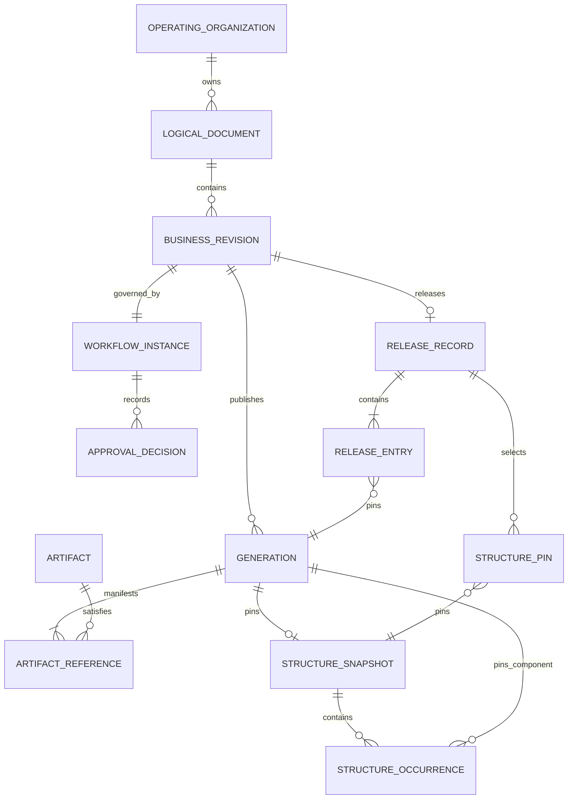
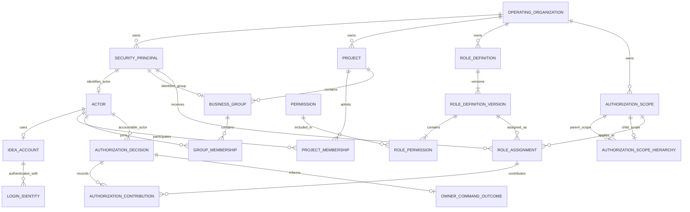
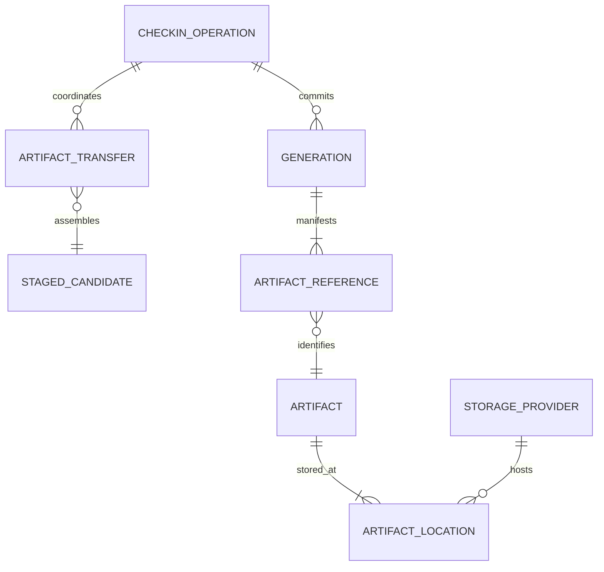
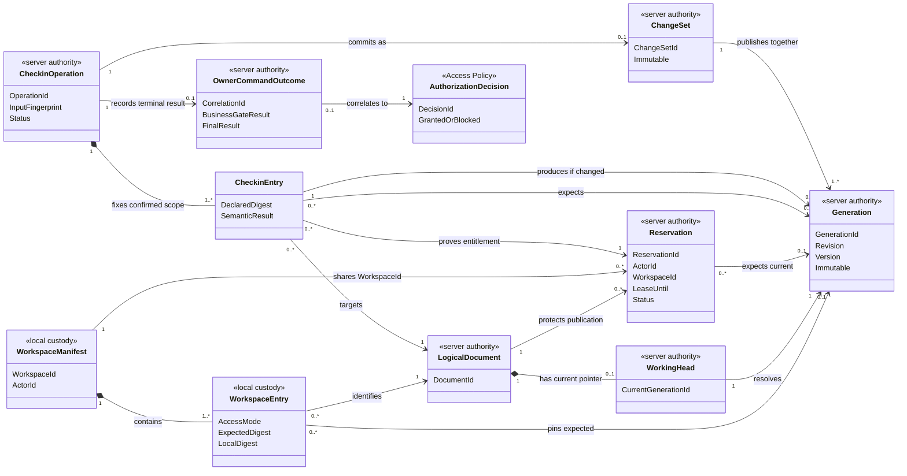

# IDEA Engineering Core v0 Data, Integration and Migration Specification

> **Instance state**: controlled `Draft 0.14`. Sections 1–7 define the information and exchange
> obligations needed by the proposed Spec. Protocol, database, storage product and deployment choices
> remain Tech decisions. This document does not authorize bulk migration.

## Control envelope

| Field | Recorded value |
|---|---|
| Stable Document ID | `IE-PROD-DATA-001` |
| Document Class | `DOC-06` |
| Title | IDEA Engineering Core v0 Data, Integration and Migration Specification |
| Owner | `Principal Product Author`; named data/integration owner is `BLOCKED` before `Proposed` |
| Document Status | `Draft` |
| Document Version | `0.14` |
| Applicable Baseline | `IDEA-C1-ANALYSIS-DESIGN-001`; `IE-SPEC-CORE-V0-001@0.13` |
| Effective Date | `NOT APPLICABLE` until approval |
| Authors / Reviewers | Principal Product Author (assistant prepares) / project user (internal document review); required data, security, migration and format specialists are not assigned |
| Approvers | Product Decision Authority for Spec/Tech as applicable; decisions `NOT-RUN` |
| Source Links | [DOC-03](DOC-03-business-requirements.md), [DOC-04](DOC-04-software-requirements-specification.md), [domain language](../../../../CONTEXT.md), [architecture input](../../../architecture/idea-product-lifecycle-architecture.md), [DDM/Aras workspace comparison](../../../research/2026-09-10-ddm-aras-checkout-reference-checkin-comparison.md) |
| Downstream Links | [DOC-05](DOC-05-architecture-description.md), [DOC-07](DOC-07-mvp-roadmap-and-delivery-plan.md), [DOC-08](DOC-08-ui-ux-and-interaction-specification.md), [VVP](registers/VVP-core-v0-verification-validation-plan.md), future CHG/VEV/REL |
| Evidence / Claim Status | Data contracts are `Draft`; migration, format and recovery evidence are `NOT-RUN` |
| Change History | 0.14: align Artifact Custody, server-established authorization context, immutable authorization decisions, atomic owner outcomes, policy-neutral Release Structure Pins, two-axis Reference conditions and Restricted Recovery Mode; [IE-CHG-ARCH-CORR-001](registers/CHG-2026-09-12-architecture-consistency-correction.md). 0.13: define Reservation status/lease evidence, modified-Reference recovery, resumable transfer records, provider-neutral Artifact locations and storage migration; make the product-owned Permission catalogue and request-time Scope evaluation explicit; add the cross-authority Workspace/Check-in data view; [IE-CHG-WS-SCALE-001](registers/CHG-2026-09-10-workspace-transfer-storage-decisions.md). 0.12: replace the former group/policy-grant model with Security Principal + Role Definition + Authorization Scope = Role Assignment. Earlier history remains in controlled change records. |
| Access Classification | `INTERNAL`; pilot/production-derived files require a separately approved company storage boundary |
| Retention Rule | Logical retention rules and blockers are specified; exact organizational periods and legal-hold policy are `UNKNOWN`, owner Product Decision Authority/Quality authority, trigger before PG4 |
| Content State | `COMPLETE CONTROLLED DRAFT` with explicit policy, environment and evidence gaps |

<!-- AUTHOR CONTENT START -->

## 1. Data scope and ownership

An authoritative owner may expose an interface but retains control of its state and invariants.
Workspace copies, indexes, previews and exported packages never become a second Product Definition
authority.

| Data concept / class | Business meaning | Authoritative owner | Custody / access | Classification / retention | Source link |
|---|---|---|---|---|---|
| Operating Organization | Scope containing identities, policy, configuration and Audit. | Identity and Accounts owns the stable organization identity; every Module owns only its organization-scoped records | Server authority; organization-scoped access only | Internal; retained while dependent controlled records exist | `REQ-GOV-001` |
| Actor / IDEA Account | Stable accountable person identity and its current account eligibility, independent of login name. | Identity and Accounts; product authorization remains owned by Access Policy | Server authority; account administration does not confer document access | Identity retained while Audit/ownership/decisions reference it; personal data minimized | `REQ-IAM-001/002/004/005/006` |
| Credential / session / recovery proof | Protected authentication material, session eligibility/version and expiring one-use recovery state. | Identity and Accounts | Server-side protected custody and scoped client-session proof only; no plaintext password retrieval | Security-sensitive; never in engineering manifests, exports or logs; retention/expiry policy pending security review | `REQ-IAM-003/004/007`; `REQ-SEC-001/002` |
| Login Identity | Native login and any later explicitly linked provider subject; not a document identity. | Identity and Accounts | Organization-scoped, explicitly verified mapping; provider integration deferred | Retain necessary link/provenance and Audit; no automatic email/name merge | `REQ-IAM-006` |
| Project / Project Membership | Governed Project identity and the attributable effective-period association that makes an eligible Actor a Project participant. Membership alone grants no product action. | Project Governance | Server authority; a Project Administrator acts only inside its assigned Project | Retain Project identity and membership history while documents, Groups, assignments, decisions or Audit refer to it | `REQ-AUTH-003/005/009`; `REQ-GOV-004` |
| Business Group / Group Membership | Governed Security Principal and direct association of a Project Member with that Group. Organizational Department is not a Group; Core v0 does not nest Groups. | Project Governance; Project Administration manages Project-scoped Groups and membership | Server authority; membership contributes only through an applicable Group Role Assignment; suspended accounts are ineligible | Retain Group identity and attributable membership history while an assignment, decision or Audit refers to it | `REQ-AUTH-005/006/009`; `REQ-IAM-005` |
| Permission | Stable action code implemented and owned by the IDEA product, such as a document, administration or Audit operation. It is not assigned directly to a person, and an administrator cannot invent an executable code through configuration. | Access Policy owns the catalogue; the Module that performs the action enforces the matching business gate | Authorized clients may read the supported catalogue and descriptions; Role Definitions may select only catalogue entries | A code referenced by a retained Role Definition version or decision is never reused with a different meaning | `REQ-AUTH-001/002` |
| Role Definition / Version | Named bundle selected only from product-supported Permissions. Built-in definitions are protected; each change to an active Custom Role creates an immutable successor version. Activating that successor does not retarget an existing Role Assignment. | Access Policy | Server authority; managed only through constrained role-administration commands; an assignment moves to a successor only through a separate previewed, authorized and audited replacement | Retain every version referenced by a Role Assignment or decision | `REQ-AUTH-001/002/009/010` |
| Authorization Scope | Identified Operating Organization, Project or governed-resource boundary within which a Role Assignment applies. Folder, department, Document Class and lifecycle state are not Scope levels. | Access Policy references stable identities owned by their Modules | At each request, the server evaluates the selected resource and its current parent Scope chain. A parent assignment applies downward only where the Role Definition and supported condition cover the request; no ACL is copied into every descendant document. | Retain Scope identity with assignments and decisions; moving a UI placement does not change Scope | `REQ-AUTH-001/003/004` |
| Role Assignment | Attributable connection of one Actor or Business Group principal to one Role Definition version at one Scope, with status, effective period, supported condition, reason and assigning Actor. | Access Policy | Server authority; Group assignment is normal, direct Actor assignment remains visible/audited; delegation limits are evaluated before write | Retain assignment history and exact version used by every material authorization decision | `REQ-AUTH-001/004…007/010` |
| Authorization Decision | Immutable, explainable point-in-time RBAC result for one server-established `ActorContext`, action, resource and expected state, including contributing memberships/assignments/role versions/Scope. It contains no owner business-gate result. | Access Policy records the RBAC result; the authoritative resource Module owns the separate final business outcome | Append-only evidence for material actions; explanation is filtered to the requester's information access | Retain with Audit and the affected command/decision according to policy | `REQ-AUTH-006…008`; `REQ-AUD-001/002` |
| Owner Command Outcome | The resource owner's attributable result for one protected command, including correlation to its Authorization Decision, owner business-gate result and final accepted/refused/committed disposition. | The authoritative resource Module that owns the affected business state | Retained atomically with its owner state, material Audit Evidence and transactional outbox; not an Access Policy record | Retain with the owner command/operation and applicable Audit policy | `REQ-GOV-002`; `REQ-AUTH-008`; `REQ-AUD-001/002` |
| Logical Document | Stable identity representing one controlled document through all Revisions/Generations. | Controlled Product Data | Server authority; read through controlled interface | Internal; not physically deleted while retained evidence refers to it | `REQ-ID-001` |
| Document Folder / Placement | Logical navigation hierarchy and the identified relationships that place or link a Logical Document within it; neither is a physical storage path. | Controlled Product Data | Server authority; Discovery may project the permitted tree | Folder/placement history is audited; deleting one placement never deletes the Logical Document or Artifact | `REQ-ID-007/008` |
| Source Copy Relationship | Provenance from a newly created Logical Document to the exact permitted source used by Create Copy/Save-As. | Controlled Product Data | Server authority; read according to source/new-document access | Retained with the new document and Audit; conveys no source Reservation, Approval or Release state | `REQ-ID-009` |
| Business Revision | Business change branch/coordinate and its lifecycle/workflow. | Controlled Product Data with Lifecycle Governance transition authority | Server authority | Retained with all linked Generations, decisions and releases | `REQ-ID-002`, `REQ-LC-009` |
| Generation Manifest | Immutable published Product Definition: revision/version coordinate, versioned metadata, `ArtifactReference` values, structure and provenance. | Controlled Product Data | Server metadata plus immutable Artifact custody | Retained according to release/reference/hold policy | `REQ-ID-002/004`, `REQ-WS-009` |
| Artifact Reference | A Controlled Product Data manifest reference to one exact `ArtifactId`/digest. It identifies required content but is neither a provider location nor byte custody. | Controlled Product Data | Stored with the Generation/Representation manifest; resolved only through Artifact Custody | Retained with the manifest; provider/path changes never rewrite it | `REQ-ID-003/004`; `REQ-OPS-006` |
| Artifact | Provider-neutral logical identity for immutable binary content identified by digest. Product identity and manifests never depend on a filesystem path, bucket name or storage vendor. | Artifact Custody | Bytes are accessed only through Artifact Custody and an active Artifact Location; owners retain only `ArtifactReference` values | Classification inherits the Logical Document/context; physical reclamation requires zero retained references | `REQ-FMT-001`; `REQ-OPS-003/006` |
| Artifact Location | Replaceable custody record that maps one Artifact digest to a storage provider, opaque provider key, verification state and migration status. It is not part of the document identity. | Artifact Custody | Server-only; clients receive operation-scoped transfer access, never a permanent path or provider credential | Old and new locations may coexist during verified migration; a location is retired only after reconciliation proves every retained reference is readable | `REQ-OPS-003/004/006`; `QRS-012` |
| Artifact Transfer | Resumable upload/download session for one immutable candidate or pinned Artifact, with `TransferId`, `OperationId`, expected size/digest, accepted byte ranges/chunks, per-chunk verification and terminal state. | Artifact Custody; Check-in Operation owns the publish decision | Private staging and short-lived operation-scoped authorization; not visible as a Generation | Interrupted sessions may resume safely; abandoned candidates follow governed expiry/reconciliation and never become public by themselves | `REQ-WS-012/015`; `REQ-OPS-001`; `QRS-011` |
| Structure Snapshot | Immutable exact Product Structure/occurrence/dependency baseline. | Product Structure | Server authority; projections/exports are read-only views | Retained with linked Generation/Release evidence | `REQ-STR-001/002` |
| BOM View Profile | Versioned purpose, included fields, filters, ordering and output rules for resolving a BOM from an exact Structure Snapshot. | Product Structure | Server authority; query clients select only authorized active/retained versions | Every version used by a BOM Representation or Release is retained | `REQ-STR-004/005` |
| BOM Representation | Non-authoritative Excel/PDF/CSV or other output from one exact Structure Snapshot and BOM View Profile, with output digest and producer provenance. | Product Structure owns source/profile relationship and status; Artifact Custody holds immutable output bytes | Generated/served through controlled interfaces; never writable as authoritative structure | Retained when referenced by Release/history; otherwise governed derivative retention; `Current` only for its exact source/profile | `REQ-STR-005`, `REQ-LC-008` |
| BOM Import Candidate | Non-authoritative proposed structure change with payload digest, exact base Structure Snapshot, mapping, validation result and visible add/change/remove difference. | Product Structure | Server-side candidate boundary; no query treats it as Product Structure before confirmed acceptance | Failed/abandoned candidate follows governed retention; accepted result links to the resulting snapshot/Generation | `REQ-STR-006` |
| Independent controlled parts-list relationship | Exact relationship from a parts-list Logical Document Generation to the Structure Snapshot it describes. | Product Structure owns the relation; Controlled Product Data owns the document/Generation | Both objects keep their own identity, lifecycle and access | Retained with either object's release/history; later changes do not rewrite the prior relation | `REQ-STR-005`, `REQ-LC-008` |
| Reservation | Temporary server-authoritative publish entitlement for one Logical Document, Actor, Workspace and expected Generation. | Controlled Product Data | Server authority; Workspace holds only its identity/status. At most one conflicting Reservation is `Active`. | Retain status transitions `Active`, `Ended`, `Expired` and `Recovered` plus attributable Audit. `Released` is never a Reservation status; exact lease, renewal and grace durations remain `UNKNOWN`; disconnect, sign-out or app exit does not end it immediately. | `REQ-WS-002/013` |
| Workspace Manifest | Local durable record of exact materialized Generations, digests, paths and Checkout/Reference modes. | Workspace implementation for local custody; server remains product authority | Protected per-user Workspace | Local operational data; cleanup/recovery policy pending Tech | `REQ-WS-001/003/004` |
| Check-in Operation / Change Set | Idempotent attempt and successful atomic publication scope. | Controlled Product Data | Server authority; a named use-case coordinator may orchestrate its declared cross-module operation but owns no product record | Operation/Audit retention tied to published or failed outcome | `REQ-WS-007/012` |
| Workflow Definition / Version / Role / Assignment | Versioned states, transitions, Workflow Roles, required RBAC eligibility, decision rule, required reason/evidence and notification intent; one active default version may be assigned per Document Class. | Lifecycle Governance; Product Configuration Administration prepares governed definitions | Server authority; activation and assignment require governed administration; Workflow Role eligibility neither creates a Role Assignment nor grants authority outside the step | Every version, role and assignment referenced by an instance/history is retained | `REQ-LC-001/003/005`; `REQ-AUTH-008`; `REQ-GOV-005` |
| Workflow Instance | One running process for a Business Revision, pinned to the exact selected Workflow Definition and Approval Policy versions. | Lifecycle Governance | Server authority | Retained with transitions, decisions and releases; later activation does not reinterpret it | `REQ-LC-001/002` |
| Approval Policy / Decision | Exact actor eligibility, required decision count/rule and attributable approval/rejection. | Lifecycle Governance | Server authority; read according to access policy | Retained with workflow/release evidence | `REQ-LC-003/004` |
| Release Record | Immutable evidence of the exact approved/released scope, including `0..* StructurePin` records selected/required by the applicable Release Policy. | Lifecycle Governance | Server authority; export is a rendition | Retained baseline; purge blocked while policy requires it | `REQ-LC-006/007` |
| Structure Pin | An exact relationship from one Release Record to one Structure Snapshot; it exists only when selected or required by the applicable Release Policy. | Lifecycle Governance owns the Release-side selection; Product Structure owns the referenced snapshot | Server authority; never resolves a floating latest structure | Retained with the Release Record; zero pins is permitted unless Release Policy requires otherwise | `REQ-LC-006…008`; `REQ-STR-001/002` |
| Controlled Release Package | Exportable exact package of manifest, metadata, structure, Artifacts, digests and provenance. | Release process; authority remains the Release Record | Authorized export boundary | Classification/retention follow the release scope | `REQ-LC-008` |
| Governed Policy Definition | Stable policy identity with editable Draft content and immutable activated versions for metadata, numbering, access, workflow, approval, retention, localization or format rules. | Applicable owner module | Server authority; only an authorized activation makes a version effective | Retain every version referenced by history | `REQ-GOV-002`…`REQ-GOV-005` |
| Policy Import Candidate / Activation | A form or serialized payload, optional JSON, plus schema version, base-policy pin, digest, validation/diff and attributable activation outcome for a supported governed definition. | Applicable policy owner; Identity only supplies eligible Actor context | Candidate is non-authoritative; Server validates and separately activates under current RBAC/bootstrap authority | Failed/abandoned candidates follow governed retention; every activated version and activation evidence is retained | `REQ-GOV-002/005`; `REQ-AUTH-002/010`; AC-01…05 |
| Departmental Deliverable | A governed CAD/PDF/software/instruction/checklist, Product Structure output, Release Record or other evidence supplied or received in an engineering handoff. This is a classification or relationship over the applicable existing record, not a parallel data authority. | The module that owns the underlying Logical Document, Product Structure, Release Record or evidence | Normal controlled interfaces and access policy; department responsibility is retained as attributable metadata/relationship | Inherits the underlying record's classification, version, retention and Release rules | `BR-029`; `REQ-GOV-003`; DH-01…04 |
| Operational Reference Data | Hours, cost estimates, purchasing/fabrication status, progress or completion values retained only to explain engineering context. | The named external system, department or accountable person/process remains authoritative; IDEA has no Core v0 transaction authority | Stored as versioned metadata or controlled document content and read through the owning document interface | Internal context; retained with the exact metadata definition/Generation that used it; never treated as an authoritative ERP/MRP, procurement, manufacturing or project record | `BR-029`; `REQ-GOV-003`; DH-02…04 |
| Representation | Preview or neutral derivative tied to one exact source Generation and source Artifact digest, with producing application/Adapter/tool versions and output digest. | Format Intelligence | Automatic application-assisted/standalone processing or attributable manual upload through one acceptance boundary; served through controlled interface | Non-authoritative; `Current` only for its pinned source, otherwise `Needs update`; may be regenerated, but history/provenance is retained | `REQ-FMT-005` |
| Audit Evidence | Append-only record explaining material command, decision, target, policy/source pins and result. | Audit Evidence | Server-controlled append; governed read/export | Retention period `UNKNOWN`; ordinary mutation/deletion prohibited | `REQ-AUD-001/002` |
| Discovery Projection | Rebuildable search/browse view derived from controlled state. | Discovery | Server-side projection; never write authority | Rebuildable; ranking/cache is not Product Definition | Basic discovery only in Core v0 |

### 1.1 Product baseline identity view

This conceptual data view shows the identities that make one released baseline reproducible. It does
not prescribe table names or an ORM mapping; the relationship and immutability rules in sections 2–3
remain authoritative.

**`DATA-VIEW-CORE-001` — Released-baseline identity (conceptual).** **Model profile:** UML-style ER
domain view; `Draft 0.14`; product, data and quality reviewers. **Question:** which exact identities
make an earlier Release reproducible? **Scope:** controlled-document/structure/release identity.
**Excludes:** table schema, storage paths and Workspace state. **Trace:** `REQ-ID-*`, `REQ-STR-*`,
`REQ-LC-006…009`, SR-01…06. **Legend:** crow's-foot marks logical cardinality; relationships name
the owner/pin direction; every released target is exact rather than floating.

The key rule is direction: a Release Record resolves exact Generations and `0..*` exact
`StructurePin` records. The applicable Release Policy decides which structure is required for a
particular scope; the model never infers that every Release has one Structure Snapshot, or that all
Releases lack structure. A retained pin never follows the later Working Head of a document.

### 1.2 Account, Project and RBAC boundary view

**`DATA-VIEW-AUTH-001` — Principal, Role Definition, Scope and Role Assignment (conceptual).**
**Model profile:** UML-style ER domain view; `Draft 0.14`; data and security reviewers. **Question:**
which records preserve account eligibility, Project/Group participation and effective product
authority without duplicating ownership? **Scope:** Organization-level identity and RBAC records.
**Excludes:** credential fields, UI and business-gate state. **Trace:** `REQ-IAM-*`,
`REQ-AUTH-001…010`, PA-01…04, RBAC-01…10. **Legend:** crow's-foot marks logical cardinality;
Actor and Business Group are mutually exclusive kinds of Security Principal.

Identity and Accounts writes Actor/account/Login Identity records only. Project Governance writes
Projects, Project Memberships, Business Groups and direct Group Memberships. Access Policy writes
Permissions, immutable Role Definition versions, Role Assignments and authorization decisions.
`SecurityPrincipal.PrincipalType` identifies exactly one kind: Actor or Business Group. A Role
Assignment therefore has one principal link, never two optional links that can be misread as both
being required. `AuthorizationScopeHierarchy` gives each non-root Scope at most one parent and lets a
parent have many children. `AuthorizationContribution` preserves the many-to-many evidence between
applicable Role Assignments and Authorization Decisions; a blocked decision may have no applicable
assignment. `ActorContext` is server/IAM-established runtime context from session proof, not a
client-provided row or trusted `ActorId`. At request time the product Module obtains only the
immutable RBAC result; it owns and persists its separate `OwnerCommandOutcome` after revalidating
lifecycle, Checkout, expected-Generation and completeness gates before committing. Organizational
Department remains descriptive data and never substitutes for a Business Group or Authorization
Scope.

### 1.3 Artifact transfer and storage identity view

**`DATA-VIEW-ART-001` — Immutable Artifact, resumable transfer and replaceable storage location.**
**Model profile:** UML-style ER domain view; `Draft 0.14`; data, operations and security reviewers.
**Question:** how can candidate transfer resume and storage move without changing immutable Artifact
identity? **Scope:** transfer, candidate, Generation manifest and provider-neutral locations.
**Excludes:** provider schema, chunk implementation and final Check-in gates. **Trace:**
`REQ-WS-012/015`, `REQ-OPS-001/003/004/006`, `VVP-017`, WS-08 and ST-01…04. **Legend:**
crow's-foot marks logical cardinality; a staged candidate remains private until a committed
Generation references its Artifact.

An upload remains a private staged candidate until the authoritative Check-in transaction publishes
the complete manifest. Artifact Custody verifies/deduplicates candidates and allocates or reuses
`ArtifactId`; Controlled Product Data subsequently records only an `ArtifactReference` in its
Generation manifest. `ArtifactId` and `ContentDigest` remain stable when bytes move between storage
providers; only verified Artifact Location records change. A client therefore resumes by
`TransferId`/accepted ranges and resolves bytes through the server, never by treating a filesystem
path or provider key as document identity.

### 1.4 Workspace and Check-in authority view

**`DATA-VIEW-WS-001` — Workspace evidence, Reservation and Check-in result (conceptual).**
**Model profile:** UML Class/domain view; `Draft 0.14`; data, architecture and verification
reviewers. **Question:** which local and server records prove access mode, expected head, publish
entitlement and one atomic result? **Scope:** one Managed Workspace and its Check-in Operations.
**Excludes:** ORM/table mapping, credentials, chunk fields and Artifact Location/provider details.
**Trace:** `REQ-ID-002…004`, `REQ-WS-001…015`, ADR C1-004/C1-005, `WS-01…08`. **Legend:**
composition diamonds mean the child belongs to that record's declared scope; cardinalities are
logical; stereotypes identify local custody versus server authority.

Long description and consistency rules:

1. `WorkspaceManifest` and `WorkspaceEntry` are protected local custody records. Their IDs, modes
   and digests are evidence supplied to commands, not server product authority.
2. `WorkingHead` is the only current pointer. A Reference or Checkout entry pins an exact expected
   Generation and never floats silently when that head advances.
3. `Reservation` is a separate server record. Matching Actor and `WorkspaceId` in a local manifest
   is necessary but not sufficient; Server/IAM establishes the ActorContext from session proof, then
   status, lease, expected head, permission and business gates are re-evaluated by the owner Module.
4. `CheckinOperation` fixes a complete input fingerprint and owns one or more `CheckinEntry` rows.
   A confirmed entry uses exactly one in-scope Reservation; a Reference entry is ineligible and
   therefore cannot appear as a publish entry.
5. A changed committed entry produces exactly one immutable Generation. A semantic No Change entry
   produces none. A `ChangeSet` exists only when at least one changed entry publishes and contains
   every Generation produced by that operation; the Operation still records No Change results and
   every successful in-scope Reservation disposition as `Ended`.
6. The owner records its `OwnerCommandOutcome` separately from the immutable Access Policy
   `AuthorizationDecision`. In a declared Check-in operation, owner state/outcome, Audit Evidence and
   transactional outbox commit together in one relational unit of work; a coordinator may orchestrate
   that declared operation but owns none of these records.
7. The relationships express logical ownership, not a claim that local and server records share a
    database or that external Artifact bytes participate in the relational transaction.

### 1.5 Reference-condition observation dimensions

`Reference` safety is observed on two independent axes, not one overloaded status:

| Axis | Values | Evidence rule | Consequence |
|---|---|---|---|
| `LocalIntegrity` | `Exact`, `Modified`, `Missing/Unreadable`, `Unknown` | Compare the materialized local bytes with the Workspace Manifest's pinned Artifact digest when readable. A missing scan, unreadable file or incomplete local evidence is not silently treated as Exact. | `Modified` has local candidate bytes but no publish entitlement; `Missing/Unreadable` and `Unknown` require safe recovery guidance rather than a destructive action. |
| `ServerFreshness` | `Current`, `OutOfDate`, `Unknown` | Only a server check of the pinned expected Generation against the current authoritative state may establish `Current` or `OutOfDate`. Cached UI data, a local timestamp or a client-supplied head is insufficient. | `OutOfDate` blocks conversion/publication; `Unknown` fails safe and cannot be presented as current. |

The client presents the pair (for example, `Modified × Current` or `Exact × Unknown`) and its
evidence status. Only `Modified × Current` can offer an explicit conversion request; it still needs a
new Reservation and commit-time revalidation. Any `Unknown` component, or `Missing/Unreadable`, keeps
the local candidate safe and blocks conversion/publication until a new authoritative observation is
available. This condition model does not grant a Reservation and does not authorize automatic
CAD/Office merge, overwrite or discard.

## 2. Identity, version and lifecycle

| Identity or lifecycle item | Stable identity rule | Version/Generation/Revision relationship | State transitions | Audit and recovery evidence |
|---|---|---|---|---|
| Logical Document | One `DocumentId` per Organization; never reused or derived from a path/name/number. | Owns all Business Revisions; points to at most one Working Head. | `Active → Trashed → Restored` or governed future Purge path; Trash/Purge are outside Core v0 UI. | Registration, disposition and recovery events identify actor/reason. |
| Document Folder / Placement | Stable `FolderId` and `PlacementId` per Organization; names and parent placement may change without becoming Artifact paths. | A placement targets one Logical Document by default; an exact historical link additionally pins one Revision/Generation. Move/link/unlink creates no document Version/Generation. | Active placement may move or be removed under policy; removal never disposes the target document. | Actor, source/destination, target identity, mode and outcome are audited. |
| Source Copy Relationship | New document and exact source identities are retained; it is not a shared physical-file identity. | Create Copy allocates a new `DocumentId`; first published content follows normal Revision A / Version 1 / Generation rules. | Relationship is append-only provenance; later changes to either document do not rewrite the other. | Actor, time, source pin and new identity are retained. |
| Initial document | Stable `DocumentId` may exist before content publication. | `Start` may have no Generation/Working Head. First publish creates Revision A / Version 1 under seeded policy. | `Start → In Work` only on complete first publish. | Failed first publish exposes no partial Generation; operation result retained. |
| Generation | Unique `GenerationId`; immutable after successful changed Check-in. | Belongs to exactly one Logical Document and Business Revision; Version within Revision starts at 1 and strictly increases for changed Check-ins. No Change creates neither a new Version nor a Generation. | No mutable lifecycle; becomes current Working Head by atomic Check-in. | Manifest pins Version, metadata schema, Artifact digests, structure and provenance. |
| Artifact | `ArtifactId` is provider-neutral; `ContentDigest` identifies immutable bytes. | One Generation may retain `ArtifactReference` values to multiple Artifacts; content may be physically deduplicated without merging document identity. | Artifact Custody verifies/deduplicates a private candidate before it can be referenced by validated owner commit; later provider migration changes no Generation. | Upload/validation/producer evidence, location history and digest read-check. |
| Artifact Location | Stable custody location-record identity points from one Artifact to one provider and opaque provider key. | It is not a Version, Generation or user-visible file identity. | Candidate → Verified → Retiring → Retired; at least one verified readable location must remain while the Artifact is retained. | Artifact Custody records copy verification, cutover, reconciliation and retirement evidence without exposing credentials. |
| Artifact Transfer | `TransferId` is unique and correlated to one `OperationId`, direction, expected Artifact/candidate and Actor/Workspace. | Chunks/ranges do not create document Versions; only a committed Check-in may publish a Generation. | Preparing → Transferring → Verified → Consumed, or Failed/Expired/NeedsReconciliation. | Artifact Custody retains accepted ranges, checksums, retry status and terminal result for safe resume without duplicate publication. |
| Business Revision | Stable `RevisionId` plus policy-controlled `RevisionCode`. | Contains ordered Generations and one authoritative Workflow Instance selected from the permitted Document-Class assignment. | Seeded path `Start → In Work → Under Review → Released`; Reject/Withdraw returns to In Work according to the pinned policy. | Every transition pins workflow/policy version and actor/result. |
| Reservation | Unique `ReservationId` bound to Document, Actor, Workspace, expected Generation and lease. | Does not create a Generation and does not propagate to parent/child. | `Active` may be renewed. Confirmed successful changed or No Change Check-in and governed Cancel produce `Ended`; lease timeout produces `Expired`; authorized takeover is recorded as `Recovered` before any new Reservation. `Released` is never a Reservation status. Disconnect/sign-out/app exit alone changes no status. | Every renewal, normal end, expiry and recovery is attributable; none bypasses expected-head validation or deletes/transfers local work. |
| Structure Snapshot | Unique immutable identity and semantic digest. | One published Generation may pin one required snapshot; members pin exact Generations. | New structure creates a new snapshot/Generation; old snapshot never changes. | Unresolved/manual/external links remain visible with disposition. |
| BOM View Profile | Stable profile identity plus immutable activated versions. | A BOM view resolves one exact profile version over one exact Structure Snapshot; it is not a document Version or Generation. | Activating a later profile affects later queries/exports only; retained outputs keep their pinned profile. | Activation and use are attributable; old outputs remain reproducible. |
| BOM Representation | Stable output identity with immutable bytes/digest and exact source/profile pins. | Many outputs/formats may derive from one snapshot/profile; none changes the source Generation. | `Current` for the pinned source/profile; comparison with a newer source/profile yields `Needs update`. | Producer, time, source/profile, format and output digest retained. |
| BOM Import Candidate | Stable candidate/operation identity bound to one expected base snapshot. | Accepted candidate creates one new Structure Snapshot and owning Generation under normal changed-content rules; a No Change result creates neither. | Prepared/Validated/Refused/Accepted/Abandoned; only Accepted can point to authoritative output. | Payload digest, mapping, diff, actor, confirmation and terminal result retained. |
| Review / Release baseline | Review pins exact Generation; Release pins exact Generations, approval/policy and `0..*` exact Structure Pins selected or required by the applicable Release Policy. | Later Working Heads do not alter a pending review or released baseline. | Content change invalidates pending review; Release is terminal for that Revision. | Approval Decisions, Release Record and every selected Structure Pin provide the evidence chain. |
| IDEA Account / Actor | Stable account and Actor references scoped to the Organization; rename/disable never reassigns historical references. | Not a document Generation or Business Revision; security state/version is independent. | Proposed account states: Invited, Active, Disabled; expired setup requires controlled reissue. No physical identity deletion while retained evidence refers to it. | Provisioning, activation, recovery, suspension and reactivation identify acting/target Actors and reason/outcome. |
| Account session | Unique session identity with validity/security-version context; token/cookie is proof, not stable Actor identity. | Revocation does not change a document Version/Generation. | Active → Expired/Revoked; reactivation requires fresh proof, not resurrection of an old session. | Record security outcome without credential; restore invalidates sessions and enters Restricted Recovery Mode. Only independently proved post-recovery changes may be reconciled before an explicit reopen decision. |

Semantic `No Change` compares Artifact digests, normalized versioned metadata and semantic Structure
Snapshot digest in the same Revision. Timestamps, local cache, preview and search fields are excluded
unless an approved policy explicitly makes a derived value part of Product Definition.

## 3. Relationships and integrity

| Relationship ID | Parent/child or reference rule | Cardinality / invariants | Conflict or orphan behavior | Verification |
|---|---|---|---|---|
| `DATA-REL-001` | Organization owns all controlled identities and policy/audit records. | Every authoritative record belongs to exactly one Organization. | Cross-Organization reference is rejected; no implicit global lookup. | Two-Organization isolation matrix |
| `DATA-REL-002` | Logical Document owns Business Revisions. | One-to-many; Revision Code unique within Document under its policy. | Deleting/renaming external files does not orphan the Logical Document. | Identity/lifecycle tests |
| `DATA-REL-003` | Business Revision owns ordered Generations. | Version within Revision is unique/strictly increasing and begins at 1; each changed Check-in maps one Version to one immutable Generation; no separate Version Sequence exists. | Missing manifest or Artifact prevents Check-in and Release. | Constraint and fault-injection tests |
| `DATA-REL-004` | Generation Manifest references Artifacts by exact identity/digest. | At least one primary Artifact where the format profile requires it; digest is immutable. | Missing/corrupt object is visible and blocks exact reproduction. | Manifest-to-object reconciliation |
| `DATA-REL-005` | Structure Snapshot contains nodes/occurrences/dependency edges pinned to exact Generations. | Stable occurrence identity; required graph must be resolvable and policy-valid. | Cycle, missing pin, unresolved required link or changed dependency blocks publish/release as specified. | Graph and release tests |
| `DATA-REL-006` | Reservation binds one Document, Actor, Workspace and expected Generation. | At most one active conflicting publish entitlement per Document under policy; no parent/child inheritance. | Wrong owner/workspace/head is rejected; local files remain. | Concurrency suite |
| `DATA-REL-007` | Check-in Change Set contains all Generations published by one successful confirmed operation. | One successful terminal operation maps to one Change Set; every changed member or none. | Any validation/conflict rejects the complete confirmed scope. | Atomicity/idempotency tests |
| `DATA-REL-008` | A versioned Document-Class assignment selects one active default Workflow Definition Version; each Workflow Instance belongs to one Business Revision and pins the selected definition and Approval Policy versions. | Multiple definitions may coexist; one authoritative active instance exists per Revision. A permitted explicit selection is recorded instead of replacing the default assignment. | Invalid definitions cannot activate; later definition/assignment activation does not reinterpret a running instance or retained history. Migration is a separate authorized operation. | WF-01/02/05 policy-version and assignment tests |
| `DATA-REL-009` | Approval Decision pins Workflow Instance, exact Generation/scope and Approval Policy Version. | Actor eligibility and quorum must be satisfied. | Content change invalidates pending scope; prior decisions remain evidence, not approval of new content. | Workflow/approval tests |
| `DATA-REL-010` | Release Record pins exact Generations, decisions, exceptions and policy versions, plus `0..*` `StructurePin` records. | The applicable Release Policy decides which Structure Pins are required for the exact scope; every selected pin references one exact Structure Snapshot and no record resolves dynamic latest. | Missing/stale/incomplete/unauthorized required member or required pin rejects the full release. | Release/reproduction tests |
| `DATA-REL-011` | Representation pins source Generation, source Artifact digest, Format Capability Profile and producing application/Adapter/tool versions; manual upload also records attributable uploader and declared producer. | Many derivatives per Generation are allowed; none is authoritative. `Current` is evaluated against the selected source Generation, never a floating latest reference. | Source/profile advance changes the older result to `Needs update`; conversion or validation failure preserves the source and authoritative product state. | CR-01…05 derivative provenance/staleness/policy tests |
| `DATA-REL-012` | Audit Evidence correlates actor, command/decision, operation, target and source/policy pins. | Append-only; material outcome must have evidence. | Missing evidence fails applicable verification/gate; no ordinary edit/delete. | Evidence-ledger reconciliation |
| `DATA-REL-013` | Organization owns stable Actors, IDEA Accounts and Login Identities; product ownership, decisions and Audit refer to stable Actor identity. | One account resolves one accountable Actor. Usernames, departments and role labels are not referential keys or implicit product access. | Rename/disable retains history; a suspended account is ineligible; stale, cross-scope or unauthorized account changes fail without partial update. Account Administration cannot create Project or product access. | REQ-IAM-002/005/006; REQ-AUTH-009; VVP-015 |
| `DATA-REL-014` | Credential, session and setup/reset state belongs to one account/Organization. | Setup/reset proof is single-use, expiring and target-bound; sessions identify current eligibility/security version. | Invalid/replayed proof and revoked/ineligible sessions fail closed; revocation and authoritative command races require serialization/revalidation. | REQ-IAM-001/003/004/007; VVP-011/015 |
| `DATA-REL-015` | A Login Identity maps explicitly to one IDEA Account within the Organization. | Native login initially; any later provider/subject association must be unique in the approved scope and verified. No email-based auto-link. | Ambiguous/reassigned provider subjects require controlled resolution, never silent Actor merge or privilege assignment. | REQ-IAM-006; future provider integration remains deferred |
| `DATA-REL-016` | Organization owns Projects; each Project Membership connects one Actor to one Project for an effective period. | Membership makes the Actor eligible to participate in that Project but grants no product Permission. | Inactive, expired, cross-Project or unauthorized membership is ignored/refused without rewriting history or membership in another Project. | REQ-AUTH-003/005/009; PA-01…04 |
| `DATA-REL-017` | Organization owns a Document Folder hierarchy; Document Placement relates a Logical Document to a folder/divider independently of Artifact and Workspace paths. | A document has one governed primary placement and may have additional explicit links; all identities share one Organization. An exact historical link also pins Revision/Generation. | Move/link/unlink failure leaves the prior hierarchy and placements unchanged; removing the final placement does not delete or orphan the Logical Document. | IF-01…03 placement/identity tests |
| `DATA-REL-018` | A navigation alias belongs to a Placement; a controlled document name/title belongs to versioned Product Definition metadata. | Alias Rename changes no Generation; controlled Rename uses Check-in and creates a Generation while retaining `DocumentId`. | Ambiguous or unauthorized Rename is refused without changing either name; both accepted paths are auditable. | IF-04/05 Rename tests |
| `DATA-REL-019` | A Source Copy Relationship points from a new Logical Document to the exact source document/Revision/Generation used for Create Copy. | One new `DocumentId` is allocated per successful operation; source bytes may be physically deduplicated without sharing logical identity, workflow or authority. | Failure exposes no partial new document; source remains unchanged; no Reservation, Approval or Released state is inherited. | IF-06 copy/provenance tests |
| `DATA-REL-020` | A BOM query combines one exact Structure Snapshot with one exact BOM View Profile version. | Every row retains a stable occurrence and exact component Generation; quantity/position and profile-defined fields are deterministic for those pins. | Missing/unresolved/unauthorized source data is visible or refuses the query/export according to policy; no fallback to floating latest. | BM-01 query/profile tests |
| `DATA-REL-021` | A BOM Representation pins the exact Structure Snapshot, BOM View Profile, producer/format and immutable output Artifact digest. | Many representations may exist; none is Product Structure authority. `Current` is evaluated against the selected source/profile. | Source/profile advance preserves prior output and yields `Needs update`; mismatch or failed generation cannot change authoritative structure. | BM-02/03 export and staleness tests |
| `DATA-REL-022` | A BOM Import Candidate pins its payload digest, exact base Structure Snapshot, proposed mapping and difference set; acceptance links to the resulting snapshot/Generation. | Candidate is non-authoritative; one successful confirmation maps to at most one atomic result. | Malformed, unresolved, unauthorized, stale-base or faulted import leaves the base structure unchanged and exposes no partial result. | BM-04/05 import tests |
| `DATA-REL-023` | An independently controlled parts-list Generation relates explicitly to the exact Structure Snapshot it describes and declares its governed role. | The document and structure retain separate identities/lifecycles; Release pins exact versions of both when policy requires the list. | Later change to either side does not rewrite history; mismatch is visible and cannot silently substitute a current file or snapshot. | BM-06 release/reproduction test |
| `DATA-REL-024` | A Departmental Deliverable uses the normal owning record and may carry versioned Operational Reference Data or a link to its named source authority. | Department, value or label alone creates no additional business authority. Changing controlled content follows normal Version/Generation rules; changing an external source does not silently rewrite retained IDEA history. | Store/update/import cannot by itself calculate time/cost, create a purchase or fabrication transaction, mark product/project completion, or advance Workflow/Release. Any future authoritative exchange requires a separately approved Feature and named integration contract. | DH-01…04 handoff and authority-boundary tests |
| `DATA-REL-025` | A Project owns its Business Groups; each Group Membership connects one active Project Member directly to one Group. | Core v0 has no Group-to-Group membership. Membership alone grants no action and never carries to a similarly named Group in another Project. | Unknown member/Group, nesting, stale version, inactive Project Membership or cross-Project command is refused atomically. | REQ-AUTH-005/006/009; PA-02…04 |
| `DATA-REL-026` | A Role Definition owns immutable versions; each version contains supported Permissions. | Built-in definitions are protected. Editing an active Custom Role creates one successor version available to new assignments; Permission codes are not assigned directly to principals or reused with changed meaning. | Invalid/unknown Permission, stale base or attempted built-in mutation is refused. Activation does not retarget existing assignments; each intended move to the successor is a separate governed replacement, and prior assignments/decisions retain their pinned version. | REQ-AUTH-001/002/009/010; RBAC-01…03 |
| `DATA-REL-027` | A Role Assignment connects exactly one Actor or Business Group principal, one Role Definition version and one Authorization Scope, plus status, effective period, supported condition, reason and assigning Actor. | Scope hierarchy is Organization → Project → governed resource. A parent assignment applies downward only where the role/condition covers the request. Direct Actor and Group assignments add positive grants; no grant means blocked. | Unsupported condition, invalid principal class, expired period, cross-scope delegation, self-broadening or removal of the last effective Super recovery path is refused atomically. | REQ-AUTH-003…006/009/010; RBAC-02…08 |
| `DATA-REL-028` | An immutable Authorization Decision identifies server-established ActorContext, action, resource/expected state, evaluated membership and assignments, immutable Role Definition versions, Scope resolution and RBAC result. | A granted RBAC result expresses eligibility only; it contains no business-gate or final owner result. | Evaluation failure or no grant fails closed. Explanation is safe for the requester's access; decision evidence cannot be used to retroactively reinterpret a prior outcome. | REQ-AUTH-006…008; REQ-AUD-001/002; RBAC-06/09/10 |
| `DATA-REL-029` | A Policy Import Candidate identifies Organization, policy kind, schema version, exact base definition/version, payload digest and proposing Actor; activation identifies the authorized Actor and immutable result. | Candidate data, including JSON, has no authority and cannot grant its own adoption permission. | Malformed, unresolved, stale-base, unauthorized or self-authorizing candidate fails atomically; active definitions, assignments, memberships and retained decisions remain unchanged. | REQ-GOV-002/005; REQ-AUTH-002/010; AC-01…05 |
| `DATA-REL-030` | Artifact Custody owns one or more Artifact Locations behind its controlled storage interface. | Product manifests pin Artifact identity/digest through `ArtifactReference`, never provider/path. At least one verified readable location exists for every retained Artifact; migration may temporarily keep multiple locations. | A copy/digest/reconciliation failure leaves the prior verified location active. No migration step changes a Generation, Version or Release Record. | `REQ-OPS-003/004/006`; `QRS-012`; storage-evolution tests |
| `DATA-REL-032` | Authorization evaluates the requested resource's current Organization → Project → governed-resource Scope chain against current Role Assignments. | Permission catalogue entries are product-owned; applicable parent grants are resolved at request time and combined additively. No per-document ACL copy is required for inherited access. | Moving/adding a folder placement grants nothing; stale or unavailable Scope/assignment evidence fails closed without rewriting descendant records. | `REQ-AUTH-002…006`; RBAC-04/09/10 |
| `DATA-REL-033` | An owner Command Outcome correlates one Authorization Decision to the resource owner's business-gate and final result. | The record belongs to the authoritative resource owner; it is not mutable Access Policy state or a generic cross-module transaction table. | Commit-time authorization or owner-state revalidation failure produces a refused outcome and no authoritative business-state change. | `REQ-GOV-002`; `REQ-AUTH-008`; `REQ-AUD-001/002`; RBAC-10 |

## 4. Exchange and integration semantics

These are semantic interfaces. Protocol and concrete adapter selection belong to DOC-05/Tech.

| Boundary / interface | Source owner | Destination owner | Exchange meaning and version | Failure, retry and idempotency rule | Security / audit |
|---|---|---|---|---|---|
| Product command/query | Web/Desktop client | Owning server module | The client supplies session proof and declared command data; Server/IAM establishes the `ActorContext` before the owner evaluates identity, workspace, Check-in, workflow, policy or Release. A client-supplied `ActorId` is never trusted. Clients never write owner storage directly. | Commands carry correlation/idempotency where material; validation errors are typed and safe to retry only as declared. | Server-established Actor/Organization context; resource-owner authorization and Audit. |
| Account/session operations | Authorized Account Administrator or signing-in user | Identity and Accounts | Provision/activate, sign-in/out, change/reset password, suspend/revoke and resolve eligibility. | Typed bounded errors, no username enumeration through unauthenticated recovery responses; expired/reused proof refused; repeated admin actions do not create duplicate account identity. | No open signup; protected transport, Audit without secrets; current eligibility checked at protected requests and owner commit. |
| Project and Group administration | Authorized Project Administrator | Project Governance | Create/update Project-scoped Groups, add/remove Project Members and manage direct Group Membership within the administrator's assigned Project. | Expected-version and Scope checks make retry safe; unknown Actor/Group, inactive Project Member, nested Group, stale version, cross-Project or unauthorized command changes no membership. | Server-only authority; actor, target, Project Scope and before/after outcome audited. Cannot create accounts or imply a product Permission. |
| Role Definition administration/import | Authorized Privileged Role Administrator | Access Policy | Form data or versioned serialized candidate, optionally JSON, selects supported Permissions and becomes a validated preview/diff; activation creates an immutable Custom Role Definition version. | Candidate upload/retry is idempotent and non-authoritative. Built-in mutation, schema/reference/base-version failure or lost authority changes no active Role Definition or assignment. | Delegated role/Scope/self-management checks; actor, role version, permission difference, digest and outcome audited; Super Administrator remains separately protected. |
| Role Assignment administration | Authorized Privileged Role Administrator or Project Administrator within its constrained delegation | Access Policy | Connect one Actor or Group, one approved Role Definition version and one Scope; optional effective period and supported condition are explicit. | Unknown principal/role/Scope, expired/invalid period, unsupported condition, cross-scope delegation, self-escalation or last-Super-path removal changes no assignment. | Direct Actor assignment is visibly identified; reason, assigning Actor, limits, expected version and terminal outcome audited. |
| Effective-access evaluation | Authoritative product Module | Access Policy, which resolves Identity and Accounts plus Project Governance evidence itself | Owner requests authorization with server-established `ActorContext`, Permission, `ResourceId`, Scope and expected state. Access Policy resolves current IAM eligibility, Project/Group membership, Role Assignments, immutable Role Definition versions and Scope hierarchy, then returns one immutable `AuthorizationDecision`. It never returns the owner's business-gate or final command outcome. | Missing or unavailable eligibility evidence fails closed. The owner applies its own gates and requests commit-time revalidation before commit. | Correlation identifies contributing assignment/version IDs, the immutable decision and the separate owner outcome without leaking unauthorized data. |
| Workflow administration | Authorized Product Configuration Administrator | Lifecycle Governance | Versioned Workflow/Approval candidate defines states, transitions, Workflow Roles and required RBAC eligibility; activation and default Document-Class assignment are separate governed commands. | Missing role/transition/eligibility, stale base or unauthorized activation changes no definition or running instance; running history keeps its pinned version. | Actor, candidate/version, eligibility references, assignment and outcome audited; interface cannot create accounts, Groups, memberships or Role Assignments. |
| Future company login | Future verified external provider | Identity and Accounts | Explicit stable Actor/account linking, not direct adoption of provider permissions. | Integration protocol and recovery/fallback policy require a separate approved scope; no unimplemented SSO promise. | Deferred; no company-system access in this increment. |
| Workspace materialization | Artifact Custody server | Per-user Workspace | Artifact storage serves bytes only to Artifact Custody; the server streams the exact pinned Artifact/digest onward to the Workspace under one `TransferId`. The Workspace never receives a provider URI/credential or a direct Store path. | Interrupted multi-GB transfer resumes only missing ranges/chunks. Digest mismatch remains not ready; retry cannot silently substitute another Artifact. | Short-lived object/operation-scoped authorization; protected local custody; no provider path or credential is exposed. |
| Modified Reference conversion | Workspace | Controlled Product Data / Artifact Custody | A locally changed Reference remains non-authoritative. The UI records `LocalIntegrity × ServerFreshness`; only `Modified × Current` may request explicit Checkout conversion, and the server must grant a new Reservation. | `OutOfDate`, `Unknown`, `Missing/Unreadable` or another actor's Reservation refuses conversion/publication and preserves local bytes. The user may keep a safe copy, obtain current bytes separately, create a new Logical Document or explicitly discard; no automatic CAD/Office merge or overwrite. | Server-established Actor, Workspace, source Generation, two-axis condition, local digest, chosen path and result are attributable; `REQ-WS-014`. |
| Check-in staging | Workspace | Artifact Custody / private staging | One `CheckinOperationId` declares the confirmed document scope, expected Generations, Reservations, manifests, sizes and digests; Artifact Custody receives resumable checked chunks into a private candidate. | Repeating an accepted chunk/range is idempotent. Changed inputs cannot reuse the operation. Failed or incomplete candidates remain private and are expired/reconciled under policy. | No permanent storage credential; accepted ranges/checksums and every terminal custody-transfer outcome are auditable. |
| Check-in commit/status | Declared Check-in use-case coordinator | Named Controlled Product Data owner, Artifact Custody, Audit/outbox and Reservation records | The coordinator opens one shared relational unit of work and invokes only its declared owners; it owns no generic CRUD or product record. After Artifact Custody has privately verified candidates, Controlled Product Data publishes the full logical Change Set, advances intended Working Heads, persists its `OwnerCommandOutcome` and marks every confirmed in-scope Reservation `Ended`; Audit evidence and transactional outbox commit atomically with that authoritative outcome. `No Change` publishes no Generation but still marks its in-scope Reservation `Ended`. | Before-commit failure publishes none and ends none. The same `CheckinOperationId` returns the committed result, resumes safe missing work or reports an input conflict; an uncertain client response is resolved by status query before retry. | Server/IAM-established ActorContext, authorization decision, owner/Workspace/current Generation and business gates are revalidated at commit. Audit distinguishes committed, failed and `NeedsReconciliation`; local work is never deleted by server failure. |
| Format analysis / Representation | Controlled Product Data | Isolated Format Intelligence Adapter or attributable manual-upload boundary | Immutable source Generation/Artifact digest plus exact Format Capability Profile. Result includes execution mode, application/Adapter/tool versions, output digest and declared semantic output. | Retry by job identity; mismatched output is rejected; source advance yields `Needs update`; timeout/failure cannot change source/product state. | Least-privilege one-job scope and bounded resources; release response comes from the versioned Release Policy. |
| BOM query/export | Web/Desktop or Release process | Product Structure / controlled Artifact custody | Exact Structure Snapshot plus BOM View Profile returns a governed view or a BOM Representation pinned to both inputs and its output digest. | Query/export may retry by operation identity; no request follows floating latest where an exact result is required; failed output changes no structure. | Owner authorization; source/profile/output/actor/result recorded; `REQ-STR-004/005`. |
| BOM import | Authorized Web/Desktop administration/work surface | Product Structure | Payload and exact base snapshot create a non-authoritative candidate and validation/difference preview; separate confirmation may create one new snapshot/Generation. | Invalid/stale/unauthorized/faulted candidate is refused atomically; retry cannot create a duplicate result. | Server-only authority; candidate digest, base, mapping, actor, confirmation and outcome audited; `REQ-STR-006`. |
| Departmental engineering handoff | Departmental contributor or governed source | Controlled Product Data / Product Structure / Lifecycle evidence owner | Applicable files, structure outputs and evidence use the existing controlled interfaces. Optional hours, cost, purchasing, fabrication, progress or completion values are retained only as versioned Operational Reference Data. | Retry follows the owning document/import operation. A stored value or deliverable never implies an external business transaction, completion or lifecycle transition. | Actor, source, metadata-definition/Generation pins and result are auditable; future write integration requires a separate approved contract. |
| Review/Release notification | Committed owner outcome | User notification projection | Post-commit information that a workflow/release event occurred. | Replay from committed event; notification failure never changes authoritative outcome. | Recipient authorization; no secret/restricted payload beyond policy. |
| Discovery projection | Authoritative committed events | Discovery | Rebuildable item/state/metadata view for basic find/browse. | Replay/rebuild repairs drift; projection is eventually updated and cannot accept domain commands. | Query filters enforce organization/access policy. |
| Controlled export | Release Record | Authorized internal consumer | Exact read-only Release Package and manifest for one released baseline. | Export may retry; digest/manifest mismatch fails and cannot alter source. | Authorized, audited, classification/retention carried with package. |
| External enterprise integration | Future consumer | Future owned contract | `NOT APPLICABLE` to Core v0 beyond read-only controlled export. | No contract or retry rule is invented. | Requires separate Spec/Tech decision. |

## 5. Migration and reconciliation

### 5.1 Core v0 onboarding mapping

Core v0 supports `New`, `Store Existing` and a versioned Canonical Demo Dataset loader. Bulk legacy
migration, cutover and historical equivalence remain a separate assessment.

| Source identity/field | Target identity/field | Transform / loss rule | Evidence and owner | Disposition |
|---|---|---|---|---|
| Existing path and file name | Candidate display name/source provenance | Normalize only for validation/display; never use as `DocumentId`, Document Folder identity or authoritative Artifact location. Preserve original source reference where permitted. | Store Existing preview; Principal Product Author | `IN SCOPE` |
| File bytes | Artifact plus `ContentDigest` | Preserve bytes exactly; compute digest; physical dedup may reuse bytes but never merge Logical Documents. | Digest comparison | `IN SCOPE` |
| User-supplied metadata | Versioned metadata values | Validate against selected schema; invalid values block registration/publish with field-level feedback. | Mapping/validation report | `IN SCOPE` |
| Departmental spreadsheets, instructions, checklists or status sheets | Controlled Logical Document/Generation plus mapped versioned metadata and declared source authority where applicable | Preserve the file and provenance. Hours, cost, purchasing/fabrication, progress or completion values remain Operational Reference Data; unresolved ownership or meaning is marked `UNKNOWN`, never promoted to an operational transaction or completion state. | Mapping decision and handoff evidence; departmental owner/authority may remain `UNKNOWN` | `IN SCOPE` as governed engineering context; authoritative operational migration `EXCLUDE` |
| Existing business number | Business Number candidate | Validate uniqueness/scope; conflict requires new value or explicit governed reconciliation. | Numbering-policy result | `IN SCOPE` |
| Existing Revision/Version label | Candidate Revision provenance | Do not assert equivalence automatically; Core v0 default starts at governed initial Revision unless an approved mapping exists. | Mapping decision; exact legacy rules `UNKNOWN` | `BLOCKED` for historical migration |
| File-system time/owner | Provenance only | May be retained as untrusted source metadata; never treated as approval, publication time or authoritative actor evidence. | Import report | `IN SCOPE` with limitation |
| Discovered file dependency | Proposed Product Structure relation | Mark as parser/manual/unresolved with exact source evidence; user confirms before publish. | Capability Profile/result | `IN SCOPE` for bounded profile |
| Existing Excel/CSV BOM or parts list proposed as structure | BOM Import Candidate against an exact base Structure Snapshot | Map fields and references; validate and show add/change/remove differences. The uploaded file is never authoritative merely because it is stored. | Candidate/diff/confirmation record; Product Structure reviewer | `IN SCOPE` for bounded, confirmed import; bulk migration remains excluded |
| Existing PDF/Excel parts list retained as a controlled document | Logical Document Generation plus exact Structure Snapshot relationship, or BOM Representation when generated by IDEA | Preserve bytes and provenance; user must choose and validate the intended role. Do not silently infer that the file is authoritative Product Structure. | Mapping decision and exact relation/output manifest | `IN SCOPE` for explicit mapping; historical equivalence `BLOCKED` |
| Existing approval/status text | No automatic Approval Decision/Release | Historical text is not promoted without attributable, exact-baseline evidence and approved mapping. | Migration authority `UNKNOWN` | `EXCLUDE` from Core v0 trust mapping |

### 5.2 Reconciliation and rollback

| Migration step | Precondition | Reconciliation check / threshold | Failure handling | Rollback or recovery evidence |
|---|---|---|---|---|
| Inspect candidate | Authorized file and selected class/schema | Readability, extension/profile, size policy, digest and duplicate candidates reported. | No controlled record committed; source unchanged. | Inspection result/Audit |
| Preview mapping | User supplies required metadata/number/relations. | Every required field and relation has value or visible unresolved disposition. | Return field/relation errors; retain input for correction. | Mapping report |
| Stage content | User confirms Store Existing. | Resumable transfer records accepted ranges/chunks; completed staged bytes are readable and the digest equals the candidate. | Preserve verified progress for safe retry or expire/reconcile the private candidate under policy; no public Generation. | Operation, transfer and staging reconciliation |
| Commit registration/first publish | Server-established ActorContext, authorization/policy/owner validation pass and Artifact Custody has verified candidate file bytes privately. | The shared relational unit of work makes Logical Document, Revision A/Version 1, `ArtifactReference` manifest, owner Command Outcome, Audit Evidence and outbox agree exactly; it does not atomically write external bytes. | Roll back database publication; unused bytes remain private for safe reconciliation, never an empty/partial public Generation. | Transaction/manifest and crash-recovery evidence |
| Post-commit reconcile | Committed identity returned. | Query resolves exact manifest and Artifact digest; projections may catch up separately. | Flag repair incident; authoritative record remains source. | Reconciliation result |
| Cancel/retry | Before commit or after known terminal outcome. | Same OperationId cannot produce a duplicate. | Cancel private work where safe; retry returns/resumes same outcome. | Idempotency evidence |

No source file is modified or deleted by Store Existing. A future bulk migration must add source
system inventory, field/history mapping, dry run, exception ownership, volume/performance evidence,
cutover, rollback and reconciliation thresholds before authorization.

### 5.3 Account bootstrap and future login migration

Provision the first named account administrator once through a controlled setup; preserve the
separate Bootstrap Custodian and Access Policy adoption authority. Setup cannot remain a public
reusable privilege-creation path. Protect the last effective administrative recovery path through
an authorized replacement or governed recovery arrangement (REQ-IAM-007). During development one
person may hold all bootstrap permissions, but the stored permissions, interfaces and Audit remain
separate so production duties can be assigned to different people without redesign.

Native-account initialization is new product setup, not an import of the company's existing
account database. Future provider linking needs explicit identity-matching decisions, ambiguity
handling, pre/post Actor/permission reconciliation, rollback and user/session recovery. Do not copy
company credentials, merge by email or create an empty provider integration in Core v0.

### 5.4 Storage-provider evolution and migration

Changing from an initial filesystem-backed provider to object storage or another approved provider
must not change a Logical Document, Revision, Version, Generation, Artifact identity or Release
Record. Migration runs behind the Artifact Custody controlled storage interface and uses the following
controlled sequence:

1. register the target provider and keep it unavailable for ordinary resolution;
2. copy retained Artifacts by digest, using resumable transfer where needed;
3. verify size/digest and create `Verified` Artifact Location records;
4. reconcile every retained manifest, hold, Release and backup/recovery-set reference;
5. enable reads from the target under a recorded cutover while retaining the source location;
6. retire the source location only after the approved observation/rollback window and a second
   reconciliation pass.

A failed copy, verification or cutover leaves the prior verified location active. No database or
serialized provider/path field may be exposed as a document identity. Exact provider, topology,
capacity thresholds and migration schedule remain Tech/operations decisions; the invariant above is
the product/data contract required by `REQ-OPS-006` and `QRS-012`.

## 6. Format capability boundary

| Profile | Format/scope | Identity/digest control | Semantic/structure capability | Limitations / status |
|---|---|---|---|---|
| Generic Controlled-File Baseline | Configurable allowlist; proposed initial environment includes Office documents, PDF and IRONCAD files, exact extensions/versions pending. | Stable document/Artifact identity, immutable Generation, digest, metadata, Checkout/Reference, Check-in, Audit, release/export and recovery. | No extraction assumed; open via OS association where configured. | `Draft`; exact allowlist, sizes and application versions `BLOCKED` pending environment inventory. |
| IRONCAD deep profile | First deep CAD profile for exact IRONCAD application/Adapter/tool version. | Generic controls plus exact source Generation/Artifact digest and producer/output provenance. | Candidate: dependency/structure/property extraction and PDF/neutral Representation through a qualified application-assisted or standalone path; manual upload remains available when automatic conversion is not qualified. | `Draft`; exact versions, export interface, licensing, execution host, headless capability and round-trip evidence `BLOCKED`. |
| Office support profile | Word/Excel and related Office files in configured environment. | Generic controls. | Preview/property/dependency behavior is `None/Manual/Parser` per future profile; no semantic claim from extension alone. | `Draft`; exact application versions and capabilities `UNKNOWN`. |
| PDF support profile | Controlled source or representation according to document class/policy. | Generic controls plus source-Generation pin when derivative. | Text/preview/signature behavior not assumed. | `Draft`; signing/validation requirements `UNKNOWN`. |

Every profile declares Generic vaulting, OS-open support, hash/change detection, dependency/property/
structure extraction, preview, neutral representation and measured round-trip fidelity. Each deeper
capability also declares `None`, `Manual`, `Application-assisted`, `Parser` or `Standalone converter`,
plus prerequisites and exact producer versions. Unsupported or untested capability is explicit;
processing failure preserves the original Artifact. A Release Policy separately declares whether a
missing, failed or `Needs update` Representation blocks Release or produces a warning.

## 7. Security, privacy, retention and operational obligations

| Obligation | Data/surface | Control or evidence | Owner | Status |
|---|---|---|---|---|
| Least privilege / isolation | Account, Project/Group and Role administration; product commands, transfer, Workspace, worker and export | Product-owned Permission catalogue, Principal–Role–Scope assignments evaluated at request time, constrained delegation, owner-enforced business gates, short-lived transfer, per-user local protection and one-job worker scope | Security authority `UNKNOWN` | Requirements Draft; RBAC procedures and review `NOT-RUN` |
| Personal information minimization | Actor names/IDs and Audit | Retain only accountable identity and permitted context; no secrets or unnecessary personal data in logs/evidence | Security/Quality authority `UNKNOWN` | Policy `UNKNOWN` before PG3 |
| Classification propagation | Logical Document, Artifact, Representation, export | Derived/packaged data carries source classification and access constraint; downgrade requires explicit authority | Data/Security owner `UNKNOWN` | Draft obligation |
| Retention / legal hold | Generation, Release, structure, decision, Audit and Artifact | Retained references/holds block physical deletion; exact periods and cryptographic erasure process pending | Product Decision Authority/Quality | `BLOCKED` before Purge/rollout |
| Audit integrity | All material outcomes | Append-only logical evidence and controlled export; no ordinary mutation/deletion | Audit Evidence owner | Draft obligation |
| Backup / restore | Metadata, Artifacts, structure, policies/configuration, account/security state and required cryptographic material | One coordinated recovery point, manifests and digest reconciliation; invalidate restored sessions and enter Restricted Recovery Mode. Post-recovery-point account/access changes are not automatically reconciled: only independently proved changes may be reconciled through a named governed process before an explicit reopen decision. | User may operate initially; long-term authority `UNKNOWN` | Four-working-hour RTO / one-hour RPO are preliminary objectives only; environment/drill `NOT-RUN` |
| Incident / reconciliation | Missing/corrupt objects, expired staging, interrupted transfer, location-migration mismatch, projection drift, expired/stuck Reservation | Detect, classify, preserve evidence, repair/recover through authorized operation; never expose a private candidate or silently transfer local work | Operations authority `UNKNOWN` | Detailed runbook deferred to OPS/Tech |

Recovery-set identity must name the database point and matching Artifact/configuration/key set.
Database backup/WAL alone does not contain external file bytes. A newer database point with missing
Artifacts is not usable recovery; the latest complete coordinated set determines the recovery point.
Exact source scope, working-hour clock, retention, protected backup destination and allowed loss need
qualification against TECH-CTX-008 and VVP-013/014. Credentials/recovery secrets are never included
in a Controlled Release Package, even though protected operational backups need them.

The accepted design envelope permits an individual Artifact to reach multiple GB and a future
Project corpus to reach hundreds of TB. This is a scalability boundary for interfaces and identity,
not an initial allocation, benchmark, service-level target or proof that a proposed deployment can
carry that load. File-size distribution, growth rate, concurrency, transfer limits, storage topology,
retention and supported-format limits remain open under `SPEC-OPEN-04/05`.

## 8. Verification and gate readiness

| Gate / verification item | Required evidence | Result |
|---|---|---|
| Feature prerequisite | Product Decision Authority decision on an updated Feature brief that pins DOC-03@0.7 | `NOT-RUN`; current Feature brief is stale after source changes |
| PG2 requirement consistency | Every data obligation traces to DOC-03/DOC-04 and VVP | Requirement trace authored; review `NOT-RUN` |
| PG3 design consistency | Ownership, relationships, semantic interfaces and failure behavior align with DOC-05@0.14 | Draft reconciliation authored; architecture/data/security review and Tech decision `NOT-RUN` |
| RBAC integrity | Account, Project/Group, Role Definition/Assignment, Scope, effective-access and business-gate boundaries satisfy `REQ-AUTH-001…010` | Model and procedure definitions authored; RBAC-01…10 and PA-01…04 execution `NOT-RUN` |
| Migration readiness | Mapping, duplicate handling, reconciliation, rollback and approved data boundary | Bounded Store Existing/Demo plan Draft; bulk migration `NOT APPLICABLE` |
| Format readiness | Exact allowlist/profile/tool versions and conformance results | `BLOCKED`; environment/profile evidence absent |
| Recovery readiness | Exact coordinated backup/restore configuration, Restricted Recovery Mode, independently proved security-change reconciliation and timed successful drill | `NOT-RUN`; initial operator possible, long-term owner/backup/clock/environment still open |
| Workspace/scale and architecture correction | CHG covers Reservation, Reference, transfer, storage, RBAC inheritance, tests, operations, release impact and the ownership/security corrections | [IE-CHG-WS-SCALE-001](registers/CHG-2026-09-10-workspace-transfer-storage-decisions.md) remains the earlier direction; [IE-CHG-ARCH-CORR-001](registers/CHG-2026-09-12-architecture-consistency-correction.md) records the correction; review/closure and runtime evidence remain open |

## Typed trace, supporting records and rendition controls

| Link type | Required target and purpose | Result |
|---|---|---|
| `SOURCE-NEED` / `SOURCE-DECISION` | DOC-03 needs/rules, DOC-04 obligations and approved Feature/Spec decision | Draft sources linked; Feature/Spec decisions `NOT-RUN` |
| `DOWNSTREAM` | DOC-05 interfaces, DOC-07 increment, DOC-08 interactions, VVP and later implementation contracts | DOC-05@0.14 and DOC-08@0.10 Drafts authored and reconciled at source level; review `NOT-RUN` |
| `CHANGE` | CHG with data, interface, security, migration, recovery and release impact | Prior decisions remain traceable; [IE-CHG-WS-SCALE-001](registers/CHG-2026-09-10-workspace-transfer-storage-decisions.md) records the workspace/scale successor and [IE-CHG-ARCH-CORR-001](registers/CHG-2026-09-12-architecture-consistency-correction.md) records the later ownership/security correction |
| `VERIFICATION` | Mapping/reconciliation, Workspace/Reference/transfer/storage, item/folder/copy, BOM, handoff, workflow, format, RBAC/delegation, authorization/import and restore procedures/results | Candidate `IE-VVP-CORE-001@0.14`; all product execution `NOT-RUN`; [IE-VEV-ARCH-CORR-001](registers/VEV-2026-09-12-architecture-consistency-correction.md) separately records the bounded source/rendition audit |
| `RELEASE` | Future REL baseline and data-boundary authorization | `NOT APPLICABLE` to this Draft |
| `RENDITION` | Source-pinned DOCX/PDF identity/status | No rendition generated |

<!-- AUTHOR CONTENT END -->

## Contract references

- [DOC-06 class template](../../definition/DOC-06-data-integration-and-migration-specification.md)
- [Core document catalogue](../../definition/README.md)
- [Control fields and status](../../../../specs/003-controlled-documentation/contracts/control-fields-and-status.md)
- [Evidence and trace](../../../../specs/003-controlled-documentation/contracts/evidence-and-trace.md)
- [Rendition contract](../../../../specs/003-controlled-documentation/contracts/rendition.md)
