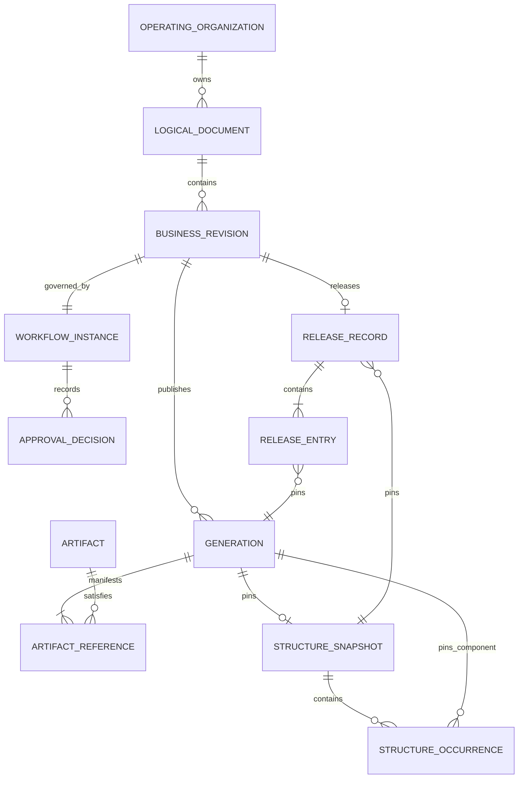
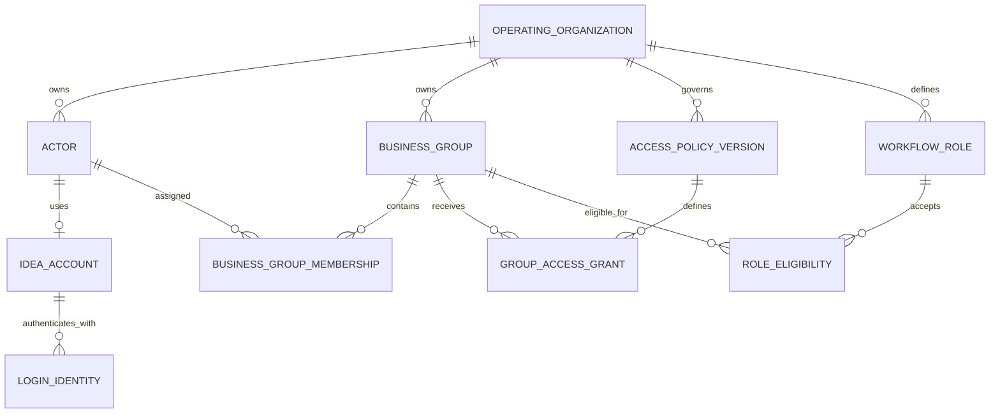

# IDEA Engineering Core v0 Data, Integration and Migration Specification

> **Instance state**: controlled `Draft 0.11`. Sections 1–7 define the information and exchange
> obligations needed by the proposed Spec. Protocol, database, storage product and deployment choices
> remain Tech decisions. This document does not authorize bulk migration.

## Control envelope

| Field | Recorded value |
|---|---|
| Stable Document ID | `IE-PROD-DATA-001` |
| Document Class | `DOC-06` |
| Title | IDEA Engineering Core v0 Data, Integration and Migration Specification |
| Owner | `Principal Product Author`; named data/integration owner is `BLOCKED` before `Proposed` |
| Document Status | `Draft` |
| Document Version | `0.11` |
| Applicable Baseline | `IDEA-C1-ANALYSIS-DESIGN-001`; `IE-SPEC-CORE-V0-001@0.11` |
| Effective Date | `NOT APPLICABLE` until approval |
| Authors / Reviewers | Principal Product Author (assistant prepares) / project user (internal document review); required data, security, migration and format specialists are not assigned |
| Approvers | Product Decision Authority for Spec/Tech as applicable; decisions `NOT-RUN` |
| Source Links | [DOC-03](DOC-03-business-requirements.md), [DOC-04](DOC-04-software-requirements-specification.md), [domain language](../../../../CONTEXT.md), [architecture input](../../../architecture/idea-product-lifecycle-architecture.md) |
| Downstream Links | [DOC-05](DOC-05-architecture-description.md), [DOC-07](DOC-07-mvp-roadmap-and-delivery-plan.md), [DOC-08](DOC-08-ui-ux-and-interaction-specification.md), [VVP](registers/VVP-core-v0-verification-validation-plan.md), future CHG/VEV/REL |
| Evidence / Claim Status | Data contracts are `Draft`; migration, format and recovery evidence are `NOT-RUN` |
| Change History | 0.11: separate ownership of Actors/accounts/Business Groups/membership, Access Policy and Workflow Roles, add maintained baseline/authorization relationship views, and align with DOC-03@0.6 and DOC-04@0.11; no new product permission or migration scope. 0.10: reconcile the current Feature pin; [IE-CHG-SOURCE-RECON-001](registers/CHG-2026-09-09-cross-document-reconciliation.md). 0.9 classified departmental deliverables through existing document/structure/evidence records and kept hours, cost, purchasing, manufacturing and project values as non-authoritative Operational Reference Data. 0.8 defined BOM View Profile, BOM Representation, BOM Import Candidate and exact independent-parts-list relationship. 0.7 defined Folder/Placement/copy relationships. 0.6 separated Identity from Access Policy authority. 0.5 defined versioned workflows. 0.4 defined Representation provenance/freshness. 0.3 aligned Version/Generation. 0.2 added account/session and recovery context. |
| Access Classification | `INTERNAL`; pilot/production-derived files require a separately approved company storage boundary |
| Retention Rule | Logical retention rules and blockers are specified; exact organizational periods and legal-hold policy are `UNKNOWN`, owner Product Decision Authority/Quality authority, trigger before PG4 |
| Content State | `COMPLETE CONTROLLED DRAFT` with explicit policy, environment and evidence gaps |

<!-- AUTHOR CONTENT START -->

## 1. Data scope and ownership

An authoritative owner may expose an interface but retains control of its state and invariants.
Workspace copies, indexes, previews and exported packages never become a second Product Definition
authority.

| Data concept / class | Business meaning | Authoritative owner | Custody / access | Classification / retention | Source link |
|---|---|---|---|---|---|
| Operating Organization | Scope containing identities, policy, configuration and Audit. | Identity and Accounts owns the stable organization identity; every Module owns only its organization-scoped records | Server authority; organization-scoped access only | Internal; retained while dependent controlled records exist | `REQ-GOV-001` |
| Actor / IDEA Account | Stable accountable person identity and its current account eligibility, independent of login name. | Identity and Accounts; product authorization remains owned by Access Policy | Server authority; account administration does not confer document access | Identity retained while Audit/ownership/decisions reference it; personal data minimized | `REQ-IAM-001/002/004/005/006` |
| Credential / session / recovery proof | Protected authentication material, session eligibility/version and expiring one-use recovery state. | Identity and Accounts | Server-side protected custody and scoped client-session proof only; no plaintext password retrieval | Security-sensitive; never in engineering manifests, exports or logs; retention/expiry policy pending security review | `REQ-IAM-003/004/007`; `REQ-SEC-001/002` |
| Login Identity | Native login and any later explicitly linked provider subject; not a document identity. | Identity and Accounts | Organization-scoped, explicitly verified mapping; provider integration deferred | Retain necessary link/provenance and Audit; no automatic email/name merge | `REQ-IAM-006` |
| Business Group / Membership | Governed group identity and explicit association of an eligible Actor with that group inside a delegated Administration Scope. Organizational Department is not a group. | Identity and Accounts; Account Administration maintains membership | Server authority; membership contributes to a product decision only through an active Access Policy; suspended accounts are ineligible | Retain group identity and attributable membership effective history while policy, decision or Audit references it | `REQ-IAM-002/005/006`; `REQ-GOV-002` |
| Logical Document | Stable identity representing one controlled document through all Revisions/Generations. | Controlled Product Data | Server authority; read through controlled interface | Internal; not physically deleted while retained evidence refers to it | `REQ-ID-001` |
| Document Folder / Placement | Logical navigation hierarchy and the identified relationships that place or link a Logical Document within it; neither is a physical storage path. | Controlled Product Data | Server authority; Discovery may project the permitted tree | Folder/placement history is audited; deleting one placement never deletes the Logical Document or Artifact | `REQ-ID-007/008` |
| Source Copy Relationship | Provenance from a newly created Logical Document to the exact permitted source used by Create Copy/Save-As. | Controlled Product Data | Server authority; read according to source/new-document access | Retained with the new document and Audit; conveys no source Reservation, Approval or Release state | `REQ-ID-009` |
| Business Revision | Business change branch/coordinate and its lifecycle/workflow. | Controlled Product Data with Lifecycle Governance transition authority | Server authority | Retained with all linked Generations, decisions and releases | `REQ-ID-002`, `REQ-LC-009` |
| Generation Manifest | Immutable published Product Definition: revision/version coordinate, versioned metadata, Artifact references, structure and provenance. | Controlled Product Data | Server metadata plus immutable Artifact custody | Retained according to release/reference/hold policy | `REQ-ID-002/004`, `REQ-WS-009` |
| Artifact | Logical reference to immutable binary content identified by digest. | Controlled Product Data | Private Artifact storage via controlled transfer only | Classification inherits the Logical Document/context; physical reclamation requires zero retained references | `REQ-FMT-001`, `REQ-OPS-003` |
| Structure Snapshot | Immutable exact Product Structure/occurrence/dependency baseline. | Product Structure | Server authority; projections/exports are read-only views | Retained with linked Generation/Release evidence | `REQ-STR-001/002` |
| BOM View Profile | Versioned purpose, included fields, filters, ordering and output rules for resolving a BOM from an exact Structure Snapshot. | Product Structure | Server authority; query clients select only authorized active/retained versions | Every version used by a BOM Representation or Release is retained | `REQ-STR-004/005` |
| BOM Representation | Non-authoritative Excel/PDF/CSV or other output from one exact Structure Snapshot and BOM View Profile, with output digest and producer provenance. | Product Structure owns source/profile relationship and status; Controlled Product Data holds immutable output bytes | Generated/served through controlled interfaces; never writable as authoritative structure | Retained when referenced by Release/history; otherwise governed derivative retention; `Current` only for its exact source/profile | `REQ-STR-005`, `REQ-LC-008` |
| BOM Import Candidate | Non-authoritative proposed structure change with payload digest, exact base Structure Snapshot, mapping, validation result and visible add/change/remove difference. | Product Structure | Server-side candidate boundary; no query treats it as Product Structure before confirmed acceptance | Failed/abandoned candidate follows governed retention; accepted result links to the resulting snapshot/Generation | `REQ-STR-006` |
| Independent controlled parts-list relationship | Exact relationship from a parts-list Logical Document Generation to the Structure Snapshot it describes. | Product Structure owns the relation; Controlled Product Data owns the document/Generation | Both objects keep their own identity, lifecycle and access | Retained with either object's release/history; later changes do not rewrite the prior relation | `REQ-STR-005`, `REQ-LC-008` |
| Reservation | Temporary publish entitlement for one Logical Document, actor, Workspace and expected Generation. | Controlled Product Data | Server authority; Workspace holds only its reference/status | Operational record plus Audit; period/lease policy `UNKNOWN` | `REQ-WS-002/013` |
| Workspace Manifest | Local durable record of exact materialized Generations, digests, paths and Checkout/Reference modes. | Workspace implementation for local custody; server remains product authority | Protected per-user Workspace | Local operational data; cleanup/recovery policy pending Tech | `REQ-WS-001/003/004` |
| Check-in Operation / Change Set | Idempotent attempt and successful atomic publication scope. | Controlled Product Data | Server authority; client retains operation reference | Operation/Audit retention tied to published or failed outcome | `REQ-WS-007/012` |
| Workflow Definition / Version / Role / Assignment | Versioned states, transitions, Workflow Roles, eligible Business Group references, decision rule, required reason/evidence and notification intent; one active default version may be assigned per Document Class. | Lifecycle Governance; PDM Administration defines roles and eligible-group mappings | Server authority; activation and assignment require governed administration; role eligibility does not itself assign a person to a running instance | Every version, role and assignment referenced by an instance/history is retained | `REQ-LC-001/003/005`; `REQ-GOV-005` |
| Workflow Instance | One running process for a Business Revision, pinned to the exact selected Workflow Definition and Approval Policy versions. | Lifecycle Governance | Server authority | Retained with transitions, decisions and releases; later activation does not reinterpret it | `REQ-LC-001/002` |
| Approval Policy / Decision | Exact actor eligibility, required decision count/rule and attributable approval/rejection. | Lifecycle Governance | Server authority; read according to access policy | Retained with workflow/release evidence | `REQ-LC-003/004` |
| Release Record | Immutable evidence of the exact approved/released scope. | Lifecycle Governance | Server authority; export is a rendition | Retained baseline; purge blocked while policy requires it | `REQ-LC-006/007` |
| Controlled Release Package | Exportable exact package of manifest, metadata, structure, Artifacts, digests and provenance. | Release process; authority remains the Release Record | Authorized export boundary | Classification/retention follow the release scope | `REQ-LC-008` |
| Governed Policy Definition | Stable policy identity with editable Draft content and immutable activated versions for metadata, numbering, access, workflow, approval, retention, localization or format rules. | Applicable owner module | Server authority; only an authorized activation makes a version effective | Retain every version referenced by history | `REQ-GOV-002`…`REQ-GOV-005` |
| Direct Grant Exception | Exceptional policy grant to one Actor with exact action/scope, reason, start/expiry and authority evidence. It is not the normal personnel-assignment path. | Access Policy | Server authority; fails closed unless every exception field and activation condition is valid | All grant versions and decision evidence retained according to policy and referenced outcomes | `REQ-GOV-002`; AC-01/04/05 |
| Policy Import Candidate / Activation | A form or serialized payload, optional JSON, plus schema version, base-policy pin, digest, validation/diff and attributable activation outcome. | Applicable policy owner; Identity only supplies eligible Actor context | Candidate is non-authoritative; Server validates and separately activates under the current Access Policy/bootstrap authority | Failed/abandoned candidates follow governed retention; every activated version and activation evidence is retained | `REQ-GOV-002/005`; AC-01…05 |
| Departmental Deliverable | A governed CAD/PDF/software/instruction/checklist, Product Structure output, Release Record or other evidence supplied or received in an engineering handoff. This is a classification or relationship over the applicable existing record, not a parallel data authority. | The module that owns the underlying Logical Document, Product Structure, Release Record or evidence | Normal controlled interfaces and access policy; department responsibility is retained as attributable metadata/relationship | Inherits the underlying record's classification, version, retention and Release rules | `BR-029`; `REQ-GOV-003`; DH-01…04 |
| Operational Reference Data | Hours, cost estimates, purchasing/fabrication status, progress or completion values retained only to explain engineering context. | The named external system, department or accountable person/process remains authoritative; IDEA has no Core v0 transaction authority | Stored as versioned metadata or controlled document content and read through the owning document interface | Internal context; retained with the exact metadata definition/Generation that used it; never treated as an authoritative ERP/MRP, procurement, manufacturing or project record | `BR-029`; `REQ-GOV-003`; DH-02…04 |
| Representation | Preview or neutral derivative tied to one exact source Generation and source Artifact digest, with producing application/Adapter/tool versions and output digest. | Format Intelligence | Automatic application-assisted/standalone processing or attributable manual upload through one acceptance boundary; served through controlled interface | Non-authoritative; `Current` only for its pinned source, otherwise `Needs update`; may be regenerated, but history/provenance is retained | `REQ-FMT-005` |
| Audit Evidence | Append-only record explaining material command, decision, target, policy/source pins and result. | Audit Evidence | Server-controlled append; governed read/export | Retention period `UNKNOWN`; ordinary mutation/deletion prohibited | `REQ-AUD-001/002` |
| Discovery Projection | Rebuildable search/browse view derived from controlled state. | Discovery | Server-side projection; never write authority | Rebuildable; ranking/cache is not Product Definition | Basic discovery only in Core v0 |

### 1.1 Product baseline identity view

This conceptual data view shows the identities that make one released baseline reproducible. It does
not prescribe table names or an ORM mapping; the relationship and immutability rules in sections 2–3
remain authoritative.

**`DATA-VIEW-CORE-001` — Released-baseline identity (conceptual).**

The key rule is direction: a Release Record resolves exact Generations and one exact Structure
Snapshot. It never follows the later Working Head of a document.

### 1.2 Account, group and policy boundary view

**`DATA-VIEW-AUTH-001` — Directory and authorization ownership (conceptual).**

Account Administration writes the Actor/account/group/membership side. PDM Administration writes
Access Policy and Workflow definitions. At request time, the owning product Module reads the eligible
Actor and effective membership, evaluates the active policy, and still revalidates its own state
before committing. Organizational Department is descriptive data and never substitutes for a
Business Group.

## 2. Identity, version and lifecycle

| Identity or lifecycle item | Stable identity rule | Version/Generation/Revision relationship | State transitions | Audit and recovery evidence |
|---|---|---|---|---|
| Logical Document | One `DocumentId` per Organization; never reused or derived from a path/name/number. | Owns all Business Revisions; points to at most one Working Head. | `Active → Trashed → Restored` or governed future Purge path; Trash/Purge are outside Core v0 UI. | Registration, disposition and recovery events identify actor/reason. |
| Document Folder / Placement | Stable `FolderId` and `PlacementId` per Organization; names and parent placement may change without becoming Artifact paths. | A placement targets one Logical Document by default; an exact historical link additionally pins one Revision/Generation. Move/link/unlink creates no document Version/Generation. | Active placement may move or be removed under policy; removal never disposes the target document. | Actor, source/destination, target identity, mode and outcome are audited. |
| Source Copy Relationship | New document and exact source identities are retained; it is not a shared physical-file identity. | Create Copy allocates a new `DocumentId`; first published content follows normal Revision A / Version 1 / Generation rules. | Relationship is append-only provenance; later changes to either document do not rewrite the other. | Actor, time, source pin and new identity are retained. |
| Initial document | Stable `DocumentId` may exist before content publication. | `Start` may have no Generation/Working Head. First publish creates Revision A / Version 1 under seeded policy. | `Start → In Work` only on complete first publish. | Failed first publish exposes no partial Generation; operation result retained. |
| Generation | Unique `GenerationId`; immutable after successful changed Check-in. | Belongs to exactly one Logical Document and Business Revision; Version within Revision starts at 1 and strictly increases for changed Check-ins. No Change creates neither a new Version nor a Generation. | No mutable lifecycle; becomes current Working Head by atomic Check-in. | Manifest pins Version, metadata schema, Artifact digests, structure and provenance. |
| Artifact | `ArtifactId` is a logical reference; `ContentDigest` identifies immutable bytes. | One Generation may reference multiple Artifacts; content may be physically deduplicated without merging document identity. | Immutable candidate becomes referenced only after validated commit. | Upload/validation/producer evidence and digest read-check. |
| Business Revision | Stable `RevisionId` plus policy-controlled `RevisionCode`. | Contains ordered Generations and one authoritative Workflow Instance selected from the permitted Document-Class assignment. | Seeded path `Start → In Work → Under Review → Released`; Reject/Withdraw returns to In Work according to the pinned policy. | Every transition pins workflow/policy version and actor/result. |
| Reservation | Unique `ReservationId` bound to Document, Actor, Workspace, expected Generation and lease. | Does not create a Generation and does not propagate to parent/child. | Active, renewed/recovered or ended by confirmed successful Check-in/No Change/cancel policy. | Recovery/transfer/expiry outcome is attributable and never bypasses expected head. |
| Structure Snapshot | Unique immutable identity and semantic digest. | One published Generation may pin one required snapshot; members pin exact Generations. | New structure creates a new snapshot/Generation; old snapshot never changes. | Unresolved/manual/external links remain visible with disposition. |
| BOM View Profile | Stable profile identity plus immutable activated versions. | A BOM view resolves one exact profile version over one exact Structure Snapshot; it is not a document Version or Generation. | Activating a later profile affects later queries/exports only; retained outputs keep their pinned profile. | Activation and use are attributable; old outputs remain reproducible. |
| BOM Representation | Stable output identity with immutable bytes/digest and exact source/profile pins. | Many outputs/formats may derive from one snapshot/profile; none changes the source Generation. | `Current` for the pinned source/profile; comparison with a newer source/profile yields `Needs update`. | Producer, time, source/profile, format and output digest retained. |
| BOM Import Candidate | Stable candidate/operation identity bound to one expected base snapshot. | Accepted candidate creates one new Structure Snapshot and owning Generation under normal changed-content rules; a No Change result creates neither. | Prepared/Validated/Refused/Accepted/Abandoned; only Accepted can point to authoritative output. | Payload digest, mapping, diff, actor, confirmation and terminal result retained. |
| Review / Release baseline | Review pins exact Generation; Release pins exact Generations, structure, approval and policy. | Later Working Heads do not alter a pending review or released baseline. | Content change invalidates pending review; Release is terminal for that Revision. | Approval Decisions and Release Record provide the evidence chain. |
| IDEA Account / Actor | Stable account and Actor references scoped to the Organization; rename/disable never reassigns historical references. | Not a document Generation or Business Revision; security state/version is independent. | Proposed account states: Invited, Active, Disabled; expired setup requires controlled reissue. No physical identity deletion while retained evidence refers to it. | Provisioning, activation, recovery, suspension and reactivation identify acting/target Actors and reason/outcome. |
| Account session | Unique session identity with validity/security-version context; token/cookie is proof, not stable Actor identity. | Revocation does not change a document Version/Generation. | Active → Expired/Revoked; reactivation requires fresh proof, not resurrection of an old session. | Record security outcome without credential; restore invalidates sessions and reconciles access changes before reopening. |

Semantic `No Change` compares Artifact digests, normalized versioned metadata and semantic Structure
Snapshot digest in the same Revision. Timestamps, local cache, preview and search fields are excluded
unless an approved policy explicitly makes a derived value part of Product Definition.

## 3. Relationships and integrity

| Relationship ID | Parent/child or reference rule | Cardinality / invariants | Conflict or orphan behavior | Verification |
|---|---|---|---|---|
| `DATA-REL-001` | Organization owns all controlled identities and policy/audit records. | Every authoritative record belongs to exactly one Organization. | Cross-Organization reference is rejected; no implicit global lookup. | Two-Organization isolation matrix |
| `DATA-REL-002` | Logical Document owns Business Revisions. | One-to-many; Revision Code unique within Document under its policy. | Deleting/renaming external files does not orphan the Logical Document. | Identity/lifecycle tests |
| `DATA-REL-003` | Business Revision owns ordered Generations. | Version within Revision is unique/strictly increasing and begins at 1; each changed Check-in maps one Version to one immutable Generation; no separate Version Sequence exists. | Missing manifest or Artifact prevents Check-in and Release. | Constraint and fault-injection tests |
| `DATA-REL-004` | Generation Manifest references Artifacts by exact identity/digest. | At least one primary Artifact where the format profile requires it; digest is immutable. | Missing/corrupt object is visible and blocks exact reproduction. | Manifest-to-object reconciliation |
| `DATA-REL-005` | Structure Snapshot contains nodes/occurrences/dependency edges pinned to exact Generations. | Stable occurrence identity; required graph must be resolvable and policy-valid. | Cycle, missing pin, unresolved required link or changed dependency blocks publish/release as specified. | Graph and release tests |
| `DATA-REL-006` | Reservation binds one Document, Actor, Workspace and expected Generation. | At most one active conflicting publish entitlement per Document under policy; no parent/child inheritance. | Wrong owner/workspace/head is rejected; local files remain. | Concurrency suite |
| `DATA-REL-007` | Check-in Change Set contains all Generations published by one successful confirmed operation. | One successful terminal operation maps to one Change Set; every changed member or none. | Any validation/conflict rejects the complete confirmed scope. | Atomicity/idempotency tests |
| `DATA-REL-008` | A versioned Document-Class assignment selects one active default Workflow Definition Version; each Workflow Instance belongs to one Business Revision and pins the selected definition and Approval Policy versions. | Multiple definitions may coexist; one authoritative active instance exists per Revision. A permitted explicit selection is recorded instead of replacing the default assignment. | Invalid definitions cannot activate; later definition/assignment activation does not reinterpret a running instance or retained history. Migration is a separate authorized operation. | WF-01/02/05 policy-version and assignment tests |
| `DATA-REL-009` | Approval Decision pins Workflow Instance, exact Generation/scope and Approval Policy Version. | Actor eligibility and quorum must be satisfied. | Content change invalidates pending scope; prior decisions remain evidence, not approval of new content. | Workflow/approval tests |
| `DATA-REL-010` | Release Record pins exact Generations, Structure Snapshot, decisions, exceptions and policy versions. | Immutable complete scope; no dynamic latest resolution. | Stale/incomplete/unauthorized member rejects the full release. | Release/reproduction tests |
| `DATA-REL-011` | Representation pins source Generation, source Artifact digest, Format Capability Profile and producing application/Adapter/tool versions; manual upload also records attributable uploader and declared producer. | Many derivatives per Generation are allowed; none is authoritative. `Current` is evaluated against the selected source Generation, never a floating latest reference. | Source/profile advance changes the older result to `Needs update`; conversion or validation failure preserves the source and authoritative product state. | CR-01…05 derivative provenance/staleness/policy tests |
| `DATA-REL-012` | Audit Evidence correlates actor, command/decision, operation, target and source/policy pins. | Append-only; material outcome must have evidence. | Missing evidence fails applicable verification/gate; no ordinary edit/delete. | Evidence-ledger reconciliation |
| `DATA-REL-013` | Organization owns stable Actors, accounts, Business Groups and explicit Business Group Membership; product ownership, decisions and Audit refer to stable Actor/group identities. | One account resolves one accountable Actor. Membership links an eligible Actor to an existing governed group inside a delegated Administration Scope; usernames, departments and role labels are not referential keys or implicit membership. | Rename/disable retains history; suspended accounts are ineligible; stale, cross-scope or unauthorized membership changes fail without partial update. Account Administration cannot bypass owner-policy resolution. | REQ-IAM-002/005/006; REQ-GOV-002; VVP-015 |
| `DATA-REL-014` | Credential, session and setup/reset state belongs to one account/Organization. | Setup/reset proof is single-use, expiring and target-bound; sessions identify current eligibility/security version. | Invalid/replayed proof and revoked/ineligible sessions fail closed; revocation and authoritative command races require serialization/revalidation. | REQ-IAM-001/003/004/007; VVP-011/015 |
| `DATA-REL-015` | A Login Identity maps explicitly to one IDEA Account within the Organization. | Native login initially; any later provider/subject association must be unique in the approved scope and verified. No email-based auto-link. | Ambiguous/reassigned provider subjects require controlled resolution, never silent Actor merge or privilege assignment. | REQ-IAM-006; future provider integration remains deferred |
| `DATA-REL-016` | A Policy Import Candidate identifies its Organization, policy kind, schema version, exact base Access Policy Version, payload digest and proposing Actor; an activation identifies the authorized Actor and resulting immutable version. | Candidate data, including JSON, has no authority and cannot grant its own adoption permission. Normal policy grants reference stable Business Group identities and evaluate effective membership owned by Identity and Accounts. A direct Actor grant also requires exact scope, action, reason, start/expiry and authority. | Malformed, unresolved, stale-base, unauthorized, self-authorizing or incomplete direct-grant candidate fails atomically; it cannot create or change group membership, and the active policy and historical decisions remain unchanged. | AC-01…05 policy administration/import tests |
| `DATA-REL-017` | Organization owns a Document Folder hierarchy; Document Placement relates a Logical Document to a folder/divider independently of Artifact and Workspace paths. | A document has one governed primary placement and may have additional explicit links; all identities share one Organization. An exact historical link also pins Revision/Generation. | Move/link/unlink failure leaves the prior hierarchy and placements unchanged; removing the final placement does not delete or orphan the Logical Document. | IF-01…03 placement/identity tests |
| `DATA-REL-018` | A navigation alias belongs to a Placement; a controlled document name/title belongs to versioned Product Definition metadata. | Alias Rename changes no Generation; controlled Rename uses Check-in and creates a Generation while retaining `DocumentId`. | Ambiguous or unauthorized Rename is refused without changing either name; both accepted paths are auditable. | IF-04/05 Rename tests |
| `DATA-REL-019` | A Source Copy Relationship points from a new Logical Document to the exact source document/Revision/Generation used for Create Copy. | One new `DocumentId` is allocated per successful operation; source bytes may be physically deduplicated without sharing logical identity, workflow or authority. | Failure exposes no partial new document; source remains unchanged; no Reservation, Approval or Released state is inherited. | IF-06 copy/provenance tests |
| `DATA-REL-020` | A BOM query combines one exact Structure Snapshot with one exact BOM View Profile version. | Every row retains a stable occurrence and exact component Generation; quantity/position and profile-defined fields are deterministic for those pins. | Missing/unresolved/unauthorized source data is visible or refuses the query/export according to policy; no fallback to floating latest. | BM-01 query/profile tests |
| `DATA-REL-021` | A BOM Representation pins the exact Structure Snapshot, BOM View Profile, producer/format and immutable output Artifact digest. | Many representations may exist; none is Product Structure authority. `Current` is evaluated against the selected source/profile. | Source/profile advance preserves prior output and yields `Needs update`; mismatch or failed generation cannot change authoritative structure. | BM-02/03 export and staleness tests |
| `DATA-REL-022` | A BOM Import Candidate pins its payload digest, exact base Structure Snapshot, proposed mapping and difference set; acceptance links to the resulting snapshot/Generation. | Candidate is non-authoritative; one successful confirmation maps to at most one atomic result. | Malformed, unresolved, unauthorized, stale-base or faulted import leaves the base structure unchanged and exposes no partial result. | BM-04/05 import tests |
| `DATA-REL-023` | An independently controlled parts-list Generation relates explicitly to the exact Structure Snapshot it describes and declares its governed role. | The document and structure retain separate identities/lifecycles; Release pins exact versions of both when policy requires the list. | Later change to either side does not rewrite history; mismatch is visible and cannot silently substitute a current file or snapshot. | BM-06 release/reproduction test |
| `DATA-REL-024` | A Departmental Deliverable uses the normal owning record and may carry versioned Operational Reference Data or a link to its named source authority. | Department, value or label alone creates no additional business authority. Changing controlled content follows normal Version/Generation rules; changing an external source does not silently rewrite retained IDEA history. | Store/update/import cannot by itself calculate time/cost, create a purchase or fabrication transaction, mark product/project completion, or advance Workflow/Release. Any future authoritative exchange requires a separately approved Feature and named integration contract. | DH-01…04 handoff and authority-boundary tests |

## 4. Exchange and integration semantics

These are semantic interfaces. Protocol and concrete adapter selection belong to DOC-05/Tech.

| Boundary / interface | Source owner | Destination owner | Exchange meaning and version | Failure, retry and idempotency rule | Security / audit |
|---|---|---|---|---|---|
| Product command/query | Web/Desktop | Owning server module | Versioned commands/queries for identity, workspace, Check-in, workflow, policy and Release; clients never write owner storage directly. | Commands carry correlation/idempotency where material; validation errors are typed and safe to retry only as declared. | Authenticated actor/Organization; resource-owner authorization and Audit. |
| Account/session operations | Authorized Account Administrator or signing-in user | Identity and Accounts | Provision/activate, sign-in/out, change/reset password, suspend/revoke and resolve eligibility. | Typed bounded errors, no username enumeration through unauthenticated recovery responses; expired/reused proof refused; repeated admin actions do not create duplicate account identity. | No open signup; protected transport, Audit without secrets; current eligibility checked at protected requests and owner commit. |
| Group and membership administration | Authorized Account Administrator | Identity and Accounts | Create/update governed Business Groups and add/remove Actors within delegated Administration Scope. Product privileges remain determined by the independently active Access Policy. | Expected-version and scope checks make retry safe; unknown Actor/group, stale version, cross-scope or unauthorized command changes no membership. | Server-only authority; actor, target, scope and before/after outcome audited. Cannot define policy/workflow or turn a department into an implicit group. |
| Access Policy administration/import | Authorized PDM administration surface | Access Policy | Form data or versioned serialized candidate, optionally JSON, references existing group identities and becomes a validated preview/diff; a separate authorized command may create and activate a new immutable policy version. | Upload/retry is idempotent and non-authoritative. Schema/reference/semantic/base-version failure or lost authority refuses activation without changing active policy or membership. | Server-only authority; no database credential in clients; candidate/result digest, actor, policy pins and outcome audited; no secret material in payload. |
| Workflow administration | Authorized PDM administration surface | Lifecycle Governance | Versioned Workflow/Approval candidate defines states, transitions, Workflow Roles and eligible Business Group references; activation and default Document-Class assignment are separate governed commands. | Missing group/role/transition, stale base or unauthorized activation changes no definition or running instance; running history keeps its pinned version. | Actor, candidate/version, eligible-group references, assignment and outcome audited; interface cannot create accounts/groups/membership. |
| Future company login | Future verified external provider | Identity and Accounts | Explicit stable Actor/account linking, not direct adoption of provider permissions. | Integration protocol and recovery/fallback policy require a separate approved scope; no unimplemented SSO promise. | Deferred; no company-system access in this increment. |
| Workspace materialization | Server/Artifact authority | Per-user Workspace | Exact Workspace Manifest plus scoped transfer of pinned Artifacts/digests. | Resumable transfer verifies digest; mismatch remains not ready and may retry safely. | Short-lived, object/operation-scoped authorization; protected local custody. |
| Check-in upload | Workspace | Controlled Product Data / staging | Proposed manifest and bytes for one confirmed Operation/expected-head set. | Upload may resume; finalize is idempotent; failed candidates remain private and reconciled. | No permanent storage credential; every terminal outcome audited. |
| Format analysis / Representation | Controlled Product Data | Isolated Format Intelligence Adapter or attributable manual-upload boundary | Immutable source Generation/Artifact digest plus exact Format Capability Profile. Result includes execution mode, application/Adapter/tool versions, output digest and declared semantic output. | Retry by job identity; mismatched output is rejected; source advance yields `Needs update`; timeout/failure cannot change source/product state. | Least-privilege one-job scope and bounded resources; release response comes from the versioned Release Policy. |
| BOM query/export | Web/Desktop or Release process | Product Structure / controlled Artifact custody | Exact Structure Snapshot plus BOM View Profile returns a governed view or a BOM Representation pinned to both inputs and its output digest. | Query/export may retry by operation identity; no request follows floating latest where an exact result is required; failed output changes no structure. | Owner authorization; source/profile/output/actor/result recorded; `REQ-STR-004/005`. |
| BOM import | Authorized Web/Desktop administration/work surface | Product Structure | Payload and exact base snapshot create a non-authoritative candidate and validation/difference preview; separate confirmation may create one new snapshot/Generation. | Invalid/stale/unauthorized/faulted candidate is refused atomically; retry cannot create a duplicate result. | Server-only authority; candidate digest, base, mapping, actor, confirmation and outcome audited; `REQ-STR-006`. |
| Departmental engineering handoff | Departmental contributor or governed source | Controlled Product Data / Product Structure / Lifecycle evidence owner | Applicable files, structure outputs and evidence use the existing controlled interfaces. Optional hours, cost, purchasing, fabrication, progress or completion values are retained only as versioned Operational Reference Data. | Retry follows the owning document/import operation. A stored value or deliverable never implies an external business transaction, completion or lifecycle transition. | Actor, source, metadata-definition/Generation pins and result are auditable; future write integration requires a separate approved contract. |
| Review/Release notification | Committed owner outcome | User notification projection | Post-commit information that a workflow/release event occurred. | Replay from committed event; notification failure never changes authoritative outcome. | Recipient authorization; no secret/restricted payload beyond policy. |
| Discovery projection | Authoritative committed events | Discovery | Rebuildable item/state/metadata view for basic find/browse. | Replay/rebuild repairs drift; projection is eventually updated and cannot accept domain commands. | Query filters enforce organization/access policy. |
| Controlled export | Release Record | Authorized internal consumer | Exact read-only Release Package and manifest for one released baseline. | Export may retry; digest/manifest mismatch fails and cannot alter source. | Authorized, audited, classification/retention carried with package. |
| External enterprise integration | Future consumer | Future owned contract | `NOT APPLICABLE` to Core v0 beyond read-only controlled export. | No contract or retry rule is invented. | Requires separate Spec/Tech decision. |

## 5. Migration and reconciliation

### 5.1 Core v0 onboarding mapping

Core v0 supports `New`, `Store Existing` and a versioned Canonical Demo Dataset loader. Bulk legacy
migration, cutover and historical equivalence remain a separate assessment.

| Source identity/field | Target identity/field | Transform / loss rule | Evidence and owner | Disposition |
|---|---|---|---|---|
| Existing path and file name | Candidate display name/source provenance | Normalize only for validation/display; never use as `DocumentId`, Document Folder identity or authoritative Artifact location. Preserve original source reference where permitted. | Store Existing preview; Principal Product Author | `IN SCOPE` |
| File bytes | Artifact plus `ContentDigest` | Preserve bytes exactly; compute digest; physical dedup may reuse bytes but never merge Logical Documents. | Digest comparison | `IN SCOPE` |
| User-supplied metadata | Versioned metadata values | Validate against selected schema; invalid values block registration/publish with field-level feedback. | Mapping/validation report | `IN SCOPE` |
| Departmental spreadsheets, instructions, checklists or status sheets | Controlled Logical Document/Generation plus mapped versioned metadata and declared source authority where applicable | Preserve the file and provenance. Hours, cost, purchasing/fabrication, progress or completion values remain Operational Reference Data; unresolved ownership or meaning is marked `UNKNOWN`, never promoted to an operational transaction or completion state. | Mapping decision and handoff evidence; departmental owner/authority may remain `UNKNOWN` | `IN SCOPE` as governed engineering context; authoritative operational migration `EXCLUDE` |
| Existing business number | Business Number candidate | Validate uniqueness/scope; conflict requires new value or explicit governed reconciliation. | Numbering-policy result | `IN SCOPE` |
| Existing Revision/Version label | Candidate Revision provenance | Do not assert equivalence automatically; Core v0 default starts at governed initial Revision unless an approved mapping exists. | Mapping decision; exact legacy rules `UNKNOWN` | `BLOCKED` for historical migration |
| File-system time/owner | Provenance only | May be retained as untrusted source metadata; never treated as approval, publication time or authoritative actor evidence. | Import report | `IN SCOPE` with limitation |
| Discovered file dependency | Proposed Product Structure relation | Mark as parser/manual/unresolved with exact source evidence; user confirms before publish. | Capability Profile/result | `IN SCOPE` for bounded profile |
| Existing Excel/CSV BOM or parts list proposed as structure | BOM Import Candidate against an exact base Structure Snapshot | Map fields and references; validate and show add/change/remove differences. The uploaded file is never authoritative merely because it is stored. | Candidate/diff/confirmation record; Product Structure reviewer | `IN SCOPE` for bounded, confirmed import; bulk migration remains excluded |
| Existing PDF/Excel parts list retained as a controlled document | Logical Document Generation plus exact Structure Snapshot relationship, or BOM Representation when generated by IDEA | Preserve bytes and provenance; user must choose and validate the intended role. Do not silently infer that the file is authoritative Product Structure. | Mapping decision and exact relation/output manifest | `IN SCOPE` for explicit mapping; historical equivalence `BLOCKED` |
| Existing approval/status text | No automatic Approval Decision/Release | Historical text is not promoted without attributable, exact-baseline evidence and approved mapping. | Migration authority `UNKNOWN` | `EXCLUDE` from Core v0 trust mapping |

### 5.2 Reconciliation and rollback

| Migration step | Precondition | Reconciliation check / threshold | Failure handling | Rollback or recovery evidence |
|---|---|---|---|---|
| Inspect candidate | Authorized file and selected class/schema | Readability, extension/profile, size policy, digest and duplicate candidates reported. | No controlled record committed; source unchanged. | Inspection result/Audit |
| Preview mapping | User supplies required metadata/number/relations. | Every required field and relation has value or visible unresolved disposition. | Return field/relation errors; retain input for correction. | Mapping report |
| Stage content | User confirms Store Existing. | Staged bytes readable and digest equals candidate. | Expire/reconcile private candidate; no public Generation. | Operation and staging reconciliation |
| Commit registration/first publish | Authorization/policy/validation pass and candidate file bytes are verified and durably materialized privately. | Database transaction makes Logical Document, Revision A/Version 1, manifest references and Audit agree exactly; it does not atomically write external bytes. | Roll back database publication; unused bytes remain private for safe reconciliation, never an empty/partial public Generation. | Transaction/manifest and crash-recovery evidence |
| Post-commit reconcile | Committed identity returned. | Query resolves exact manifest and Artifact digest; projections may catch up separately. | Flag repair incident; authoritative record remains source. | Reconciliation result |
| Cancel/retry | Before commit or after known terminal outcome. | Same OperationId cannot produce a duplicate. | Cancel private work where safe; retry returns/resumes same outcome. | Idempotency evidence |

No source file is modified or deleted by Store Existing. A future bulk migration must add source
system inventory, field/history mapping, dry run, exception ownership, volume/performance evidence,
cutover, rollback and reconciliation thresholds before authorization.

### 5.3 Account bootstrap and future login migration

Provision the first named account administrator once through a controlled setup; preserve the
separate Bootstrap Custodian and Access Policy adoption authority. Setup cannot remain a public
reusable privilege-creation path. Protect the last effective administrative recovery path through
an authorized replacement or governed recovery arrangement (REQ-IAM-007). During development one
person may hold all bootstrap permissions, but the stored permissions, interfaces and Audit remain
separate so production duties can be assigned to different people without redesign.

Native-account initialization is new product setup, not an import of the company's existing
account database. Future provider linking needs explicit identity-matching decisions, ambiguity
handling, pre/post Actor/permission reconciliation, rollback and user/session recovery. Do not copy
company credentials, merge by email or create an empty provider integration in Core v0.

## 6. Format capability boundary

| Profile | Format/scope | Identity/digest control | Semantic/structure capability | Limitations / status |
|---|---|---|---|---|
| Generic Controlled-File Baseline | Configurable allowlist; proposed initial environment includes Office documents, PDF and IRONCAD files, exact extensions/versions pending. | Stable document/Artifact identity, immutable Generation, digest, metadata, Checkout/Reference, Check-in, Audit, release/export and recovery. | No extraction assumed; open via OS association where configured. | `Draft`; exact allowlist, sizes and application versions `BLOCKED` pending environment inventory. |
| IRONCAD deep profile | First deep CAD profile for exact IRONCAD application/Adapter/tool version. | Generic controls plus exact source Generation/Artifact digest and producer/output provenance. | Candidate: dependency/structure/property extraction and PDF/neutral Representation through a qualified application-assisted or standalone path; manual upload remains available when automatic conversion is not qualified. | `Draft`; exact versions, export interface, licensing, execution host, headless capability and round-trip evidence `BLOCKED`. |
| Office support profile | Word/Excel and related Office files in configured environment. | Generic controls. | Preview/property/dependency behavior is `None/Manual/Parser` per future profile; no semantic claim from extension alone. | `Draft`; exact application versions and capabilities `UNKNOWN`. |
| PDF support profile | Controlled source or representation according to document class/policy. | Generic controls plus source-Generation pin when derivative. | Text/preview/signature behavior not assumed. | `Draft`; signing/validation requirements `UNKNOWN`. |

Every profile declares Generic vaulting, OS-open support, hash/change detection, dependency/property/
structure extraction, preview, neutral representation and measured round-trip fidelity. Each deeper
capability also declares `None`, `Manual`, `Application-assisted`, `Parser` or `Standalone converter`,
plus prerequisites and exact producer versions. Unsupported or untested capability is explicit;
processing failure preserves the original Artifact. A Release Policy separately declares whether a
missing, failed or `Needs update` Representation blocks Release or produces a warning.

## 7. Security, privacy, retention and operational obligations

| Obligation | Data/surface | Control or evidence | Owner | Status |
|---|---|---|---|---|
| Least privilege / isolation | Product commands, transfer, Workspace, worker and export | Organization-scoped authorization, short-lived transfer, per-user local protection, one-job worker scope | Security authority `UNKNOWN` | Requirements Draft; review `BLOCKED` |
| Personal information minimization | Actor names/IDs and Audit | Retain only accountable identity and permitted context; no secrets or unnecessary personal data in logs/evidence | Security/Quality authority `UNKNOWN` | Policy `UNKNOWN` before PG3 |
| Classification propagation | Logical Document, Artifact, Representation, export | Derived/packaged data carries source classification and access constraint; downgrade requires explicit authority | Data/Security owner `UNKNOWN` | Draft obligation |
| Retention / legal hold | Generation, Release, structure, decision, Audit and Artifact | Retained references/holds block physical deletion; exact periods and cryptographic erasure process pending | Product Decision Authority/Quality | `BLOCKED` before Purge/rollout |
| Audit integrity | All material outcomes | Append-only logical evidence and controlled export; no ordinary mutation/deletion | Audit Evidence owner | Draft obligation |
| Backup / restore | Metadata, Artifacts, structure, policies/configuration, account/security state and required cryptographic material | One coordinated recovery point, manifests and digest reconciliation; invalidate restored sessions and reconcile account/access changes before service reopening | User may operate initially; long-term authority `UNKNOWN` | Four-working-hour RTO / one-hour RPO are preliminary objectives only; environment/drill `NOT-RUN` |
| Incident / reconciliation | Missing/corrupt objects, expired staging, projection drift, stuck Reservation | Detect, classify, preserve evidence, repair/recover through authorized operation | Operations authority `UNKNOWN` | Detailed runbook deferred to OPS/Tech |

Recovery-set identity must name the database point and matching Artifact/configuration/key set.
Database backup/WAL alone does not contain external file bytes. A newer database point with missing
Artifacts is not usable recovery; the latest complete coordinated set determines the recovery point.
Exact source scope, working-hour clock, retention, protected backup destination and allowed loss need
qualification against TECH-CTX-008 and VVP-013/014. Credentials/recovery secrets are never included
in a Controlled Release Package, even though protected operational backups need them.

The document-volume estimate in TECH-CTX-005 is not a file-size limit, total repository size or
migration benchmark. Retention and supported-format limits remain open.

## 8. Verification and gate readiness

| Gate / verification item | Required evidence | Result |
|---|---|---|
| Feature prerequisite | Product Decision Authority decision on an updated Feature brief that pins DOC-03@0.6 | `NOT-RUN`; `FEATURE-001@0.12` is stale |
| PG2 requirement consistency | Every data obligation traces to DOC-03/DOC-04 and VVP | Requirement trace authored; review `NOT-RUN` |
| PG3 design consistency | Ownership, relationships, semantic interfaces and failure behavior align with DOC-05 | DOC-05 Draft authored; review and Tech decision `NOT-RUN` |
| Migration readiness | Mapping, duplicate handling, reconciliation, rollback and approved data boundary | Bounded Store Existing/Demo plan Draft; bulk migration `NOT APPLICABLE` |
| Format readiness | Exact allowlist/profile/tool versions and conformance results | `BLOCKED`; environment/profile evidence absent |
| Recovery readiness | Exact coordinated backup/restore configuration, security reconciliation and timed successful drill | `NOT-RUN`; initial operator possible, long-term owner/backup/clock/environment still open |
| Material change | CHG covers data/interface/security/migration/recovery/release impact | Prior decisions remain in their CHG records; [IE-CHG-SPEC-ARCH-QUALITY-001](registers/CHG-2026-09-10-spec-architecture-quality-baseline.md) records the current data-ownership and relationship-view update |

## Typed trace, supporting records and rendition controls

| Link type | Required target and purpose | Result |
|---|---|---|
| `SOURCE-NEED` / `SOURCE-DECISION` | DOC-03 needs/rules, DOC-04 obligations and approved Feature/Spec decision | Draft sources linked; Feature/Spec decisions `NOT-RUN` |
| `DOWNSTREAM` | DOC-05 interfaces, DOC-07 increment, DOC-08 interactions, VVP and later implementation contracts | DOC-05/08 Drafts authored and reconciled at source level; review `NOT-RUN` |
| `CHANGE` | CHG with data, interface, security, migration, recovery and release impact | Prior decisions remain traceable; [IE-CHG-SPEC-ARCH-QUALITY-001](registers/CHG-2026-09-10-spec-architecture-quality-baseline.md) records the current successor and retained predecessor evidence |
| `VERIFICATION` | Mapping/reconciliation, item/folder/copy, BOM query/export/import, departmental handoff/authority boundary, workflow, format, authorization/import and restore procedures/results | `IE-VVP-CORE-001@0.11` authored; all execution `NOT-RUN` |
| `RELEASE` | Future REL baseline and data-boundary authorization | `NOT APPLICABLE` to this Draft |
| `RENDITION` | Source-pinned DOCX/PDF identity/status | No rendition generated |

<!-- AUTHOR CONTENT END -->

## Contract references

- [DOC-06 class template](../../definition/DOC-06-data-integration-and-migration-specification.md)
- [Core document catalogue](../../definition/README.md)
- [Control fields and status](../../../../specs/003-controlled-documentation/contracts/control-fields-and-status.md)
- [Evidence and trace](../../../../specs/003-controlled-documentation/contracts/evidence-and-trace.md)
- [Rendition contract](../../../../specs/003-controlled-documentation/contracts/rendition.md)
