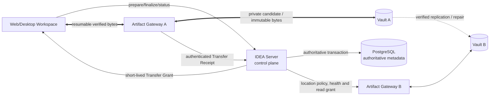

# Multi-location Vault and Direct Artifact Transfer Architecture Change

## Control envelope

| Field | Recorded value |
|---|---|
| Stable Supporting Record ID | `IE-CHG-VAULT-XFER-001` |
| Supporting class / version / status | `CHG` / `0.2` / `Draft` |
| Date | 2026-09-17 |
| Owner / author | Principal Product Author; named person attribution `BLOCKED` before `Proposed` |
| Reviewer / acceptance authority | Project user and Product Decision Authority confirmed the Multi-location Artifact Custody decisions recorded in section 3.1 on 2026-09-18; approval of the exact successor product baseline remains a separate source-pin decision |
| Product normativity | `INFORMATIVE`; the successor controlled documents own the proposed obligations and views |
| Applicable baseline | `IDEA-C1-ANALYSIS-DESIGN-001`; predecessor DOC-04@0.13, DOC-05@0.20, DOC-06@0.16, DOC-07@0.11, DOC-08@0.12 and VVP@0.16 |
| Source / upstream trace | Management need recorded by the project user: the business Backend may remain on one host, Vault storage must support multiple locations, and large concurrent transfers must not be forced through that Backend; [provenance note](../../../../research/2026-09-17-vault-transfer-and-multi-location-provenance.md); [ADR-0013](../../../../adr/0013-separate-artifact-control-and-data-planes.md) |
| Downstream trace | DOC-04@0.14, DOC-05@0.21, DOC-06@0.17, DOC-07@0.12, DOC-08@0.13, VVP@0.17, product lifecycle architecture@0.4, technology view set@0.3 and TECH-001@0.15 |
| Decision evidence | The project user reported on 2026-09-18 that the user and Product Decision Authority approved the recommended Multi-location Artifact Custody direction; no separately signed approval artifact was supplied to the repository |
| Evidence status | Architecture synthesis and source/rendition checks recorded in [IE-VEV-VAULT-XFER-001](VEV-2026-09-17-vault-transfer-diagram-review.md); implementation, benchmark, failover, replication, security and restore runtime evidence are `NOT-RUN` |
| Access / retention | `INTERNAL`; retain with predecessor and successor controlled sources |

## 1. Reason for change

The predecessor views routed every Artifact byte through the IDEA Server and described one private
Artifact Store. That shape made the Server a data-plane bottleneck and did not satisfy the stated
need to keep byte custody in several locations. It also conflicted with the intended scale of
multi-GB individual files and future Projects measured in hundreds of TB.

## 2. Selected design direction

The successor Draft separates two paths:

1. **Control plane:** Client → IDEA Server → PostgreSQL for authentication, RBAC, `OperationId`,
   confirmed scope, expected Generation, Reservation, transfer preparation, finalization, status and
   authoritative commit.
2. **Data plane:** Client ↔ selected Artifact Gateway ↔ selected Vault for resumable, verified byte
   transfer under a short-lived `Transfer Grant`.

The Gateway returns a correlated `Transfer Receipt`; only the authoritative server owner may accept
that evidence and commit a Check-in. One Artifact may have several verified locations. Replication is
Vault-to-Vault and does not require another Client upload or change product identity.

## 3. Controlled effects and non-effects

| Area | Successor effect |
|---|---|
| Feature scope | No new Feature group; the existing Workspace, security, recovery and controlled-file capabilities receive a scalable realization. |
| Spec | Add direct scoped transfer, one-to-many Artifact locations and replication/durability-policy obligations. Exact thresholds remain open. |
| Architecture | Add Artifact Gateway Adapter boundary; distinguish control plane from data plane; change materialization, Check-in, trust and deployment views. |
| Data | Add Vault Endpoint, Transfer Grant, Transfer Receipt, Replication Task and versioned Storage/Durability Policy concepts. |
| UX | Show selected transfer endpoint only as useful operational status; keep publication status separate from transfer/replication status. |
| Verification | Add negative grant tests, direct-path concurrency/load evidence, location failover, replication/repair and exact digest reconciliation. All are `NOT-RUN`. |
| Technology | No storage vendor, Gateway runtime, protocol library, location count or deployment product selected. Existing Tech Stack and Q-15 are unchanged. |

## 3.1 Confirmed Multi-location Artifact Custody decisions

The project user and Product Decision Authority confirmed the following design decisions for the
Multi-location Artifact Custody direction. These decisions define the extensibility boundary; they
do not claim that multiple Vaults, replication, failover or recovery have already been implemented
or qualified.

| Decision | Confirmed rule |
|---|---|
| Purpose | Prepare for large Artifacts, concurrent transfers, future capacity growth, recovery and additional locations without making the business Server the payload bottleneck. |
| Core v0 deployment boundary | Core v0 may run with one operational Vault location. The custody contract must support one-to-many locations so a later location can be added without changing product identity. |
| Artifact identity | One logical `ArtifactId` may have multiple `ArtifactLocation` records. Rehome, replication, repair and failover do not create a new Artifact, Generation, Version, Revision or Release Record. |
| Location selection | Artifact Custody selects an eligible Gateway/Vault by policy. A Client may see a logical location/status but cannot choose a raw physical path or hold a permanent Vault credential. |
| Check-in baseline | Core v0 requires at least one digest-verified location before a new Artifact can become eligible for final Check-in. A later policy may require more locations. |
| Release policy | Release may apply a stricter versioned durability policy in a later decision. Exact counts, failure domains and lag targets remain open. |
| Failure behavior | Reads may fail over only to a location holding the same verified Artifact identity, size and digest. If the applicable policy cannot be met, Check-in/Release refuses safely and preserves local work; any exception is governed and audited. |
| Replication and Repair | Future background or governed operations may copy/repair bytes between locations without Client re-upload. A verified replica is not a Backup and cannot publish a Generation or decide Check-in. |
| Administration | QLHT manages account/infrastructure concerns; Product Configuration Administration manages storage/durability policy; ordinary CAD users do not configure Vaults or bypass policy. |
| Provider boundary | Core v0 may start with a filesystem-backed Adapter, but the Artifact Custody interface remains provider-neutral so object storage or another location type can be added later. |
| User-visible status and Audit | UI shows transfer, verification, recovery and refusal status in user language without exposing secrets/raw paths. Server-side append-only Audit records the Actor, `OperationId`, Artifact/location identity, digest/result and reason; it does not store file bytes or credentials. |

## 4. Open decisions

- The Core v0 baseline is one verified location; the future minimum location count for each
  Document Class/Project and any stricter Release policy remain open.
- Required failure-domain separation, replication lag, capacity headroom and detailed location
  selection rules remain open.
- Gateway runtime/toolchain, exact implementation of the initial filesystem-backed Adapter and
  company network topology. Object storage remains a later alternative, not a new selection here.
- Measurable throughput, concurrency, availability, RPO/RTO and recovery targets.

Until these values are approved, documents may describe the configurable policy and required
behavior but must not invent a number, claim high availability or report a verification PASS.

## 5. Diagram follow-through

The current rendition replaces the predecessor gallery for this successor. It includes two new
maintained UML Sequence views: `ARCH-VIEW-SEQ-012` for exact read failover and
`ARCH-VIEW-SEQ-013` for verified replica eligibility. `ARCH-VIEW-SEQ-010` also changes: worker input
and automatic/manual output bytes now use scoped Gateway transfers; Format Intelligence receives
candidate metadata and custody evidence only. `ARCH-VIEW-SEQ-002` uses a readable Server-container
abstraction, explicitly shows finalize refusals and retains internal owner contracts in companion
views. No owner boundary or requirement is changed by this simplification.

The [current gallery](../evidence/IE-VEV-VAULT-XFER-001/index.html) contains the maintained
architecture/data/technology set plus three Vietnamese management simplifications. The
[Word-update guide](../../../../reports/IDEA-DDM-multi-location-vault-sharepoint-word-update-guide-2026-09-17.md)
identifies the images and paste-ready wording; the submitted Word is not modified by this work.

## 6. Version history

| Version | Date | Status | Change |
|---|---|---|---|
| `0.2` | 2026-09-18 | `Draft` | Records the project user's and Product Decision Authority's confirmation of the Multi-location Artifact Custody direction, including the one-location Core v0 boundary, identity preservation, policy-selected location, governed failure handling, Audit visibility and provider-neutral Adapter boundary. Exact topology, thresholds and runtime qualification remain open. |
| `0.1` | 2026-09-17 | `Draft` | Initial change record for separating Artifact control and data planes and preparing multi-location Vault custody. |
