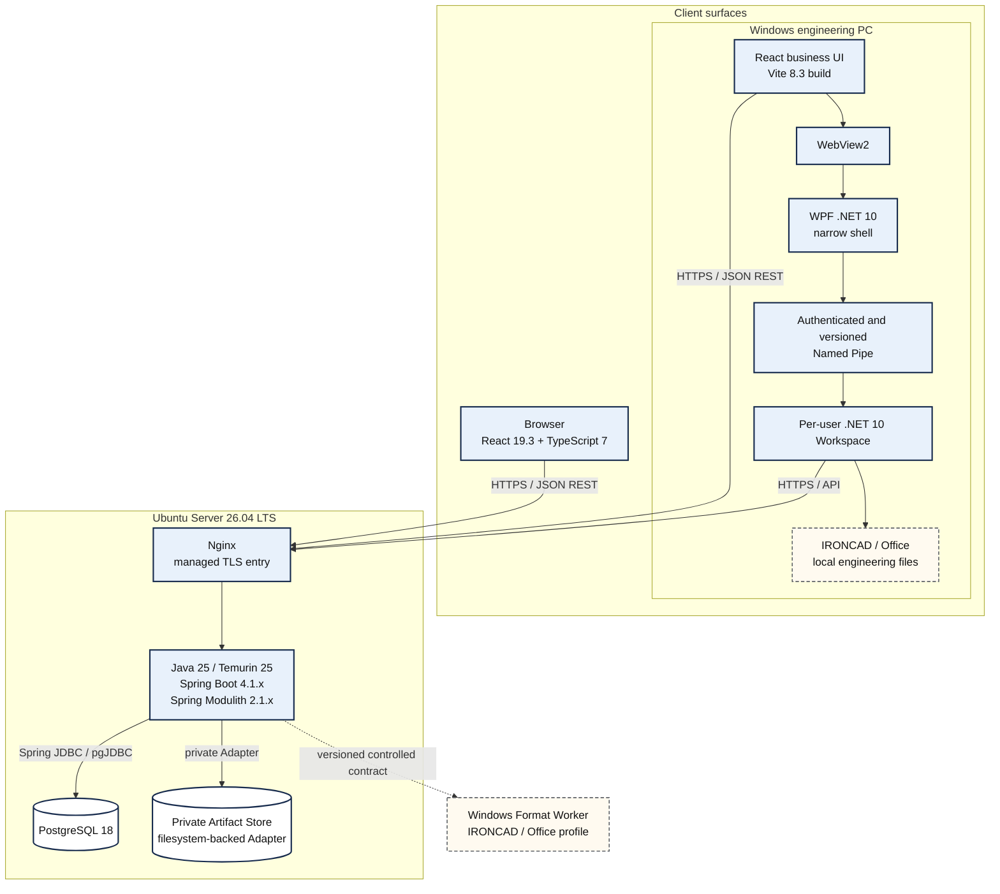
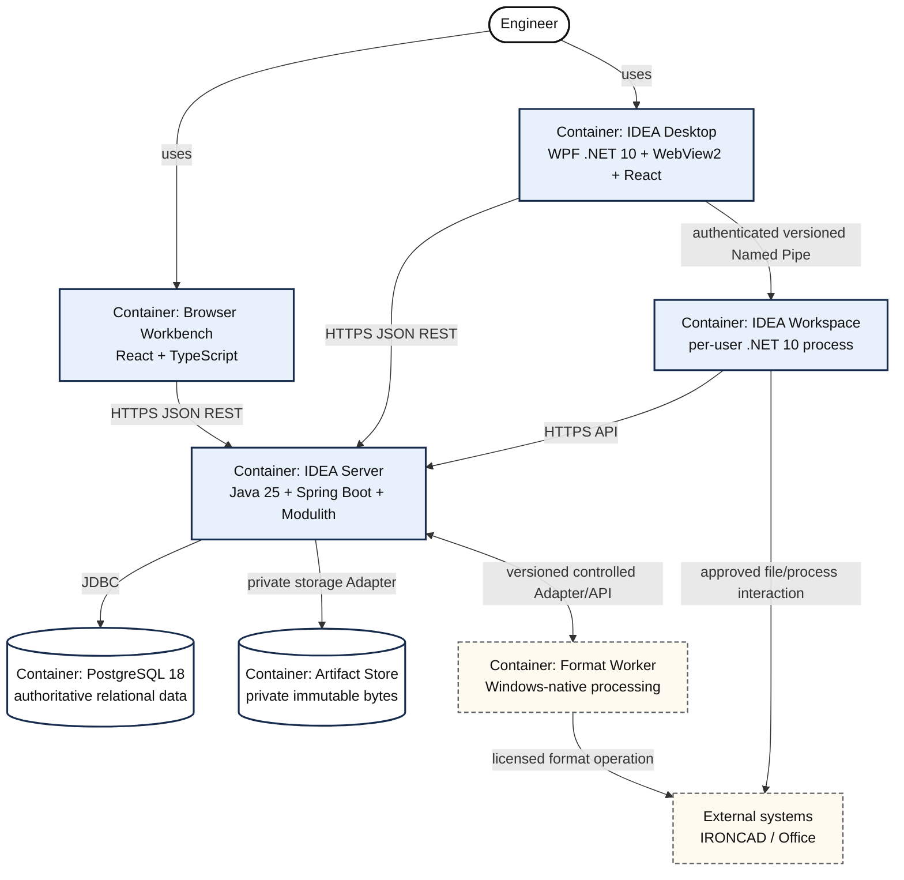
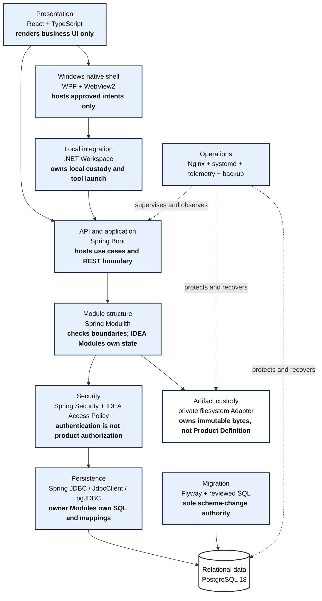
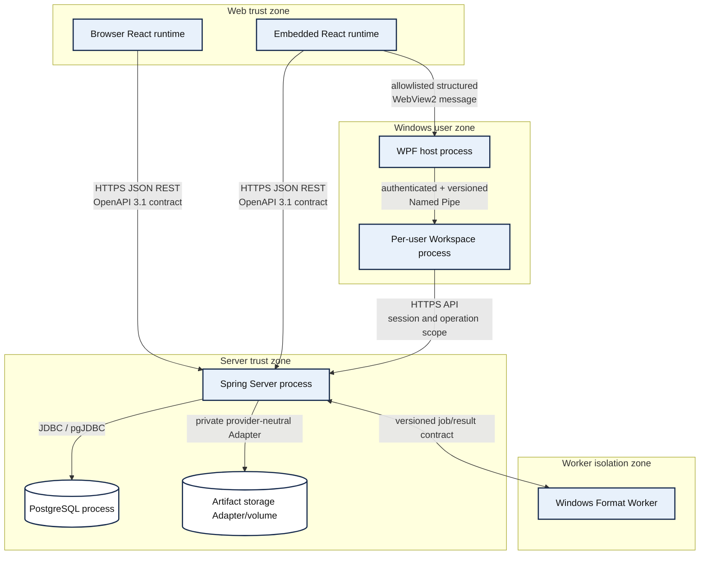
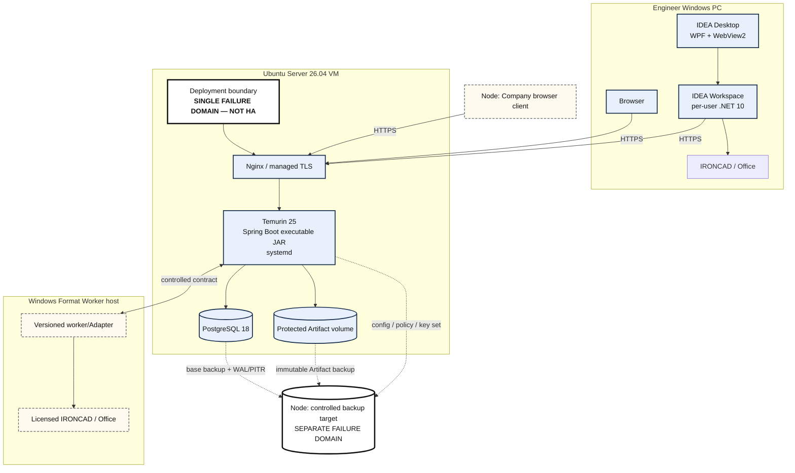
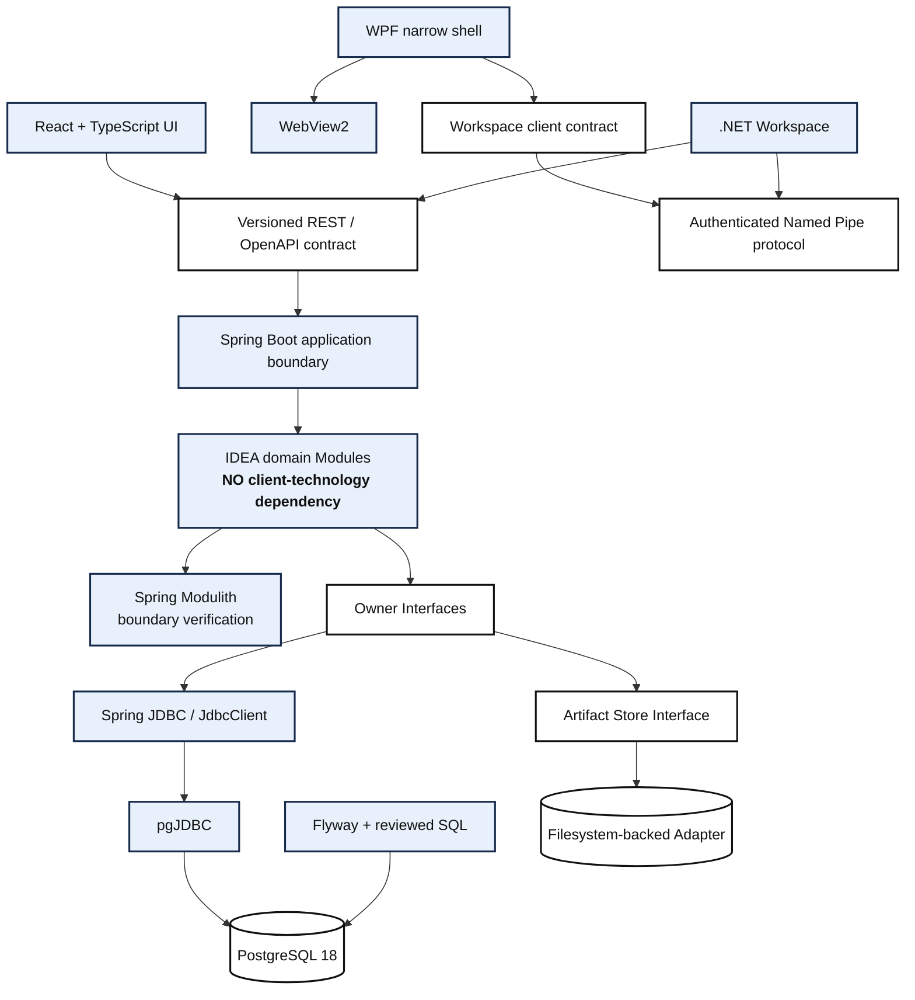
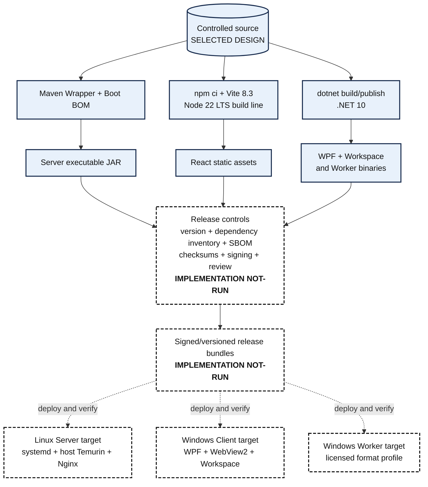
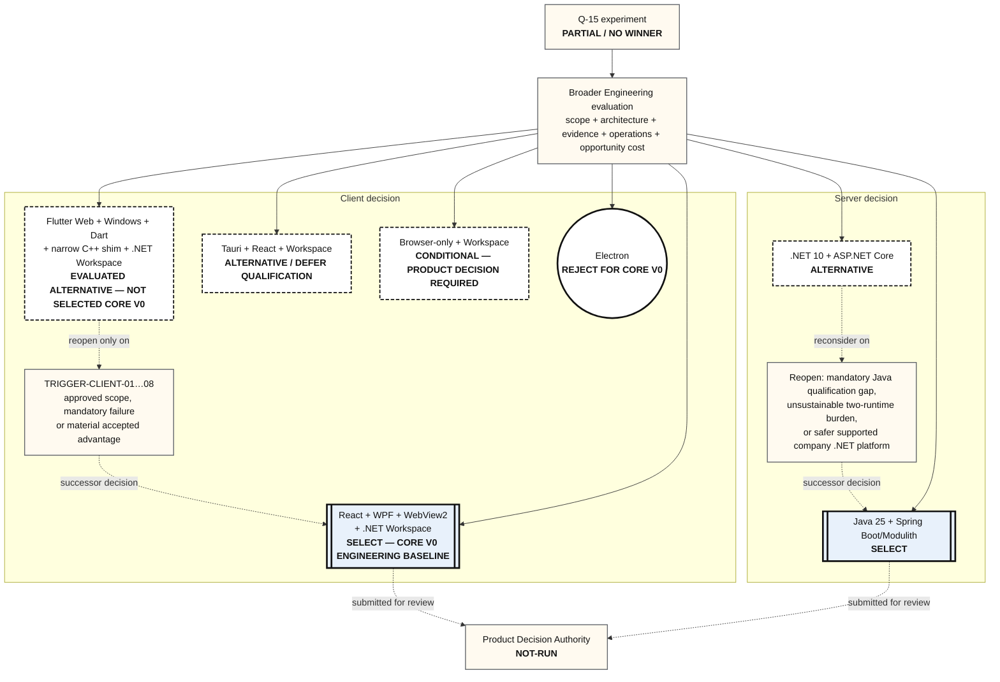

# IDEA Engineering Core v0 Technology Architecture View Set

| Control field | Value |
|---|---|
| Stable Document ID | `IE-ARC-TECH-VIEW-001` |
| Document class | `ARC` / Technology Architecture View Set |
| Title | IDEA Engineering Core v0 Technology Architecture View Set |
| Version / status | `0.1` / `Draft` |
| Artifact role | Focused views of the Engineering-selected Core v0 technology baseline; companion to the decision matrix and TECH-001, not a replacement for DOC-05 |
| Product normativity | `INFORMATIVE` — visualizes the selected implementation direction and creates no FTR/REQ/product behavior |
| Repository process authority / instruction state | `NOT-APPLICABLE` / `NOT-APPLICABLE` |
| Owner / author | Principal Product Author; named attribution `BLOCKED` before `Proposed` |
| Reviewer / acceptance authority | Architecture/technology review `NOT-RUN`; Product Decision Authority review and acceptance `NOT-RUN` |
| Applicable baseline | `IDEA-C1-ANALYSIS-DESIGN-001`; DOC-05@0.20; `IE-KNW-TECH-DEC-001@0.6`; `TECH-001@0.14` |
| Source / upstream trace | [`IE-STD-TECH-STACK-001@0.1`](../../../../agents/technology-stack-documentation-standard.md); [DOC-05](../DOC-05-architecture-description.md); [`IE-KNW-TECH-DEC-001@0.6`](../../../knowledge/2026-09-13-core-v0-technology-decision-matrix.md); [`TECH-001@0.14`](../decision-briefs/TECH-001-technology-and-architecture-proposal.md); accepted ADRs |
| Downstream trace | [`IE-VEV-TECH-VIEW-001`](../registers/VEV-2026-09-15-technology-architecture-view-set.md); rendered [SVG/PNG view package](../evidence/IE-VEV-TECH-VIEW-001/index.html); future implementation and release records |
| Change record | [`IE-CHG-TECH-BASELINE-001`](../registers/CHG-2026-09-15-core-v0-technology-stack-baseline.md); initial view set |
| Supersedes / superseded by | `NOT-APPLICABLE` / `NOT-APPLICABLE` |
| Review trigger | Technology baseline, deployment topology, protocol, trust boundary, build/release path or client reopen disposition changes |
| Access / retention | `INTERNAL`; retain with the technology baseline and successor history |
| Evidence status | Mermaid sources authored; rendering and standalone-SVG opening are recorded separately by `IE-VEV-TECH-VIEW-001`; a rendered image is not architecture approval |

## Reading rule and notation

These eight views answer different questions. They deliberately omit class-level design, database
tables and full domain behavior already owned by DOC-05/DOC-06. A box is a logical software/runtime
boundary unless a view explicitly labels it as a machine or deployment node. “Container” in TECH-D02
uses the C4 meaning (an application or data store), not Docker.

| Visual convention | Meaning in every view |
|---|---|
| Solid box and solid relationship | Selected Core v0 engineering direction or required relationship |
| Dashed box/relationship | Alternative, conditional, external or planned-but-not-implemented element as labelled |
| `[SELECT]`, `[ALTERNATIVE]`, `[CONDITIONAL]`, `[DEFER]`, `[REJECT CORE V0]` | Authoritative text status; color is not required to interpret it |
| Arrow | Dependency, call or transfer in the labelled direction; not a time sequence unless stated |
| Boundary | Process, trust, node or responsibility boundary named in that view |

## TECH-D01 — Technology Stack Overview

| View metadata | Recorded value |
|---|---|
| View ID / title | `TECH-D01` — Technology Stack Overview |
| Purpose | Show the selected Web, installed Windows, Server, storage and Windows-format technology families in one readable overview. |
| Stakeholders / concerns | Product Decision Authority, Engineering, IT; scope fit, principal runtimes, technology ownership and deployment shape. |
| Viewpoint / notation | Technology stack overview; Mermaid flowchart with grouped runtime boundaries. |
| Source | Matrix@0.6 sections 2/6–8; TECH-001@0.14; DOC-05 container/deployment views. |
| Current status / authority | `Draft`; Engineering baseline selected; exact technology disposition is owned by Matrix/TECH, architecture semantics by DOC-05. |
| Qualification boundary | Does not prove compatibility, security, capacity, HA, deployability or Product Decision Authority approval. Q-01…Q-14 remain `NOT-RUN`; Q-15 remains `PARTIAL / NO WINNER`. |

**Text alternative.** The same React/TypeScript business UI serves Browser and Desktop. Desktop adds
WebView2, a narrow WPF .NET 10 shell and an authenticated/versioned Named Pipe to a separate per-user
.NET 10 Workspace. Browser, embedded React and Workspace call the Ubuntu-hosted Java/Spring Server
through HTTPS. The Server alone accesses PostgreSQL and the private Artifact Store and uses a
versioned contract for an isolated Windows Format Worker.

## TECH-D02 — C4 Container / Technology Boundary View

| View metadata | Recorded value |
|---|---|
| View ID / title | `TECH-D02` — C4 Container / Technology Boundary View |
| Purpose | Identify the independently running applications/data stores and the technology/protocol crossing each boundary. |
| Stakeholders / concerns | Architecture, implementation, security and operations reviewers; executable ownership, trust and integration seams. |
| Viewpoint / notation | C4-style Container view rendered with Mermaid flowchart notation; a C4 Container is not a Docker container. |
| Source | DOC-05 `ARCH-VIEW-CON-001`; Matrix@0.6; TECH-001@0.14. |
| Current status / authority | `Draft`; DOC-05 owns container responsibilities; Matrix/TECH own exact selected technologies. |
| Qualification boundary | Does not establish process count under load, ports, host count, network rules, capacity or HA. |

**Text alternative.** The running containers are Browser Workbench, IDEA Desktop, IDEA Workspace,
IDEA Server, PostgreSQL, Artifact Store and Format Worker. IRONCAD/Office are external. Product calls
use HTTPS JSON; the Desktop-to-Workspace seam uses an authenticated/versioned Named Pipe; Server data
access uses JDBC and a private storage Adapter; format work uses a versioned controlled contract.

## TECH-D03 — Technology Layer Mapping

| View metadata | Recorded value |
|---|---|
| View ID / title | `TECH-D03` — Technology Layer Mapping |
| Purpose | Map each selected technology to its bounded responsibility and show where IDEA domain authority remains. |
| Stakeholders / concerns | Developers and architecture reviewers; framework role, domain ownership and prevention of accidental authority leakage. |
| Viewpoint / notation | Responsibility/layer mapping; Mermaid flowchart. |
| Source | Matrix@0.6 selected-stack records; DOC-05 Module ownership; accepted ADRs C1-003…006. |
| Current status / authority | `Draft`; Matrix/TECH own selection, DOC-05 owns business authority and Module boundaries. |
| Qualification boundary | Does not prescribe classes/packages or prove that module checks and runtime controls are implemented. |

**Text alternative.** React/TypeScript owns presentation; WPF/WebView2 only hosts the installed UI;
Workspace owns local custody and tool launch. Spring Boot hosts APIs/use cases, Modulith checks rather
than creates Module ownership, Spring Security authenticates and IDEA Access Policy authorizes.
Owner Modules retain SQL/state authority through JDBC/PostgreSQL; Flyway owns schema migration;
Artifact Custody owns bytes; Nginx/systemd/telemetry/backup are operational mechanisms.

## TECH-D04 — Runtime & Protocol View

| View metadata | Recorded value |
|---|---|
| View ID / title | `TECH-D04` — Runtime & Protocol View |
| Purpose | Make every selected process-to-process protocol and principal trust boundary explicit. |
| Stakeholders / concerns | Security, implementation and integration reviewers; authentication, versioning, protocol ownership and refusal boundaries. |
| Viewpoint / notation | Runtime communication/data-flow view; Mermaid flowchart with trust-zone grouping. |
| Source | DOC-05 security/container views; Matrix@0.6 sections 5–8; TECH-001@0.14. |
| Current status / authority | `Draft`; protocol families selected by Engineering; detailed contracts and security controls remain owned by DOC-04/05/06. |
| Qualification boundary | Does not assert TLS, origin, Named Pipe authentication, JDBC, worker or large-file tests have passed. |

**Text alternative.** React-to-Server and Workspace-to-Server calls use versioned HTTPS JSON REST.
Embedded React crosses an allowlisted WebView2 message boundary into WPF. WPF crosses a separate
authenticated/versioned Named Pipe boundary to Workspace. Server alone uses JDBC to PostgreSQL and
a private Adapter to Artifact storage; its Format Worker exchange uses a versioned contract.

## TECH-D05 — Deployment View

| View metadata | Recorded value |
|---|---|
| View ID / title | `TECH-D05` — Deployment View |
| Purpose | Place selected deployables on initial machines and show failure-domain and backup boundaries. |
| Stakeholders / concerns | IT, operations, security and release reviewers; installation, supervision, recovery and availability claims. |
| Viewpoint / notation | C4-style Deployment view rendered with Mermaid flowchart notation. |
| Source | DOC-05 deployment/recovery views; Matrix@0.6 section 8; TECH-001@0.14. |
| Current status / authority | `Draft`; Engineering-selected initial topology, subject to company/PDA review and Q-07/Q-14. |
| Qualification boundary | **Core v0 baseline is not HA.** Host sizing, network policy, production entitlement, restore result and operating approval remain unqualified. |

**Text alternative.** Windows engineer PCs run Browser/Desktop/Workspace and external tools. One
Ubuntu VM runs Nginx, Spring Boot/Temurin, PostgreSQL and the protected Artifact volume. An optional
separate Windows host runs licensed format processing. Coordinated database, Artifact,
configuration/policy and key material goes to another failure domain. The single VM is not HA.

## TECH-D06 — Technology Dependency View

| View metadata | Recorded value |
|---|---|
| View ID / title | `TECH-D06` — Technology Dependency View |
| Purpose | Show permitted direct technology dependency direction without listing transitive packages or creating cycles. |
| Stakeholders / concerns | Developers, maintainers and supply-chain reviewers; coupling, replaceable seams and dependency authority. |
| Viewpoint / notation | Technology dependency view; Mermaid flowchart. |
| Source | Matrix@0.6 dependency classes; DOC-05 deep-Module rules; ADR C1-003. |
| Current status / authority | `Draft`; selected dependency direction, not package-level implementation evidence. |
| Qualification boundary | Does not prove resolved dependency versions, license/SBOM completeness or Modulith boundary tests. |

**Text alternative.** Client technologies depend on REST or Workspace contracts and never on IDEA
domain Modules. WPF depends on WebView2 and the Workspace client contract; Workspace implements the
Named Pipe side and consumes the Server API. Spring Boot hosts domain Modules; Modulith checks their
boundaries. Owner Interfaces lead to JDBC/pgJDBC/PostgreSQL or Artifact Store Interface/adapter.
Flyway separately controls schema migration. No dependency cycle is intended.

## TECH-D07 — Build / Packaging / Deployment Pipeline

| View metadata | Recorded value |
|---|---|
| View ID / title | `TECH-D07` — Build / Packaging / Deployment Pipeline |
| Purpose | Show the selected build outputs and required release controls before deployment to each runtime family. |
| Stakeholders / concerns | Engineering, release, security and operations; reproducibility, provenance, signing, SBOM, package ownership and rollback. |
| Viewpoint / notation | Build/release pipeline design; Mermaid flowchart. |
| Source | Matrix@0.6 build/deployment decisions; TECH-001@0.14; standards register supply-chain guidance. |
| Current status / authority | `SELECTED DESIGN / IMPLEMENTATION NOT-RUN`; Engineering baseline selected, no CI/release-pipeline PASS. |
| Qualification boundary | The diagram is a design. It does not claim CI, signing, SBOM generation, package publication, migration or rollback is implemented. |

**Text alternative.** Controlled source has three selected build lanes: Maven Wrapper creates the
Server JAR, npm/Vite creates React assets and dotnet creates WPF/Workspace/Worker binaries. Planned
release controls add versioning, dependency inventory, SBOM, checksums, signing and review before
separate Linux Server, Windows Client and Windows Worker bundles are deployed. These controls and
deployments are `IMPLEMENTATION NOT-RUN`, not a claim that CI exists.

## TECH-D08 — Technology Decision & Reopen Map

| View metadata | Recorded value |
|---|---|
| View ID / title | `TECH-D08` — Technology Decision & Reopen Map |
| Purpose | Show current Client and Server dispositions and the controlled route for reconsidering a non-selected candidate. |
| Stakeholders / concerns | Product Decision Authority, Engineering and architecture reviewers; decision finality, viable alternatives and change triggers. |
| Viewpoint / notation | Decision and evolution map; Mermaid flowchart. Status is written in every node and reinforced with solid/dashed borders. |
| Source | Matrix@0.6 sections 3/6 and reopen register; TECH-001@0.14; `IE-CHG-TECH-BASELINE-001`. |
| Current status / authority | `Draft`; Engineering decision `COMPLETE`, Core v0 baseline `SELECTED`, Product Decision Authority `NOT-RUN`. |
| Qualification boundary | Q-15 remains `PARTIAL / NO WINNER`; this map does not turn any candidate into a Q-15 winner or any Engineering disposition into approval. |

**Text alternative.** Q-15 contributes `PARTIAL / NO WINNER` evidence to a broader Engineering
decision. Engineering selects React + WPF/WebView2 + .NET Workspace for Core v0. Flutter remains an
evaluated alternative and returns only through TRIGGER-CLIENT-01…08. Tauri remains an alternative,
browser-only requires a Product decision and Electron is rejected only for Core v0. Java/Spring is
the selected Server direction; .NET/ASP.NET Core remains reopenable. PDA approval is `NOT-RUN`.

## Client reopen trigger register

| Trigger | Observable condition | Decision effect and evidence needed |
|---|---|---|
| `TRIGGER-CLIENT-01` | Android or iOS becomes a first-class approved Product requirement. | Reopen Flutter and other viable cross-platform candidates against the approved mobile scope. |
| `TRIGGER-CLIENT-02` | macOS or Linux Desktop becomes a first-class approved Product requirement. | Reopen the installed-client choice using the exact target platforms and engineering-tool constraints. |
| `TRIGGER-CLIENT-03` | React/WPF/WebView2 has a measured mandatory security defect that cannot be mitigated acceptably. | Reopen with retained threat/test evidence and an approved risk disposition; do not infer Flutter automatically passes. |
| `TRIGGER-CLIENT-04` | The selected client fails an approved mandatory performance requirement. | Compare viable candidates on the same approved workload/configuration and retained measurements. |
| `TRIGGER-CLIENT-05` | The selected client fails an approved mandatory accessibility requirement. | Compare exact Web/Windows assistive behavior with specialist-reviewed evidence. |
| `TRIGGER-CLIENT-06` | Web ceases to be a first-class Product surface. | Re-evaluate the value of a shared DOM/React business UI and all viable native/cross-platform options. |
| `TRIGGER-CLIENT-07` | Measured WPF/WebView2/native-bridge maintenance burden materially exceeds a management-accepted threshold. | Reopen using named ownership, incident, patch, onboarding, build and lifecycle evidence; no arbitrary threshold is invented here. |
| `TRIGGER-CLIENT-08` | A future controlled qualification demonstrates a material total-cost/risk advantage for Flutter. | Create a successor decision using the same mandatory behavior/security/custody gates and obtain the applicable approvals. |

The eight triggers keep Flutter viable without making its unresolved Phase 3 environment work a
Core v0 blocker. A trigger opens a review; it does not automatically switch the baseline.

## View-set version history

| Version | Date | Status | Change |
|---|---|---|---|
| `0.1` | 2026-09-15 | Draft | Initial TECH-D01…D08 set for the Engineering-selected Core v0 baseline; Q-15 remains `PARTIAL / NO WINNER`, PDA and PG states unchanged |
