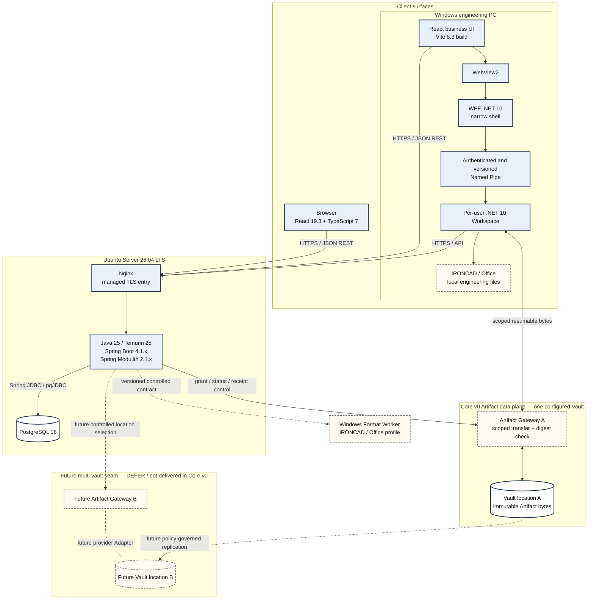
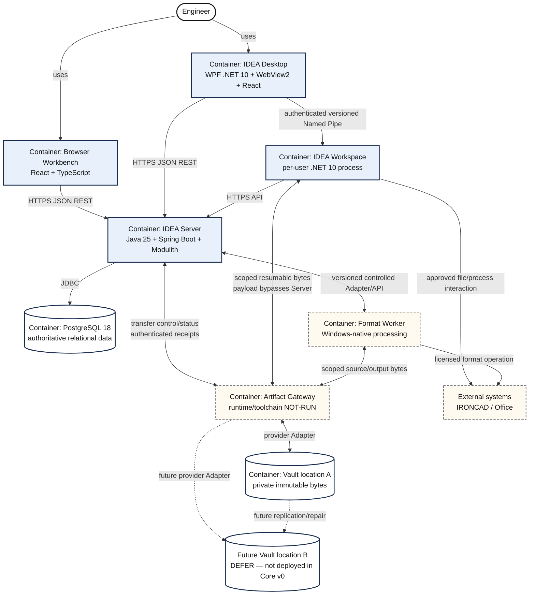
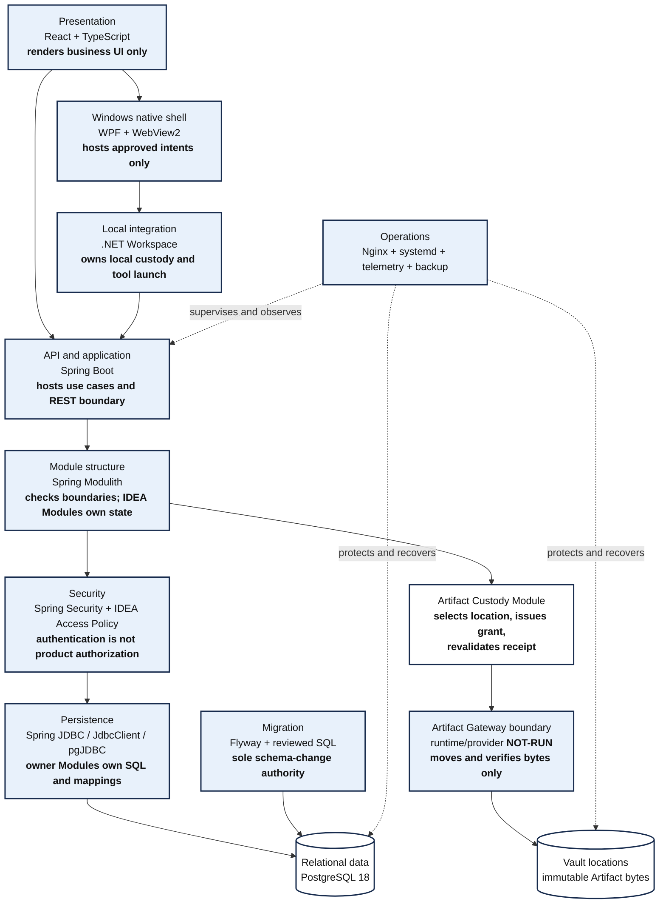
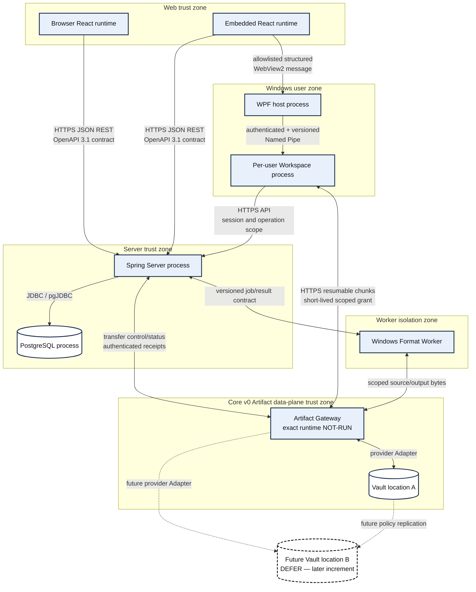
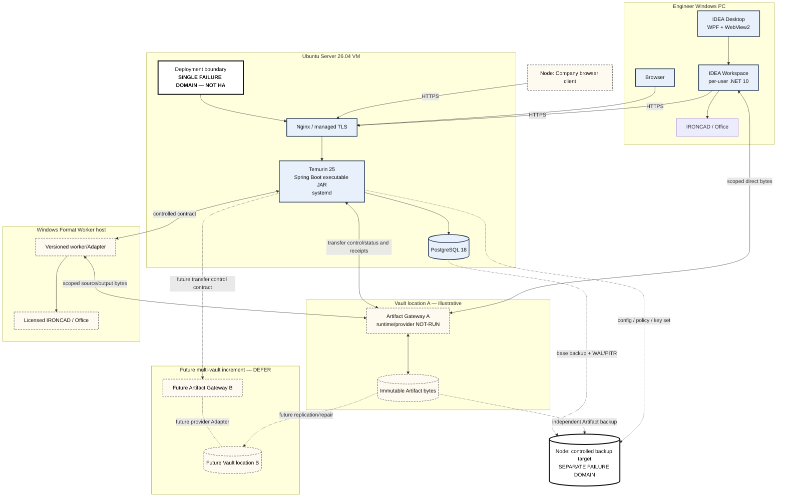
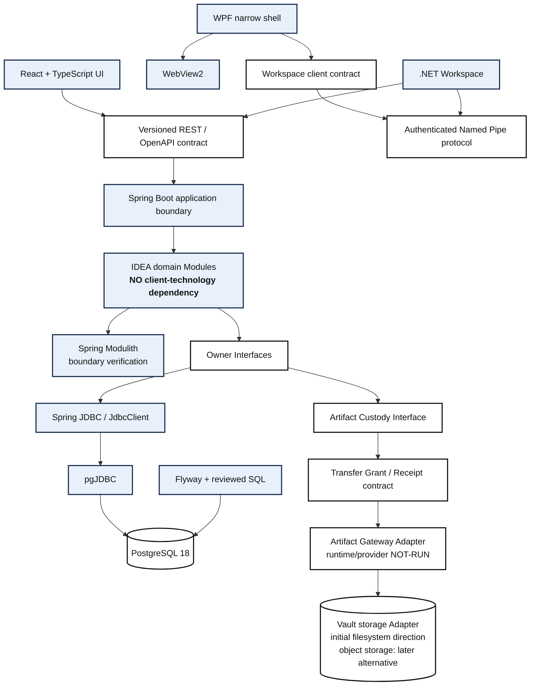
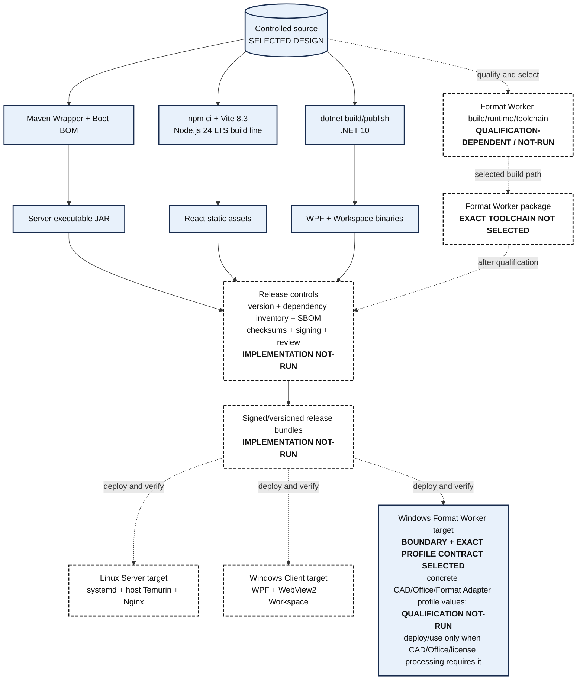
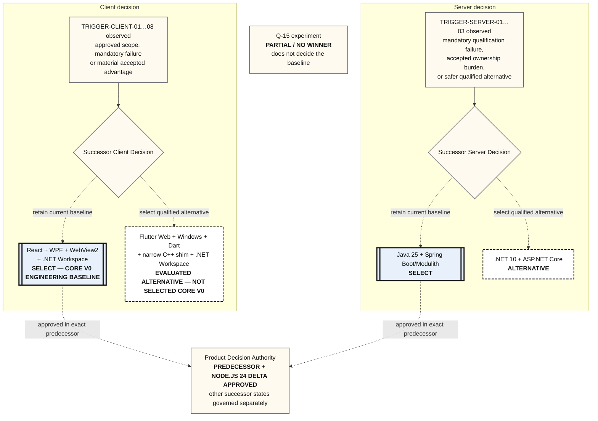

# IDEA Engineering Core v0 Technology Architecture View Set

| Control field | Value |
|---|---|
| Stable Document ID | `IE-ARC-TECH-VIEW-001` |
| Document class | `ARC` / Technology Architecture View Set |
| Title | IDEA Engineering Core v0 Technology Architecture View Set |
| Version / status | `0.5` / `Draft` |
| Artifact role | Focused views of the Engineering-selected Core v0 technology baseline; companion to the decision matrix and TECH-001, not a replacement for DOC-05 |
| Product normativity | `INFORMATIVE` — visualizes the selected implementation direction and creates no FTR/REQ/product behavior |
| Repository process authority / instruction state | `NOT-APPLICABLE` / `NOT-APPLICABLE` |
| Owner / author | Principal Product Author; named attribution `BLOCKED` before `Proposed` |
| Reviewer / acceptance authority | Independent architecture/technology review `NOT-RUN`; Product Decision Authority approved the exact predecessor Tech baseline and Node.js 24 Web-build delta; remaining successor authority states follow their records |
| Applicable baseline | `IDEA-C1-ANALYSIS-DESIGN-001`; DOC-05@0.22; `IE-KNW-TECH-DEC-001@0.7`; `TECH-001@0.16`; `IE-PLAN-DEC2026-003@0.2` |
| Source / upstream trace | [`IE-STD-TECH-STACK-001@0.1`](../../../../agents/technology-stack-documentation-standard.md); [DOC-05](../DOC-05-architecture-description.md); [`IE-KNW-TECH-DEC-001@0.7`](../../../knowledge/2026-09-13-core-v0-technology-decision-matrix.md); [`TECH-001@0.16`](../decision-briefs/TECH-001-technology-and-architecture-proposal.md); [ADR-0013](../../../../adr/0013-separate-artifact-control-and-data-planes.md) |
| Downstream trace | Current Core v0 one-Vault correction rendition and focused author review: [`IE-VEV-TECH-VIEW-004`](../registers/VEV-2026-09-23-one-vault-core-v0-technology-view-correction.md) and [current technology SVG/PNG gallery](../evidence/IE-VEV-TECH-VIEW-004/index.html); Node.js 24 predecessor rendition [`IE-VEV-TECH-VIEW-003`](../registers/VEV-2026-09-23-node24-technology-view-refresh.md), Vault successor gallery [`IE-VEV-VAULT-XFER-002`](../registers/VEV-2026-09-18-vault-transfer-diagram-review.md) and earlier packages remain historical evidence |
| Change record | [`IE-CHG-PH0-CORR-002`](../registers/CHG-2026-09-23-post-analysis-consistency-correction.md); [`IE-CHG-TECH-NODE24-001`](../registers/CHG-2026-09-23-node24-web-build-baseline.md); [`IE-CHG-VAULT-XFER-001`](../registers/CHG-2026-09-17-multi-location-vault-transfer-architecture.md); predecessor correction [`IE-CHG-TECH-VIEW-CORR-001`](../registers/CHG-2026-09-15-technology-architecture-view-correction.md) |
| Predecessor | `IE-ARC-TECH-VIEW-001@0.4`; successor source/diagram/SVG/PNG hashes are recorded in the current rendition evidence |
| Supersedes / superseded by | Supersedes `IE-ARC-TECH-VIEW-001@0.4` / `NOT-APPLICABLE` |
| Review trigger | Technology baseline, deployment topology, protocol, trust boundary, build/release path or client reopen disposition changes |
| Access / retention | `INTERNAL`; retain with the technology baseline and successor history |
| Evidence status | Mermaid source, Core v0 one-Vault correction rendering, standalone-SVG inspection and focused author visual review are recorded in `IE-VEV-TECH-VIEW-004`; independent architecture review and runtime qualification remain `NOT-RUN`; PDA authority is mixed and follows the linked decision records |

## Reading rule and notation

These eight views answer different questions. They deliberately omit class-level design, database
tables and full domain behavior already owned by DOC-05/DOC-06. A box is a logical software/runtime
boundary unless a view explicitly labels it as a machine or deployment node. “Container” in TECH-D02
uses the C4 meaning (an application or data store), not Docker.

| Visual convention | Meaning in every view |
|---|---|
| Solid box and solid relationship | Selected Core v0 engineering direction or required relationship |
| Dashed box/relationship | Alternative, conditional, external or planned-but-not-implemented element as labelled |
| `[SELECT]`, `[ALTERNATIVE]`, `[CONDITIONAL]`, `[DEFER]`, `[REJECT CORE V0]` | Authoritative text status; color is not required to interpret it |
| Arrow | Dependency, call or transfer in the labelled direction; not a time sequence unless stated |
| Boundary | Process, trust, node or responsibility boundary named in that view |

## TECH-D01 — Technology Stack Overview

| View metadata | Recorded value |
|---|---|
| View ID / title | `TECH-D01` — Technology Stack Overview |
| Purpose | Show the selected Web, installed Windows, Server, storage and Windows-format technology families in one readable overview. |
| Stakeholders / concerns | Product Decision Authority, Engineering, IT; scope fit, principal runtimes, technology ownership and deployment shape. |
| Viewpoint / notation | Technology stack overview; Mermaid flowchart with grouped runtime boundaries. |
| Source | Matrix@0.7 sections 2/6–8; TECH-001@0.16; DOC-05@0.22 container/deployment views. |
| Current status / authority | `Draft`; Engineering baseline selected; exact technology disposition is owned by Matrix/TECH, architecture semantics by DOC-05. |
| Qualification boundary | Does not prove compatibility, security, capacity, HA or deployability and does not create Product Decision Authority approval. Existing approvals remain owned by their decision records. Q-01…Q-14 remain `NOT-RUN`; Q-15 remains `PARTIAL / NO WINNER`. |

**Text alternative.** The same React/TypeScript business UI serves Browser and Desktop. Desktop adds
WebView2, a narrow WPF .NET 10 shell and an authenticated/versioned Named Pipe to a separate per-user
.NET 10 Workspace. Browser, embedded React and Workspace call the Ubuntu-hosted Java/Spring Server
through HTTPS for authentication, authorization, operation preparation and authoritative commit. The
Workspace sends or receives large file bytes directly through one configured Artifact Gateway and
Vault location under a short-lived scoped grant. The dashed second location is the preserved
multi-vault seam for a later increment; it is not deployed in Core v0. Future replication does not
create a new Artifact identity and is not backup. The Server uses PostgreSQL and a versioned contract
for an isolated Windows Format Worker. Exact Gateway runtime/provider is `NOT-RUN`.

## TECH-D02 — C4 Container / Technology Boundary View

| View metadata | Recorded value |
|---|---|
| View ID / title | `TECH-D02` — C4 Container / Technology Boundary View |
| Purpose | Identify the independently running applications/data stores and the technology/protocol crossing each boundary. |
| Stakeholders / concerns | Architecture, implementation, security and operations reviewers; executable ownership, trust and integration seams. |
| Viewpoint / notation | C4-style Container view rendered with Mermaid flowchart notation; a C4 Container is not a Docker container. |
| Source | DOC-05@0.22 `ARCH-VIEW-CON-001`; Matrix@0.7; TECH-001@0.16; DOC-07@0.17. |
| Current status / authority | `Draft`; DOC-05 owns container responsibilities; Matrix/TECH own exact selected technologies. |
| Qualification boundary | Does not establish process count under load, ports, host count, network rules, capacity or HA. |

**Text alternative.** The running containers are Browser Workbench, IDEA Desktop, IDEA Workspace,
IDEA Server, PostgreSQL, one configured Artifact Gateway/Vault and Format Worker. IRONCAD/Office are
external. Business control uses HTTPS JSON; the Desktop-to-Workspace seam uses an authenticated/
versioned Named Pipe. Large payload bytes bypass the Server process and use a scoped resumable
Workspace–Gateway transfer. Vault B is a deferred boundary showing that the same contract can later
address another location; it is not a Core v0 runtime component. The Server alone authorizes and
commits product state; a Gateway receipt is evidence for revalidation, not Check-in success. Exact
Gateway runtime/provider remains `NOT-RUN`.

## TECH-D03 — Technology Layer Mapping

| View metadata | Recorded value |
|---|---|
| View ID / title | `TECH-D03` — Technology Layer Mapping |
| Purpose | Map each selected technology to its bounded responsibility and show where IDEA domain authority remains. |
| Stakeholders / concerns | Developers and architecture reviewers; framework role, domain ownership and prevention of accidental authority leakage. |
| Viewpoint / notation | Responsibility/layer mapping; Mermaid flowchart. |
| Source | Matrix@0.7 selected-stack records; DOC-05 Module ownership; accepted ADRs C1-003…006. |
| Current status / authority | `Draft`; Matrix/TECH own selection, DOC-05 owns business authority and Module boundaries. |
| Qualification boundary | Does not prescribe classes/packages or prove that module checks and runtime controls are implemented. |

**Text alternative.** React/TypeScript owns presentation; WPF/WebView2 only hosts the installed UI;
Workspace owns local custody and tool launch. Spring Boot hosts APIs/use cases, Modulith checks rather
than creates Module ownership, Spring Security authenticates and IDEA Access Policy authorizes.
Owner Modules retain SQL/state authority through JDBC/PostgreSQL; Flyway owns schema migration;
Artifact Custody owns location selection, grant/receipt validation and custody policy; the Gateway
moves/verifies bytes only and Vault locations retain immutable copies. Nginx/systemd/telemetry/backup
are operational mechanisms. This mapping selects the boundary, not a Gateway runtime or provider.

## TECH-D04 — Runtime & Protocol View

| View metadata | Recorded value |
|---|---|
| View ID / title | `TECH-D04` — Runtime & Protocol View |
| Purpose | Make every selected process-to-process protocol and principal trust boundary explicit. |
| Stakeholders / concerns | Security, implementation and integration reviewers; authentication, versioning, protocol ownership and refusal boundaries. |
| Viewpoint / notation | Runtime communication/data-flow view; Mermaid flowchart with trust-zone grouping. |
| Source | DOC-05@0.22 security/container views; Matrix@0.7 sections 5–8; TECH-001@0.16; DOC-07@0.17. |
| Current status / authority | `Draft`; protocol families selected by Engineering; detailed contracts and security controls remain owned by DOC-04/05/06. |
| Qualification boundary | Does not assert TLS, origin, Named Pipe authentication, JDBC, worker or large-file tests have passed. |

**Text alternative.** React-to-Server and Workspace-to-Server calls use versioned HTTPS JSON REST.
Embedded React crosses an allowlisted WebView2 message boundary into WPF. WPF crosses a separate
authenticated/versioned Named Pipe boundary to Workspace. The Server uses JDBC to PostgreSQL and
retains authorization/commit authority. File payloads move directly between Workspace and the
selected Artifact Gateway under a short-lived scoped grant; Vault paths and permanent credentials
remain hidden. The Gateway returns transfer evidence only. Its Format Worker exchange uses a
versioned contract. Exact Gateway runtime/provider remains `NOT-RUN`.

## TECH-D05 — Deployment View

| View metadata | Recorded value |
|---|---|
| View ID / title | `TECH-D05` — Deployment View |
| Purpose | Place selected deployables on initial machines and show failure-domain and backup boundaries. |
| Stakeholders / concerns | IT, operations, security and release reviewers; installation, supervision, recovery and availability claims. |
| Viewpoint / notation | C4-style Deployment view rendered with Mermaid flowchart notation. |
| Source | DOC-05@0.22 deployment/recovery views; Matrix@0.7 section 8; TECH-001@0.16; DOC-07@0.17. |
| Current status / authority | `Draft`; Core v0 deploys one Server control plane and one configured Gateway/Vault location. The Artifact Custody/Gateway seam preserves a later multi-vault extension; the second location, replication and failover behavior are `DEFER` for Core v0. Exact Gateway/Vault hosts, runtime/provider and policy thresholds remain subject to company/PDA review and qualification. |
| Qualification boundary | **Core v0 Server baseline is not HA.** One configured Vault is delivered in Core v0. The future second location does not create a current availability claim. Host count/sizing, network policy, failure domains, production entitlement, restore result and operating approval remain unqualified. |

**Text alternative.** Windows engineer PCs run Browser/Desktop/Workspace and external tools. One
Ubuntu VM runs Nginx, Spring Boot/Temurin and PostgreSQL. Workspace transfers large bytes directly
through one configured Gateway to Vault location A under a Server-issued grant. The dashed Gateway B
and Vault B show only the later extension seam; Core v0 does not deploy, replicate to or fail over to
that location. An optional separate Windows host runs licensed format processing. Coordinated
database, Artifact, configuration/policy and key material goes to an independent backup target. A
future replica and backup remain different controls; the single Server VM is not HA.

## TECH-D06 — Technology Dependency View

| View metadata | Recorded value |
|---|---|
| View ID / title | `TECH-D06` — Technology Dependency View |
| Purpose | Show permitted direct technology dependency direction without listing transitive packages or creating cycles. |
| Stakeholders / concerns | Developers, maintainers and supply-chain reviewers; coupling, replaceable seams and dependency authority. |
| Viewpoint / notation | Technology dependency view; Mermaid flowchart. |
| Source | Matrix@0.7 dependency classes; DOC-05 deep-Module rules; ADR C1-003. |
| Current status / authority | `Draft`; selected dependency direction, not package-level implementation evidence. |
| Qualification boundary | Does not prove resolved dependency versions, license/SBOM completeness or Modulith boundary tests. |

**Text alternative.** Client technologies depend on REST or Workspace contracts and never on IDEA
domain Modules. WPF depends on WebView2 and the Workspace client contract; Workspace implements the
Named Pipe side and consumes the Server API. Spring Boot hosts domain Modules; Modulith checks their
boundaries. Owner Interfaces lead to JDBC/pgJDBC/PostgreSQL or the Artifact Custody Interface.
Artifact Custody depends on a provider-neutral Transfer Grant/Receipt contract; a separately
qualified Gateway Adapter reaches the selected Vault Adapter. Filesystem remains the initial Adapter
direction; object storage is a later alternative. The exact Gateway implementation remains subject
to qualification; this view makes no new technology selection. Flyway separately controls schema
migration. No dependency cycle is intended.

## TECH-D07 — Build / Packaging / Deployment Pipeline

| View metadata | Recorded value |
|---|---|
| View ID / title | `TECH-D07` — Build / Packaging / Deployment Pipeline |
| Purpose | Show the selected build outputs and required release controls before deployment to each runtime family. |
| Stakeholders / concerns | Engineering, release, security and operations; reproducibility, provenance, signing, SBOM, package ownership and rollback. |
| Viewpoint / notation | Build/release pipeline design; Mermaid flowchart. |
| Source | Matrix@0.7 build/deployment decisions; TECH-001@0.16; standards register supply-chain guidance. |
| Current status / authority | `SELECTED DESIGN / IMPLEMENTATION NOT-RUN`; Engineering baseline selected, no CI/release-pipeline PASS. |
| Qualification boundary | The diagram is a design. It does not claim CI, signing, SBOM generation, package publication, migration or rollback is implemented. |

**Text alternative.** Maven Wrapper creates the Server JAR, npm/Vite creates React assets, and
`dotnet build/publish` creates only the WPF and Workspace binaries. The separate Format Worker
boundary and the contract requiring an exact CAD/Office/Format Adapter profile are `SELECT`.
Concrete profile values and the Worker build/runtime/toolchain remain qualification-dependent and
`NOT-RUN`. A Worker package enters the release controls only after its toolchain is separately
selected. The Worker is deployed or used only when the exact CAD/Office/license processing profile
requires it. Release controls and all depicted deployments remain `IMPLEMENTATION NOT-RUN`; this is
not a claim that CI exists.

## TECH-D08 — Technology Decision & Reopen Map

| View metadata | Recorded value |
|---|---|
| View ID / title | `TECH-D08` — Technology Decision & Reopen Map |
| Purpose | Show current Client and Server dispositions and the controlled route for reconsidering a non-selected candidate. |
| Stakeholders / concerns | Product Decision Authority, Engineering and architecture reviewers; decision finality, viable alternatives and change triggers. |
| Viewpoint / notation | Decision and evolution map; Mermaid flowchart. Status is written in every node and reinforced with solid/dashed borders. |
| Source | Matrix@0.7 sections 3/6 and reopen register; TECH-001@0.16; `IE-CHG-TECH-BASELINE-001`. |
| Current status / authority | `Draft`; Engineering decision `COMPLETE`, Core v0 baseline `SELECTED`; exact predecessor and Node.js 24 delta are PDA-approved, while remaining successor states follow their records. |
| Qualification boundary | Q-15 remains `PARTIAL / NO WINNER`; this map does not turn any candidate into a Q-15 winner or any Engineering disposition into approval. |

**Text alternative.** Q-15 contributes `PARTIAL / NO WINNER` evidence to a broader Engineering
decision. Engineering selects React + WPF/WebView2 + .NET Workspace for Core v0. Flutter remains an
evaluated alternative. When a Client trigger occurs, a Successor Client Decision may either retain
the current React baseline or select a qualified Flutter alternative. The same rule applies to the
Server: a Server trigger leads to a Successor Server Decision that may retain Java/Spring or select
qualified .NET/ASP.NET Core. No trigger predetermines its outcome. Tauri remains an alternative,
browser-only requires a Product decision and Electron is rejected only for Core v0. PDA approval is
`NOT-RUN`.

## Client reopen trigger register

| Trigger | Observable condition | Decision effect and evidence needed |
|---|---|---|
| `TRIGGER-CLIENT-01` | Android or iOS becomes a first-class approved Product requirement. | Reopen Flutter and other viable cross-platform candidates against the approved mobile scope. |
| `TRIGGER-CLIENT-02` | macOS or Linux Desktop becomes a first-class approved Product requirement. | Reopen the installed-client choice using the exact target platforms and engineering-tool constraints. |
| `TRIGGER-CLIENT-03` | React/WPF/WebView2 has a measured mandatory security defect that cannot be mitigated acceptably. | Reopen with retained threat/test evidence and an approved risk disposition; do not infer Flutter automatically passes. |
| `TRIGGER-CLIENT-04` | The selected client fails an approved mandatory performance requirement. | Compare viable candidates on the same approved workload/configuration and retained measurements. |
| `TRIGGER-CLIENT-05` | The selected client fails an approved mandatory accessibility requirement. | Compare exact Web/Windows assistive behavior with specialist-reviewed evidence. |
| `TRIGGER-CLIENT-06` | Web ceases to be a first-class Product surface. | Re-evaluate the value of a shared DOM/React business UI and all viable native/cross-platform options. |
| `TRIGGER-CLIENT-07` | Measured WPF/WebView2/native-bridge maintenance burden materially exceeds a management-accepted threshold. | Reopen using named ownership, incident, patch, onboarding, build and lifecycle evidence; no arbitrary threshold is invented here. |
| `TRIGGER-CLIENT-08` | A future controlled qualification demonstrates a material total-cost/risk advantage for Flutter. | Create a successor decision using the same mandatory behavior/security/custody gates and obtain the applicable approvals. |

The eight triggers keep Flutter viable without making its unresolved Phase 3 environment work a
Core v0 blocker. For every trigger, Engineering prepares the evidence and recommendation; the
Product Decision Authority owns the successor decision. A trigger opens a review; it does not
automatically switch the baseline.

## Server reopen trigger register

| Trigger | Observable condition | Required evidence and decision owner |
|---|---|---|
| `TRIGGER-SERVER-01` | The selected Java/Spring configuration fails an approved mandatory qualification. | Retain the failed objective, exact configuration and comparable alternative result. Engineering recommends; Product Decision Authority decides. |
| `TRIGGER-SERVER-02` | Measured two-runtime ownership burden exceeds a management-accepted threshold. | Retain staffing, build, patch, support, incident and lifecycle evidence against the accepted threshold. Engineering recommends; Product Decision Authority decides. |
| `TRIGGER-SERVER-03` | A company-supported .NET candidate is demonstrated to be safer while meeting every approved mandatory behavior. | Retain a like-for-like security, behavior, operations and total-risk comparison. Engineering recommends; Product Decision Authority decides. |

Each Server trigger opens the successor decision shown in TECH-D08. It does not select .NET or
force retention of Java in advance.

## View-set version history

| Version | Date | Status | Change |
|---|---|---|---|
| `0.5` | 2026-09-23 | Draft | Correct TECH-D01/D02/D04/D05 so Core v0 deploys one configured Vault while retaining a visibly deferred multi-vault seam. No Feature, Spec, Tech selection, Product Scope, Q-15, PDA or gate state changes. |
| `0.4` | 2026-09-23 | Draft | Record the PDA-approved Node.js 24 LTS Web-build baseline and refresh TECH-D07; no topology, protocol, Product Scope, Q-15 or gate change. Successor render evidence is recorded separately. |
| `0.3` | 2026-09-17 | Draft | Add control-plane/data-plane separation and multi-location Vault capability to TECH-D01…D06; correct control/receipt directions and worker byte paths; retain initial filesystem Adapter direction. Current render/open and focused author review are recorded in `IE-VEV-VAULT-XFER-002`. Gateway runtime/provider, independent review and runtime qualification remain `NOT-RUN`; Technology Stack, Q-15, Product Scope, PDA and PG states are unchanged. |
| `0.2` | 2026-09-15 | Draft | Correct TECH-D07 so `.NET` applies only to WPF/Workspace and the selected Worker boundary retains an unselected toolchain; correct TECH-D08 so Client and Server triggers lead to an unbiased successor decision; baseline, Q-15, Product Scope, PDA and PG states unchanged |
| `0.1` | 2026-09-15 | Draft | Initial TECH-D01…D08 set for the Engineering-selected Core v0 baseline; Q-15 remains `PARTIAL / NO WINNER`, PDA and PG states unchanged |
