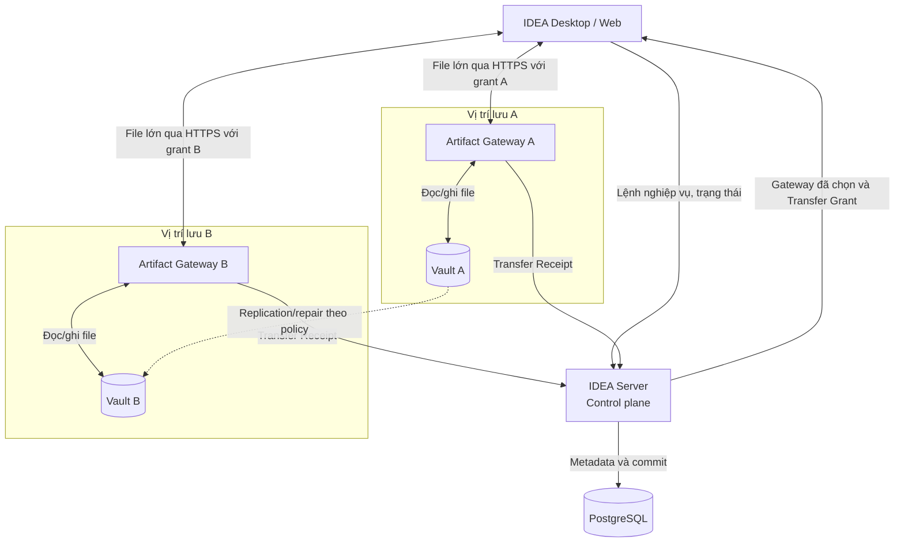
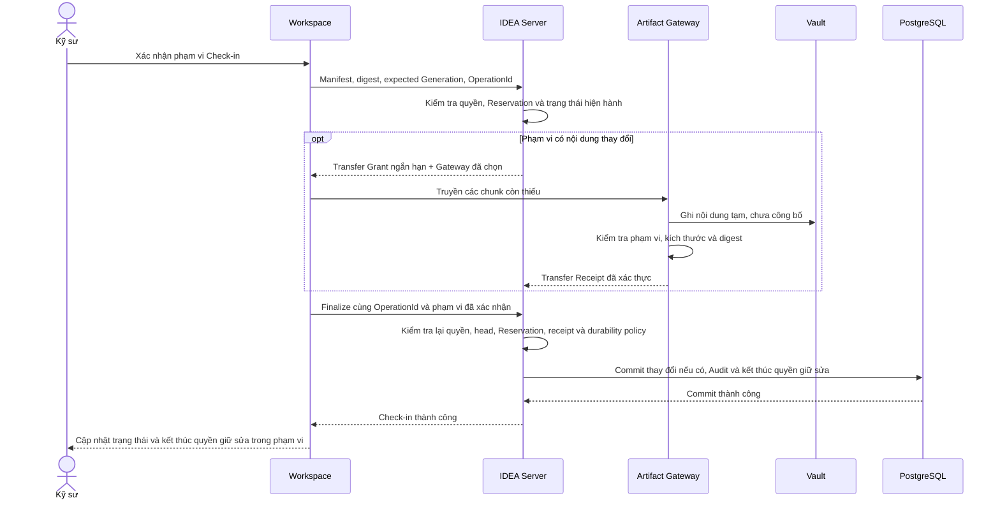
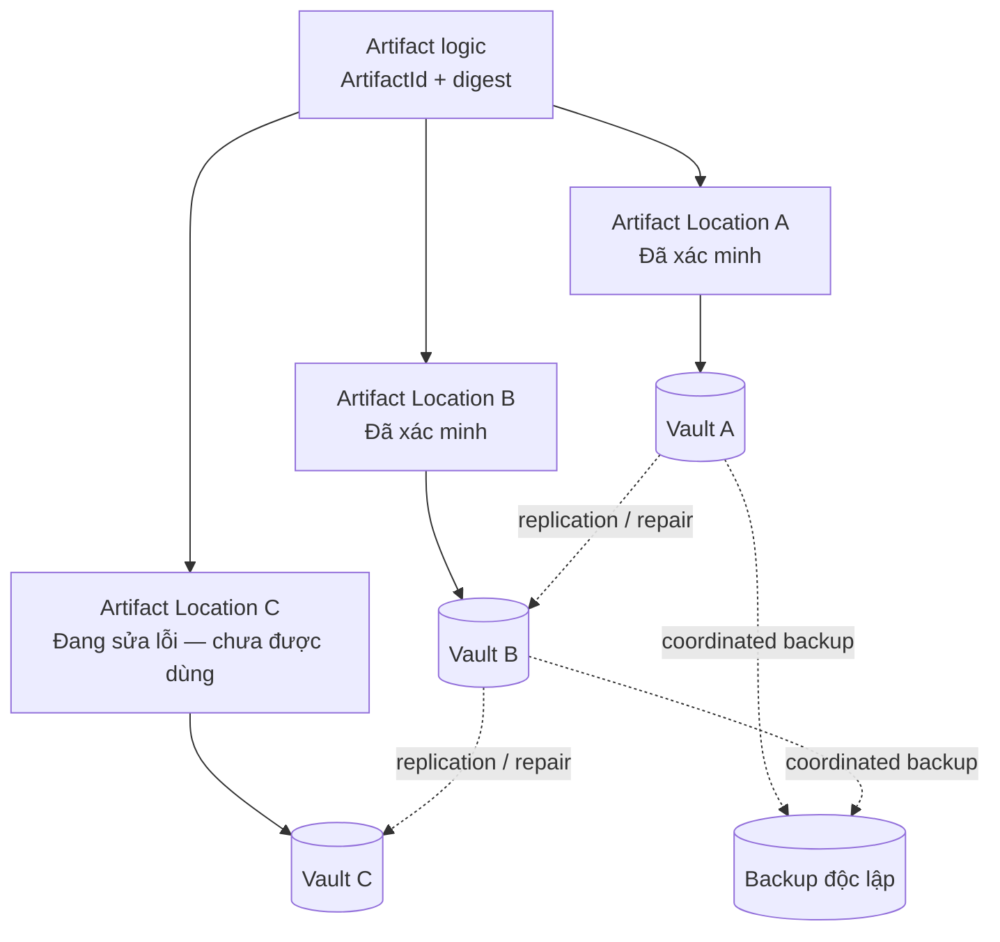

# Hướng dẫn cập nhật bản Word trên SharePoint — Luồng file lớn và Vault nhiều vị trí

Ngày lập: 17-09-2026  
Phạm vi: chỉ hướng dẫn biên tập bản Word đã gửi trên SharePoint; không thay đổi trực tiếp file Word.  
Nguồn hiện hành: [DOC-04@0.14](../product/instances/idea-engineering/DOC-04-software-requirements-specification.md), [DOC-05@0.21](../product/instances/idea-engineering/DOC-05-architecture-description.md), [DOC-06@0.17](../product/instances/idea-engineering/DOC-06-data-integration-and-migration-specification.md), [DOC-08@0.13](../product/instances/idea-engineering/DOC-08-ui-ux-and-interaction-specification.md), [ADR-0013](../adr/0013-separate-artifact-control-and-data-planes.md) và [Change Record](../product/instances/idea-engineering/registers/CHG-2026-09-17-multi-location-vault-transfer-architecture.md).

## 1. Nội dung cần giữ nguyên

- Backend vẫn có thể chạy trên một máy ở giai đoạn đầu.
- Server vẫn là nơi xác thực, phân quyền, kiểm tra trạng thái, quản lý Checkout/Reservation và quyết định Check-in có thành công hay không.
- PostgreSQL vẫn lưu dữ liệu nghiệp vụ có thẩm quyền; file lớn không được đưa vào PostgreSQL.
- Tech Stack đã chọn, Q-15, Product Scope, PG3 và PG4 không thay đổi.
- Check-in chỉ thành công khi toàn bộ phạm vi đã xác nhận được Server kiểm tra và commit. Truyền file xong chưa phải Check-in thành công.

## 2. Các câu cũ cần tìm và thay

Tìm trong Word các câu hoặc hình có ý tương đương với bảng sau. Không cần đúng từng chữ mới thay.

| Nội dung cũ cần tìm | Vì sao phải sửa | Nội dung mới |
|---|---|---|
| `Store → Server → Workspace` | Làm người đọc hiểu mọi byte file đều đi xuyên qua Server. | Control đi qua Server; file lớn truyền trực tiếp giữa Workspace và Artifact Gateway được Server cấp quyền. |
| `Server-mediated Artifact transfer` | Đúng với bản cũ, không còn đúng với successor. | Server-mediated control, scoped direct Artifact data transfer. |
| `Server alone accesses Artifact Store` | Không thể hiện Gateway và nhiều Vault location. | Server quyết định quyền và vị trí; Gateway truyền/xác minh byte; Vault lưu byte. |
| `Private server-managed filesystem Artifact Store` | Gắn kho file vào một Server/một volume. | Multi-location Artifact Gateway/Vault; filesystem-backed Adapter là hướng triển khai ban đầu, không phải một volume bắt buộc nằm cùng Server. |
| Một VM chứa Server + PostgreSQL + Artifact volume | Tạo một điểm nghẽn băng thông và một nơi lưu file duy nhất. | Một Server control plane; một hoặc nhiều Gateway/Vault node; số lượng và vị trí chính xác chờ qualification. |
| `Replica` được gọi là `backup` | Replica có thể sao chép cả lỗi/xóa nhầm và thường cùng hệ thống vận hành. | Replication phục vụ độ bền/khả dụng trực tuyến; backup là bản khôi phục độc lập. |

## 3. Đoạn tóm tắt có thể dán vào Word

> IDEA DDM tách luồng điều khiển khỏi luồng truyền file. Người dùng vẫn gửi lệnh Checkout, Reference,
> Check-in và yêu cầu tải file đến IDEA Server. Server xác thực người dùng, kiểm tra quyền, trạng thái
> tài liệu và chọn nơi lưu phù hợp. Với file lớn, Workspace không gửi toàn bộ dữ liệu xuyên qua tiến
> trình Server. Thay vào đó, Server cấp một quyền truyền ngắn hạn cho đúng thao tác và đúng file;
> Workspace truyền dữ liệu trực tiếp qua Artifact Gateway đến Vault đã chọn. Gateway kiểm tra kích
> thước và mã kiểm tra nội dung rồi gửi kết quả về Server. Chỉ sau khi Server kiểm tra lại đầy đủ và
> commit giao dịch thì Check-in mới được ghi nhận thành công.

## 4. Đoạn mô tả các khối có thể dán vào bảng kiến trúc

| Khối | Mô tả đề nghị |
|---|---|
| IDEA Server | Xử lý đăng nhập, phân quyền, trạng thái tài liệu, Checkout/Reservation, chuẩn bị và hoàn tất Check-in. Server quyết định kết quả nghiệp vụ nhưng không phải gánh toàn bộ byte của file lớn. |
| PostgreSQL | Lưu metadata, trạng thái, quan hệ, quyền, workflow, Release Record, Audit Evidence và thông tin vị trí file. Không lưu nội dung file lớn. |
| Artifact Gateway | Nhận quyền truyền ngắn hạn do Server cấp; truyền tiếp hoặc đọc file từ Vault; kiểm tra phạm vi, kích thước và digest; trả Transfer Receipt. Gateway không có quyền tự tạo Generation hoặc công bố Check-in thành công. |
| Vault | Lưu byte bất biến của Artifact. Hệ thống có thể có nhiều Vault location. Tên nhà cung cấp, đường dẫn vật lý và credential không trở thành identity của tài liệu. |
| Workspace | Giữ file làm việc trên máy kỹ sư, tính digest, tiếp tục truyền phần còn thiếu và bảo toàn dữ liệu cục bộ khi lỗi. Workspace không nhận credential Vault lâu dài. |
| Storage/Durability Policy | Quy định vị trí nào được dùng, cần bao nhiêu bản đã xác minh và khi nào replication/repair phải hoàn tất. Giá trị cụ thể chưa chốt. |
| Backup | Bản khôi phục độc lập của PostgreSQL, Artifact, cấu hình, policy và khóa cần thiết. Backup không được thay bằng replication giữa các Vault. |

## 5. Hình 1 — Tổng quan control plane và data plane

**View ID:** `MGMT-VLT-001` — Luồng điều khiển và truyền file.  
**Loại hình:** Data-flow view; bản giản lược dành cho quản lý (`Management simplification`).  
**Nguồn:** `ARCH-VIEW-CON-001`, `ARCH-VIEW-DEP-001`, `ARCH-VIEW-SEC-001` trong DOC-05@0.21.  
**Mục đích:** giúp quản lý thấy rõ quyền quyết định nằm ở Server, còn byte file lớn không đi xuyên qua Server.  
**Ký hiệu:** hộp là ứng dụng hoặc Gateway; hình trụ là nơi lưu; mũi tên ghi rõ lệnh, file hoặc kết quả; nét đứt là replication. A/B chỉ minh họa nhiều vị trí, không chốt số máy.  
**Không được suy diễn:** hình không chốt số máy, sản phẩm lưu trữ, băng thông, HA hoặc runtime của Gateway.

**Chú thích hình để dán vào Word:**

> Hình — Tách luồng điều khiển và luồng truyền file. Server giữ quyền xác thực, phân quyền và commit;
> file lớn truyền trực tiếp qua Gateway được cấp quyền đến Vault đã chọn. Nhiều Vault location không
> đồng nghĩa Server đã có High Availability.

## 6. Hình 2 — Trình tự Check-in file lớn

**View ID:** `MGMT-VLT-002` — Check-in qua Gateway.  
**Loại hình:** UML Sequence Diagram; bản giản lược dành cho quản lý (`Management simplification`).  
**Nguồn:** `ARCH-VIEW-SEQ-002`, `ARCH-VIEW-SEQ-006`, `ARCH-VIEW-SEQ-013` trong DOC-05@0.21.  
**Mục đích:** giải thích vì sao “upload xong” chưa phải “Check-in thành công”.  
**Ký hiệu:** thời gian đi từ trên xuống; nét liền là yêu cầu, nét đứt là kết quả; `opt` là bước chỉ chạy khi có thay đổi. Đây là nhánh thành công; các nhánh lỗi nằm trong controlled views được dẫn nguồn.  
**Không được suy diễn:** chưa chốt protocol chi tiết, kích thước chunk, timeout hoặc số lần retry.

**Chú thích hình để dán vào Word:**

> Hình — Check-in gồm hai phần tách biệt: truyền/xác minh byte và commit trạng thái nghiệp vụ. Gateway
> chỉ xác nhận dữ liệu đã được nhận đúng; IDEA Server mới quyết định Check-in có thành công hay không.

Nếu policy yêu cầu thêm bản sao đã xác minh, Server chỉ hoàn tất Check-in sau khi điều kiện đó đạt.
Không có thay đổi thì bỏ qua truyền file và không tạo Generation mới; Check-in thành công vẫn kết
thúc quyền giữ sửa trong phạm vi đã xác nhận. Lỗi hoặc bản làm việc đã cũ giữ nguyên công việc cục bộ.

## 7. Hình 3 — Một Artifact, nhiều nơi lưu

**View ID:** `MGMT-VLT-003` — Một Artifact, nhiều vị trí lưu.  
**Loại hình:** Logical data relationship view; bản giản lược dành cho quản lý (`Management simplification`).  
**Nguồn:** `DATA-VIEW-ART-001` trong DOC-06@0.17 và `ARCH-VIEW-EVO-001`, `ARCH-VIEW-SEQ-013` trong DOC-05@0.21.  
**Mục đích:** giải thích một file logic không bị nhân thành nhiều tài liệu khi có nhiều bản lưu vật lý.  
**Ký hiệu:** nét liền là liên kết identity/vị trí; nét đứt có nhãn là replication hoặc backup. Vị trí đang sửa lỗi chưa đủ điều kiện phục vụ tải file hay tính vào số bản đạt policy.  
**Không được suy diễn:** chưa chốt số bản tối thiểu, site, khoảng cách địa lý, replication lag hoặc nhà cung cấp.

**Chú thích hình để dán vào Word:**

> Hình — Một Artifact có một identity và digest nhưng có thể có nhiều Artifact Location đã xác minh.
> Replication hoặc repair không tạo Version/Generation mới. Backup vẫn là cơ chế độc lập.

## 8. Đoạn triển khai và mở rộng có thể dán vào Word

> Giai đoạn đầu có thể dùng một IDEA Server và một PostgreSQL để giảm số thành phần phải vận hành.
> Kho file được thiết kế tách khỏi máy chủ nghiệp vụ và có thể mở rộng thành nhiều Gateway/Vault
> location. Artifact Custody chọn vị trí theo policy, tình trạng hoạt động, vị trí mạng và dung lượng.
> Khi một vị trí không dùng được, hệ thống chỉ chuyển sang vị trí khác đã xác minh; không thay đổi
> identity hoặc lịch sử tài liệu. Thiết kế này giảm tải băng thông cho Server nhưng không tự tạo High
> Availability cho Server/PostgreSQL. HA, số lượng Vault, failure domain và ngưỡng replication phải
> được chốt và kiểm chứng riêng.

## 9. Glossary cần bổ sung vào Word

| Thuật ngữ | Nghĩa dùng thống nhất trong tài liệu |
|---|---|
| Control plane | Luồng lệnh và quyết định: đăng nhập, phân quyền, phạm vi thao tác, trạng thái, chuẩn bị và commit. |
| Data plane | Luồng byte file lớn giữa Workspace, Gateway và Vault. Không có quyền tự thay đổi trạng thái nghiệp vụ. |
| Artifact | Nội dung file bất biến được nhận diện bằng ArtifactId và digest; không đồng nghĩa Logical Document hoặc Generation. |
| Artifact Gateway | Cổng truyền/xác minh byte theo quyền ngắn hạn. Không sở hữu tài liệu và không công bố Generation. |
| Vault | Nơi lưu byte Artifact. Một hệ thống có thể có nhiều Vault location. |
| Artifact Location | Một bản vật lý đã biết của cùng Artifact tại một Vault cụ thể, kèm trạng thái xác minh. |
| Transfer Grant | Quyền ngắn hạn, giới hạn đúng Operation, Artifact, Gateway, chiều truyền, phạm vi byte, kích thước/digest và thời hạn. |
| Transfer Receipt | Bằng chứng có xác thực do Gateway trả về sau khi nhận/kiểm tra dữ liệu; Server phải kiểm tra lại trước khi commit. |
| Replication | Sao chép/đồng bộ Artifact giữa các Vault theo policy; không tạo Version/Generation mới. |
| Repair | Khôi phục một Artifact Location bị thiếu/hỏng từ một location đã xác minh khác. |
| Storage/Durability Policy | Quy tắc có phiên bản về vị trí được phép, số bản cần có và điều kiện replication/repair. |
| Backup | Bản khôi phục độc lập dùng khi dữ liệu/hệ thống chính bị mất hoặc hỏng. Backup không đồng nghĩa replica. |
| Digest | Mã kiểm tra nội dung dùng để nhận biết byte có đúng và không bị thay đổi. |
| Workspace | Thư mục làm việc được IDEA quản lý trên máy người dùng, cùng thông tin về file, bản đã tải và quyền giữ sửa. |
| Manifest | Danh sách chính xác các file, identity, digest và bản tài liệu thuộc một thao tác hoặc bộ hồ sơ. |
| Chunk / byte range | Một phần dữ liệu file được truyền và xác minh riêng để có thể truyền tiếp khi gián đoạn. |
| OperationId | Mã duy nhất của một thao tác. Dùng lại mã này để hỏi kết quả hoặc truyền tiếp cùng thao tác, tránh ghi nhận hai lần. |
| Finalize | Yêu cầu Server hoàn tất cùng thao tác đã chuẩn bị, sau khi kiểm tra dữ liệu và điều kiện hiện hành. |
| Commit | Ghi nhận thành công toàn bộ thay đổi nghiệp vụ của giao dịch. Trước commit, nội dung tạm chưa trở thành bản tài liệu chính thức. |
| Generation | Identity hệ thống của một bản nội dung bất biến. Người dùng theo dõi Version; Generation dùng để pin và tái tạo đúng bản. |
| Version | Số bản nội dung người dùng theo dõi trong một Revision; không phải một loại identity thứ hai bên cạnh Generation. |
| Revision | Mốc sửa đổi nghiệp vụ của tài liệu; bên trong một Revision có thể có nhiều Version. |
| Expected Generation | Generation mà bản làm việc dựa trên; Server so với head hiện hành để phát hiện bản làm việc đã cũ. |
| Working Head / head | Bản nội dung hiện hành của tài liệu trong Revision đang làm. |
| Reservation | Bản ghi quyền giữ sửa của một tài liệu cho một người dùng và Workspace trong thời gian hiệu lực. |
| No Change | Kết quả không có thay đổi nội dung. Check-in thành công vẫn kết thúc quyền giữ sửa trong phạm vi xác nhận. |
| Change Set | Tập các thay đổi được ghi nhận cùng nhau trong một Check-in; không công bố một phần nếu phần còn lại bị từ chối. |
| Audit Evidence / Audit | Nhật ký có thẩm quyền ghi ai thực hiện, thao tác gì, trên phạm vi nào, lúc nào và kết quả ra sao. |
| Metadata | Thông tin mô tả tài liệu/file như mã, tên, loại, trạng thái và quan hệ; không phải nội dung byte của file. |
| Artifact Custody | Module trên Server quản lý identity Artifact, vị trí lưu, grant, receipt và replication; không quyết định trạng thái tài liệu. |
| Replica | Một bản lưu vật lý của cùng Artifact đã được xác minh; không tạo tài liệu hoặc Version mới. |
| Policy | Bộ quy tắc có phiên bản dùng để quyết định điều kiện hoặc hành vi của hệ thống. |
| High Availability / HA | Khả năng duy trì dịch vụ khi một thành phần gặp lỗi. Nhiều Vault không tự tạo HA cho Server hoặc PostgreSQL. |

## 10. Những câu không được ghi

- “Client truy cập trực tiếp Vault” — phải ghi “Client truyền qua Artifact Gateway bằng Transfer Grant”.
- “Upload thành công là Check-in thành công” — sai; còn bước Server revalidate và commit.
- “Có hai Vault nên hệ thống đã HA” — sai; Server/PostgreSQL vẫn có thể là một điểm lỗi.
- “Replica là backup” — sai; hai cơ chế có mục tiêu và failure domain khác nhau.
- “DDM/Aras dùng đúng kiến trúc này” — chưa có bằng chứng. Đây là thiết kế IDEA tổng hợp từ các pattern và nguồn đã ghi trong research note.
- “Gateway đã chọn công nghệ X” — chưa chọn exact runtime/toolchain/provider.

## 11. Thứ tự sửa bản Word trên SharePoint

[Mở bộ hình hiện hành](../product/instances/idea-engineering/evidence/IE-VEV-VAULT-XFER-002/index.html).
Chỉ dùng hình trong bộ này cho nội dung Vault mới.

| Hình dùng trong Word | PNG để chèn | SVG để mở đầy đủ |
|---|---|---|
| `MGMT-VLT-001` — Luồng điều khiển và truyền file | [PNG](../product/instances/idea-engineering/evidence/IE-VEV-VAULT-XFER-002/MGMT-VLT-001.png) | [SVG](../product/instances/idea-engineering/evidence/IE-VEV-VAULT-XFER-002/MGMT-VLT-001.svg) |
| `MGMT-VLT-002` — Check-in qua Gateway | [PNG](../product/instances/idea-engineering/evidence/IE-VEV-VAULT-XFER-002/MGMT-VLT-002.png) | [SVG](../product/instances/idea-engineering/evidence/IE-VEV-VAULT-XFER-002/MGMT-VLT-002.svg) |
| `MGMT-VLT-003` — Một Artifact, nhiều vị trí lưu | [PNG](../product/instances/idea-engineering/evidence/IE-VEV-VAULT-XFER-002/MGMT-VLT-003.png) | [SVG](../product/instances/idea-engineering/evidence/IE-VEV-VAULT-XFER-002/MGMT-VLT-003.svg) |

Các hình chi tiết nên dẫn link từ caption hoặc phần giải thích liên quan:

- [Truyền tiếp file lớn — ARCH-VIEW-SEQ-006](../product/instances/idea-engineering/evidence/IE-VEV-VAULT-XFER-002/ARCH-VIEW-SEQ-006.svg).
- [Đổi Vault khi tải gián đoạn — ARCH-VIEW-SEQ-012](../product/instances/idea-engineering/evidence/IE-VEV-VAULT-XFER-002/ARCH-VIEW-SEQ-012.svg).
- [Xác minh replica — ARCH-VIEW-SEQ-013](../product/instances/idea-engineering/evidence/IE-VEV-VAULT-XFER-002/ARCH-VIEW-SEQ-013.svg).
- [Check-in và các nhánh từ chối — ARCH-VIEW-SEQ-002](../product/instances/idea-engineering/evidence/IE-VEV-VAULT-XFER-002/ARCH-VIEW-SEQ-002.svg).
- [Tạo PDF/Representation qua Gateway — ARCH-VIEW-SEQ-010](../product/instances/idea-engineering/evidence/IE-VEV-VAULT-XFER-002/ARCH-VIEW-SEQ-010.svg).

Các link trên mở file local để anh kiểm tra. Khi đưa lên SharePoint, tải SVG/PNG mới vào thư mục
`so-do`, lấy link chia sẻ của từng SVG rồi thay link trong Word bằng link SharePoint đó. Anh giữ
PNG trong Word để đọc tại chỗ và dùng SVG qua hyperlink để xem toàn bộ hình ở độ phân giải đầy đủ.

1. Lưu một version của Word hiện tại trước khi sửa.
2. Sửa phần tóm tắt kiến trúc bằng đoạn ở mục 3.
3. Sửa bảng các khối bằng mục 4.
4. Thay các hình một kho file sau Server bằng ba hình ở mục 5–7. SVG/PNG hiện hành và các sơ đồ kỹ thuật đầy đủ được dẫn trong mục 11.
5. Sửa phần triển khai/backup bằng mục 8.
6. Thêm toàn bộ thuật ngữ ở mục 9 vào Glossary và dùng đúng một nghĩa xuyên suốt.
7. Tìm toàn văn theo các cụm ở mục 2 và mục 10 để loại mô tả cũ còn sót.
8. Kiểm tra lại hyperlink, caption, số hình và mục lục hình/bảng trong Word.
9. Ghi chú trạng thái: exact successor PDA approval, Gateway runtime/provider, topology, durability thresholds và runtime verification đều chưa hoàn tất.
