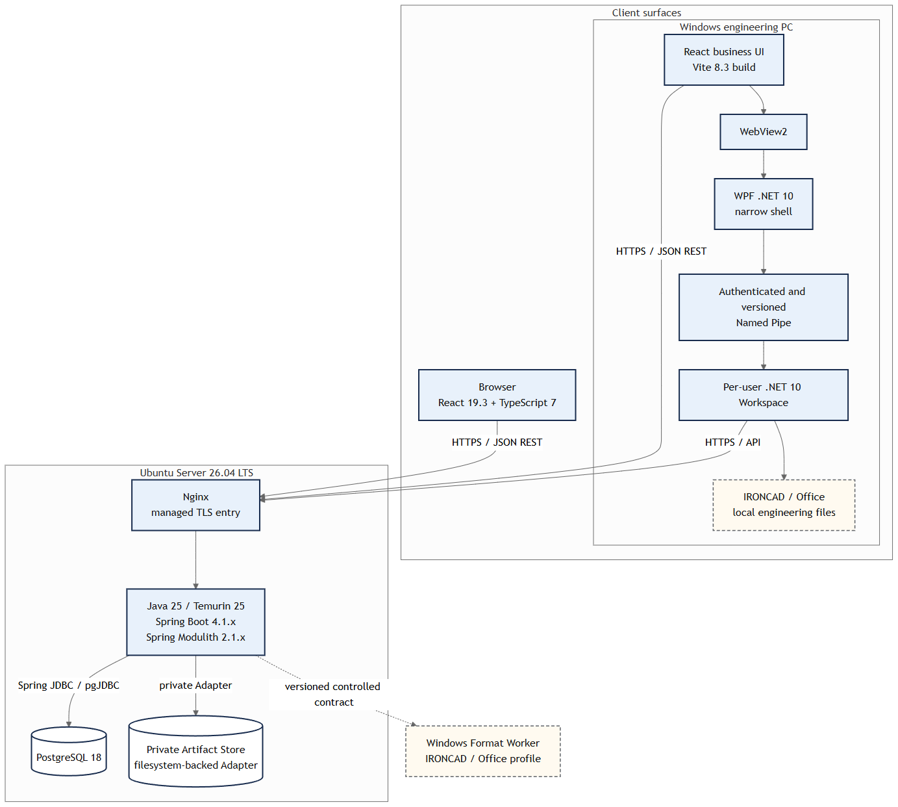
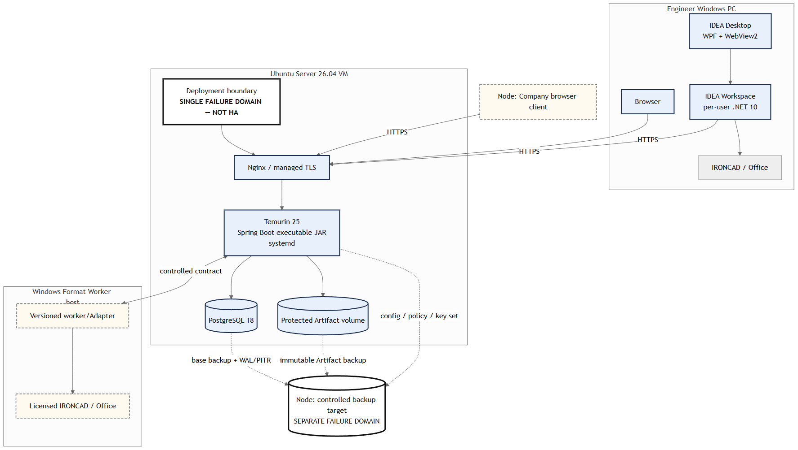
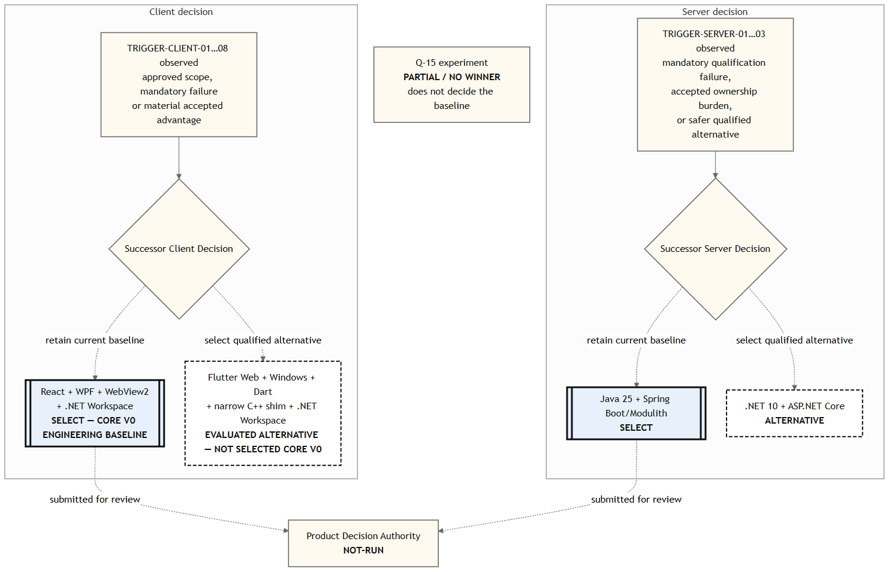

# BÁO CÁO ĐỀ XUẤT NỀN TẢNG CÔNG NGHỆ  
# IDEA ENGINEERING — CORE V0

**Technology Stack & Architecture Recommendation**  
**Trạng thái:** `For Management Review`  
**Ngày lập:** 15/09/2026  
**Người phụ trách:** Nguyễn Huỳnh Phúc Lâm  
**Phòng ban:** Phòng Phát triển sản phẩm nội bộ

> Đây là báo cáo hỗ trợ review quản lý, được lập từ baseline tại commit
> `d84630c53501fc13bb2eadf1bc44b3d97464a0c8`. Báo cáo không thay thế TECH-001,
> tài liệu kiến trúc hoặc hồ sơ qualification. Technology baseline đã được Engineering lựa chọn;
> các qualification và phê duyệt quản lý tiếp tục được thực hiện theo quy trình dự án.

## 1. Đề xuất Tech Stack

Engineering đề xuất dùng **Linux-first Java/Spring/PostgreSQL** cho Server,
**React/TypeScript** cho Web và **WPF/WebView2 kết hợp .NET Workspace** cho máy Windows của kỹ sư
làm Technology Baseline của IDEA Engineering Core v0.

| Hạng mục | Công nghệ đề xuất |
|---|---|
| Server OS | Ubuntu Server 26.04 LTS |
| Backend | Java 25 LTS / Eclipse Temurin + Spring Boot + Spring Modulith |
| Architecture | Deep-module Modular Monolith |
| Database | PostgreSQL 18 |
| Persistence | Spring JDBC / JdbcClient + Flyway |
| API | HTTPS JSON REST + OpenAPI |
| Web UI | React + TypeScript + Vite |
| Windows Desktop | WPF .NET 10 + WebView2 |
| Local Workspace | .NET 10 Workspace |
| Local IPC | Authenticated/versioned Named Pipe |
| Artifact Storage | Private server-managed Artifact Store |
| CAD/Office Processing | Separate Windows Format Worker |

Baseline này tập trung vào hai bề mặt Core v0 thực sự cần: trình duyệt Web và máy Windows của kỹ
sư. Những thành phần như Microservices, Kubernetes, broker, Redis hay công cụ tìm kiếm riêng chưa
được đưa vào vì hiện chưa có nhu cầu đủ rõ để gánh thêm chi phí triển khai và vận hành.

**Kết luận phần 1.** Đây là một baseline cụ thể để sếp review, không phải danh sách công nghệ thử
nghiệm. Báo cáo chưa đồng nghĩa hệ thống đã hoàn tất qualification hoặc được Product Decision
Authority phê duyệt.

## 2. Kiến trúc tổng thể

### 2.1 Server tập trung trên Linux

Luồng chính là `Ubuntu Server → Java/Spring → PostgreSQL + Artifact Store`. Server giữ dữ liệu và
trạng thái có thẩm quyền. Client không truy cập database trực tiếp, không tự quyết định quyền và
không tự công bố trạng thái sản phẩm. PostgreSQL lưu metadata, quan hệ, workflow, quyền và audit;
Artifact Store giữ nội dung file. Việc tách hai trách nhiệm này giúp backup, kiểm tra toàn vẹn và
recovery rõ ràng hơn.

Server không phụ thuộc trực tiếp vào IRONCAD hoặc Office. Nhờ vậy logic sản phẩm không bị phân tán
trên từng máy người dùng, việc bảo mật và truy vết tập trung hơn, đồng thời lỗi của một ứng dụng
desktop không làm thay đổi dữ liệu có thẩm quyền.

### 2.2 Một React business UI dùng cho Web và Desktop

IDEA không phát triển hai bộ business UI riêng biệt. Trình duyệt chạy React trực tiếp; ứng dụng
Windows dùng WPF làm **narrow native shell**, WebView2 để hiển thị cùng React business UI. Phần lớn
thay đổi về màn hình và hành vi nghiệp vụ vì vậy nằm trong một codebase, giúp giảm code trùng, giảm
công việc kiểm thử lặp lại và giữ hành vi Web/Desktop nhất quán.

### 2.3 .NET Workspace xử lý tích hợp trên máy kỹ sư

Luồng Windows là `React → WPF shell → Named Pipe có xác thực → .NET Workspace → file cục bộ /
IRONCAD / Office`. Web technology phù hợp cho business UI nhưng không nên có quyền tùy ý thao tác
file, process hoặc ứng dụng kỹ thuật trên máy người dùng.

Workspace được tách để xử lý materialization, hashing, transfer, journal, recovery, mở file và các
ứng dụng kỹ thuật nằm trong allowlist. **Server sở hữu Product state; Workspace sở hữu local
engineering operation.** Đây là phân chia trách nhiệm có chủ đích, không phải ghép nhiều công nghệ
tùy tiện.

### 2.4 Windows Format Worker

Một số thao tác chuyển đổi hoặc tạo Representation có thể cần Windows, IRONCAD, Office hoặc license
riêng. Các workload đó đi qua hợp đồng được kiểm soát tới một Windows Format Worker riêng. Core
Server vẫn chạy Linux; lỗi conversion không mặc nhiên làm toàn Server dừng hoạt động.

Boundary của Format Worker đã được chọn cho Core v0, nhưng chỉ triển khai hoặc sử dụng khi profile
CAD/Office/license thực tế yêu cầu. Runtime và toolchain cụ thể của Worker **chưa được lựa chọn** và
sẽ được qualification riêng. Cách này tránh buộc toàn bộ Server phụ thuộc desktop software, đồng
thời giữ chỗ thay Adapter hoặc Worker khi nhu cầu định dạng thay đổi.

### 2.5 Modular Monolith

Core v0 dùng Modular Monolith: một Server deployable, nhưng bên trong chia Module theo ownership rõ
ràng. Cách này giữ transaction, deploy, debug và backup đơn giản hơn distributed system. Ranh giới
Module vẫn được duy trì để sau này có thể tách service khi xuất hiện nhu cầu triển khai độc lập,
quy mô tổ chức hoặc bottleneck đã đo được.

**Kết luận phần 2.** Kiến trúc tập trung quyền quyết định ở Server, tái sử dụng một business UI và
cô lập các thao tác đặc thù Windows. Mỗi boundary có một trách nhiệm rõ, nên thay đổi một phần không
buộc phải viết lại toàn hệ thống.

## 3. Cơ sở lựa chọn

| Cơ sở | Ý nghĩa đối với IDEA Engineering Core v0 |
|---|---|
| Phù hợp Product Scope | Core v0 cần Web, máy Windows của kỹ sư, Server tập trung và tích hợp file/CAD/Office. Hiện chưa có first-class requirement cho mobile, macOS Desktop hoặc Linux Desktop. |
| Đúng công nghệ cho đúng trách nhiệm | Java/Spring cho Server; React cho business UI; .NET cho tích hợp Windows; PostgreSQL cho dữ liệu quan hệ có thẩm quyền. Không ép một runtime làm mọi việc. |
| Không over-engineer | Chưa đưa Microservices, Kubernetes, Service Mesh, Kafka/RabbitMQ, Redis hoặc Elasticsearch/OpenSearch vào baseline khi chưa có nhu cầu được chứng minh. |
| Giảm code trùng và chi phí bảo trì | React được dùng lại cho Web/Desktop; Modular Monolith giảm số deployable, đường xử lý sự cố và hạ tầng phải vận hành ở Core v0. |
| Có đường thay đổi có kiểm soát | Server, Workspace, Artifact Store, Format Worker, Adapter và API có boundary riêng; từng phần có thể được xem xét lại khi requirement hoặc evidence thay đổi. |

Lựa chọn này chấp nhận một chi phí thật: hệ thống có cả Java và .NET. Engineering không che chi phí
đó; Java phụ trách Server, còn .NET chỉ nằm ở phần Windows cần tích hợp native. Chi phí sở hữu hai
toolchain phải được theo dõi trong quá trình qualification và vận hành thử.

**Kết luận phần 3.** Baseline được chọn theo phạm vi sản phẩm và trách nhiệm của từng thành phần,
không theo sở thích ngôn ngữ. Những công nghệ chưa tạo giá trị rõ cho Core v0 được giữ ngoài baseline.

## 4. So sánh các phương án

Hình 3 cần đọc theo chiều `Trigger → Successor Decision → giữ baseline hiện tại hoặc chọn phương án
thay thế đã đủ điều kiện`. Trigger chỉ mở việc xem xét; nó không quyết định sẵn kết quả. Baseline
Engineering được gửi Product Decision Authority review và hiện chưa phải phê duyệt quản lý.

### 4.1 Java/Spring và .NET/ASP.NET Core cho Server

| Tiêu chí | Java/Spring | .NET/ASP.NET Core |
|---|---|---|
| Linux Server | Tốt | Tốt |
| Hỗ trợ Modular Monolith | **Lợi thế** nhờ Spring Modulith | Tốt; cần tự ghép architecture checks |
| PostgreSQL | Tốt | Tốt |
| Security và API | Tốt | Tốt |
| Chung runtime với thành phần Windows | Không | **Lợi thế** |
| Toolchain toàn hệ thống | Nhiều hơn | **Đơn giản hơn** |
| Core v0 disposition | **SELECT** | Alternative |

.NET là phương án cạnh tranh nghiêm túc, đặc biệt nhờ dùng chung runtime với Workspace và các thành
phần Windows. Engineering vẫn chọn Java/Spring cho Server với lợi thế hẹp: Spring Modulith hỗ trợ
trực tiếp việc kiểm tra ranh giới Modular Monolith và phù hợp hướng Linux-first đã chọn. Nếu
qualification bắt buộc không đạt, hoặc chi phí sở hữu hai runtime vượt ngưỡng quản lý chấp nhận,
Server phải được xem xét lại qua một quyết định kế nhiệm.

**Không có kết luận Java nhanh hơn, scale tốt hơn hoặc tốt hơn .NET nói chung.**

### 4.2 React + WPF/WebView2 và Flutter

| Tiêu chí | React + WPF/WebView2 | Flutter |
|---|---|---|
| Browser-first | **Lợi thế** | Khả thi |
| Windows Desktop | Mạnh | Mạnh |
| Dùng lại UI giữa Web/Desktop | Có | **Rất mạnh** |
| Mobile trong tương lai | Bình thường | **Lợi thế rõ** |
| Tích hợp Windows | **Tự nhiên với .NET Workspace** | Có thêm native/FFI seam |
| Web payload trong prototype hiện tại | **Nhẹ hơn** | Nặng hơn |
| Evidence hiện tại | **Nhiều hơn** | Một số phần còn `BLOCKED` |
| Core v0 disposition | **SELECT** | Evaluated Alternative |

**Q-15 = `PARTIAL / NO WINNER`.** Q-15 cho thấy Flutter là một phương án kỹ thuật khả thi; không cho
phép nói React đã thắng hoặc Flutter đã thất bại. Lợi thế lớn nhất của Flutter là dùng lại UI đa nền
tảng. Tuy nhiên Core v0 chưa có first-class requirement cho mobile, macOS hoặc Linux Desktop, nên
chưa có lý do đủ mạnh để đổi toàn bộ presentation architecture và sở hữu thêm Dart/native
integration/toolchain chỉ để lấy optionality chưa cần.

Với phạm vi Core v0 hiện tại, React + WPF/WebView2 + .NET Workspace có tỷ lệ phù hợp sản phẩm / độ
phức tạp / bằng chứng hiện có tốt hơn. Nếu mobile hoặc desktop đa nền tảng trở thành yêu cầu chính,
hoặc Option A không đạt điều kiện bắt buộc về security, performance, accessibility hay chi phí bảo
trì, quyết định phải được mở lại.

### 4.3 Modular Monolith và Microservices

| Tiêu chí | Modular Monolith | Microservices |
|---|---|---|
| Cách triển khai | Một Server deployable | Nhiều service/deployable |
| Transaction | Đơn giản hơn | Phải xử lý distributed consistency |
| Debug và truy vết | Tập trung hơn | Cần distributed tracing/debug |
| Vận hành Core v0 | Ít đầu mối hơn | Nhiều hạ tầng và quy trình hơn |
| Khi phù hợp | Nhóm nhỏ, ownership tập trung | Có áp lực scale/ownership độc lập rõ |
| Core v0 disposition | **SELECT** | **NOT SELECTED** |

Microservices không bị loại vĩnh viễn. Engineering chưa chọn cho Core v0 vì chưa có nhu cầu triển
khai độc lập, quy mô tổ chức hoặc bottleneck đã đo được đủ để biện minh cho chi phí của distributed
system.

**Kết luận phần 4.** Các phương án thay thế đều được giữ ở vị trí nghiêm túc và có điều kiện xem xét
lại. Baseline hiện tại là lựa chọn phù hợp nhất với phạm vi Core v0, không phải tuyên bố công nghệ
được chọn tốt hơn trong mọi bối cảnh.

---

**Nguồn kiểm soát:** TECH-001@0.14; IE-KNW-TECH-DEC-001@0.6;
IE-CHG-TECH-BASELINE-001@0.2; IE-ARC-TECH-VIEW-001@0.2; Q-15 Phase 1–3; DOC-05@0.20.

**Ranh giới quyết định:** Tech baseline changed `NO`; Product scope changed `NO`; Q-15 changed `NO`;
new technology decision introduced `NO`.
